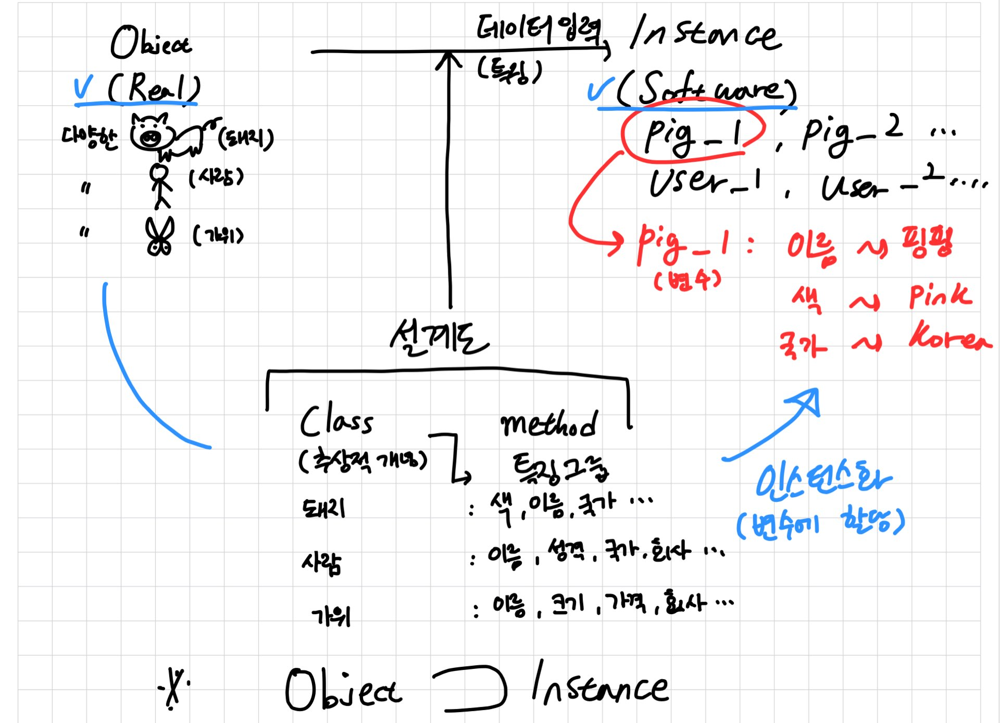
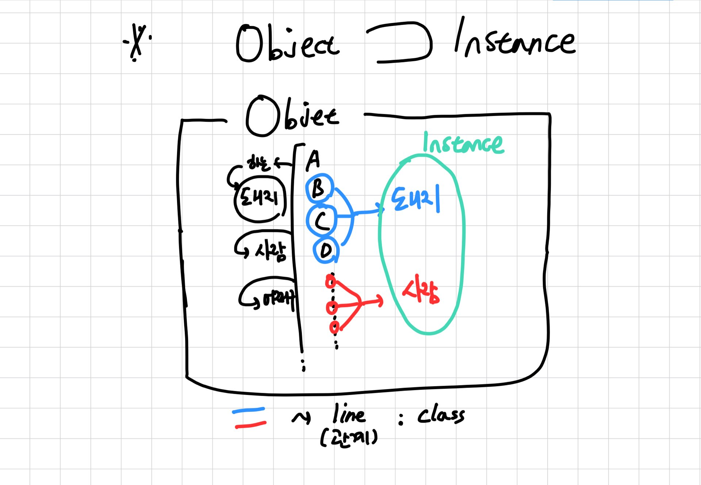

# Python 입문 06

---

>## Python 클래스(Class)

### 1. Python 클래스(Class), 인스턴스(Instance), 오브젝트(Object) 이해

&nbsp; 먼저 클래스를 사용하는 이유는 **데이터 효율적 관리, 복잡한 처리과정을 편하게** 만들기 위해서이다.    

<br>

&nbsp; **클래스를 이해하려면 클래스(class), 인스턴스(instance)를 이해 해야 한다.** 자그럼 클래스와 인스턴스 등의 용어에 대해 이해해 보자.   

<br>

&nbsp; 세상에는 모든지 개념이라는게 존재한다.   
이 개념은 구체적으로 어떤 특정 사람('김아무개'), 사물, 동물, 숫자, 문자, 자료 등의 무엇이든지 존재 자체를 개념이라고 볼 수 있는데 여기서는 **Object** 라고 이야기한다. 상당히 제일큰 범주의 용어라고 생각한다. **Real**이라고 생각하는 것도 편한 것 같다.
 

<br>

&nbsp; 예를 들어 사람은 모두 각각 다르다. 김아무개, 박아무개, 이아무개 등 이고 그 한명 한명의 묘사(귀가 큰사람, 대머리, 청력이 좋아, 지금 한발로 서있어, 웃고있어, 착해 등..)들은 다 다를 것이다. 여기서 특정 존재 **<span style="color:blue">'김아무개' 는 Object</span>** 이고 이를 그룹화 시켜 추상적 임시 개념이 '사람'이다. **<span style="color:red">'사람' = Class</span>** 

<br>

&nbsp; 즉, Object는 무수히 많은 특징이 존재한다. 계속 움직이고 변화하고 있고 모두 다른 특징종류 을 가지고 있어 모든 특징을 구체적으로 이야기 하기란 불가능하여 필요한 정보종류를 설계하여 데이터를 넣어 이야기하면 훨씬 효율적이다. 풀어서 이야기하면, Object(ex. real pig)에서 추상화 임시 개념(class, ex. pig)을 만든다(선언). 그리고 class에 필요한 특징종류(method, ex. color) 넣어 필요한 구체적 임시 개념(method가 입력된 class, ex. pig_color)을 만드는 것이다.  그래서 그 구체적 임시 개념 class 를 가지고 변수에 할당하여 특징(데이터, ex. pig_color :red)을 넣으면 Instance 라고 볼수 있다. 그리고 그 과정을 instance화라고 한다.

<br>
   
- 내 나름대로 이해해서 그려본 개념
   

<br>

   

<br>
<br>

---

<br>
<br>

### 2. Python 클래스(Class)

#### 1) Class 선언

``` python
class UserInfo:         # 클래스 이름 선언
   # 속성, 메소드 추가
    def __init__(self, name):       # __init__ : 클래스 최초 초기화시(인스턴스 생성시) 호출 함수(생성자)
    # self = 인스턴스 임
       self.name = name             # self.name이라는 인스턴스 변수 안에 name을 넣어줌
    def user_info_p(self):          # 구현하고 싶은 함수
        print("Name : ", self.name) # 그때 마다 이름이 다를 거니까
``` 

- Class = `UserInfo`    
-  Method = `__init__` , `user_info_p`      
- instance 변수 = `self.name`   
<br>
- Class 사용

``` python
user1 = UserInfo("Kim") # 클래스 사용하여 user1 인스턴스 생성 및 name 할당
print(user1.name) # user1인스턴스 변수 출력
user1.user_info_p() # user1인스턴스에 특정함수 출력
```

<br>

#### 2) self의 이해, Class method vs Instance method

``` python
class SelfTest:
    def function1(): # self가 없는 클래스 변수
        print('function1 called!')
    def function2(self): # self가 있는 인스턴스 함수
        print(id(self))
        print('function2 called!')

``` 
- Class = `SelfTest`    
-  Method = `fuction1` , `function2`      

``` python
user3 = SelfTest() # user3 인스턴스 생성
# user3.function1() -> function1은 self가 없어 인스턴스를 사용하지 않는 클래스 함수임
SelfTest.function1() # 이렇게 클래스에서 호출해줘야 함
user3.function2() # function2는 self가 있는 인스턴스 함수라서 인스턴스에 바로 붙여 호출 가능
```
- 결론, 클래스 함수 vs 인스턴스 함수 : 클래스 함수는 `클래스.클래스_함수` , 인스턴스 함수는 `인스턴스.인스턴스_함수` 사용   


<br>

#### 3) Class 변수 vs Instance 변수

``` python
class WareHouse:
    stock_num = 0        #  class 변수
    def __init__(self, name):   # __init__ 생성자
        self.name = name    # instance 변수
        WareHouse.stock_num += 1 # 창고 이름 1생성시 1추가
    def __del__(self):  # __del__ 소멸자
        WareHouse.stock_num -= 1 # 창고 이름 삭제시 -1

user1 = WareHouse('kim')  # 인스턴스 생성
user2 = WareHouse('park')
user3 = WareHouse('lee')
```
- self를 쓰냐 안쓰냐 차이임
- `__dict__` : 내부 속성 확인 함수

``` python
print(user1.__dict__)  #  class 변수에 대한 정보 안나옴 인스턴스 연결X 라서, self가 없으니까
print(WareHouse.__dict__) # stock_num 클래스 변수 확인 가능
print(user1.stock_num) # 근데 인스턴스 변수에서 클래스 변수 출력해도 출력이 됨, 클레스 네임 스페이스에서 찾아오기 때문
```     
- 결론, class 변수, instance 변수도 self 차이인데 class 함수 instance 함수와 다르게 **클래스 변수는 인스턴스와 공유함**
- 사용은 `클래스.클래스_변수`,`인스턴스.클래스 변수`, `인스턴스.인스턴스_변수` 가능함
- `클래스.인스턴스_변수` 는 불가
- 중요) 클래스와 클래스 변수, 클래스 함수는 다른것이고 똑같이 인스턴스와 인스턴스 변수, 인스턴스 함수는 다른 것임

#### Q. 의문점 
&nbsp; 인스턴스 속성, 클래스 속성이라는 용어를 발견했는데 인스턴스 변수, 클래스 변수와 같은것 같은데 이게 맞는지 모르겠다.

<br>
<br>

---

<br>
<br>


### 3. Class 상속

- 클래스는 superclass(부모), subclass(자식)으로 나뉜다.
- sub(자식)은 super(부모)의 속성을 사용가능하며 주로 super은 공통 속성으로 하고 sub는 그 특성에 맞는 속성들로 추가적으로 구성한다.

<br>

#### 1) Class 상속 선언과 사용

- **Super class 선언**

``` python
class Car:
    """Super Class"""
    def __init__(self, tp, color):
        self.type = tp
        self.color = color
    
    def show(self):
        return 'Car Class "Show Method!"'
```     

<br>

- **Sub class 선언**

``` python
class KiaCar(Car):  # 괄호 () 안에 super class 이름넣어서 연결 선언
    """Sub Class"""
    def __init__(self, car_name, tp, color):
        super().__init__(tp, color) # super에서 가져오는 항목들 생성자 연결하여 코드 절약
        self.car_name = car_name

    def show_model(self) -> None: # -> None 은 파라미터 힌트 임
        return "Your Car Name : %s" % self.car_name

class HdCar(Car):
    """Sub Class"""
    def __init__(self, car_name, tp, color):
        super().__init__(tp, color)
        self.car_name = car_name

    def show_model(self) -> None:
        return "Your Car Name : %s" % self.car_name
``` 
<br>

- **class 상속 사용 결과**

``` python
model1 =Kia('520d', 'sedan', 'red')
print(model1.color) # Super
print(model1.type) # Super
print(model1.car_name) # Sub
print(model1.show()) # Super
print(model1.show_model()) # Sub
print(model1.__dict__) # super, sub 모두 보임
```

<br>
<br>

#### 2) Class 상속_오버라이딩       

- sub, super의 메서드 이름이 같은 경우 -> sub(자식) 메서드 가져옴, 만약에 같지 않으면 super 메서드 가져오는 것임        

``` python
class Car:
    """Super Class"""
    def __init__(self, tp, color):
        self.type = tp
        self.color = color
    
    def show(self):       # show 메서드 확인
        return 'Car Class "Show Method!"'

class HdCar(Car):
    """Sub Class"""
    def __init__(self, car_name, tp, color):
        super().__init__(tp, color)
        self.car_name = car_name

    def show_model(self) -> None:
        return "Your Car Name : %s" % self.car_name

    def show(self):  # 부모와 같은 이름의 show 메서드 추가, 내용은 다름
        print(super().show()) # 부모 것도 보고 싶은 경우
        return 'Car Info : %s %s %s' % (self.car_name, self.type, self.color)

model2 = HdCar("350s", "sedan", "silver")
print(model2.show()) # 오버 라이딩 된 자식 메서드가 출력 'Car Info : 350s sedan silver'
```     
<br>
<br>

#### 3) Class 다중 상속     

``` python
class X():
    pass

class Y():
    pass

class Z():
    pass

class A(X, Y): # , 콤마를 통해서 여러개 상속
    pass

class B(Y, Z):
    pass

class M(B, A, Z): # M에서 모두 사용 가능(너무 많은 다중상속은 코드해석이 어려움, 보통은 2개정도 받음)
    pass

print(M.mro())
print(A.mro())
```     

- `class 이름.mro` : 상속 상태 볼 수 있음
- 왼쪽이 하위 ~ 오른쪽으로 갈수록 상위 마지막은 object class
- super_main : X , Y , Z
- super_midle : A(X, Y) , B(Y, Z)
- sub: M(A, B, Z) -> X, Y, Z
  
<br>
<br>

---

<br>
<br>


>## Python 모듈(Module)과 패키지(Package)

### 1. 모듈과 패키지 이해

- **`모듈` = 파일 , `패키지` = 폴더**
- 파이썬 사용시 오픈소스를 끌고와서 사용하는 경우가 많은데 대부분 오픈소스를 배포하거나 가져올때 패키지 형태임      
- 예를 들어 어떤 프로젝트가 있으면 프로젝트 안에 어떤 역할들을 패키지로 하고 그 역할들 안에 역할을 위한 기능들을 모듈이라고 하며 기능을 이루기 위해 함수 및 클래스를 지정하고 함수 및 클래스를 위해 코딩을 한다.        
- **`프로젝트` - `역할(패키지)` - `기능(모듈)` - `클래스 및 함수` - `코드`**        
  
<br>

### 2. from 과 import

- `from` : ~부터로서, 모듈 부를때 씀
- `import` : 가져오다로서 메모리 할당해서 완전히 쓸수 있게 가져오는 것
- `as` : alias 라고 필요에 의해서 별명으로 이름을 줄이고 싶을때 사용 (import 어쩌구 as 단축어)


### 3. 가져와서 적용시켜 보기

- 현재 `pkg`라는 패키지를 만들고, `calulation`, `fibonacci`,`prints` 라는 모듈들을 만들었다.
- `fibonacci`의 경우 클래스를 형성하였고 외의 모듈은 함수만 형성하였다.

<br>

- **import 클래스**
``` python
from pkg.fibonacci import Fibonacci
# pkg.fibonacci = 패키지.모듈 Fibonacci = 클래스
# 즉 패키지.모듈에서 클래스만 가져온다.
Fibonacci.fib(300)
# 클래스 명 까지 입력해서 사용
Fibonacci().title # 를 통해서 인스턴화를 시켜야 init 메서드가 호출됨
```          

<br>

- **import * (너무 메모리를 많이 사용해서 비추천)**     

``` python
from pkg.fibonacci import *
# *는 모두를 뜻함 , fibonacci 모듈에서 모든 것을 가져온다.
```


<br>

-  **alias 를 사용한 import**       

``` python
from pkg.fibonacci import Fibonacci as fb 
# fb로 축약 했음
print(fb.fib2(130))
```

<br>

-  **모듈을 import 한 경우**     

``` python
import pkg.calculations as c
# 모듈을 import하고 모듈을 c로 단축
print(c.add(10, 100))
# import를 모듈로 했기 때문에 모듈네임(c)을 써주면서 함수(add) 사용해야함 
from pkg.calculations import div as d
print("ex5 : ", d(100,10))
# 여기에선 이미 함수까지 import 되어 있기에 바로 함수 사용 가능
```     

**즉, import 한 자료는 그 네임을 호출하며 써야한다는 것.**  

<br>

-  **builtins 모듈**         
  
``` python
print(dir(builtins))
```
기본 내장 모듈로서 기본 함수들이 포함되어 있다. 굳이 import는 할 필욘 없다.