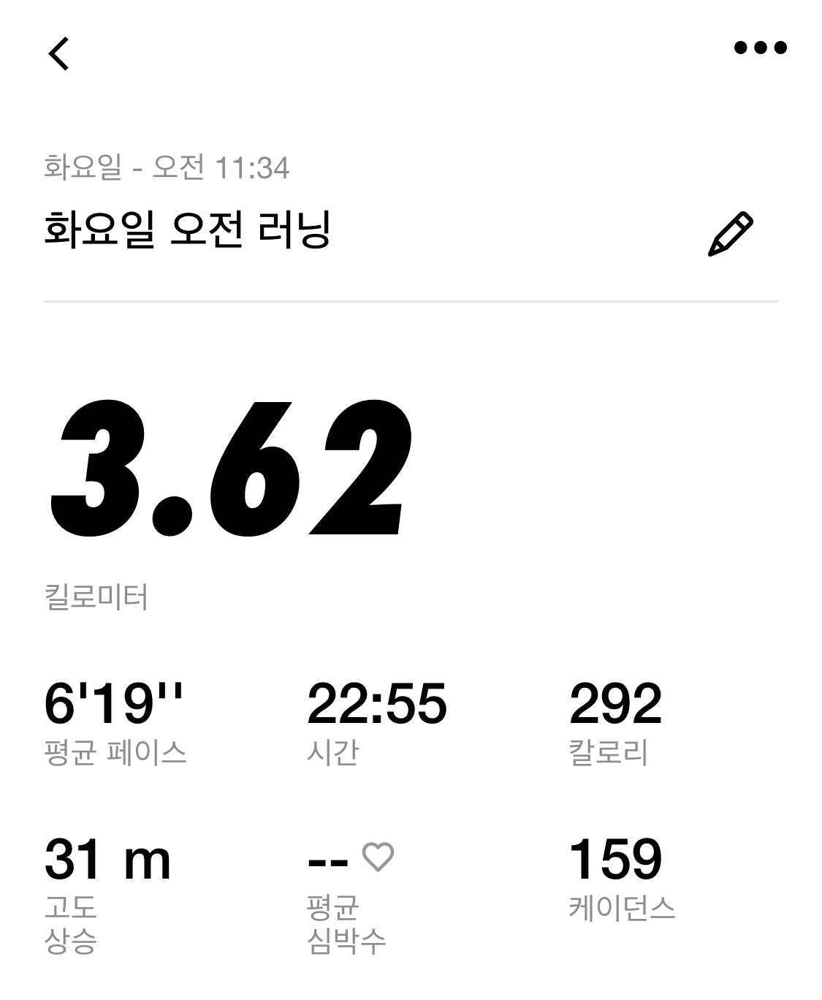

&nbsp;&nbsp; 웹 개발을 하게 되면 프론트 엔드나 백엔드를 나누어서 가고는 하는데,
아직까지 파이썬 문법 밖에 배우지 않았지만 나중에 html , css, js 그리고 여러 프레임 워크 등을 배우게 되면
점점 만들수 있는 능력이 커질 것이다. 그래서 그 능력에 도달하기 전에 먼저 프로젝트 기획서를 만드는 작업이 필요하다고 본다.

 

&nbsp;&nbsp; 기획서를 만드는데 중요한 툴로는 Adobe XD가 있다고 한다.
그래서 유튜브로 Adobe XD를 어느정도 강의를 들었으나,,, 확실히 디자이너의 영역인 것 같다.
내가 하고자 했던 것은 그냥 아버지 과수원에 맞는 온라인 판매 및 과수원 소개용 사이트를 하나 정도를 만들고자 하였다.
물론 판매 목적이라면 SEO도 잘되어 있는 네이버 스마트스토어가 확실히 맞지만, 그냥 도전해 보는 것이다. 회사 소개처럼 과수원을 멋있게 소개하며 판매상품도 올려 놓는 그런 사이트를 만들고자 하였다.

 

&nbsp;&nbsp; 처음에는 일단 여러 사이트를 돌아 다녀 보았다. 사이트 구성이 어떻게 되는지 둘러보면서 웹페이지 캡쳐를 했다.
원하는 사이트에서 `F12`를 누르고 `ctrl + shift + p` 를 누르면 커맨드가 뜬다. 거기에서 cepture full size를 치고 해당 목록 클릭하면 다운 받아진다. `F12`는 생각보다 재미있는 기능이 많았다. `좌측 상단에 화살표` 클릭을 하면 웹페이지 블록의 크기, 폰트, 색등이 다 뜬다.   
그리곤 웹페이지의 구성을 살펴 보니, 
최상단 블록 = 로그인, 가입, 장바구니, 마이페이지 등이 있고 
로고 블럭 =  홈페이지 로고, 검색탭
리스트 블럭 = 각 상품에 대한 카테고리가 있는 경우도 있고 사이트 서비스 관련 및 회사소개 , 공지사항 등이 있기도 하였다.
내용이 시작되는 블럭 = 보통 이미지 전환 탭이 있는 경우가 많았다.
그 밑 = 브랜드 이미지, 슬로건 이나 , 아니면 바로 상품 이미지를 넣어 상품 홍보 이미지가 있기도 하였다.

 

그래서 일단, 만들 페이지를 생각해 보았다.        
첫 메인 화면 1개        
로그인 화면 1개(장차 npay api를 넣는다면 로그인을 넣을 필요는 없겠다.)
상품목록 창 1개 (이거는 사과만 홍보하면 딱히 따로 상품 목록창을 안만들고 스크롤 형식으로 넣어도 괜찮을 듯 하다.)
상품 창 1 개 (레이아웃만 만들어 놓고 늘려가는건 나중에 해도 될듯)
과수원 소개 창 1개 
결론 , 최소한으로 잡으면 첫 메인 화면 1개랑 , 상품 창 1개 해서 총 2개로 잡고            
나머지 부분들은 메인 창에서 과수원 소개, 상품 목록, 등을 스크롤 형식으로 녹여 넣고      
상품 목록을 클릭하면 구체적인 상품 안내 페이지가 나오게 끔 하는게 좋을 듯 하다. 

&nbsp;&nbsp; 그래서 Adobe XD 툴을 써보았는데 말론 쉽다고 하지만 익숙해지는게 힘들었다.
처음에는 개속 마우스로만 하다가 지쳐 버렸다. 열심히 했는데 생각보다 디자인에는 소질이 없는 것 같기도 하다.
그러다가 단축키 활용이 생각났다. 단축키 몇개만 사용해도 정말 편해지던데,, 정말 바보 같이 마우스로만 하고 있던 것이다.

 

# Adobe XD 단축키
주로 쓰는 기능만 나열하겠다.
`T` : 텍스트
`V` : 선택 커서
`R` : 사각형
`shift + 좌클릭` : 다중 선택
`ctrl + shift + < , >` : 글자 크기
`ctrl + [ , ]` : 배열 , 레이어 뒤 앞으로 보내기

  

# 첫 기획 도안 (하다 말음)

 

- 움직이는 배너도 만들었다. (배너 클릭시 상품 페이지 이동 , 배너 버튼 만들어야 겠다. 배너 버튼 클릭시 다른 배너 보기)
- 무료이미지를 최대한 활용했고, 근데 디자인에 너무 욕심내려는 것 같아 현타가 온다.
- 일단 이미지는 앞으로 안 찾아서 넣고 레이아웃만 대강 만들어야 겠다.
- 기획하면서 느끼는 건데 내가 생각보다 프론트는 별로 안좋아 하는 것 같기도 하다. 
- 일단 앞으로 css, html, js 배울꺼니까 배우고 나서 또 생각해봐야 겠다.

 

> # NRC

눈이 아직 안녹았지만 오늘은 뛰러 갔다왔다.

한창 뛰면서 운동하면서 오늘든 생각은 NRC 데이터를 깃헙 잔디 심듯이 볼 수 있게 프로젝트로 하면 좋을것 같다.
