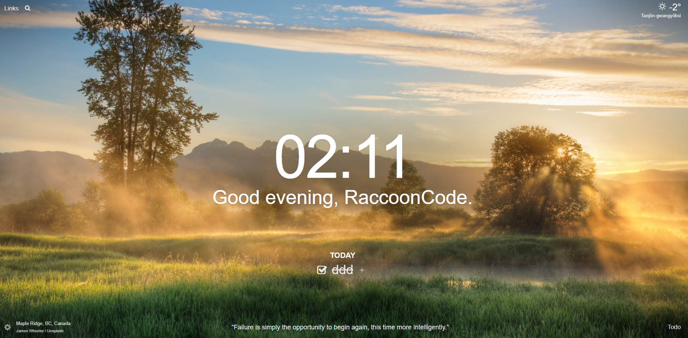
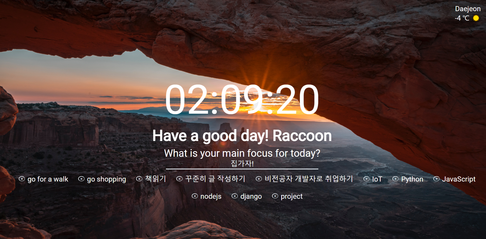

- js가 프로젝트에서 어떻게 사용되어지는지 알기 위해서 노마드 코더의 강의를 들었고 단지, 내 수준에서 필요한 것만 회고하듯 정리함
- [노마드 코더 강의](https://nomadcoders.co/courses) 잘되어 있으니 듣길 바란다.

># JavaScript with Nomadcoder

 

># JavaScript project

- nomadcoder에서 진행하는 이 강의의 프로젝트는 클론 코딩이다.
- 클론 대상은 [momentum](https://chrome.google.com/webstore/detail/momentum/laookkfknpbbblfpciffpaejjkokdgca?hl=ko) 이라는 Todolist 페이지 이다.
- 특징은 가운데 시계가 있고, 배경이 변하고, todolist기능, 날씨 정보기능이 있다.
- 현재 해당 강의는 모두 들어서 프로젝트는 끝냈으나 추가적인 기능 및 CSS를 추가하여 마무리 하였다.

 
 
 

># 완료한 project와 해당 사이트 비교해 보기

- **momentum 사이트 (클론하고자한 크롬 앱)**

 
 

- **내가 구현한 크롬앱**

- 기존에 완성한 프로젝트에 추가한 것
  - CSS (여러가지 기능들을 다시 확인하면서 사용했고, 새로운 기능도 알게 되었다.)
  - js-화면처음에 user 이름이 있어야 todolist를 보여주고 없으면 입력을 해야 todolist를 적을 창이 생김
  - 그리고 이름이 없어지면 기존에 있던 todolist는 모두 사라지게 하였다. (물론 개발툴 application 탭에서 storage를 지우지 않는 이상 user가 사라지진 않는다.)
  - 날씨 설명을 받아와 그에 맞는 이모티콘을 반환하는 기능을 추가하였다.
  - 여러개의 todo를 적게 되면 너무 아래로만 쌓이게 되는 현상을 CSS로 보완하여 보기 좋게 하였다.

 
 
 
 

- 자세한 내용은 내일 작성할 예정이다. 오늘은 너무 추가할 기능이 계속 생각나는 바람에 코딩을 너무 열심히 하느라 글을 쓸 시간은 좀 부족하였다. 그래서 간단히 결론정도만 적고, 기능을 추가하면서 알게된 것들은 내일 쓰도록 하겠다.
