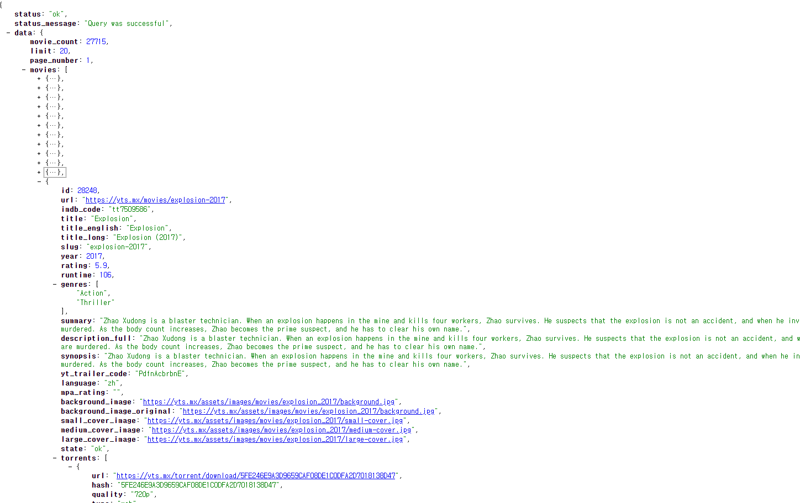
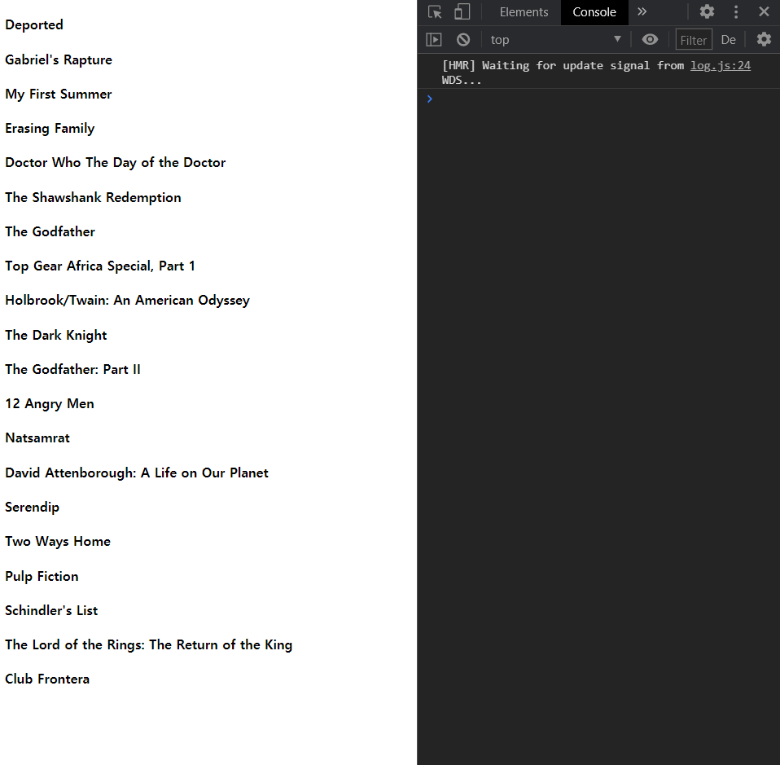

># React.js and React project(영화 웹 서비스 만들기) with nomadcoder

&nbsp;&nbsp; 저번에는 자바스크립트 기초강의의 todolist 크롬 앱을 구현했는데 이번에는 React를 배우고 입문하기 위해서 노마드 코더의 react js로 만드는 영화 웹서비스 만들기 강의를 수강하였다.
물론, 무료이다. 정말 좋은 강의 이고 저번 todolist 강의에서 처럼 어떤 형태로 쓰이는지 전체적인 감이 올것이라고 생각한다.

<br>

- [노마드 코더 사이트!](https://nomadcoders.co/?gclid=Cj0KCQiA4feBBhC9ARIsABp_nbVxRSolGl8kEqrti8PVF9rv5l4jJxXcNIGeNSUaDEm6zqH79HPTH5kaAitcEALw_wcB)

<br>

- 단지, 노마드 코더 강의를 듣고 공부 과정을 서술하듯 쓸 것이다. 본 자료를 무턱대고 믿지는 말았으면 좋겠다. 내가 이해하는 대로 쓴 것일뿐이니...


<br>
<br>
<br>
<br>
<br>


># 1. React- State

>## Component Life Cycle

일단, 우리가 만드는 class component는 React class component의 확장인데 React class component는 render method 뿐만아니라 여러가지가 있다.
이것들을 life cycle method라고 하고 이것은 react가 component를 생성하고 없애는 방법이다. 

<br>

component가 생성될때 render전에 호출되는 몇가지 function들과 render후에 호출되는 function들이 있다.
그리고 component가 업데이트 될때, 호출되는 function들이 있다.

<br>

- Life Cycle method
  - After functions
  - Before functions
  - Update functions

<br>
<br>
<br>

>### 1) Mounting : component 생성

- 1. `constructor()` : js에서 class 생성시 호출되는 method (render보다 먼저 호출됨, 생성자이기 때문에)
  - component가 mount되어 screen에 표시될때 constructor를 호출함
- 2. `render()` : 렌더링 시에 호출
- 3. `componentDidMount()` : 렌더링 후에 호출

<br>

**즉, constructor -> render -> componentDidMount**


``` js
constructor(props) {
    super(props);
    console.log("hello");
  }
render() {
    console.log("I am rendering");
    return (
      <div>
        <h1>The number is : {this.state.count}</h1>
        <button onClick={this.add}>Add</button>
        <button onClick={this.minus}>Minus</button>
      </div>
    );
  }
componentDidMount() {
    console.log("component redered");
}
// hello -> I am redering -> component rendered
```

<br>
<br>
<br>

>### 2) Updating : 일반적인 업데이트

- **setState를 호출할때 마다 발생** (ex. Add 또는 Minus를 클릭해서 state 변경할때 그것이 업데이트임) 
- setState -> Component -> reder -> updated 

<br>  

- 1. `static getDerivedStateFromProps()` : 잘 안씀 찾아볼것 나중에
- 2. `shouldComponentUpdate()` : 업데이트 할지 말지 결정
- 3. `render()` : (다시) 렌더링 호출
- 4. `componentDidUpdate()` : 렌더링 후에 호출

<br>

**즉, 위 숫자 순서대로 실행**

``` js
render() {
  console.log("I am rendering");
  return (
    <div>
      <h1>The number is : {this.state.count}</h1>
      <button onClick={this.add}>Add</button>
      <button onClick={this.minus}>Minus</button>
    </div>
  );
}
componentDidUpdate() {
    console.log("I just updated");
  }
// 버튼 클릭(setState 호출) -> I am rendering -> I just updated
```

<br>
<br>
<br>

>### 3) Unmounting : component 제거 

- `componentWillUnmount()`
- 어떤걸 하거나 다른 페이지로 갈때 동작함

``` js
componentWillUnmount() {
    console.log("Goodbye, cruel world!")
  }
// 확인은 못하지만 작동함!!
```


<br>
<br>
<br>
<br>

---

<br>
<br>


># 2. Movie Component 계획하기

- state를 만들어서 loading일 경우 상태를 만듦
- component가 생성(mount)되자 마자 isLoading은 기본적으로 true
- render후에 componentDidMount로 movie 관련 데이터가 나오게 해야함
- constructor시에는 react가 loading하는 경우를 두어야 해서 본격적인 작업은 componentDidMount에서 실행되어야 하는 것임

``` js
render() {
    const { isLoading } = this.state;
    return (
      <div>{isLoading ? "Loading..." : "We are ready"}</div>
    );
  }
// 3항 조건 연산자 (?)를 사용해서 Loading...을 표기함
```


- 내가 미래에 쓰고자 하는 state를 선언하는 것은 필수가 아님(기본적으로 추가한 state의 props들을 굳이 setState에서 다시 선언할 필요는 없다.)

<br>
<br>
<br>
<br>


>## 1) Fetching Data (axios, YTS API)

일반적으로 js에서 data를 가져오는 방법은 `fetch`를 사용함
**하지만, 더 좋은 방법으로 `axios`가 있음**

- **axios** : fetch위에 있는 작은 layer인데 설치를 필요로 함
  - `npm install axios`

- **YTS API**
  - YTS는 불법 다운로드 및 토렌트 사용에 관련한 data를 API로 제공하고 있음
  - 불법이기에 항상 API url이 변함 그래서 app을 만들면 문제가 생김
  - 그래서 니꼬쌤이 제공하는 `https://yts-proxy.nomadcoders1.now.sh/list_movies.json` url을 사용할 예정임
  - `json view` 크롬 익스텐션 깔면 json을 통해서 어떤 데이터 가져올수 있는지 보기 편해짐

<br>
<br>
<br>

- **Jsonview로 본 API**



<br>
<br>
<br>
<br>
<br>

- componentDidMount에 `axios.get(url)`을 통해서 yts data를 가져와 movies 변수에 할당 그런데 데이터를 가져오는데는 시간이 걸리기 때문에 전체적으로 비동기 `async` 처리하고 가져오는 것은 `await` 로 동기화 처리함(일단 다 가져와야 하니까)
- 아니면 따로 class 함수처리(method) 해서 componentDidMount에서 호출되게 해도됨

- **ES6에서 제공하는 객체 표현법**을 이용하면 세부적인 하위 객체에 접근하여 받아 올수 있음

``` js
getMovies = async() => {
    const {data: {data: {movies}}} = await axios.get("https://yts-proxy.nomadcoders1.now.sh/list_movies.json");
    // this.setState({ movies: movies }); // 원래는 이렇게 써야하지만 단축이 가능함 state의 prop와 여기서의 변수 이름이 같기 때문에
    this.setState({movies, isLoading: false});
  }
```
- API data를 받아오고 setState를 통해서 isLoading상태를 false로 변경

<br>
<br>
<br>
<br>
<br>

>## 2) Movie Component

**Component는 역할은 state의 data를 보내어 의도하는 형태로 찍어내는 역할을 한다는 것을 생각하자** 

<br>

- Component에서 state가 필요 없을 경우에는 class component를 사용할 필요가 없음 -> `function Component` 사용

- Movie component의 `propTypes`를 설정해야함
  - 우리가 가져와서 표현할 것은 id, title, summary, poster, year

``` js
import PropTypes from 'prop-types';
function Movie({id, year, title, summary, poster}) {
    return <h4>{title}</h4>;
}
Movie.propTypes = {
    id: PropTypes.number.isRequired,
    year: PropTypes.number.isRequired,
    title: PropTypes.string.isRequired,
    summary: PropTypes.string.isRequired,
    poster: PropTypes.string.isRequired
}
export default Movie;
```

<br>
<br>

- rating 순으로 정렬하는게 좋으니까 API에서 제공하는 param(option)을 보니 `sort_by`에 rating이 있으니 그것으로 API주소에 param을 더해서 변경하자.
- 주소중에 ?부터는 key value이니까 `?sort_by=rating` 을 붙이자

<br>
<br>

- **App.js에서 render 연결**
  - loading 조건에 바로 넣도 좋고, 따로 rederMovie 함수를 만들어서 넣어도 좋고
  - `map` 사용해서 state의 item 하나하나 데이터를 Movie component로 보내어 component형식의 data로 찍어서 반환시킴
  - **주의) 항상 data 찍어 낼때는 key prop를 넣어 주어야 함!**

``` js
render() {
    const { isLoading, movies } = this.state;
    return (
      <div>{isLoading ? "Loading..." : movies.map(movie => {
        return <Movie key={movie.id} id={movie.id} year={movie.year} title={movie.title} summary={movie.summary} poster={movie.medium_cover_image} />
      })}</div>
    );
  }
```

<br>
<br>
<br>
<br>

># 중간 결과

<br>



<br>
