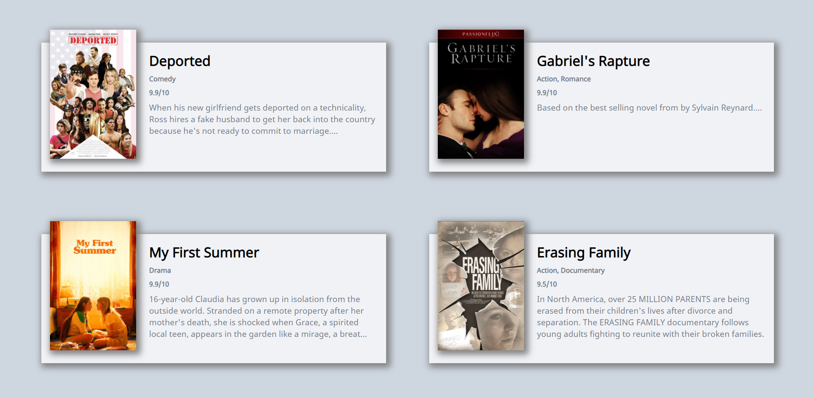

># React.js and React project(영화 웹 서비스 만들기) with nomadcoder

&nbsp;&nbsp; 저번에는 자바스크립트 기초강의의 todolist 크롬 앱을 구현했는데 이번에는 React를 배우고 입문하기 위해서 노마드 코더의 react js로 만드는 영화 웹서비스 만들기 강의를 수강하였다.
물론, 무료이다. 정말 좋은 강의 이고 저번 todolist 강의에서 처럼 어떤 형태로 쓰이는지 전체적인 감이 올것이라고 생각한다.

<br>

- [노마드 코더 사이트!](https://nomadcoders.co/?gclid=Cj0KCQiA4feBBhC9ARIsABp_nbVxRSolGl8kEqrti8PVF9rv5l4jJxXcNIGeNSUaDEm6zqH79HPTH5kaAitcEALw_wcB)

<br>

- 단지, 노마드 코더 강의를 듣고 공부 과정을 서술하듯 쓸 것이다. 본 자료를 무턱대고 믿지는 말았으면 좋겠다. 내가 이해하는 대로 쓴 것일뿐이니...


<br>
<br>
<br>
<br>
<br>


># HTML 구현

- main container 만들기 (section tag로 container)
- loading html 만들기

``` js
<section className="container">
  {isLoading ? (
    <div className="loader">
      <span className="loader__text">Loading...</span>
    </div>
  ) : (
    <div className="movies">
      { movies.map(movie => (
      <Movie 
        key={movie.id} 
        id={movie.id} 
        year={movie.year} 
        title={movie.title} 
        summary={movie.summary} 
        poster={movie.medium_cover_image} 
      />
    ))}
    </div>
  )}
</section>
```

<br>
<br>

- movie component에 보여줄 html 만들기
- p tag는 문단 형식으로 summary하기 위해서
- img alt, title prop를 넣은 것은 마우스 올렸을 때 제목 뜨고 blind people에게 도움

``` js
function Movie({id, year, title, summary, poster}) {
    return <div className="movie">
            
            <div className="movie__data">
                <h3 className="movie__title">{title}</h3>
                <h5 className="movie__year">{year}</h5>
                <p className="movie__summary">{summary}</p>
            </div>
        </div>;
}
```

<br>
<br>
<br>

- **Genres 추가하기**

``` js
// li로 표현하기
<ul className="genres">{genres.map((genre, index) => (
    <li key={index} className="genres__genre">{genre}</li> 
))}</ul>

// 그냥 한줄에 표현하기
<h5 className="movie__genres">{genres.join(", ")}</h5>
```


- **주의**
- js에서 return 하는 html같은 것들은 JSX이기 때문에 html 처럼 class 라고 지칭하면 안되고 `className`이라고 해야함**
  - class component 선언시 class와 jsx의 class가 햇갈리기 때문임

- label 태그는 for 속성이 있는데 jsx로 js에서 사용될 때는 js의 loop인 for와 헷갈리기 때문에 `htmlFor` 속성이름으로 써야함

- browser 상의 html은 class, for 모두 제대로 되어 있음

- `map` 사용시 항상 item에 key에 구분할수 있는 것을 넣어줘야함 넣어야 됨


<br>
<br>
<br>
<br>


># CSS

>## js위에 바로 CSS 지정하는 방법

- js에서 style을 넣으려면 해당 태그의 style prop을 사용하고 `{{}}`를 사용하여 안에 옵션 값을 넣을 수 있음
- 예) `<h3 class="movie__title" style={{backgroundColor: "red"}}></h3>`

<br>

>## 따로 CSS 파일을 만들어 연결하는 방법

- CSS 파일을 생성해서 해당 component js파일에 import 시키면 됨
- `import "./이름.css"`

<br>

>## Styled Components 활용하기

- SASS 코드를 SASS 설치 없이 사용하고, CSS 파일 없이 css코드를 짤수 있음
- 심지어 클래스명 없이 css 작업이 가능함
- 코드를 리액트 네이티브 앱으로 공유도 가능함
- Webpack 도 안건들임
- variable, mixins 사용가능

<br>

**[Nomadcoder styled components 강의](https://www.youtube.com/watch?v=HqIFTMvtVgc&list=PL7jH19IHhOLNUIOJcGj6egl-dNB-QXjEm&index=2)**


- **새로 알게된 css 속성**
- `box-shodow` : 그림자의 x축, y축, blur값, 색상값 (양수=우 하)

<br>
<br>
<br>
<br>
<br>
<br>

>## 내가 구현한 CSS

``` css
/* App.css */
body {
  background-color: #ced6e0;
  color: black;
  font-size: 10px;
  font-family: "Noto Sans", sans-serif;
}

* {
  box-sizing: border-box;
}

.loader {
  text-align: center;
  margin: 47vh 0;
  font-size: 2.5rem;
  font-weight: 700;
}

/* Movie.css */

.movie {
  float: left;
  width: 800px;
  height: 345px;
  margin: 50px;
  position: relative;
}

.page {
  float: left;
  width: 800px;
  height: 300px;
  margin: 50px;
  background-color: #f1f2f6;
  box-shadow: 5px 5px 15px 5px gray;
}

img {
  float: left;
  position: absolute;
  top: 20px;
  left: 70px;
  width: 200px;
  height: 300px;
  box-shadow: 5px 5px 15px 5px gray;
}

.movie__data {
  float: right;
  width: 530px;
  height: 300px;
  font-size: 1.2rem;
  margin-right: 20px;
}

.movie__title {
  font-size: 2rem;
  margin: 20px 0 10px 0;
}

.movie__genres {
  margin: 10px 0;
  color: #747d8c;
}

.movie__rating {
  margin: 0;
  color: #747d8c;
}

.movie__summary {
  overflow: hidden;
  height: 110px;
  color: #747d8c;
  margin: 10px 0;
}

```

<br>
<br>
<br>
<br>

>## 최종 결과



<br>
<br>
<br>

**다음시간에는 배포와 Styled Components, SASS 등을 적을 예정**


 
