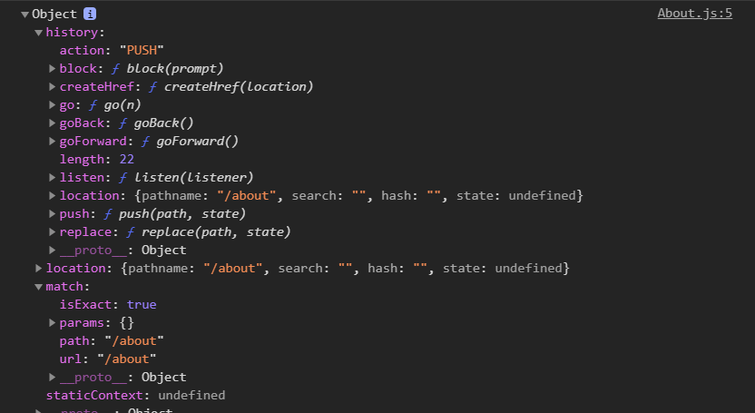
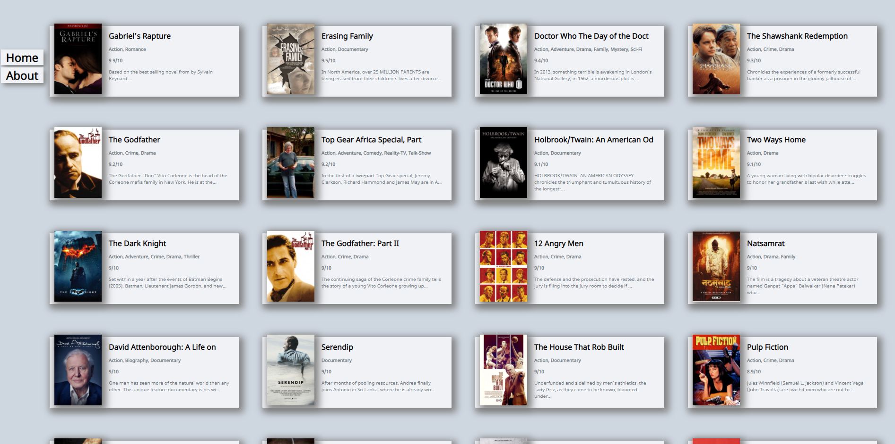
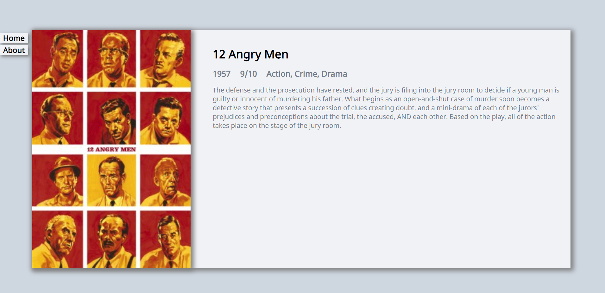
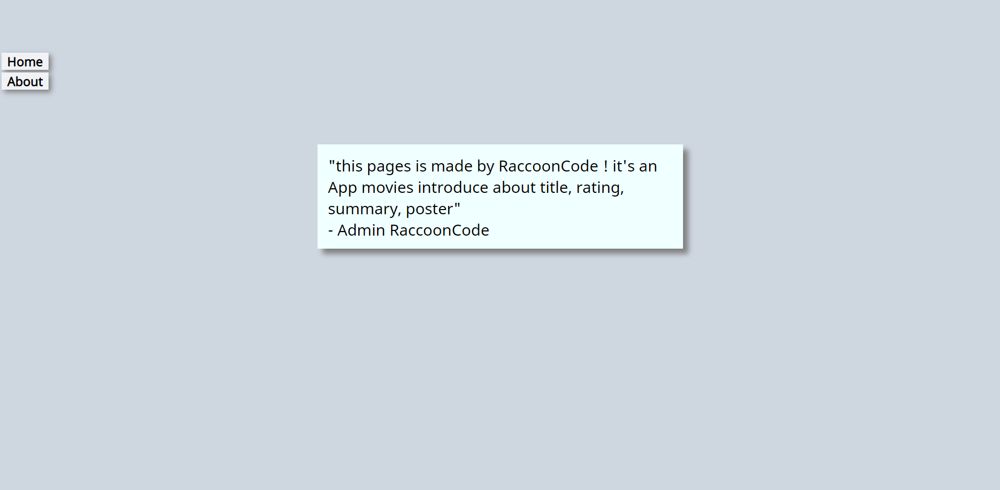

># React.js and React project(영화 웹 서비스 만들기) with nomadcoder

&nbsp;&nbsp; 저번에는 자바스크립트 기초강의의 todolist 크롬 앱을 구현했는데 이번에는 React를 배우고 입문하기 위해서 노마드 코더의 react js로 만드는 영화 웹서비스 만들기 강의를 수강하였다.
물론, 무료이다. 정말 좋은 강의 이고 저번 todolist 강의에서 처럼 어떤 형태로 쓰이는지 전체적인 감이 올것이라고 생각한다.

<br>

- [노마드 코더 사이트!](https://nomadcoders.co/?gclid=Cj0KCQiA4feBBhC9ARIsABp_nbVxRSolGl8kEqrti8PVF9rv5l4jJxXcNIGeNSUaDEm6zqH79HPTH5kaAitcEALw_wcB)

<br>

- 단지, 노마드 코더 강의를 듣고 공부 과정을 서술하듯 쓸 것이다. 본 자료를 무턱대고 믿지는 말았으면 좋겠다. 내가 이해하는 대로 쓴 것일뿐이니...


<br>
<br>
<br>
<br>
<br>


># Github 페이지를 통한 배포(Deploying)

- 설치 `npm i gh-pages`
- gh-pages : 웹사이트를 깃허브 페이지 도메인에 나타나게 해줌
- 무료로 static 웹사이트, html, css, javascript 웹사이트를 제공
- package.JSON 가서 홈페이지 설정하기
  - `"homepage": "https://user이름.github.io/프로젝트 repo 이름/"` (꼭 소문자로만 해야함, 띄어쓰기 안됨)

- package.json에서 scripts 에 script 추가하기
  - deploy를 실행하면 build 파일을 gh-pages에 올리게 함
  - predeploy를 실행시키면 deploy전에 항상 실행되고 build 파일을 생성하게 함 (기본적으로 pre 뒤에가 같아야 pre가 작동함)

``` json
"scripts": {
    "start": "react-scripts start", // npm run start
    "build": "react-scripts build", // npm run build
    "deploy": "gh-pages -d build", // npm run deploy
    "predeploy": "npm run build" // npm run predeploy
  },
```

- **deploy 해도 404 error 발생시**
  - 해당 github repo settings에가서 githubpage의 branch를 바꾸고 save해보자


<br>
<br>
<br>
<br>
<br>
<br>

- state를 사용하려고 꼭 class component를 사용할 필요는 없다. 새로운 기술로 component hook이 있음

># react-router dom

- 상단 메뉴 (Navigation) 만들기
- react-router dom 사용함
- `npm install react-router-dom`
- src에 components, routes 폴더 만들기
  - components에는 Movie.js, Movie.css 를 넣고 (app.js의 import movie 경로를 변경해준다.)
  - routes 안에는 About.js, Home.js를 만들어 두개의 스크린을 더 가지게 할 예정
  - `Home.js` 바로 영화를 보여주는 페이지
  - `About.js` 자세히 보기 페이지
- App.js의 내용들을 router들을 통해서 연결할 예정
- App.js 그대로 복사해서 Home으로 옮기고 app.css 도 home으로 변경해서 home 앱으로 수정
- `react-router dom`을 사용해서 기본적으로 react가 home, about js 를 보게 만들어줌
- 즉, 라우터에게 명령을 해놓아서 url에 덧붙여 실행했을 때 해당 componet를 불러 올수 있게 할 수 있음

- `HashRouter`를 import 하는데 react-router-dom에는 여러가지 router가 존재함(주소창의 분류가 #으로 이루어짐)

``` js
import React from 'react';
import { HashRouter, Route } from "react-router-dom";
import About from "./routes/About";
import Home from "./routes/Home";

function App(){
  return <HashRouter>
    <Route path="/" component={ Home }/>
    <Route path="/about" component={ About }/>
  </HashRouter>;
}

export default App;

```


- 2개의 컴포넌트가 한꺼번에 렌더링됨 (`/`도 라우터로 인식하여, 부모가 `/` 자식이 `/`를 포함하는 `/about`이라고 인식했기 때문에 `/`을 포함하는 모든 page를 렌더링 한것)
- `exact={true}` prop를 넣어 줌으로서 깔끔하게 `/`인 경우에만 해당 component가 렌더링 되도록 함

``` js
import React from 'react';
import { HashRouter, Route } from "react-router-dom";
import About from "./routes/About";
import Home from "./routes/Home";

function App(){
  return <HashRouter>
    <Route path="/" exact={true} component={ Home }/>
    <Route path="/about" component={ About }/>
  </HashRouter>;
}

export default App;

```

<br>
<br>
<br>
<br>
<br>
<br>

># Navigation

- 안내하는 버튼 임(각 페이지를 연결하는 버튼)

``` js
import React from "react";

function Navigation() {
    return (<div>
        <a href="/">Home</a>
        <a href="/about">About</a>
    </div>
    );
}

export default Navigation;
```

- 문제점 그냥 html이라서 페이지를 새로고침 시켜버려서 계속 react가 죽어서 자원을 새로 부름으로 SPA에 맞지 않음
- 그래서 `react-router-dom`에서 `Link` 객체를 가져와서 연결

``` js
import React from "react";
import { Link } from "react-router-dom";

function Navigation() {
    return (<div>
        <Link to="/">Home</Link>
        <Link to="/about">About</Link>
    </div>
    );
}

export default Navigation;
```

<br>
<br>
<br>
<br>
<br>


- **주의) Link는 router 태그 밖에서 사용 불가함(무조건 router 태그 안에 있어야 동작함)**
- 물론, 모든 것을 router 태그 안에 넣을 필요는 없지만 Link 사용시엔 넣어야함

``` js
import React from 'react';
import { HashRouter, Route } from "react-router-dom";
import About from "./routes/About";
import Home from "./routes/Home";
import Navigation from "./components/Navigation";

function App(){
  return (
  <HashRouter>
    <Navigation />
    <Route path="/" exact={true} component={ Home }/>
    <Route path="/about" component={ About }/>
  </HashRouter>
  );
}

export default App;

```

- 보기에는 BrowserRouter가 좋지만 github pages에서는 HashRouter가 업로드하기 편하다고 한다.


- 라우터의 모든 라우터들은 props를 가짐



- 이러한 props를 이용해서 home의 정보들을 보낼수 있음 (버튼 클릭시 정보를 보냄)

```js
import React from "react";
import { Link } from "react-router-dom";

function Navigation() {
    return (
      <div>
        <Link to="/">Home</Link>
        <Link to={{
            pathname:"./about",
            state: {
                fromNavigation: true
            }
        }}>About</Link>
    </div>
    );
}

export default Navigation;
```

- 위처럼 `Link`를 사용하고 prop의 state를 통해 정보를 넣고 다른 페이지에 연결하여 전달 가능

- [react-router-dom official site](https://reactrouter.com/web/api/Link/to-object)

- 우리가 링크를 클릭하면 react-router가 `/about`으로 데려가고 component about을 보내주고 또한 props도 보내줌(route가 정보를 보내줌)

<br>
<br>
<br>
<br>


># movie detail 만들기

- import  link를 통해서 누르면 detail페이지로 이동 할수 있게 하며, 해당 component의 props를 link의 state에 넣어 보냄

``` js
function Movie({year, rating, title, summary, poster, genres}) {
    return (
        <Link to={{
            pathname:'/movie-detail',
            state: {
                rating,
                title,
                year,
                summary,
                poster,
                genres
            }
        }}>
        <div className="movie">
            <div className="page">
                
                <div className="movie__data">
                    <h3 className="movie__title">{title.slice(0, 30)}</h3>
                    {/* <ul className="genres">{genres.map((genre, index) => (
                        <li key={index} className="genres__genre">{genre}</li> 
                    ))}</ul> */}
                    <h5 className="movie__genres">{genres.join(", ")}</h5>
                    <h5 className="movie__rating">{rating}/10</h5>
                    <p className="movie__summary">{summary.slice(0, 220)}...</p>
                </div>
            </div>
        </div>
        </Link>
    );
}
```

<br>
<br>
<br>
<br>

- **movie detail router 만들기**

- Link를 누르지 않고 주소창으로 movie-detail 접근시 state가 없으므로 정보를 띄우지 못함, 접근은 막기 위해서 `redirect` 라고 home으로 다시 이동하게 만듦
  - render 이후에 state의 undefined를 check함 (componentDidMount를 통해서)

<br>

- render-> componentDidMount가 된 상태에서 새로고침으로 다시 render하는 경우 
- Link를 통해서 받는 state가 없으므로 렌더링 할 것이 없어 undifined error가 발생함 그래서 unifined를 null로 return 시켜 error를 방지하고 componentDidMount가 다음에 실행 될때 undefined를 감지하여 홈으로 돌려 보냄


``` js
import React from "react";

class Detail extends React.Component{
    
    render() {
        const {location} = this.props;
        if(location.state){
            return <span>{location.state.title}</span>;
        } else {
            return null;
        }
    }
    componentDidMount() {
        const { location, history } = this.props;
        if(location.state === undefined) {
            history.push("/");
        }
    }
}


export default Detail;
```

- render, componentDidMount는 독립적이며 값을 공유하지 않는다는 것을 기억하자

<br>
<br>
<br>
<br>
<br>
<br>

># HTML, CSS 갖추기

- **Movie app main home**



<br>
<br>
<br>

- **Movie app detail view**



<br>
<br>
<br>

- **Movie app about site**




<br>
<br>
<br>
<br>


># 마치며


- 최종 배포
  - [github movie_app page](https://raccooncode96.github.io/movie_app/#/) 클릭!

- 마치면서 더 개선하고 싶었던 부분은 home에서 계속 다시 로딩하지 않고 이미 불러온 창으로 다시 돌아가는 것을 구현하면 좋을 듯하다.
- 나름 내가 생각해서 CSS도 개선하고, detail view 페이지도 구성해 보았다.


