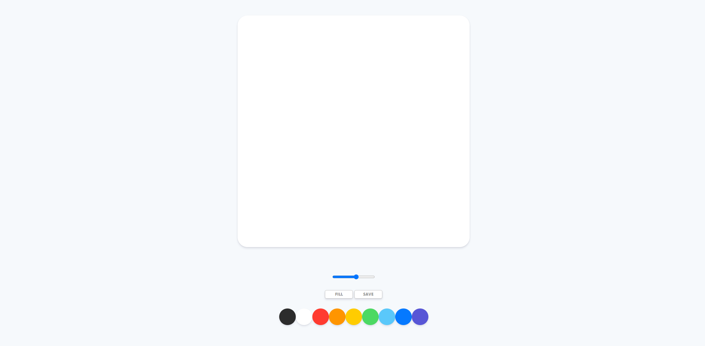
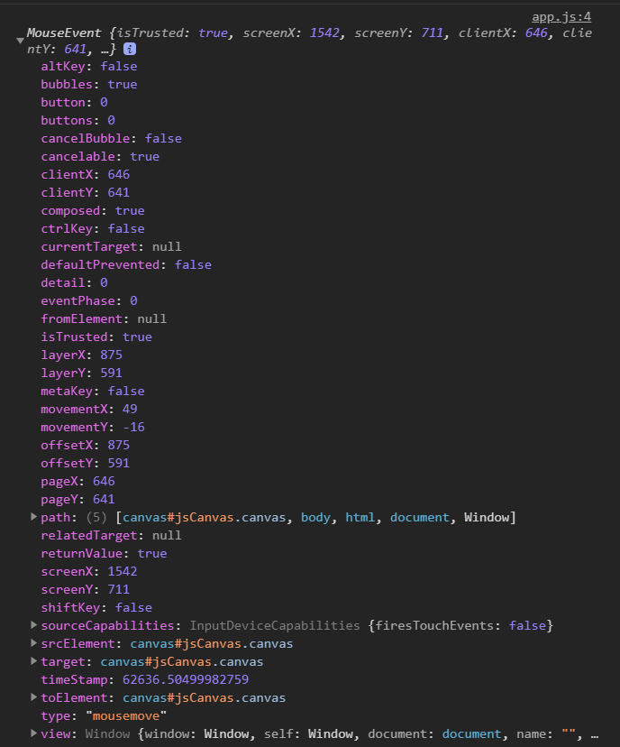
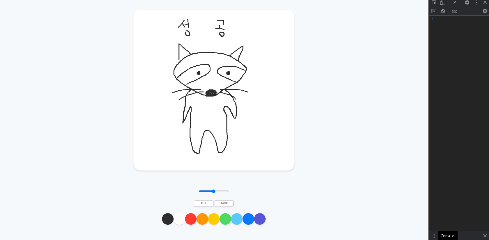

># 바닐라 js를 이용한 그림판 만들기 project

- [Nomadcoder 사이트 클릭!](https://nomadcoders.co/courses)

>## 그림판 전체적인 기능

- Canvas API를 이용함
  - 굵기 조절
  - 색깔 선택
  - 그리기
  - 채우기
  - 저장 기능

<br>
<br>
<br>

>## 사전에 필요한 것들

- 깃헙 계정
- 구글 크롬
- VScode

<br>
<br>
<br>


>## Set up

>### HTML

  - CSS, js 파일 연결
  - 전체적인 요소 구현
  - convas 태그 사용

``` js
<!DOCTYPE html>
<html lang="en">
<head>
    <meta charset="UTF-8">
    <meta http-equiv="X-UA-Compatible" content="IE=edge">
    <meta name="viewport" content="width=device-width, initial-scale=1.0">
    <link rel="stylesheet" href="styles.css">
    <title>PaintJS</title>
</head>
<body>
    <canvas id="jsCanvas" class="canvas"></canvas>
    <div class="controls">
        <div class="controls__colors" id="jsColors">
            <div class="controls__color" style="background-color: #2c2c2c;"></div>
            <div class="controls__color" style="background-color: white;"></div>
            <div class="controls__color" style="background-color: #FF3B30;"></div>
            <div class="controls__color" style="background-color: #FF9500;"></div>
            <div class="controls__color" style="background-color: #ffCC00;"></div>
            <div class="controls__color" style="background-color: #4CD963;"></div>
            <div class="controls__color" style="background-color: #5AC8FA;"></div>
            <div class="controls__color" style="background-color: #0579FF;"></div>
            <div class="controls__color" style="background-color: #5856D6;"></div>
        </div>
    </div>
    <script src="./app.js"></script>    
</body>
</html>

```

<br>
<br>
<br>

>### CSS

  - CSS 초기화 파일 만들기 (reset.css) [CSS RESET code](https://meyerweb.com/eric/tools/css/reset/)
  - RESET CSS을 CSS파일에 연결하기 `@import "위치"`
  - `display : flex` [flex 속성 알아보기](https://heropy.blog/2018/11/24/css-flexible-box/)

``` CSS
@import "reset.css";
body {
  background-color: #f6f9fc;
  font-family: -apple-system, BlinkMacSystemFont, "Segoe UI", Roboto, Oxygen,
    Ubuntu, Cantarell, "Open Sans", "Helvetica Neue", sans-serif;
  display: flex;
  flex-direction: column;
  align-items: center;
  padding-top: 50px;
}

.canvas {
  width: 700px;
  height: 700px;
  background-color: white;
  border-radius: 30px;
  box-shadow: 0 4px 6px rgba(50, 50, 93, 0.11), 0 1px 3px rgba(0, 0, 0, 0.08);
}

.controls {
  margin-top: 80px;
}

.controls .controls__colors {
  display: flex;
}

.controls__colors .controls__color {
  width: 50px;
  height: 50px;
  border-radius: 25px;
  box-shadow: 0 4px 6px rgba(50, 50, 93, 0.11), 0 1px 3px rgba(0, 0, 0, 0.08);
  cursor: pointer;
}

```


<br>
<br>
<br>

>### Button

- **HTML**

- [Emmet](https://code.visualstudio.com/docs/editor/emmet)
  - html 작성시 쉽게 작성시킬 수 있는 html 생성 언어?
  - 예) `div.controls__colors*2>div.controls__color>button#jsMode+button#jsSave` 하고 `tab`

``` html
<div class="controls__btns">
    <button id="jsMode">Fill</button>
    <button id="jsSave">Save</button>
</div>
```

<br>
<br>
<br>

- **CSS**

  - **MDN 사이트**
    - [CSS : all 속성](https://developer.mozilla.org/ko/docs/Web/CSS/all) : 사용자가 지정한 값 빼고 모두 선택함
    - [CSS : unset 값](https://developer.mozilla.org/ko/docs/Web/CSS/unset) : 사용자가 지정한 초기값으로 만듦(사용자가 지정한 최상단 부모 값으로)
    - [CSS: Rgba](http://www.tcpschool.com/css/css3_module_colors) : rgb 색상 + 알파 값 -> 투명도 까지 더해진 것임
    - [CSS : button:active](https://developer.mozilla.org/ko/docs/Web/CSS/:active) : button을 누르고 있을때 모양 및 상태 설정
    - [CSS : transform](https://developer.mozilla.org/ko/docs/Web/CSS/transform) : 해당 모양을 자유 자제로 변형시킬 수 있음 사이즈, 회전, 늘리기, 줄이기 등...
    - [CSS : cursor](https://developer.mozilla.org/ko/docs/Web/CSS/cursor) : 커서 모양 설정


``` css
.controls {
  margin-top: 80px;
  display: flex;
  flex-direction: column;
  align-items: center;
}

.controls .controls__btns {
  margin-bottom: 30px;
}

.controls__btns button {
  all: unset;
  cursor: pointer;
  background-color: white;
  padding: 5px 0;
  width: 80px;
  text-align: center;
  border-radius: 5px;
  border: 2px solid rgba(0, 0, 0, 0.2);
  color: rgba(0, 0, 0, 0.4);
  text-transform: uppercase;
  font-weight: 800;
  font-size: 12px;
  box-shadow: 0 4px 6px rgba(50, 50, 93, 0.11), 0 1px 3px rgba(0, 0, 0, 0.08);
}

.controls__btns button:active {
  transform: scale(0.97);
}
```


<br>
<br>
<br>

>### Range(포인터 크기 설정)

- **HTML**
  - [HTML: input 요소 ](https://developer.mozilla.org/ko/docs/Web/HTML/Element/Input)
    - min, max 최소 최대값 / value 기본값(default)/ step 증감하는 단위 값/

``` html
<div class="controls__range">
    <input type="range" id="jsRange" min="0.1" max="5.0" value="2.5" step="0.1" />
</div>
```

<br>
<br>

- **CSS**
  - 간단하게 위치만 조정해 줌

``` css
.controls .controls__range {
  margin-bottom: 30px;
}
```

<br>
<br>
<br>

>### CSS 입힌 중간 결과물




>## Canvas Events

- MDN 사이트
  - [JS : canvas](https://developer.mozilla.org/ko/docs/Web/API/Canvas_API/Tutorial/Basic_usage)
  - [CanvasRenderingContext2D](https://developer.mozilla.org/en-US/docs/Web/API/CanvasRenderingContext2D)
  - [JS : addEventListener](https://developer.mozilla.org/en-US/docs/Web/API/EventTarget/addEventListener)
  - [JS : Event](https://developer.mozilla.org/en-US/docs/Web/API/Event)
  - [JS : mouseEvent](https://developer.mozilla.org/en-US/docs/Web/API/MouseEvent)

<br>
<br>


- **addEventListener 조건** : 
  - `mousemove` : mouse가 움직임을 감지했을 때 event 발생
  - `mousedown` : mouse가 클릭했을 때(눌렸을 때) event 발생
  - `mouseup` : mouse가 클릭했을 때(때어졌을 때) event 발생
  - `mouseleave` : mouse가 target에서 벗어 났을 때 event 발생

<br>
<br>

- **mouseEvent**



- `offsetX`, `offsetY` : canvas 안에서의 마우스 위치 값
- `clientX`, `clientY` : 윈도우 전체의 범위내에서의 마우스 위치값 

<br>
<br>

- **JS**

- `onMouseMove` : mouse 위치 감지
- mouse 클릭 상태 감지 하여 painting 변수 변경 (눌렀을 때 true, 떼거나 컨버스에서 벗어나면 false)
- paint 변수 상태를 `startPainting` , `stopPainting`으로 구현


``` js
const canvas = document.getElementById("jsCanvas");
const ctx = canvas.getContext("2d");

canvas.width = 700;
canvas.height = 700;

ctx.strokeStyle = "#2c2c2c"
ctx.lineWidth = 0.5;


let painting = false;

function startPainting(event) {
    painting = true;
}

function stopPainting(event) {
    painting = false;
}

function onMouseMove(event) {
    const x = event.offsetX;
    const y = event.offsetY;
}


if (canvas) {
    canvas.addEventListener("mousemove", onMouseMove);
    canvas.addEventListener("mousedown", startPainting);
    canvas.addEventListener("mouseup", stopPainting);
    canvas.addEventListener("mouseleave", stopPainting);
}
```

<br>

- **MDN 사이트**
  - [JS : canvas](https://developer.mozilla.org/ko/docs/Web/API/Canvas_API/Tutorial/Basic_usage)
  - [CanvasRenderingContext2D](https://developer.mozilla.org/en-US/docs/Web/API/CanvasRenderingContext2D)

<br>

- convasRednderingContext를 가져와야 함 `getContext(설정값)` 으로 가져옴
  - 설정 값은 2d, webgl(3D) 등을 넣을 수 있음
  - [3d webgl](https://jaeseokim.tistory.com/104)

<br>

- ctx 변수로 해당 canvas context 객체를 가져와 해당 속성을 기본적으로 설정함 
  - `strokeStyle` : line color
  - `lineWidth` : line thick

<br>

- canvas 객체 크기를 정해야 함 (`canvas.width`, `canvas.height`)

``` js
const canvas = document.getElementById("jsCanvas");
const ctx = canvas.getContext("2d");

canvas.width = 700;
canvas.height = 700;

let painting = false;


function onMouseMove(event) {
    const x = event.offsetX;
    const y = event.offsetY;
    if(!painting) {
        ctx.beginPath();
        ctx.moveTo(x, y);
    } else {
        ctx.lineTo(x, y);
        ctx.stroke();
    }
    
}

```

- **그리기 구현**
  - painting 변수 특성상 painting이 되는 것 안되는 것은 true false로 표시해야 가독성이 좋은데 이런 특성 때문에
  - 조건문에 넣어 특정 명령을 실행 시킬려면 조건 값이 true이어야 하는데 그래서 일부러 false 인경우를 true로 만들어 if문을 실행시킴
  - painting이 false 이면
    -  `beginPath()` : 경로 list 시작
    -  `moveTo()` : 경로 list에 시작(첫번 째) 좌표값을 받음
  - painting이 true 이면
    - `lineTo()` : 경로 list에 하위 좌표값을 받음
    - `stroke()` : 경로 시작값 부터 하위 값들의 경로로 획을 그음
      - 추측이지만 그래서 계속 시작 값 부터 하위 값들 계속 획을 긎기 때문에 최근 값일 수록 연하고 이전 값일 수록 진해 지는것 같다.

- `closePath()` : 경로 list 끝 값과 시작값을 이어주는 것 같다.
- `fill()` : fill의 경우에는 채우는 효과라서 closePath처럼 효과가 나타난다.
  - 물론, 채우냐 빈것의 차이지만 선으로 긋기만 하는 거라면 딱히 차이는 없다. 면이 아니라서


<br>
<br>



<br>
<br>
<br>


># 앞으로 점검해야 할 일 (그림판 프로젝트 X)


- 모달창 만들기
- 슬라이드 메뉴 만들기
- 드래그엔 드랍

- [30가지 바닐라 js 예제](https://javascript30.com/)


