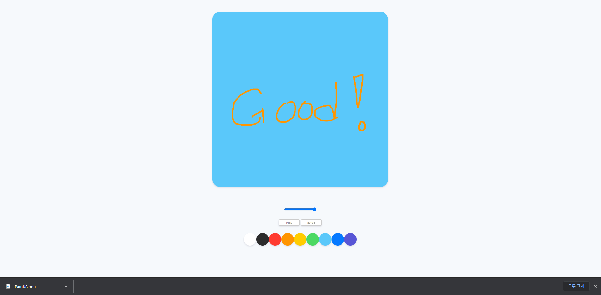
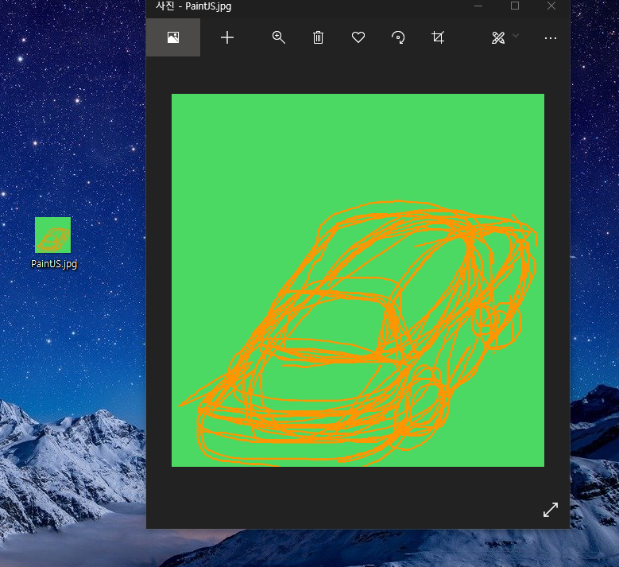

># 바닐라 js를 이용한 그림판 만들기 project

- [Nomadcoder 사이트 클릭!](https://nomadcoders.co/courses)

- 저번 시간에는 기본적인 CSS, HTML 그리고  JS의 그리기 기능 까지 구현했다.

<br>
<br>
<br>

>## VScode 다중커서

  - `Ctrl + d` : 같은 단어 찾아서 추가식으로 선택
  - `Ctrl + Alt + Up/Down` : 위/아래로 커서 추가
  -  `ALT + LMB(왼마클)` : 클릭 위치에 다중커서 추가
  -  `ESC` : 다중선택모드 종료

<br>
<br>
<br>

>## 이번에 구현할 사항

- 색 바꾸기 js
- 붓 크기 바꾸기 js
- 채우기 기능 js
- 이미지 저장하기 js

<br>
<br>
<br>


>## JS : 색 바꾸기 기능 구현하기 

- colors 변수에 dom을 가져옴
- colors 변수를 Array로 만들고 `forEach()`를 통해서 dom하나하나를 callback함수로 컨트롤 함
- callback 함수로는 Array의 item을 `addEventListener`로 받아서 click시에 `handleColorClick` 이름의 callback함수를 호출하게 한다.
- handleColorClick에서 event를 console log에 찍어보면 객체가 어떻게 이루어 져있는지 볼수 있다.
- 이를 통해서 color라는 변수에 해당 돔객체의 색깔을 할당한다.
- storkeStyle을 color 변수로 색을 할당해주면 색이 변하게 됨 (override 되니까)


``` js

const colors = document.getElementsByClassName("jsColor");

function handleColorClick(event) {
    const color = event.target.style.backgroundColor;
    ctx.strokeStyle = color;
}

Array.from(colors).forEach(color => color.addEventListener("click", handleColorClick));
```

<br>
<br>
<br>

>## JS : 붓 크기 바꾸기

``` js
const range = document.getElementById("jsRange");

function handleRangeChange(event) {
    const size = event.target.value;
    ctx.lineWidth = size;
}

if (range) {
    range.addEventListener("input", handleRangeChange);
};
```

<br>
<br>
<br>

>## JS : 채우기 기능 

- FILL 버튼이 누르면 PAINT로 바뀌는 동전? 버튼 만들기
- 바탕 채우기 기능 구현

- canvas 요소들은 모두 동기적 코드임 (순서대로 실행 되어 순서가 중요함)

- **FILL & PAINT 버튼 만들기**

``` js
const mode = document.getElementById("jsMode");

let filling = false;

function handleModeClick() {
    if (filling === true) {
        filling = false;
        mode.innerText = "fill"
    } else {
        filling = true;
        mode.innerText = "paint";
    }
}

if (mode) {
    mode.addEventListener("click", handleModeClick)
}
```

<br>
<br>
<br>

- **CANVAS 채우기**

- canvas 에서 click event 받아서 `handleCanvasClick` 호출
- `handleCanvasClick`는 `filling`이 true 일 경우 `fillRect`를 통해서 색을 채움
- 채우기 색을 지정(`fillStyle`)할 때는 그냥 `handleColorClick`시 `strokeStyle` 지정 할때 같이 같은 색으로 지정

``` js
const canvas = document.getElementById("jsCanvas");
const ctx = canvas.getContext("2d");

const INITIAL_COLOR = "#2c2c2c"
const CANVAS_SIZE = 700;

canvas.width = CANVAS_SIZE;
canvas.height = CANVAS_SIZE;

ctx.strokeStyle = INITIAL_COLOR;
ctx.fillStyle = INITIAL_COLOR;

let filling = false;

function handleCanvasClick() {
    if (filling === true) {
        ctx.fillRect(0, 0, canvas.width, canvas.height);
    }
}

function handleColorClick(event) {
    const color = event.target.style.backgroundColor;
    ctx.strokeStyle = color;
    ctx.fillStyle = ctx.strokeStyle;
}

Array.from(colors).forEach(color => color.addEventListener("click", handleColorClick));

if (canvas) {
    canvas.addEventListener("click", handleCanvasClick);
}
```

<br>
<br>
<br>

>## JS : 저장하기

- 기본적으로 canvas에서 image를 만드는 것이 내장되어 있기 때문에 그냥 우클릭 저장하면 저장됨

- 버그) 배경을 안찍고 그냥 저장하면 배경은 안 존재하는 것으로 만들어짐
- 초기 canvas set up 될때 INITIAL 배경이 있어야 함

``` js
ctx.fillStyle = "white";
ctx.fillRect(0, 0, canvas.width, canvas.height);
```

<br>

- **다운로드시 필요한 dataURL을 가져오는 방법**

- 일단, canvas에서 우클릭 context menu 이벤트를 막음 `preventDefault()`를 통해서
- 어차피 save 버튼으로 저장해야 하므로

- [HTMLCanvasElement : toDataURL()](https://developer.mozilla.org/en-US/docs/Web/API/HTMLCanvasElement/toDataURL)

- save 버튼 클릭시 `handleSaveClick` 콜백 함수 호출
- `handleSaveClick`는 canvas 객체를 `toDataURL()` 함수를 통해서 `image`변수에 dataURL로 가져오고
- `a` 태그를 이용해서 `a`태그에 `href`속성에는 url을, `download`속성에는 다운로드 됬을때 이름을 지정해 줌
- 그리고 가짜로 `click()`를 이용해서 `a`태그를 활성화 시킴
  - [MDN : a tag](https://developer.mozilla.org/ko/docs/Web/HTML/Element/a) 


``` js
const saveBtn = document.getElementById("jsSave");


function handleSaveClick() {
    const image = canvas.toDataURL('image/png', 1.0);
    const link = document.createElement("a");
    link.href = image;
    link.download = "PaintJS";
    link.click();
}

function handleCM(event) {
    event.preventDefault();
}

if (canvas) {
    canvas.addEventListener("contextmenu", handleCM)
}

if (saveBtn) {
    saveBtn.addEventListener("click", handleSaveClick);
}

```

<br>
<br>
<br>
<br>

># 결과

- **paint & save**




<br>
<br>
<br>
<br>
<br>

- **Save**




<br>
<br>
<br>
<br>
<br>

># 더하고 싶은 기능

- 커서 포인터 바꾸기(fill, paint)
- 지우개 만들기
- reset 버튼 만들기
- 저장할 때 이름 받기
- 현재 색 표시
- 도형 툴
- 색 커스텀 bar
- 팔레트 크기 변경
- 파일 불러오기