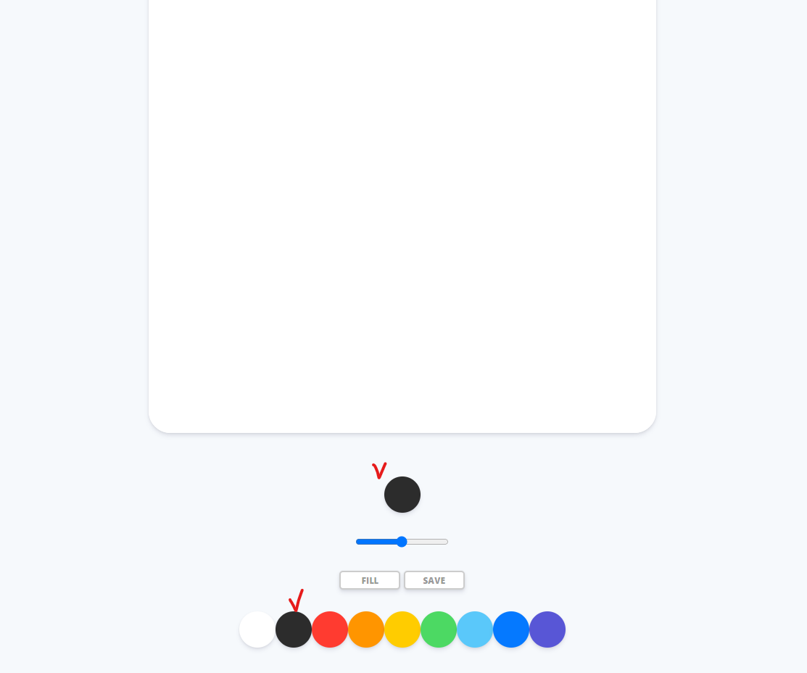
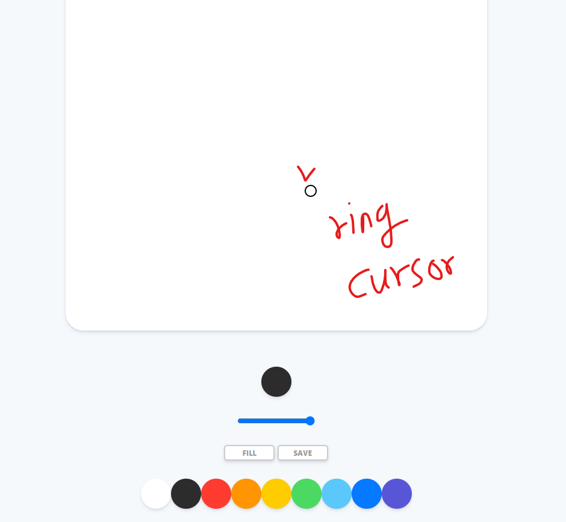
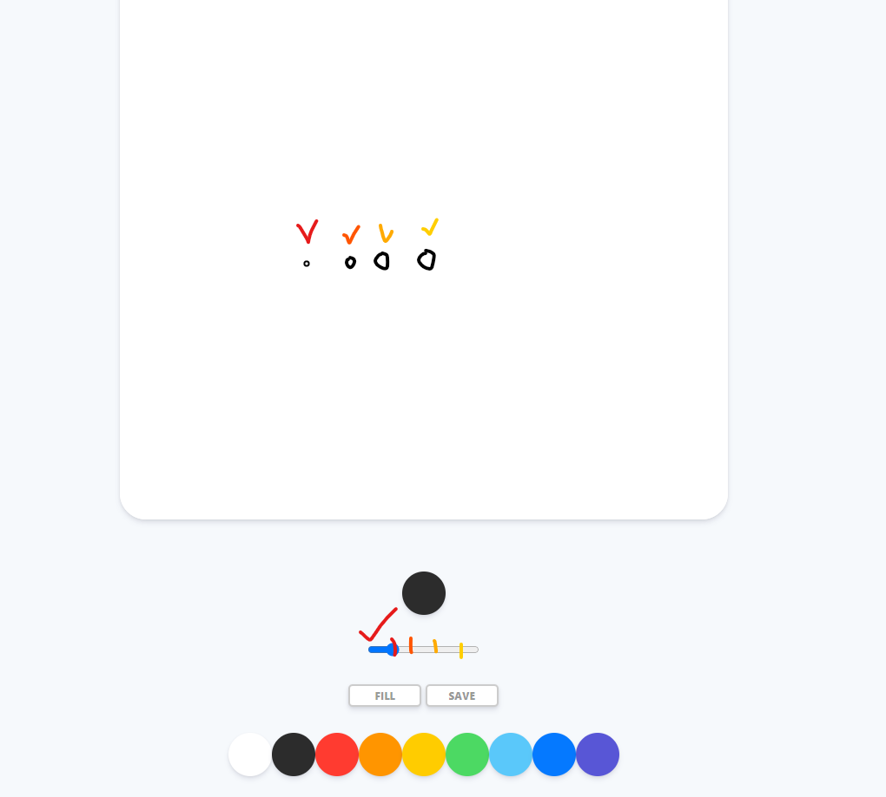

># 바닐라 js를 이용한 그림판 만들기 project

- [Nomadcoder 사이트 클릭!](https://nomadcoders.co/courses)

- 그림판 만들기 강의는 모두 끝냈고 내가 더 추가하고자 하는 기능을 구현 해 보았다.

<br>
<br>
<br>


># 추가적으로 구현한 기능

>## 현재 색 표시




<br>
<br>

``` html
<div class="controls">
    <div class="check"></div>
</div>
```

<br>

``` css
.controls .check {
  margin-bottom: 30px;
  width: 50px;
  height: 50px;
  border-radius: 25px;
  box-shadow: 0 4px 6px rgba(50, 50, 93, 0.11), 0 1px 3px rgba(0, 0, 0, 0.08);
}
```

<br>

``` js
const check = document.getElementById("jsCheck");

check.style.backgroundColor = INITIAL_COLOR;

function handleColorClick(event) {
    const color = event.target.style.backgroundColor;
    check.style.backgroundColor = color;
    ctx.strokeStyle = color;
    ctx.fillStyle = ctx.strokeStyle;
}
```

<br>
<br>
<br>
<br>

>## 커서 포인터 바꾸기 01 기본 

- canvas안에서 fill이면 default, paint이면 pointer

``` js
function handleModeClick() {
    if (filling === true) {
        filling = false;
        mode.innerText = "fill";
        ctx.canvas.style.cursor = "default";
    } else {
        filling = true;
        mode.innerText = "paint";
        ctx.canvas.style.cursor = "pointer";
    }
}
```

<br>
<br>
<br>

>## 커서 포인터 바꾸기 02 Cursor Custom

<br>



<br>

- 커서 div 만들기

``` html
<div class="cursor"></div>
```

<br>
<br>
<br>

- 커서 CSS 디자인 하기
  - 동그라미 디자인
  - 기본 convas에서는 기본 cursor가 없는 걸로 설정 
  - transfrom의 `translate`로 위치 조정
  - `pointer-events` 를 none으로 해야 움직여도 기본 pointer가 안보임
  - position `absolute`이거 조심해야 함 나중에 이렇게 해야 top, left로 조정가능

``` css
.canvas {
  cursor: none;
  width: 700px;
  height: 700px;
  background-color: white;
  border-radius: 30px;
  box-shadow: 0 4px 6px rgba(50, 50, 93, 0.11), 0 1px 3px rgba(0, 0, 0, 0.08);
}

.cursor {
  width: 1rem;
  height: 1rem;
  border: 2px solid black;
  border-radius: 50%;
  position: absolute;
  transform: translate(-50%, -50%);
  pointer-events: none;
}
```

<br>
<br>
<br>

- 마우스 기능 구현하기
  - 전체적인 기능 설명 : Canvas안에서는 custom cursor가 보이고 밖에서는 기본 cursor가 보임
  - cursor element의 class `cursor`가 기본적으로 없게 해야 함(초기값을 설정해야 초기에 커서 이미지가 안 뜸 canvas에 넣었을때 비로소 보임)
  - mouseCursor로 element를 가져오는데 `getElementsByClassName`으로 가져오면 object가 list로서 하나 더 씌워 있는 것을 주의해야 한다. (index로 item을 골라야 접근 가능함)
  - `addEventListner`로 mousemove, mouseleave 인경우로 나누어 커서를 숨길지 안숨길지 설정하고
  - 보이는 경우 `handleCursor` 콜백함수가 호출되고 안에서는 filling 상태에 따라서 classList를 조정 해서 보이거나 안보이게 하고
  - 이후에 cursor element가져와서 style의 `top`, `left` 값을 할당해 주는데 event가져와서 page상의 x,y값에 `px` 붙여서 할당 
  - **주의)** `offsetX ,Y` 로 주면 창크기 변하면 실제 커서와 커서 이미지를 맞출수 없음

<br>

``` js
const canvas = document.getElementById("jsCanvas");
const mouseCursor = document.querySelector(".cursor");
mouseCursor.classList.remove("cursor");

function handleCursor(event) {
    if(filling === false) {
        mouseCursor.classList.add("cursor")
    } else {
        mouseCursor.classList.remove("cursor")
    }
    mouseCursor.style.top = event.pageY + "px"
    mouseCursor.style.left = event.pageX + "px"    
}

function hideCursor() {
    mouseCursor.classList.remove("cursor")   
}

if (canvas) {
    canvas.addEventListener("mousemove", handleCursor);
    canvas.addEventListener("mouseleave", hideCursor);
}

```

<br>
<br>
<br>
<br>


>## 커서크기에 line range 반영

<br>

>### 커서 html 변경

- `cursor` class는 단지 커서가 밖에 나가면 custom 커서가 안보이게 하는 것임 이렇게 안하면 custom 커서가 계속 보여지고 있기 때문에 거슬림
- 또 한번에 몰아 버리면 line range를 반영하려고 하면 없어지는 class라서 sub class 이름을 두었다.

``` html
<div class="cursor cursor_range"></div>
```

<br>
<br>
<br>

>### 커서 CSS 변경

- 즉, `cursor_range` 클래스는 기본적인 cursor 모양을 유지하고 표시하는 역할을 함 그런데, `cursor` 클래스는 mouseleave event에 반응하여 border를 없애서 안보이게 처리함
- 커서 크기와 line range를 맞추기 위해서 초기값은 0.2rem으로 줌

``` css

.cursor {
  border: 2px solid black;
}

.cursor_range {
  transform: translate(-50%, -50%);
  border-radius: 50%;
  width: 0.2rem;
  height: 0.2rem;
  position: absolute;
  pointer-events: none;
}
```

<br>
<br>
<br>

>### JS : 커서 크기 line range와 연동 시키기

<br>



<br>


- cursor_range element를 가져와서 style의 width, height를 건드려서 조정했고
- 커서 크기를 맞추기 위해서 range size 값에 `상수값`을 곱해 주었다. 

``` js
const cursorRange = document.querySelector(".cursor_range")

ctx.lineWidth = 2.5;
const CURSOR_RANGE_CTRL = 0.1;


function handleRangeChange(event) {
    const size = event.target.value;
    ctx.lineWidth = size;
    cursorRange.style.width = size * CURSOR_RANGE_CTRL + "rem";
    cursorRange.style.height = size * CURSOR_RANGE_CTRL + "rem";
}
```

<br>
<br>
<br>


># 더 개선하고 싶은 부분들

- 도형 툴
- 색 커스텀 bar
- 팔레트 크기 변경
- 파일 불러오기
- 지우개 만들기
- reset 버튼 만들기
- 저장할 때 이름 받기