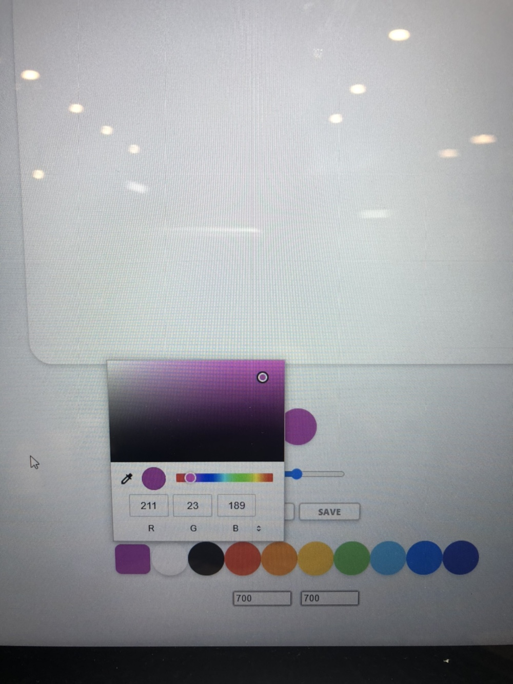
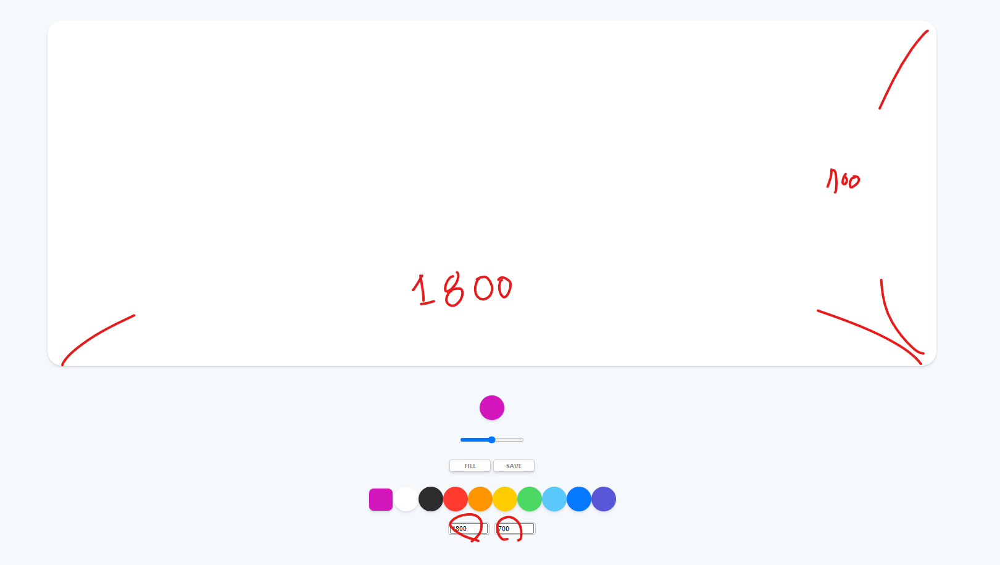

># 바닐라 js를 이용한 그림판 만들기 project

- [Nomadcoder 사이트 클릭!](https://nomadcoders.co/courses)

- 그림판 만들기 강의는 모두 끝냈고 내가 더 추가하고자 하는 기능을 구현 해 보았다.

<br>
<br>
<br>


># 추가적으로 구현한 기능

>## 커스텀 색깔 픽커 (Custom color picker)

- 저번에 다른 기능을 구현하다가 input 태그의 color 타입이 있는 것을 보았다.
- input의 color 은 custom 가능한 창을 열어서 색을 input 할수도 있다.

<br>
<br>


>### 문제

- input color의 경우 모양을 자유자재로 변경이 불가능 했다.(radius 값을 줄수 없다.)

<br>
<br>

>### 방안 01

- 새로운 요소(div)로 감싸서 div를 커스텀하여 표시하게 하고 input을 display none으로 설정하여 Javascript를 통해서 연결한다.
- check 요소에도 색깔 할당을 줘서 check 가능하게 함

``` js
const customColor = document.querySelector("#jsColorCustom");
const shapeCColor = document.querySelector(".custom__color");

function handleCColorChange(event) {
    const color = event.target.value;
    check.style.backgroundColor = color;
    ctx.strokeStyle = color;
    ctx.fillStyle = ctx.strokeStyle;
}

function linkClick() {
    customColor.click();
}

if (customColor) {
    customColor.addEventListener("input", handleCColorChange);
}

if (shapeCColor) {
    shapeCColor.addEventListener("click", linkClick);
}
```

<br>

- 정상적으로 작동하나, **<span style="color:red">click했을 때 보여지는 창이 top, left 0 위치에 존재하게 되어 불편하다.</span>**

<br>
<br>
<br>

>### 방안 02

- **가상요소 사용해서 CSS 스타일링 하기**
  - [stackoverflow에서 나온 정보](https://stackoverflow.com/questions/41884538/how-to-change-html5-color-input-inner-radius)

<br>

- **크로스 브라우징 (Cross Browsing)**
    - 쉽게 말하면 웹브라우저 마다 될 수 있는대로 비슷한 기능과 화면을 구현하여 소외감 없이 브라우저를 구성시키는 것
    - [크로스 브라우징에 대한 고찰](https://mulder21c.github.io/2019/01/30/what-is-cross-browsing/)

<br>

- **밴더 프리픽스(Vendor Prefix)**
  - CSS 접두사
  - 새로운 실험적인 기능의 CSS를 제공시에 웹 브라우저 마다 스타일 시트 요소가 있어서 인식시키기 위해서 접두사(prefix)를 사용함(호환성)
  - `-webkit-` : 크롬, 사파리 , 오페라
  - `-moz-` : firefox
  - `-ms-` : IE, Edge
  - `-o-` : 오페라

<br>

- **::-webkit-color-swatch**
  - [MDN : ::-moz-color-swatch](https://developer.mozilla.org/en-US/docs/Web/CSS/::-moz-color-swatch)

<br>

``` css
#jsColorCustom {
  outline: none;
  -webkit-appearance: none;
  padding: 0;
  border: none;
  background-color: transparent;
  width: 52px;
  height: 52px;
}

#jsColorCustom::-webkit-color-swatch {
  border: none;
  border-radius: 50%;
  padding: 0;
  box-shadow: 0 4px 6px rgba(50, 50, 93, 0.11), 0 1px 3px rgba(0, 0, 0, 0.08);
}
```

<br>

- 이렇게 해야 내부의 inner에 radius를 줄수 있음
  - 원래 요소에 `-webkit-appearance: none;`으로 안보이게 하고, `outline: none;`으로 포커스 상태를 없앨 수 있음
  - inner가 표시되어서 조금 작게 표현 되는것 같아 기본 input 크기를 52px로 늘렸다.
  - `::-webkit-color-swatch` 를 이용하여 radius 50%를 주었음

<br>
<br>

- **color custom**



<br>
<br>
<br>


>## 커스텀 캔버스 사이저 (Custom Canvas Sizer)

- input number 타입으로 넣어서 form으로 submit으로 가져와야함
- **<span style="color: red">리스너에서 input 조건으로 콜백 함수 호출 시키게 해도 호출 하지 않아 event가 발생하지 않음 그래서 submit으로 해야함)</span>**

<br>

- **html**
    - min, max 속성 주었음 
    - value 기본 값 700 인것을 표시해 줌으로써 어느 크기 인지 가늠하게 해줌

``` html
<div class="controls__size">
        <form class="controls__width">
            <input type="number" id="canvas__width" placeholder="Width" value="700" min="500" max="2000" />
        </form>
        <form class="controls__height">
            <input type="number" id="canvas__height" placeholder="height" value="700" min="500" max="2000" />
        </form>
    </div>
```

<br>
<br>
<br>

- **js**
  - form을 하나 씩 들고 와서 submit 한 event를 콘솔로 찍어 보니 target안에 바로 접근할 수 있는 key인 item들은 그냥 `.`을 통해서 가져올 수 있었지만 key가 object인 경우에는 indexing으로 가져와야 한다. `[]`로
  - 그리곤 원래 canvas 요소의 width, height 값에 할당해 줬다.

``` js
const widthForm = document.querySelector(".controls__width");
const heightForm = document.querySelector(".controls__height");

function  handleCanvasWidth(event) {
    event.preventDefault();
    canvas.width = event.target[0].value;
}

function handleCanvasHeight(event) {
    event.preventDefault();
    canvas.height = event.target[0].value;
}

if (widthForm) {
    widthForm.addEventListener("submit", handleCanvasWidth);
}

if (heightForm) {
    heightForm.addEventListener("submit", handleCanvasHeight);
}
```

<br>

- **CSS**

``` css

.controls__size {
  display: flex;
}

.controls__size form {
  margin: 20px 5px;
  width: 80px;
  text-align: center;
  border-radius: 5px;
  border: 2px solid rgba(0, 0, 0, 0.2);
}
```

<br>

- **change canvas size**



<br>
<br>
<br>

># 더 개선하고 싶은 부분들

- 도형 툴
- 저장할 때 이름 받기
- 모달창 만들어서 색, 크기, 등등의 툴 모달창 만들기
- 로컬 스토리지를 이용한 웹 저장 및 reset 버튼
  - [로컬스토리지 vs cookie](https://erwinousy.medium.com/%EC%BF%A0%ED%82%A4-vs-%EB%A1%9C%EC%BB%AC%EC%8A%A4%ED%86%A0%EB%A6%AC%EC%A7%80-%EC%B0%A8%EC%9D%B4%EC%A0%90%EC%9D%80-%EB%AC%B4%EC%97%87%EC%9D%BC%EA%B9%8C-28b8db2ca7b2)
- 파일 불러오기