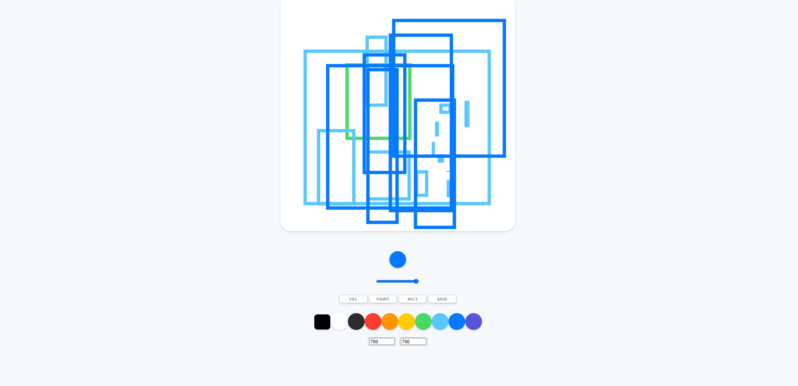

># 바닐라 js를 이용한 그림판 만들기 project

- [Nomadcoder 사이트 클릭!](https://nomadcoders.co/courses)

- 그림판 만들기 강의는 모두 끝냈고 내가 더 추가하고자 하는 기능을 구현 해 보았다.

<br>
<br>
<br>


># 추가적으로 구현한 기능

>## 도형 툴

도형 툴 중에 사각형 도형 툴을 만들기 위해서 엄청나게 많은 시간을 쏟았다.  
일단 여러 시행착오를 많이 겪었다.   

<br>

원래는 그림판 처럼 그었을 때 **사각형 도형 가이드 라인**이 보였으면 했다.   
하지만 여러가지 장벽을 만나 포기하게 되었다. Canvas API의 한계인것 같다.

<br>

>### 사각형 그리기 툴

- 기본적으로 html을 통해 rect 버튼을 만들었다.

``` html
<button id="jsRect">Rect</button>
```

<br>

- **html 요소 가져오기**

``` js
// ELEMENTS
const canvas = document.getElementById("jsCanvas");
const ctx = canvas.getContext("2d");
const rectBtn = document.querySelector("#jsRect");
```

<br>

- **변수 선언 및 초기값 설정**
  - `paint` , `rect`, `fill` 은 버튼이 눌려있는 상태를 위해서 지정해 놓은 것임
  - `recting` 은 canvas에서 마우스를 누른 경우 뗀 경우 알기 위해서 임
  - `startX` , `startY`는 마우스를 누르 경우 그리기 시작하는 좌표값을 이야기함 초기값으로 일단 0, 0으로 설정

``` js

// INIT VAULES
let paint = true;
let painting = false;
let rect = false;
let recting = false;
let fill = false;

let startX = 0;
let startY = 0;
```

<br>

- **EVENT 설정**
  - 리스너를 통해 canvas에서의 상태에 따른 콜백 함수를 지정했음
    - mouse가 눌리는 경우 그리기 시작해서(startRecting), 떼어질때 또는 넘어 갈때 끝나는 것(stopRecting) 
  - recBtn의 경우에는 버튼으로 클릭시 이벤트 임

``` js
// RECT EVENT
if (canvas) {
  canvas.addEventListener("mousemove", onMouseMoveR);
  canvas.addEventListener("mousedown", startRecting);
  canvas.addEventListener("mouseup", stopRecting);
  canvas.addEventListener("mouseleave", stopRecting);
}

if (rectBtn) {
    rectBtn.addEventListener("click", handleRectClick);
}
```

<br>

- **콜백 함수**
  - 처음에 `handleRectClick` 호출시 먼저 버튼의 상태를 확인하여 버튼 확인용 변수를 설정해준다.
  
  <br>

  - 마우스를 canvas에서 클릭하면 `startRecting`이 버튼 상태값을 확인하여 `recting`을 `true`로 만들고 start 좌표를 `offsetX`, `offsetY`를 통해서 전역 변수인 `startX`, `startY`에 할당한다. 그리고 `beginPath()`로 사전의 path를 끊어준다. (안끊으면 컬러 변경시 기존의 사각형의 색이 변하는 bug 발생)
  
  <br>

  - canvas에서 움직이면 `onMouseMoveR`이 호출되어 일단, 버튼 상태 변수 점검하고 `현재 마우스의 좌표`를 가져온다. 그리고 아까 설정한 recting 변수를 확인해서 마우스가 눌렸는지 떼어졌는지 를 통해 눌려지면 `beginPath()`로 경로를 시작하고  `ctx.rect()`를 통해서 (startX, startY, width, height )를 넣어 사각형을 그린다. 마우스가 눌리지 않은 때는 아무일도 일어나지 않는다.
   

``` js
// RECTING FUNCTIONS
function handleRectClick(event) {
    if(rect === false) {
        rect = true;
        fill = false;
        paint = false;
        ctx.canvas.style.cursor = "none";
    }
}

function startRecting(event) {
    if(rect === true) {
        recting = true;
        startX = event.offsetX;
        startY = event.offsetY;
        ctx.beginPath();
    }
}

function onMouseMoveR(event) {
    if(rect === true) {
        const x = event.offsetX;
        const y = event.offsetY;
        if(!recting) {
            
        } else{
            const width = x-startX;
            const height = y-startY;
            ctx.beginPath();
            ctx.moveTo(x, y);
            ctx.rect(startX, startY, width, height);
        }
    }
}

function stopRecting(event) {
    if(rect === true) {
        recting = false;
        ctx.stroke();
        ctx.closePath();
    }
}

```

- 이렇게 하면 완성이다.
- 하지만, 이렇게 하게 되면 rect로 선을 그을때는 사각형 가이드 선이 안보여 현재 크기를 짐작하기 어렵다.
- 그래서 사각형 가이드를 구현하고자 노력 하였으나 많은 문제에 직면했다.

<br>
<br>
<br>

>## 사각형 가이드 선

- 사각형 가이드 선을 구현하는 방법은 두가지 정도를 생각해 볼 수 있다.

<br>

>### 방법 01

- 첫번째는 `canvas API`에서 제공하는 기능을 가지고 전에 그렸던 사각형을 지울 수 있으면 기존의 잔상이 남는 것을 제거하여 가이드 선을 만들 수 있다. 
  - 하지만, style save는 있지만 rect를 기억하는 것은 없었다.
  - 지우는 것을 생각해 보아도 `clearRect()`함수가 있지만 이것은 특정 사각형 안쪽을 그냥 초기화 시키는 것에 지나지 않았다. 
  - 초기화를 이용해서 같이 나열한다 해도 너무 빠르게 지워지기 때문에 거이 보이지도 않는다. 또한, 다른 사각형 까지 지우기 때문에 불가능 하다.  

<br>

>### 방법 02

- 두번째는 Element를 이용해서 커서를 만든 것 처럼 겉에만 보이게 하는 것이다.
  - 계속 찾다보니 절대 좌표, 상대 좌표에 대한 개념이 중요하게 작용했고, 
    - [절대 좌표, 상대 좌표 01](https://mommoo.tistory.com/85)
    - [절대 좌표, 상대 좌표 02](https://hotdogya.tistory.com/130)
  - `getBoundingClientRect()`함수를 통해서 element의 좌상 끝 좌표를 알수 있게 되었고, 이를 통해서 element와 그리는 부분을 일치 시켰다.
  - 하지만, element 자체가 내포 되어 만들어 질때 조금이라도 element를 건드리게 되면 가이드가 만들어 지다가 말았고 대부분이 작게 시작해서 닿을수 밖에 없어 거의 잘 되지 않았다.

<br>
<br>


- **<span style="color: red">글을 쓰다 보니 좋은 생각이 났다. 바로 커서에서 했던 `가상 요소`를 사용하면 될 것 같다. 커서에서는 분명히 요소를 가졌음에도 그리는 것에 지장을 주지 않았던것을 생각하면 가능하겠다.</span>**

<br>
<br>

># Code 정리

- 개선 하면서 코드가 늘어날 수록 읽기는 물론, 찾기가 너무 힘들었으며 다른 기능을 추가하다 보면 다른 기능과 연관이 되어 있는 경우가 많았고 버그도 존재 했다.
- 그래서 마지막에는 html도 새로운 형식으로 만들어 버튼을 구성하고, js의 경우 주석과 함께 깔끔하게 정리해 보았다.
- 여기에서는 같은 형식을 여러개 구현 하는 게 아니라서 class 및 react를 쓸 이유는 없던것 같다.
- 물론, 나중에 react로 다시 구현해 보면 다를지도 모르겠지만

<br>

``` js
// ELEMENTS
  // Canvas
const canvas = document.getElementById("jsCanvas");
const ctx = canvas.getContext("2d");

  // Color & Line Weight
const colors = document.getElementsByClassName("jsColor");
const range = document.getElementById("jsRange");
const check = document.getElementById("jsCheck");
const customColor = document.querySelector("#jsColorCustom");

  // Cursor
const mouseCursor = document.querySelector(".cursor");
const cursorRange = document.querySelector(".cursor_range");

  // Canvas Size
const widthForm = document.querySelector(".controls__width");
const heightForm = document.querySelector(".controls__height");

  // Button
const saveBtn = document.getElementById("jsSave");
const rectBtn = document.querySelector("#jsRect");
const paintBtn = document.querySelector("#jsPaint");
const fillBtn = document.querySelector("#jsFill");

// INIT VALUE
const INITIAL_COLOR = "#2c2c2c"
const CANVAS_SIZE = 700;
const CURSOR_RANGE_CTRL = 0.1;

canvas.width = CANVAS_SIZE;
canvas.height = CANVAS_SIZE;

mouseCursor.classList.remove("cursor")
ctx.fillStyle = "white";
ctx.fillRect(0, 0, canvas.width, canvas.height);

check.style.backgroundColor = INITIAL_COLOR;
ctx.strokeStyle = INITIAL_COLOR;
ctx.fillStyle = INITIAL_COLOR;
ctx.lineWidth = 2.5;


let paint = true;
let painting = false;
let rect = false;
let recting = false;
let fill = false;

let startX = 0;
let startY = 0;


// FUNCTIONS
  // RECTING
function startRecting(event) {
    if(rect === true) {
        recting = true;
        startX = event.offsetX;
        startY = event.offsetY;
        ctx.beginPath();
    }
}

function stopRecting(event) {
    if(rect === true) {
        recting = false;
        ctx.stroke();
        ctx.closePath();
    }
}


function onMouseMoveR(event) {
    if(rect === true) {
        const x = event.offsetX;
        const y = event.offsetY;
        if(!recting) {
            
        } else{
            const width = x-startX;
            const height = y-startY;
            ctx.beginPath();
            ctx.moveTo(x, y);
            ctx.rect(startX, startY, width, height);
        }
    }
}

function handleRectClick(event) {
    if(rect === false) {
        rect = true;
        fill = false;
        paint = false;
        ctx.canvas.style.cursor = "none";
    }
}

  // PAINTING
function startPainting(event) {
    if(paint === true) {
        painting = true;
    }
}

function stopPainting(event) {
    if(paint === true) {
        painting = false;
    }
}

function onMouseMove(event) {
    if (paint === true) {
        const x = event.offsetX;
        const y = event.offsetY;
        if(!painting) {
            ctx.beginPath();
            ctx.moveTo(x, y);
        } else {
            ctx.lineTo(x, y);
            ctx.stroke();
        }
    }
}

function handlePaintClick(event) {
    if(paint === false) {
        rect = false;
        fill = false;
        paint = true;
        ctx.canvas.style.cursor = "none";
    }
}

  // FILLING
function handleFillClick() {
    if (fill === false) {
        paint = false;
        rect = false; 
        fill = true;
        ctx.canvas.style.cursor = "pointer";
        mouseCursor.classList.remove("cursor");
    } 
}

function handleCanvasClick() {
    if (fill === true) {
        ctx.fillRect(0, 0, canvas.width, canvas.height);
    }
}

  // COLOR
function handleColorClick(event) {
    const color = event.target.style.backgroundColor;
    check.style.backgroundColor = color;
    ctx.strokeStyle = color;
    ctx.fillStyle = ctx.strokeStyle;
}

function handleCColorChange(event) {
    const color = event.target.value;
    check.style.backgroundColor = color;
    ctx.strokeStyle = color;
    ctx.fillStyle = ctx.strokeStyle;
}

  // LINE WEIGHT
function handleRangeChange(event) {
    const size = event.target.value;
    ctx.lineWidth = size;
    cursorRange.style.width = size * CURSOR_RANGE_CTRL + "rem";
    cursorRange.style.height = size * CURSOR_RANGE_CTRL + "rem";
}


  // SAVE
function handleCM(event) {
    event.preventDefault();
}

function handleSaveClick() {
    const image = canvas.toDataURL('image/png', 1.0);
    const link = document.createElement("a");
    link.href = image;
    link.download = "PaintJS";
    link.click();
}

  // CURSOR
function handleCursor(event) {
    if(paint === true || rect === true) {
        ctx.canvas.style.cursor = "none";
        mouseCursor.classList.add("cursor");
    } else {
        ctx.canvas.style.cursor = "pointer";
        mouseCursor.classList.remove("cursor");
    }
    mouseCursor.style.top = event.pageY + "px";
    mouseCursor.style.left = event.pageX + "px";
}

function hideCursor() {
    mouseCursor.classList.remove("cursor");
}

  // CAVAS SIZE
function  handleCanvasWidth(event) {
    event.preventDefault();
    canvas.width = event.target[0].value;
    // Color Init Problem
    ctx.strokeStyle = check.style.backgroundColor
    ctx.fillStyle = ctx.strokeStyle;
}

function handleCanvasHeight(event) {
    event.preventDefault();
    canvas.height = event.target[0].value;
    ctx.strokeStyle = check.style.backgroundColor
    ctx.fillStyle = ctx.strokeStyle;
}
    
    

// EVENTS
if (canvas) {
    // RECT
    canvas.addEventListener("mousemove", onMouseMoveR);
    canvas.addEventListener("mousedown", startRecting);
    canvas.addEventListener("mouseup", stopRecting);
    canvas.addEventListener("mouseleave", stopRecting);
    // PAINT
    canvas.addEventListener("mousemove", onMouseMove);
    canvas.addEventListener("mousedown", startPainting);
    canvas.addEventListener("mouseup", stopPainting);
    canvas.addEventListener("mouseleave", stopPainting);
    // FILL
    canvas.addEventListener("click", handleCanvasClick);
    // CURSOR
    canvas.addEventListener("mouseleave", hideCursor);
    canvas.addEventListener("mousemove", handleCursor);
    // SAVE
    canvas.addEventListener("contextmenu", handleCM);
}


  // Color & Range(line weight)
Array.from(colors).forEach(color => color.addEventListener("click", handleColorClick));

if (customColor) {
    customColor.addEventListener("input", handleCColorChange);
}

if (range) {
range.addEventListener("input", handleRangeChange);
};

  // Canvas Size
if (widthForm) {
    widthForm.addEventListener("submit", handleCanvasWidth);
}

if (heightForm) {
    heightForm.addEventListener("submit", handleCanvasHeight);
}


  // button
if (rectBtn) {
    rectBtn.addEventListener("click", handleRectClick);
}

if (fillBtn) {
    fillBtn.addEventListener("click", handleFillClick);
}

if (paintBtn) {
    paintBtn.addEventListener("click", handlePaintClick);
}

if (saveBtn) {
    saveBtn.addEventListener("click", handleSaveClick);
}
``` 

<br>
<br>
<br>

># 결과



<br>
<br>
<br>


># 깨달은 것

- element style 접근은 두가지 방법
  - 1) Class를 넣거나 빼는 것으로 조작
  - 2) Event발생시켜서 target으로 접근
  - 3) element에서 바로 style 속성 접근

<br>

- 정말 작은 기능이어도 오래 걸리는 것은 엄청 오래 걸리는 것 같다.
- 개발자의 노오력이 대단하게 느껴진다.
- 하루 종일 여러가지 시도 해보다 보니 guide 때문에 애먹은 것 같다. 

<br>
<br>

># 더 개선하고 싶은 부분들

- 사각툴 가이드 라인
- 저장할 때 이름 받기
- 모달창 만들어서 색, 크기, 등등의 툴 모달창 만들기
- 로컬 스토리지를 이용한 웹 저장 및 reset 버튼
  - [로컬스토리지 vs cookie](https://erwinousy.medium.com/%EC%BF%A0%ED%82%A4-vs-%EB%A1%9C%EC%BB%AC%EC%8A%A4%ED%86%A0%EB%A6%AC%EC%A7%80-%EC%B0%A8%EC%9D%B4%EC%A0%90%EC%9D%80-%EB%AC%B4%EC%97%87%EC%9D%BC%EA%B9%8C-28b8db2ca7b2)
- 파일 불러오기