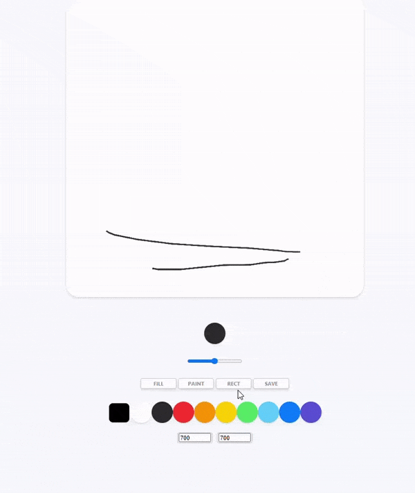

># 바닐라 js를 이용한 그림판 만들기 project

- [Nomadcoder 사이트 클릭!](https://nomadcoders.co/courses)

- 그림판 만들기 강의는 모두 끝냈고 내가 더 추가하고자 하는 기능을 구현 해 보았다.

<br>
<br>
<br>


># 추가적으로 구현한 기능

># 그림판 사각 툴 가이드 라인 기능(Rectangle Guideline of Rectangle Tool)

어제 사각 툴의 경우 구현은 했지만 사각툴의 가이드 라인을 만드는 것이 너무 나도 어려웠다.        
결론 부터 이야기 하자면 드디어 구현했다~~~~~!       

<br>

기능을 설명하자면, 이전에 사각툴을 이용하게 되면 해당 부분에 드래그를 할때 사각 형 가이드 라인이 보이지 않았다.     
계속 시도 하고 했지만 기능을 구현하는데는 실패 하였고 오늘만에 만들었다.

<br>
<br>
<br>

>## 01 : HTML

위에 표시 되기 위한 요소를 하나 추가했다.

``` html
<div class="guide"></div>
```

<br>
<br>
<br>

>## 02 : 요소 이벤트 막기 (CSS)

어제 이야기한 가상요소는 사용하지 않고, 커서를 커스텀 할때 쓰듯이 CSS를 통해서 기존의 커서의 events를 없애 버리면 되는 것이였다.    
**아래와 같이 하게 되면 커서가 element에 닿는다 해도 기존의 event는 끊기 않는다.**

- **<span style="color: red">Pointer-events: none</span>**

``` CSS 
.guide_show {
  cursor: none;
  border: 2.5px solid black;
}

.guide {
  width: 10px;
  height: 10px;
  position: absolute;
  pointer-events: none;
}
```

<br>
<br>
<br>

>## 03 : 기능 구현 (JS)

>### 변수 (Variables) 및 초기 값 (Init values)

- **Mode**는 나중에 마우스가 눌리고 떼어지는 과정에서 분별해서 기능을 구현하기 위한 변수로서 필요하다.

``` js
// Variable 01
    // Rectangle Guideline
const guide = document.querySelector(".guide");

// INIT VALUE
    // Mode
let rect = false;
let recting = false;
    // Start Location
let startPX = 0; 
let startPY = 0;
let startOX = 0;
let startOY = 0;

    // BorderWidth
let sizing = 2.5;
```

- **Start Location** 에서는 마우스가 눌렸을 때 Guide가 생길 시작점을 의미한다.
  - Location의 종류는 page, offset, client, screen이 있다.
  - `pageX, Y` 는 페이지 좌상 끝단을 기준으로 한다.
  - `offsetX, Y` 는 해당 요소의 상대적인 좌표를 의미한다.
  - `clientX, Y` 는 스크롤을 했을 경우 보이는 페이지 좌상 끝단을 기준으로 한다.
  - `screenX, Y` 은 모니터 기준이라고 생각하면 되겠다.
  - [Youtube : page vs offset vs client vs screen](https://www.youtube.com/watch?v=dxADq_DlS-w)

<br>

- **sizing 변수**의 경우에는 나중에 border 두께가 커지면 guide와 실제로 그려지는 사각형이 차이를 보이는데 width, height, location을 수정하는데 쓰인다.

<br>
<br>
<br>

>### 이벤트 설정 (Events)

- Guide 부분에서는 마우스가 canvas위에 움직이거나, 떨어질 경우의 guide가 어떻게 보이는지를 결정하는 event이다.

- 그리고 중요한 guide 기능의 경우 실제로 그려지는 함수에서 이루어 지는 경우가 많기에 따로 빼면 더 중복되는 코드가 많아질 것으로 예상되어 같이 구성하였다.

``` js
if(canvas) {
// RECT
    canvas.addEventListener("mousemove", onMouseMoveR);
    canvas.addEventListener("mousedown", startRecting);
    canvas.addEventListener("mouseup", stopRecting);
    canvas.addEventListener("mouseleave", stopRecting);
// GUIDE
    canvas.addEventListener("mouseleave", hideGuide);
    canvas.addEventListener("mousemove", handleGuide);
}
```

<br>
<br>
<br>

>### 함수 설정 (Functions)

- **함수01**

``` js
// FUNCTIOINS
// GUIDE
function handleGuide(event) {
    if(rect === true && recting === true) {
        ctx.canvas.style.cursor = "none";
        guide.classList.add("guide_show");
    } else {
        guide.classList.remove("guide_show");
    }
}

function hideGuide() {
    guide.classList.remove("guide_show");
}
```

- `handleGuide`의 경우 rect 버튼이 눌리고, 마우스가 눌리면(recting) canvas 위에서는 안보이게 하고 `guide_show` class를 넣어서 guide가 보이게 한다.
- 그리고 혹시나 해서, 그 외에는 다시한번 `guide_show` class를 없애는 명령을 실행하여 확실히 한다.

<br>

- `hideGuide`에서는 `moueseleave` event 발생시에 guide를 숨기는 것을 의미한다.

<br>
<br>
<br>

- **함수02**

``` js
// RECTING
function startRecting(event) {
    if(rect === true) {
        recting = true;
        startPX = event.pageX;
        startPY = event.pageY;
        startOX = event.offsetX;
        startOY = event.offsetY;
        ctx.beginPath();
    }
}

function stopRecting(event) {
    if(rect === true) {
        recting = false;
        ctx.stroke();
        ctx.closePath();
    }
}
```

- `startRecting`은 마우스가 canvas에서 눌릴때 호출되고 rect 버튼이 눌려있야 해당 기능을 실행한다.
- `recting`을 true로 만들고 해당 위치의 offset, page 좌표를 얻어 전역 변수에 할당시킨다. 그리고 `beginPath()`를 넣어 주어 기존의 rect path를 초기화 시킨다.

<br>

- `stopRecting` 의 경우 rect 버튼이 눌려 있어야 하고 마우스를 canvas에서 클릭이 떼어질때 recting을 false로 만들고 `stroke`, `closePath`를 통해서 사각형을 그린다.

<br>
<br>
<br>

- **함수03**

``` js
function onMouseMoveR(event) {
    if(rect === true) {
        const x = event.pageX;
        const y = event.pageY;
        const offsetX = event.offsetX;
        const offsetY = event.offsetY;
        if(!recting) {
        
        } else{
            const width = x-startPX;
            const height = y-startPY;
            // Guide Width , Height, Location
            guide.style.width = Math.abs(width - sizing) + "px";
            guide.style.height = Math.abs(height - sizing) + "px";
            guide.style.top = (startPY - sizing/2) + "px";
            guide.style.left = (startPX - sizing/2) + "px";
            ctx.beginPath();
            ctx.moveTo(offsetX, offsetY);
            ctx.rect(startOX, startOY, width, height);
        }
    }
}
```

- 마우스가 canvas에서 움직이는 경우 계속 event를 발생시키면 `onMouseMoveR`가 호출 되는데 여기에서는 rect 모드인지 검증하고 현재 위치의 `page` 좌표 , `offset`좌표를 가지고 오는데 page의 경우에는 page를 기준으로 하기 때문에 문제가 없지만, offset 좌표의 경우에는 canvas를 기준으로 좌표가 이루어 지기 때문에 주의 해야 한다.
- 본격 적으로 mouseclick이 눌렸을 경우 눌린 해당 위치의 event를 받아서 아까 찍어 두었던 start page location(`startPX,PY`)과 현재의 page location(`x, y`)와의 연산을 통해 width와 height를 구하게 된다.

<br>

- 그다음, **guide의 width와 height를 아까 구한 높이와 넓이로 할당해 준다.**
  - **여기서, 절댓값을 넣어서 음수가 나오는 것을 방지한다. 또한 sizing을 빼주어 border(range)가 두꺼워 졌을 때 차이나는 부분을 수정해 준다.**
  - 참고로, `sizing`은 range를 설정하는 경우의 size 값을 할당 받아 온다
 
<br>

- 그다음 , **guide에 top, left 값을 넣어 주는데 absolute 이기 때문에 page start 좌표를 가져와서 할당하는데 여기에도 border때문에 발생하는 오차를 제거하기 위해서 sizing/2 에 해당하는 값을 빼준다**

<br>

- 그리고 `moveTo`에 해당 offset 좌표를 받와서 초기 좌표를 계속 갱신하고 `rect()` 함수를 통해서 전에 받아둔 start offset 좌표를 넣어 그린다.

<br>


>## 04 : 추가 적인 부분

- **Guideline에 color 반영**

``` js
// COLOR
function handleColorClick(event) {
    const color = event.target.style.backgroundColor;
    check.style.backgroundColor = color;
    ctx.strokeStyle = color;
    ctx.fillStyle = ctx.strokeStyle;
    guide.style.borderColor = color; // + 추가 
}

function handleCColorChange(event) {
    const color = event.target.value;
    check.style.backgroundColor = color;
    ctx.strokeStyle = color;
    ctx.fillStyle = ctx.strokeStyle;
    guide.style.borderColor = color; // + 추가
}
```

<br>
<br>
<br>

- **Guideline에 range(굵기) 반영**

``` js
// LINE WEIGHT
function handleRangeChange(event) {
    const size = event.target.value;
    ctx.lineWidth = size;
    sizing = size;
    cursorRange.style.width = size * CURSOR_RANGE_CTRL + "rem";
    cursorRange.style.height = size * CURSOR_RANGE_CTRL + "rem";
    guide.style.borderWidth = size +"px"; // + 추가
}
```

<br>
<br>
<br>


>## 주의할 점

- element style에 접근 하여 값을 주는 경우 `px`을 붙이자. 그래야 반영됨

<br>
<br>
<br>


># 더 개선하고 싶은 부분들

- 모달창 만들어서 색, 크기, 등등의 툴 모달창 만들기
- 저장할 때 이름 받기
- 로컬 스토리지를 이용한 웹 저장 및 reset 버튼
  - [로컬스토리지 vs cookie](https://erwinousy.medium.com/%EC%BF%A0%ED%82%A4-vs-%EB%A1%9C%EC%BB%AC%EC%8A%A4%ED%86%A0%EB%A6%AC%EC%A7%80-%EC%B0%A8%EC%9D%B4%EC%A0%90%EC%9D%80-%EB%AC%B4%EC%97%87%EC%9D%BC%EA%B9%8C-28b8db2ca7b2)
- 파일 불러오기

<br>

># 후기

후기 : 사각 툴 때문에 엄청나게 고생한 것 같다. 그래도 나름배운 것도 많고 기능 구현해서 성공했을 때 그 느낌이 정말 좋았다.

<br>

아직 더 추가하고 싶은 기능들이 더 남아 있지만 output을 해서 알아가는 재미도 있지만 input도 분명 필요하다. 그래서 남은 기능들은 잘 적어 놓고 나중에 진행할 예정이고 다른 것을 배워볼 예정이다.

<br>

># 결과




<br>

># 전체 JavaScript 코드

- [라쿤코드 github : paintjs_app project 확인](https://github.com/RaccoonCode96/paintjs_app)
