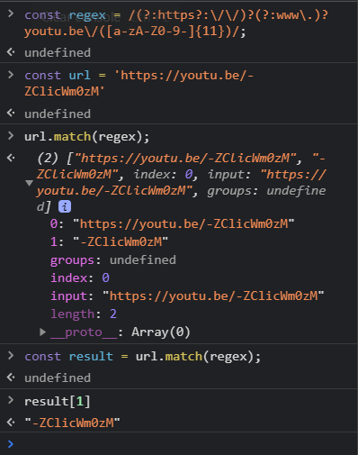

># 정규 표현식

- [드림코딩by엘리 : 정규표현식 강의](https://www.youtube.com/watch?v=t3M6toIflyQ)

- 드림코딩 엘리의 정규 표현식 강의를 찾아 들었다.

 
 
 

># 정규 표현식 (Regular Expression)

- `regex`
  - 텍스트에서 특정 패턴을 찾을때 요긴 함(ex. 이메일, 전화번호, 등 패턴...)
  - 패턴 유효성 검사
  
- 여러가지 언어를 지원하고 있으며, 심지어 여러 에디터에서도 정규표현식을 사용한 검색을 지원하고 있음

- `/ /`처럼 슬래쉬(slash)들을 사용하여 정규표현식을 알려주고 안에 찾고자 하는 패턴(pattern)을 넣고 외부에 옵션(flag)을 적어 활용할수 있음
- `/pattern/flag`

 
 
 

>## Pattern

- [예제 참고 사이트01](https://regexr.com/5mhou)
- [예제 참고 사이트02](https://regexone.com/)

- **Groups and ranges**

`|` : 또는 
  - (ex. `/hi|hello/gm`) -> hi, hello

 

`()` : 그룹
  -  (ex.`/(hi|hello)/gm`) -> 그룹 1 : hi, hello
  - `/(Hi/Hello)|(And)/gm` -> 전체적으로 그룹 1 또는 그룹 2 
  - 활용 예제 : `/gr(e|a)y/gm` -> gray(e 그룹) , grey(a 그룹)
  - 그룹 해제 방법(`?:`사용) : `/gr(?:e|a)y/gm` -> gray, grey

 

`(?:)` : 찾지만 기억하지는 않음  

`[]` : 문자셋, 괄호안의 어떤 문자든 하나라도 만족하는 문자열을 찾을 때 사용
    - `/gr[aed]y/gm` -> gray, grey, grdy ... 
    - `/gr[a-f]y/gm` -> a 부터 f 까지 에서 하나라도 만족하는 문자열을 찾을 때 사용
    - `/[a-zA-Z0-9]/gm` -> a-z , A-Z, 0-9

`[^]` : 부정 문자셋, 괄호안의 어떤 문자가 아닐때 (except 처리)
    -  `/[^a-zA-Z0-9]/gm` -> a-z , A-Z, 0-9를 제외한 나머지

 
 
 

- **Quantifiers(수량)**

`?` : 없거나 있거나 (zero or one)
    - 특정 문자 뒤에 붙이면 특정 문자가 있는 경우 없는 경우 모두 match 함
    - `/gra?y/gm` -> gray, gry

`*` : 없거나 있거나 많거나 (zero or more)
    - 특정 문자 뒤에 붙이면 특정문자가 있거나 없거나 많은 경우 모두 match 함
    - `/gra*y/gm` -> gray, gry, graaay, graay

`+` : 하나 있거나 많거나 (one or more)
    - 특정 문자 뒤에 붙이면 특정문자가 있 or 많 -> match
    - `/gra+y/gm` -> gray, graaay, graaaaay

`{n}` : n번 나오는 경우 match
    - `/gra{2}y/gm` -> graay

`{a,}` : 최소 a번 나오는 경우 (min) 즉, a 번 이상
`{a, b}` : 최소 a번 ~ 최대 b번 나오는 경우 (min-max) 즉, a~b 번 까지 

- **Boundary-type**

`\b` : 단어 경계 즉, 특정 단어 앞에다 쓰면 단어 단위를 기준으로 단어 내에서 제일 앞에 처음 찾아지는 것을 match함
  - `/\bYa/gm` : `Ya` ,  `Ya`YaYa(맨 앞의 Ya만 찾아짐)
특정 단어 뒤에다 쓰면 제일 뒤에 찾아지는 것을 match함
  - `/Ya\b/gm` : YaYa`Ya`(맨 뒤의 Ya만 찾아짐)

`\B` : `\b`의 반대로 작동함 (차집합 관계)
    - `/\BYa/gm` : Ya, Ya`YaYa` (즉, 단어 맨 앞에서 찾아지는 것 하나를 제외한 나머지 )
    - `/Ya\B/gm` : Ya , `YaYa`Ya (즉, 단어 맨뒤에서 찾아지는 것 하나를 제외한 나머지 )

`^` : 문장의 시작

`$` : 문장의 끝부분에 matching 되는 것을 찾음 (multiline flag 찍혀있으면 문장 끝부분 검사하고, multiline 안찍으면 페이지 전체의 끝부분 검사)
    - `/Ya$/` -> I'm racconcode, welcome ! `Ya` (주의 마지막에 `.` 이나 `space`가 들어가도 안됨 즉, 해당 문자 개수 만큼을 끝부분 검사해서 매칭하는지 보는 것임)

- **Character classes**

`\` : 특수 문자가 아닌 문자
   - 정규표현식에서 쓰이는 문자를 찾고 싶을 때는 `\`이스케이프를 붙여주어야 함 (ex. `\$`, `\?`, `\.`)

`.` : 어떤 글자(줄바꿈 문자 제외)

`\d` : digit 숫자를 전부 찾을 수 있음

`\D` : digit 숫자가 아닌 모든 것

`\w` : word 문자를 전부 찾음

`\W` : word 문자가 아닌 전부 찾음

`\s` : space 띄어쓰기를 찾음

`\S` : space 띄어쓰기를 제외한 것 모두 찾음

 
 
 

>## 활용 예제

>### 1) 아래 전화 번호를 선택 하시오

 

010-898-0893
010-405-3412
010 405 3412
010.405.3412
02-878-8888

 

Answer :    

1) `/\d\d\d?(-|\.|\s)\d\d\d(-|\.|\s)\d\d\d\d/gm`

2) `/\d{2,3}[-.\s]\d{3}/[-.\s]\d{4}`

3) `/\d{2,3}[- .]\d{3}/[- .]\d{4}`

 
 
 

>### 2) 아래 이메일을 선택 하시오

dream.coder.ellie@gmail.com
hello@daum.net
hello@daum.co.kr

 

Answer :    

1) `/([a-zA-z0-9]{1,}.){1,}@([a-zA-z0-9]{1,}.){1,}/gm`

2) `[a-zA-z0-9._+-]+@[a-zA-z0-9-]+\.[a-zA-z0-9.]+`

 
 
 

>### 3) 아래 유튜브 주소에서 ID를 선택 하시오

https://www.youtu.be/-ZClicWm0zM
https://youtu.be/-ZClicWm0zM
youtu.be/-ZClicWm0zM

 

Answer :    

1) `(?:https?:\/\/)?(?:www\.)?youtu.be\/([a-zA-Z0-9-]{11})`

그룹 1에 할당 되어 있음

 
 
 

>## Javascript 활용

 

주소 리스트를 가져와서 정규 표현식 사용하여 필요한 형식의 문자, 숫자 등의 형태를 가져와 활용할 수 있다.

 
 
 
 

># Django vs Node.js

- [Node.js vs. Django:  Is JavaScript Better Than Python?](https://dzone.com/articles/nodejs-vs-djangois-javascript-better-than-python)

- [Nodejs vs Django : Node.js와 Django 중에서 무엇을 사용해야할까?](https://hshine1226.medium.com/node-js%EC%99%80-django-%EC%A4%91%EC%97%90%EC%84%9C-%EB%AC%B4%EC%97%87%EC%9D%84-%EC%82%AC%EC%9A%A9%ED%95%B4%EC%95%BC%ED%95%A0%EA%B9%8C-ea8ae375aaaa)

- [js, java, python 3종 비교](https://www.itworld.co.kr/news/125598)

 
 
 

또 난관 이놈의 선택장애,,,, 그냥 node로 해보고 서버 구조좀 이해하고 js풀스택 찍어서 전체적인 흐름을 알아보자 일단.

 
