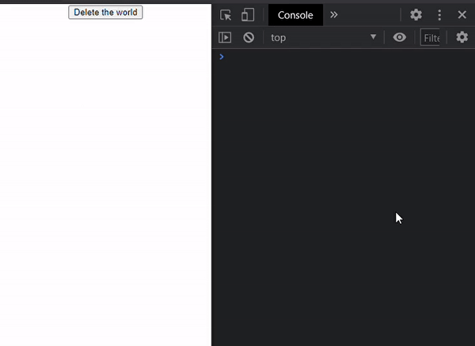

># React Hooks

- [노마드코더 : React Hooks](https://nomadcoders.co/)

- 노마드코더의 React Hooks 강의를 듣고 작성 함

<br>
<br>
<br>

># 지난 시간

- 지난 시간에는 React의 hook중에서도 useEffect, useRef에 대해서 알아 보았고 그것을 통해 만든 nooks (nico's hooks) 중에서 useTabs, useTitle, useClick을 알아보았다.

># usePreventLeave & useConfirm (nico's hook)

- useConfirm 과 usePreventLeave는 사실 hooks가 아님 (useEffect, useState를 사용하지 않기 때문)
- 하지만 이를 통해서 좋은 함수형 프로그램이 어떤건지 알수 있음

<br>
<br>
<br>

>## useConfirm

- 사용자가 무언가 하기전에 확인 하는 것으로서 사용자가 버튼을 클릭하는 작업을 하면 이벤트 실행전에 메세지를 보여줌

- useState, useEffect 사용 X

- [MDN Web API : Window.confirm()](https://developer.mozilla.org/ko/docs/Web/API/Window/confirm)

- `useConfirm` 함수는 `(message: string, onConfrim: function , onCancel: function)` 이라는 인자를 받아온다.
- 그래서 해당 함수 안에 있는 `confirmAction`이라는 함수가 message를 받아와서 알림창으로 띄우고, 확인 및 취소 중에 확인: true , 취소: false 를 return
- 그래서 확인시에는 onConfirm 으로 들어오는 콜백함수를 실행
- 취소시에는 onCancel로 들어오는 콜백함수를 실행
- 알림창을 띄우기 전에 유효성 검사(Validator)를 실시

``` js
import React from "react";
import './App.css';

const useConfirm = (message = "", onConfirm, onCancel) => {
  // 유효성 검사 (Validator)
  if(!onConfirm || typeof onConfirm !== "function"){ 
      // 없거나, 함수가 아니면 빠져나옴 
      // 즉, 있고, 함수일때만 실행된다는 얘기
    return;
  }
  if(onCancel && typeof onCancel !== "function"){ 
      // (선택사항) 있고 함수가 아닐때만 나온다. 
      // 즉, 없어도 되고 만약 있다면 function 이어야 만 실행됨
    return;
  }
  // 알림창 및 해당 콜백 함수 실행
  const confirmAction = () => {
    if(window.confirm(message)) { 
      // 주의! window를 써줘야 confirm이 무슨 함수인지 인지함
      onConfirm();
    } else {
      onCancel();
    }
  }
  return confirmAction;
};
``` 

<br>

- **component 출력 부분**
  - 알림창 확인및 취소시 호출될 deleteWorld(삭제), abort(중단) 콜백 함수 만듦
  - confrimDelete라는 이름으로 useConfirm을 주어 함수로 만듦
  - button 요소의 onClick prop에 confrimDelete를 줌
  - 삭제 하시겠습니까? -> (Ok) or (No) -> (Deleting the world) or (Aborted)

``` js
function App() {
  const deleteWorld = () => console.log("Deleting the world...");
  const abort = () => console.log("Aborted")
  const confirmDelete = useConfirm("Are you sure ?", deleteWorld, abort);
  return (
    <div className="App">
      <button onClick={confirmDelete}>Delete the world</button>
    </div>
  );
};

export default App;

```

<br>



<br>
<br>
<br>

>## usePreventLeave

- 브라우저 창을 닫기 버튼을 눌렀을 때 브라우저 창이 닫히기 전에 알림창을 띄워 바로 닫히는 것을 방지함

<br>

- 이것 또한 useState, useEffect를 사용하지 않아 hook은 아니지만 함수형 프로그램을 다루는데 중요한 기능을 담당한다.
- `usePrevnetLeave` 함수는 일단 `jsx button에서 실행될 함수 두개`를 가지고 있고, 각각은 모두 web 브라우저 창을 요소로 event("beforunload")를 감지해 닫히기전에 구현하고자 하는 callback 함수가 실행되게 하는 구조를 갖는다 하지만 이벤트를 감지 하거나 안하게 설정하기 위해서 `enable`, `disable`을 두었다. 
- `beforeunload`는 window가 닫히기 전에 function이 실행되는 걸 허락함
- callback 함수인 `listener`는 event를 받아서 새로고침이 안되게 `preventDefault` 처리하였고, `event.returnValue` 값을 주어야 작동하게 된다.
- `usePreventLeave` 함수는 최종적으로 버튼을 위한 두개의 함수를 return 하여 전달한다.
- [MDN Event : beforeunload](https://developer.mozilla.org/en-US/docs/Web/API/Window/beforeunload_event)


``` js
import React from "react";
import './App.css';

const usePreventLeave = () => {
  const listener = (event) => {
    event.preventDefault();
    event.returnValue = "";
  }
  const enablePrevent = () => window.addEventListener("beforeunload", listener);
  const disablePrevent = () => window.removeEventListener("beforeunload", listener);
  return {enablePrevent, disablePrevent};
};
```

<br>

- **component 출력 부분**
  - uesPreventLeave 함수안의 함수를 사용하기 위해서 아래처럼 가져오게 된다.
  - 그리고 버튼 요소에 onClick prop에 연결하게 된다.

``` js
function App() {
  const { enablePrevent, disablePrevent} = usePreventLeave();
  return (
    <div className="App">
      <button onClick={enablePrevent}>Protect</button>
      <button onClick={disablePrevent}>Unprotect</button>
    </div>
  );
};

export default App;
```

<br>
<br>
<br>
<br>

># useBeforeLeave (nico's hook using useEffect)

- 마우스가 페이지를 벗어 나는 경우 실행 되는 function
- 팝업 같은 것을 실행 시키고자 하는 경우 사용할 수 있음

<br>

- `useBeforeLeave`의 경우 useEffect를 사용한 hook 임
- `useBeforeLeave`는 커서가 page를 넘어가는 경우 실행할 callback 함수를 인자(onBefore)로 받는다. (당연 함수를 받아오니까, 유효성 검사 필요)
- `useBeforeLeave`가 호출되면 제일먼저 `useEffect` 가 호출되며 DIdmount를 하게 되는데 EventListener를 넣어 mouseleave가 발생하면 handle 함수를 호출한다.
- 그리고 EventListener를 켰기 때문에 return 부분(WillUnmount)에 remove를 하여 닫아준다.
- `handle`함수의 경우 event를 받아서 event의 clientY 값을 들고와서 조건에 따라 `useBeforeLeave`를 실행시킬 때 받아온 onBefore 인자(함수)를 실행시키게 한다. 

``` js
import React, { useEffect } from "react";
import './App.css';

const useBeforeLeave = (onBefore) => {
  const handle = (event) => {
    const {clientY} = event;
    if (clientY <= 0) { // 밖으로 나가는 종류가 2가지임 위로 아래로, 위로만 나가는 것을 인식하고 싶을 때
      onBefore();
    }
  }
  useEffect(() => {
    document.addEventListener("mouseleave", handle)
    // componentWIllUnmount
    return () => document.removeEventListener("mouseleave", handle);
  }, []); // [] 단 한번만 실행
  // 유효성 검사
  if(!onBefore || typeof onBefore !== "function") {
    return;
  };
}
``` 

<br>

- **component 출력 부분**
  - `useBeforeLeave`에 넣을 함수(나갔을 때 실행 할 코드)인 `begForLife` 함수를 작성한다.
  - 그리고, `useBeforeLeave`의 경우 `return 값이 없기 때문에` 값을 받아오지 않고 바로 함수자체를 실행 시키면 되겠다.


``` js
function App() {
  const begForLife = () => console.log("Pls don't leave!");
  useBeforeLeave(begForLife);
  return (
    <div className="App">
      <h1>Hello</h1>
    </div>
  );
};

export default App;
```


<br>
<br>
<br>
<br>

># useFadeIn (nico's hook)

- 물론 CSS로도 가능하지만 animation을 hooks를 통해서도 가능함
- `useFadeIn`은 useEffect를 사용한 hook으로 CSS에서의 transition, opacity 속성을 다루고 있다.

<br>

- `useFadeIn` 훅은 duration, delay를 인자로 받는 함수이다.
- fadeIn의 경우 element를 다뤄야 하기 때문에 `useRef()` 훅을 사용해서 가져온다.
- 그렇기 때문에 나중에 출력하고자 할때는 해당 요소 ref prop에 `useRef`를 연결해 줘야 한다.
- `useEffect`를 통해서 기본적으로 가져온 element를 current prop를 끌어내서 style 속성을 변화를 주어 fadeIn animation 효과를 준다.
  - `transition` 속성에서는 요소를 디테일하게 값을 줄수 있다.
    - opacity (불투명 0~1) 속성을 duration(변하는데 걸리는 시간) delay(해당 속성 값을 실행시키기 전까지 기다리는 시간) 이렇게 주었다.
  - `opacity` 마지막에는 1을 줌으로서 잘 보이게 함
- `useFadeIn` 함수는 element 그리고 style opacity 0을 return 함으로써 초기에는 render 되면 안보이게 되는 것임 그러다가 useEffect가 Didmount 되어 animation 이 실행되어 변하는 것임


``` js
import React, { useRef, useEffect } from "react";
import './App.css';

const useFadeIn = (duration = 1, delay = 0) => {
  const element = useRef();
  useEffect(() => {
    if(element.current){
      const {current} = element;
      current.style.transition = `opacity ${duration}s ease-in-out ${delay}s`;
      current.style.opacity = 1;
    }
  }, [duration, delay]);
  if (typeof duration !== "number" || typeof delay !== "number"){
    return;
  };
  return {ref: element, style: {opacity:0}};
}
```

<br>

- **component 출력 부분**
  - useFadeIn을 설정하여 useRef를 만들어 주고 해당 하는 요소에 ref연결시킨다.
  - ref 연결 편의상 애초에 useFadeIn return을 ref, style 을 가진 객체형으로 return시켜 가져온것 임 -> 편하게 `{...fadeInH1}`이런식으로 풀어 헤칠수 있음

``` js
function App() {
  const fadeInH1 = useFadeIn(1, 2);
  const fadeInP = useFadeIn(5, 10);
  return (
    <div className="App">
      <h1 {...fadeInH1}>Hello</h1>
      <p {...fadeInP}>check the opacity and animations with hookssssssssssss</p>
    </div>
  );
};

export default App;
```

<br>
<br>
<br>
<br>

># useNetwork (nico's hook)

- navigator가 online 또는 offline이 되는 걸 막아 주거나 알려줌
- [MDN : Web API Navigator](https://developer.mozilla.org/ko/docs/Web/API/Navigator) 
- Navigator는 사용자의 신원 정보 및 상태를 나타냄

<br>


- `useNetwork` 훅은 기본적으로 onChange라는 함수를 인자로 받는 매개변수로 이루어 져있다.
- 기본적으로 `navigator.onLine`은 사용가 online 이면 true , offline이면 false를 return함
-  그 true 와 false 값을 status라는 변수명으로 `useState`를 통해서 할당 시킴
-  그리고 나중에 event 발생때 호출할 콜백함수인 `handleChange` 함수를 만듦
   - `useNetwork`에서 받은 onChange가 함수면 onChange함수를 호출하여 onChange가 navigator.online을 받아 가공하게 끔 한다.
   - 그리고 마지막으로 `setStatus`를 통해 값을 변경 시켜준다.
- 그리고 `useNetwork`가 status까지 render를 마쳤을 때 useEffect가 didMount를 시작하는데 이벤트 리스너로 online, offline 변화를 듣는다. 그리고 return 이후에 이벤트리스너를 제거하게 코드함으로써 이벤트 리스너를 회수한다.

``` js
import React, {useState, useEffect } from "react";
import './App.css';

const useNetwork = onChange => {
  const [status, setStatus] = useState(navigator.onLine);
  // navigator.onLine 은 true or false를 말해줌
  const handleChange = () => {
    if (typeof onChange === "function"){
      onChange(navigator.onLine)
    }
    setStatus(navigator.onLine);
  }
  useEffect(() => {
    window.addEventListener("online", handleChange);
    window.addEventListener("offline", handleChange);
    return () => {
      window.removeEventListener("online", handleChange);
      window.removeEventListener("offline", handleChange);
    }
  }, [status]);
  return status;
}
```

<br>

- **component 출력 부분**
  - onChange로 들어올 함수를 `handleNetworkChange`로 지정한다.
    - 해당 함수는 console에 online상태 여부에 따라 해당 어구를 반환한다.
  - onLine 변수에 useNetwork를 통해서 만들어 준다.
  - 브라우저 console창의 network 탭에서 online상태를 조정하면 해당 어구가 나타난다. 


``` js
function App() {
  const handleNetworkChange = (online) => {
    console.log(online?"We just went online":"We are offline")
  }
  const onLine = useNetwork(handleNetworkChange);
  return (
    <div className="App">
      <h1>{onLine ? "Online" : "Offline"}</h1>
    </div>
  );
};

export default App;
```

<br>
<br>
<br>
<br>

># useScroll (nico's hook)

- 유저가 scroll을 해서 특정 조건 좌표를 지나치는 경우 발생할 것 들(ex. 색상 바꾸기 등..)

<br>

- `useScroll` 훅은 useState와 useEffect으로 만들어 졌다.
- 딱히 인자는 받지 않고 useState를 통해서 `x, y 의 좌표 값`을 가지는 state를 가진다.
- 그리고 스크롤 이벤트 발생시 호출할 콜백 함수인 `onScroll`을 만듦
  - `onScroll`은 `window.scrollX`와 `window.scrollY`로 현재 스크롤 좌표를 직접 적으로 받아서 setState를 통해 state에 x, y의 좌표를 넣어 수정 함
- 최종적으로 `useScroll`은 state를 return하며 render가 끝나면
- `useEffect`를 통해서 이벤트 리스너로 스크롤 이벤트를 받아 onScroll 콜백 함수 호출, 그리고 return (willUnmount)의 경우 리스너 제거 실시

``` js
import React, {useState, useEffect } from "react";
import './App.css';

const useScroll = () => {
  const [state, setState] = useState({
    x: 0,
    y: 0
  });
  const onScroll = () => {
    setState({x: window.scrollX, y: window.scrollY});
  }
  useEffect(() => {
    window.addEventListener("scroll", onScroll)
    return () => window.removeEventListener("scroll", onScroll);
  }, [])
  return state;
}
``` 

<br>

- **component 출력 부분**
  - useScroll를 통해서 y좌표를 받아 옴
  - 스크롤이 생길수 있게 가장 최상위 요소에 style height 값 1000vh 줌
  - 그리고 변화줄 요소에 position fixed를 주어서 스크롤 시에도 화면 기준의 위치로 따라 오게끔 하고 color 속성에 조건을 주어서 y 좌표 상태에 따른 색상값을 다르게 함

``` js
function App() {
  const {y} = useScroll();  
  return (
    <div className="App" style={{height: "1000vh"}}>
      <h1 style={{position: "fixed", color: y > 100 ? "red" : "blue" }}>Hi</h1>
    </div>
  );
};

export default App;
```

<br>


<br>
<br>
<br>
<br>
<br>

># useFullscreen (nico's hook)

- `useFullscreen`은 event 발생시 해당 요소를 전체화면으로 만들거나 다시 원상 복귀 시키는 훅임 (useRef 씀)
- `useFullscreen` 함수의 경우 callback 함수를 인자로 받는다.
- useRef를 사용해서 해당 요소를  `element` 변수에 가져온다.

<br>

- `useFullscreen` 함수는 3가지 함수로 이루어 져있음
  - 1) `runCb` : isFull 이라는 boolean 의 인자를 받아서 `useFullscreen`의 인자 callback이 함수인지를 체크해주는 유효성 검사 함수이다. 함수가 맞으면 해당 boolean을 가지고 callback함수에 집어 넣어 실행시킨다.
  - 2) `triggerFull` : 인자를 받아 오지 않고 단순히 event를 실행 했을때 해당 요소를 fullscreen으로 바꾸는 함수이다. 안에 마지막에는 rubCb(true)를 실행하여 현재 상태를 표현해준다.
  - 3) `exitFull` : 역시 인자를 받지 않고 `document.fullscreen`의 상태가 true인 경우에만 창을 원래대로 복귀시키는 함수를 실행한다.
   
<br>

- **주의** 
  - `exitFull`은 `document`를 통해 실행시키고 `triggerFull` 에서는 해당 `element`를 통해 접근하여 requestFullscreen함수를 호출함  
  - 그리고 모든 브라우저에서 이름이 일치되는 API가 아니기 때문에 `cross browsing`을 위해서 모두 조건을 주어 다루었다.

<br>

- `useFullscreen`은 최종적으로 `element, triggerFull, exitFull`을 return 한다. 


``` js
import React, {useRef} from "react";
import './App.css';


const useFullscreen = (callback) => {
  const element = useRef();
  const runCb = isFull => {
    if(callback && typeof callback === "function") {
      callback(isFull);
    };
  };

  const triggerFull = () => {
    if(element.current) {
      if(element.current.requestFullscreen){
        element.current.requestFullscreen();
      } else if(element.current.mozRequestFullscreen) {
        element.current.mozRequestFullscreen();
      } else if(element.current.webkitRequestFullscreen) {
        element.current.webkitRequestFullscreen();
      } else if(element.current.msRequestFullscreen) {
        element.current.msRequestFullscreen();
      }
      runCb(true);
    }
  };

  const exitFull = () => {
    if (document.fullscreen === true) {
      if (document.exitFullscreen) {
        document.exitFullscreen();
      } else if (document.mozCancelFullscreen) {
        document.mozCancelFullscreen();
      } else if (document.webkitExitFullscreen) {
        document.webkitExitFullscreen();
      } else if (document.msExitFullscreen) {
        document.msExitFullscreen();
      }
      runCb(false);
    };
  };
  
  return {element, triggerFull, exitFull };
};
``` 

<br>

- **component 출력 부분**
  - `onFullS`라는 useFullscreen의 인자가 되는 콜백 함수 지정 (현재 상태를 어떻게 표현할 것인지)
  - `useFullscreen`에 콜백 함수 `onFulls`를 넣어 해당 element, triger, exit 함수를 받아온다.
  - 이미지 자체에다가 `ref={element}`를 주면 전체 화면시 버튼이 보이지 않기때문에 이미지의 상위 div 요소에 주어 버튼이 표시 될수 있도록 한다.
  - div 안에는 exitFull 가능한 버튼이 들어 있음
  - 각 버튼에 onClick으로 exit, trigger 연결  


``` js
function App() {
  const onFullS = (isFull) => {
    console.log(isFull ? "we are full" : "We are small");
  }
  const { element, triggerFull, exitFull } = useFullscreen(onFullS);
  return (
    <div className="App" style={{height: "1000vh"}}>
      <div ref={element}>
        
        <button onClick={exitFull}>Exit fullscreen</button>
      </div>
      <button onClick={triggerFull}>Make fullscreen</button>
    </div>
  );
};

export default App;
```

<br>
<br>
<br>

- gif 로 보여주고 싶었지만, 전체화면시 녹화가 풀려서 사진으로 대체함

<br>


<br>


