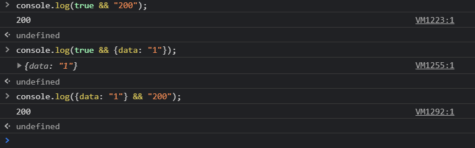

># 함수형 프로그래밍

- [드림코딩by엘리 : 함수형 프로그래밍 vs 객체지향 프로그래밍](https://www.youtube.com/watch?v=4ezXhCuT2mw)
- 드림코딩by엘리 유튜브 함수형 프로그래밍에 대한 영상을 보고 정리하였다.

<br> 

- 지난시간에 Hooks를 만들면서 함수형 프로그래밍을 해보았는데 조금더 함수형 프로그래밍에 대해서 알아보려고 하던 찰나에 영상이 업로드 되어서 시청하였다.

<br>

>## 프로그래밍 패러다임

- 절차지향 프로그래밍
- 객체지향 프로그래밍
- 함수형 프로그래밍
- 함수형 반응형 프로그래밍

<br>

- 프로젝트의 목표에 따라서 적절한 방법과 기법을 사용 함


>## 함수형 프로그래밍

- 함수형 프로그래밍 언어들(Functional Programming Languages)
  - Haskell, F#, OCaml, Erlang

<br>

- 함수형 프로그래밍을 지원하는 언어들(Support Functional Programming)
  - JavaScript, Kotlin, Go, Python, Rust, Java, C++, Scala
  - 객체지향 + 함수형 프로그래밍의 특징

<br>

>### 함수형 프로그래밍의 역사

- 1958년 LISP (첫번째 함수형 프로그래밍 언어의 탄생)
- 1962 Simula, 1972 Smalltalk (첫번째 객체 지향 프로그래밍 언어들)
- 1972 C

<br>

- 이처럼 함수형 프로그래밍은 엄청 오래 되었음
- 함수형 프로그래밍은 수학과 밀접하게 연관되어 있기 때문에 배우는데 시간이 걸리고 조금 난해 할 수 있음

<br>

- 그래서 사람의 사고방식과 가장 가까운 언어가 발달하기 시작함
  - 절차지향 프로그래밍(Imperative and Procedural Programming) : data1 , data2, data3, main function, function, function, ..
  - 객체지향 프로그래밍(Object Oriented Programming) : Object(data1, data1, function) Object(data1, function, function) ...

<br> 

- 최근 AI, IoT, 빅데이터, 비트코인이 발달하면서 방대한 데이터를 빠르게 계산해서 병렬적으로 안정적으로 처리하는 것이 중요해 짐
- 함수형 프로그래밍이 주목을 받음

<br>

>### 함수형 프로그래밍의 의미와 특징

- **의미**
  - 함수는 input이 들어와 함수를 거처 output을 나타냄.
  - 그리고 제일 특징적인 것은 함수 내부와 함수 외부는 독립되어 서로 접근이 불가능 하다.
  - 즉, 안정적이다.
  - 함수형 프로그래밍은 이런 함수들을 묶어서 프로그램을 구성해 나가는 것을 이야기 함
  - input을 넣고 output을 받고 다른 함수에 전달해서 또 output을 받고 이런식...

<br>

- **특징**
- 1) 순수 함수이다. (Pure Functions)
  - 함수에서 외부의 값을 참조 또는 상태를 변경하는 것은 순수 함수가 아니다. (절차지향적 프로그래밍일 확률이 높음)
  - input : 동일인자 -> output: 동일 결과
  - 언제 선언되었는지 외부에 전혀 영향을 받지 않도록 작성해야함

``` js
// 함수형 프로그래밍이 아님, 외부값 참조
let num = 1;

function add(a) {
  return a + num;
}

// 함수형 프로그래밍 O , 외부값 참조 없이 독립적임
function add(a, b) {
  return a + b;
}
const result = add(2, 3)
```

<br>

- 2) 비상태, 불변성을 유지해야함 (Stateless, Immutability)
  - 함수에 인자로 전달된 데이터를 변경하는 것은 함수형이 아님
  - 전달된 데이터를 변경하는 것이 아니라 새로운 버전의 오브젝트를 만들어서 결과값으로 전달 해야함
  - 함수 호출시 외부상태 변경, 예상치 못한 에러 발생이 없음(No sideEffect)
  - 그래서 여러가지 동시다발적인 멀티쓰레딩 환경에서도 안정적으로 동작 가능

``` js
// 외부 데이터를 직접 가공하여 전달 하므로 함수형 프로그래밍이 아님
let person = {name: "Raccoon", age: 26};

function increaseAge(person) {
  person.age = person.age + 1 // person의 age props의 값을 변경하므로
  return person;
}

// 함수형 프로그래밍이 맞음
const person = {name: "Raccoon", age: 26};

function increaseAge(person) {
  return {...person, age: person.age +1 }; 
  // 객체 표시로 감싸 새로운 객체를 만들었기 때문에 person에는 영향이 없음 그저 값만 가져온 것이니까

// 오브젝트 자체가 수정을 못하게 하지는 않기 때문에 더 견고하게 하기 위해서 (즉, 불변성을 위해) Object.freeze 함수를 써서 object까지 불변성을 줄수 있음
const person = Object.freeze({name: "Raccoon", age: 26});

function increaseAge(person) {
  return Object.freeze({...person, age: person.age +1 });
}
```

<br>

- 3) Expressions Only
  - expression 만 써야됨
  - if , switch, for 과 같은 여러가지 문장을 사용하는 것은 함수형이 아님

``` js
// for 등을 사용 했기에 X
let  numbers = [1, 2, 3];

function multiply(numbers, multiplier) {
  for (let i = 0; i < numbers.length; i++) {
    numbers[i] = numbers[i] * multiplier;
  }
}

// if, switch 없이 해야함
function multiply(numbers, multiplier) {
  return numbers.map(num => num * multiplier);
}
```

<br>

- 4) First-class and higher-order functions
  - 함수를 변수에 할당하거나 함수의 인자로 전달하거나 리턴하는 등의 일들을 할 수 있는 First Class(일급함수) 특징

``` js
// first class
const addTwo = a => a + 2;
const multiplyTwo = a => a * 2;
const transform = numbers => numbers.map(addTwo).map(multiplyTwo); // 함수를 인자로 넣어서 데이터가 연쇄 반응하게 할 수 있음
console.log(transform([1, 2, 3, 4]));
```

  - 함수 자체를 인자로 전달하거나 함수에서 또 다른 함수를 리턴하는 고차 함수

``` js
const addToppings = topping => food => food + topping;
// const addToppings = topping => {
//   return (food) => {
//     return food + topping;
//   }
// }
const egg = addToppings('egg'); // egg는 addToppings안의 익명함수임
const bacon = addToppings('bacon'); // bacon은 addToppings안의 익명함수임
console.log(egg('soup')); //soupegg
console.log(bacon('sandwitch')); // sandwitchbacon
// 함수를 리턴 ->  고차함수
```

<br>

>##  함수형 프로그램을 이해하기 위한 부가 지식

- **Monad** : 제일 어려운 개념
- Semigroup
- Applicative
- Monaid
- Functor
- Disjunction

<br>
<br>
<br>
<br>

일단, 함수형 프로그래밍도 좋지만 가장 많이 쓰이는 객체지향 패턴에 대해서 공부하고 나중에 함수형 프로그램에 대해 깊게 파봐야 겠다.

<br>
<br>
<br>

># React Hooks

- [노마드코더 : React Hooks](https://nomadcoders.co/)

- 노마드코더의 React Hooks 강의를 듣고 작성 함

<br>
<br>
<br>

># 지난 시간

- 지난 시간에는 React의 유용하게 쓸수 있는 커스텀된 훅인 useConfirm, usePreventLeave, useBeforeLeave, useFadeIn, useNetwork, useScroll, useFullscreen 살펴 보았다.
- 그리고 함수형 프로그램에 대해서도 어떻게 쓰이는지 알아 보았다.

<br>
<br>
<br>

># useNotification


>## Window10에서 Notification 설정 방법

- Notification을 사용하는 경우 window10에서는 두 가지 방법으로 알림을 제공한다.
  - 1) 작업 표시줄 우측 끝 알람 아이콘에서 notification을 제공한다.
  - 2) Notification 발생시 우측 하단 배너로 제공한다.

- 먼저 대부분의 알람은 배너는 안뜨더라도 작업 표시줄 우측 끝 알람 아이콘에서 확인 가능하다.

<br>

>### 필수) chorme 브라우저에서 설정

- **쉬운방법)** 허용할 주소 창에서 새로고침 표시 우측 자물쇠 또는 삼각형, 물음표 등의 아이콘을 클릭 -> 사이트 설정 -> 알림 허용

<br>

- **방법2)** 크롬 브라우저 창 우측 상단 점 3개로 된 아이콘 클릭(메뉴)
- 설정 클릭 - 개인정보보안 - 사이트 설정 - 알림 - 허용에 허용할 주소 추가

<br>

**설정 해도 안뜬다면 일단, 윈도우 작업 표시줄 우측 끝 알람 아이콘에서 확인해 보고 다음 절차를 진행 할 것 (배너가 안뜨면 배너만 안뜨는 경우를 참고)**

<br>

>### 아이콘에서도 안뜨는 경우


위 그림처럼 chrome 알림을 켜주자 그리고 크롬 아이콘을 클릭


배너 및 알림 센터 알림표시를 확인해 주자 (그럼에도 배너만 안뜨면 하단 참고)

<br>

>### 배너만 안뜨는 경우

- 알림 및 작업 하단 집중지원에 들어가서 우선 순위만으로 체크 되어 있는 경우
  - 우선순위 체크 : 자기가 보고 싶은 알람만 배너 창이 뜨게 설정 가능
- 우선순위 만에 `우선 순위 목록 사용자 지정` 클릭


- Chrome 앱을 추가해 주자


<br>
<br>
<br>

>## useNotification

- notification API 사용 [MDN : Web API _ notification](https://developer.mozilla.org/ko/docs/Web/API/notification)
- 생성자 notification() [MDN : Notification constructor](https://developer.mozilla.org/en-US/docs/Web/API/Notification/Notification)

<br>

- `useNotificaiton`은 useState 등의 hook이 사용되지 않아 hook은 아니지만 함수형 프로그램을 알아보는데 의미가 있다.
- `useNotification`은 title, options를 매개 변수로 하는 함수 이다.
  - title, options는 Notification 생성시에 사용되는 매개변수라서 기본적으로 사용자로 부터 입력 받아야 하기 때문이다.
- 전체적인 구성은 window 자체에 Notification이 존재 하는지 검정부터한다.
- 그리고 나중에 알림을 발생시킬 버튼에 넣을 함수를 만든다.
  - `fireNotif`함수이며 해당 함수는 현재 Notification의 허용상태를 점검하여 'granted' 허용이 아니면 
    - 허용을 받기 위한 `requestPermission()`함수를 호출하고, `then`을 사용하여(Promise 인것을 유추 가능) 다음으로 Notification.permission을 받아 granted를 다시 검정하고 `new Notification()`을 통해 알람을 생성한다. (granted가 아니라면 빠져 나온다.)
  -  'granted' 허용이 라면 `new Notification()`을 통해 알람을 생성한다.
  - 최종적으로 `fireNotif`함수 호출시 작업을 완료하면 fireNotif 함수를 return한다.  

``` js
import React from "react";
import './App.css';

const useNotification = (title, options) => {
  if(!("Notification" in window)) {
    return;
  }
  const fireNotif = () => {
    if(Notification.permission !== "granted") {
      Notification.requestPermission().then(permission => {
        if(permission === "granted") {
          new Notification(title, options)
        } else {
          return;
        }
      })
    } else {
      new Notification(title, options);
    }
  };
  return fireNotif;
}
```

<br>

- **component 출력 부분**

- `useNotification` 함수를 사용해서 `triggerNotif` 변수에 해당 title, body를 가지는 알림이 뜰수 있게 함수화 하고
- jsx 부분에서 button에 `triggerNotif`를 연결시켜준다.

``` js
function App() {
  const triggerNotif = useNotification("Can I steal your kimchi?", {body: "I love kimchi don't you?"});
  return (
    <div className="App" style={{height: "1000vh"}}>
        <button onClick={triggerNotif}>Notification</button>
    </div>
  );
};

export default App;
```

<br>


<br>
<br>
<br>
<br>
<br>

># useAxios

- 시작하기 앞서 axios 패키지가 필요함 npm를 통해서 설치할 수 있음(`npm install axios`)
- `axios`는 HTTPrequest를 만드는 것으로 서버통신을 하게 해줌 (promise 기반임)
  - axios는 약간의 custom 과 configuration을 허용함(instance를 만드는 것을 허용함)
    - 예) axios default url을 설정하거나, 자동으로 헤더를 설정하는 것과 같은 것을 허용함

- [npm: axios](https://www.npmjs.com/package/axios)

<br>

- `useAxios` 는 opts , axiosInstance라는 인자를 받는 함수로서 `opts`는 json을 받을 url prop를 가진 객체 형이다. 그리고 `axiosInstance`는 어떤 형식의 props를 가져올 건지 및 방법을 설정하는 것임 즉, config 설정이라고 볼수 있다.
- `useAxios`는 useState를 통해서 state, trigger라는 이름의 state를 사용하는데 `state`이름의 state는 loading, error, data prop를 가지며 default 값으로 loading만 true를 가지고 나머지는 null 값을 가진다. 그리고 `trigger` 이름의 state는 default값으로 0을 가지고 있다.
- `useAxios`는 `refetch()`라는 함수를 가지는데 이는 한번 가져온 데이터를 업데이트 시키기 위해서 만든 것이다.
  - `refetch()`는 호출시 state 값을 기존 state 값에 loading:true로 만들어 변경한다. 그리고 `setTrigger`를 통해서 trigger state 값을 현재 날짜로 새로 고침한다. (이는 나중에 useEffect가 다시 render되어 update 되게 함)
- 최종적으로 `useAxios`는 `state`이름의 state와 `refetch`함수를 return 한다.
- render가 되고 `useEffect`가 didMount되기 시작하는데 이때 새로고침 없이 서버의 데이터를 받는 AJAX 라이브러리(fetch, axios, ...)를 사용하여 호출이 가능하다.
- 이때 axiosInstance가 없으므로 defaultAxios가 되어 axios를 사용할 수 있게 되는데 axios는 url을 인자로 받아서 데이터를 요청함. 그래서 `axiosInstance(opts)` 모양이 나오는 것이고, promise 이기 때문에 반환된 값은 `then`을 통해서 받아 가공 가능하다.  
- then에는 callback 함수가 있는데 받은 data를 state에 아래와 같은 형식으로 값 수정 그리고 error가 발생하면 `catch`를 통해서 error를 받아 callback으로 state error에 값 수정
- 핵심) trigger state의 값이 변할때 마다 useEffect를 호출 하여 다시 데이터를 뽑아온다.

``` js
import React, {useEffect, useState} from "react";
import defaultAxios from "axios";
import './App.css';

const useAxios = (opts, axiosInstance = defaultAxios) => {
  
  const [state, setState] = useState({
    loading: true,
    error: null,
    data: null
  });
  const [trigger, setTrigger] = useState(0);

  const refetch = () => {
    setState({
      ...state,
      loading: true
    });
    setTrigger(Date.now());
  };

  useEffect(() => {
    axiosInstance(opts).then(data => {
      setState({
        ...state,
        loading: false,
        data
      });
    }).catch(error => {
      setState({ ...state, loading: false, error });
    });
  }, [trigger]);
  if (!opts.url) {
    return;
  };
  return {...state, refetch};
} ;
// instance가 없으면 기본값으로 Axios 로 설정
```

<br>

- **component 출력 부분**

- useAxios를 사용해서 해당 url을 받아 then , catch가 값을 수정하고 return 하는 값을 받아 사용 (어차피 axios가 자동으로 json 반환 해줌)
- bool && string , bool && object -> true이면 해당 값(str ,obj 등..)을 반환
- **obj && str -> str 반환**

<br>



<br>

- h1에서 obj && str 이므로 해당 값 200이 나옴 200은 HTTP 상태코드로 요청에 성공했다는 의미 
  - [MDN : 상태코드](https://developer.mozilla.org/ko/docs/Web/HTTP/Status)
  - (100 : continue, 201: succeeded & Created, 404 : Not Found 등 ..)
- h2는 bool && str -> str 반환
- 버튼에 refetch 함수 연결


``` js
function App() {
  const {loading, error, data, refetch} = useAxios({url: "https://yts-proxy.nomadcoders1.now.sh/list_movies.json?sort_by=rating"});
  return (
    <div className="App" style={{height: "1000vh"}}>
      <h1>{data && data.status}</h1>
      <h2>{loading && "Loading..."}</h2>
      <button onClick={refetch}>Refetch</button>
    </div>
  );
};

export default App;
```

<br>

># Hook을 더 이해하기 위해서 살펴봐야 할 것

- useContext
- useReducer
- Callback
- Memo
