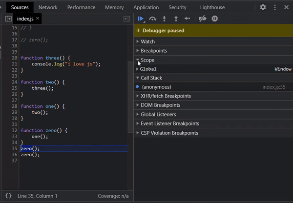

># 33 Concepts Every JavaScript Developer Should Know (by leonardomso)

- [Github : 33 Concepts Every JavaScript Developer Should Know (by leonardomso)](https://github.com/leonardomso/33-js-concepts)

- [Nomadcoder's lectures](https://www.youtube.com/watch?v=QkFkFqg-J04)

예전에 유튜브 영상을 보다가 나중에 봐야겟다하고 저장해둔 영상을 이제서야 발견해서 공부하고자 한다.

<br>

># Call Stack

- Call Stack : 자바스크립트가 함수 실행을 핸들하는 방법 중 하나.
- 책을 쌓는 것 처럼 자바스크립트 함수를 스택위에 올리고 함수를 다 실행하면 제거 함

<br>

- 일반 함수인 경우
  - 함수를 return이 나와야 끝나는 것임
  - 크롬 개발 툴 sources의 call stack을 확인해 보면
  - anonymous(zero 호출 대기) - zero(one 호출 대기) - one(two 호출 대기) - two(three 호출 대기) - three(console 호출대기) - console호출 해서 값 출력(three 제거 대기) - three 제거(two 제거 대기) - two 제거( one 제거 대기) - one 제거 ( zero 제거 대기) - zero 제거 (anonymous 제거 대기 또는 다음 호출 대기) - anonymous 종료 또는 다음 호출 
  - 중간에 에러를 만나면 모든 실행을 중단시키고 에러를 반환하고 에러전에 있던 모든 콜 스택을 알려줌
    - **콜스택 확인 방법** : **주의)** 절대로 live server로 키지 말고 그냥 html을 browser에서 실행시키자. live sever 실행시 크롬 익스텐션이 관여하는 것 같았다. (덕분에 엄청 해매서 시간 많이 뺐겼다. 그래도 결국엔 찾아 내고 만다!)

<br>



<br>

**즉, 리스트가 존재하고 함수는 리스트에 추가되고 실행이 완료되면 함수는 리스트에서 제거 된다.**

**추가적으로 arrow 함수 일 경우에는 변수 하나씩 모두 보고 진행 함**

**그리고 함수가 서로 참조되어 무한 콜스텍을 쌓을 경우 맥시멈 콜스택 제한에 의해서 에러를 뿜음**

># Arrow function vs Function 

[Arrowfunction vs function by개발아저씨들 힘을 모아](https://programming119.tistory.com/94)

- **this**
- 선언할 때 결정되는 것은 클로져
- this의 값은 함수를 호출하는 방법에 의해 결정된다. (누가 호출한 객체 = this)
- 함수의 this 값이 함수가 어떻게 호출되었는지 상관 없이 설정할 수 있는 `bind`메소드가 있음
  - 호출 방법과 무관하게 this를 호출되는 함수와 this가 무엇인지 엮어줌
- Arrow는 변수가 선언된 위치를 this로 하고 , 일반 함수는 호출된 장소에 따라 다르다. (추가적으로 usestrict에 따라 또 다르다)

<br>

- **arguments**
  - 일반 함수는 arguments라는 array형태를 띠는 객체가 있는데 인자들을 받아와야만 인자들에 접근 가능하다.
  - 하지만, Arrow 함수는 arguments 사용시 인자가 없으면 외부 함수에서 들어오는 것을 가져다 쓸 수 있다.

<br>

># Primitive type

>## undefined vs null vs NaN

undefined : 정의 되지 않음
null : 존재하지 않는다(존재하지 않는다라는 값)
NaN : 숫자가 아님 (숫자 연산이 망가진 경우)

<br>

># Value Types and Reference Types 

``` js
let a = 50; // a = 50
let b = a; // b = a = 50 (참조가 아니고 복사라고 봐야 됨)

a = 10; // a = 10 ( 그래서 여전히 b = 50)

console.log(b); // 50
```

``` js
const sexy = ['go', 'come'];
const pretty = sexy;

sexy.push("want");

console.log(pretty); // go come want 참조 되어 원래의 값에 영향을 줌 

pretty.push("wish");

console.log(sexy); // go come want wish 즉, 서로 참조하고 있음
```

``` js
console.log([10] === [10]); // false 각각 다른 메모리에 할당 되기 때문에

const x = {
  a: 'hello'
}

const b = x;

b.a = "ok";

console.log(x); // ok
```

- 참조는 array, object, function에서만 !

<br>

- 오늘은 callstack 보는 법 때문에 시간을 엄청 썻던것 같다. 결국에는 찾았지만...
- 또 Arrow function의 차이점, this가 달라지는 상황을 이해하기 힘들어서 시간을 많이 들인것 같다.
