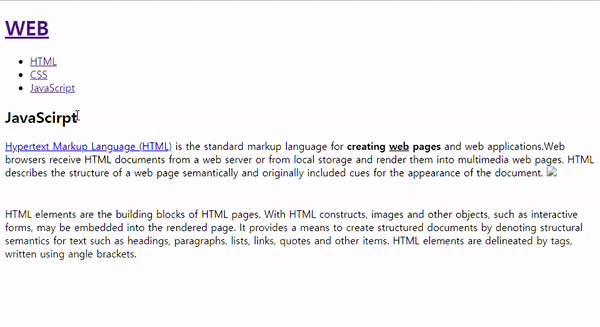
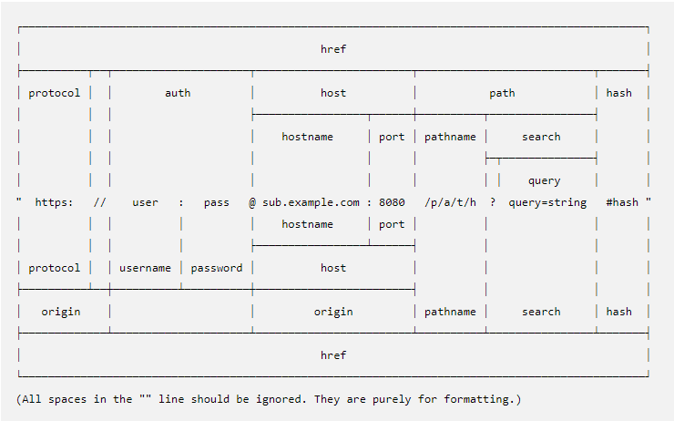

># 생활코딩

- [생활코딩 : Node.js 수업](https://opentutorials.org/course/3332)
- 생활코딩님의 강의를 들으면서 공부한 내용을 정리하는 용도로 작성되었으며, 본내용이 틀릴 수 도 있습니다.

<br>

># Node.js

># Node.js의 시작

- HTML을 일일이 수작업으로 모두 바꿔 수정해줘야 했다. -> 반복적인 일
- 모든 사람에게 HTML 파일을 수정 가능하게 하면 위험해서 웹 소유자만이 컨텐츠 추가가 가능했다.
- HTML 작성을 기계에게 해줄 순 없을까에 대한 욕망의 시작
- JavaScript에 익숙한 웹 개발자들이 다른 언어를 배우지 않고 자동으로 웹페이지를 만드는 SSA(Server Side Application)를 할수 있게 하고 싶어 지면서 -> Node.JS가 탄생한다.

<br>

- 웹의 변화 : `문서` -(javascript의 탄생)-> `앱`(사용자와 상호작용 함) -> 엄청난 인기!
- javascirpt는 웹 브라우저 세계에서의 독점적인 언어가 됨. 하지만 웹 브라우저에 갖혀있다고도 볼수 있었다.
- 그러다 MS에서 V8의 강력한 엔진 개발과 함께 javascript를 컴퓨터를 제어하는 영역으로 들고 오기 위해 javasciprt와 똑같은 언어를 사용하지만 다른 언어들 처럼 컴퓨터 제어가 가능한 언어인 node.js가 탄생 

<br>
<br>
<br>

># Node.js로 할 수 있는 것

- template를 변경해서 수많은 html을 한번에 수정이 가능 하다.
- 사용자가 웹을 통해서 콘텐츠에 대한 CRUD(Create, Read, Update, Delete)를 가능하게 함.

<br>

- 비교
  - WEB Browser - (HTML언어를 통해서) - WEB Application (기능)
  - Node.js runtime - (Javascript언어를 통해서) - Node.js Application (기능)

<br>

- 사용자의 참여는 웹의 폭발적인 팽창 시킴

<br>
<br>
<br>

># 환경설정

>## Node.js runtime 설치

- window, mac에서는 node.js가 잘 안될 수도 있음 -> [codeanywhere]()(cloud base IDE : 실습 환경 제공 사이트, 유료화됨)
- node.js 사이트에서 설치하면 됨!

<br>

>## TASK 설정

- task.json 설정 (`ctrl + shift + b` 누르면 간단한 내용으로 결과 도출 및 디버깅) 
- [vscode task설정 및 언어별 코드](https://sosomemo.tistory.com/53)
- VSCode에서 `ctrl + shift + p` - task: configure task - create - another 
- task.json 파일 생성됨 거기 그냥 해당 언어 코드로 복붙

- node.js 의 경우

``` json
{
    // See https://go.microsoft.com/fwlink/?LinkId=733558
    // for the documentation about the tasks.json format
    "version": "2.0.0",
    "tasks": [
        {
            "label": "JS Run",
            "type": "shell",
            "command": "node",
            "args": [
                "${file}"
            ],
            "group": {
                "kind": "build",
                "isDefault": true
            }
        }
    ]
}
```

<br>
<br>
<br>

># Node.js 웹서버 만들기


``` js
var http = require('http'); // httpRequest 관련 모듈 같다.
var fs = require('fs'); // 표시관련 모듈 같고
var app = http.createServer(function(request,response){
    var url = request.url;
    if(request.url == '/'){ 
      url = '/index.html';
    }
    if(request.url == '/favicon.ico'){
      response.writeHead(404); // 상태코드 404 not found
      response.end();
      return;
    }
    response.writeHead(200); // 상태코드 200 성공
    console.log(__dirname + url);
    response.end(fs.readFileSync());
    // response.end('raccoon : '+url); // 페이지 표시가 end 안에 있는 것으로 바뀜
    // end 함수안에 넣는게 render 시키는 것 같음
 
});
app.listen(3000); // port 번호

``` 

<br>
<br>
<br>

># Node.js URL 이해

- URL : `http`://`opentutorials.org`:`3000`/`main`?`id=HTML&page=12`

- `http`(protocol) :  웹브라우저 와 웹서버가 통신하기 위한 통신규칙

- `opentutorials.org` (host or domain) : 각각의 컴퓨터를 의미(연결된 컴퓨터 주소를 의미)

- `3000` (port) : 한대의 컴퓨터 안에 여러개의 서버가 존재할 수 있어서
  - `20 - FTP(data) <TCP>`
  - `21 - FTP(제어) <TCP>`
  - `22 - SSH <TCP>`
  - `23 - Telnet <TCP>` 
  - `25 - SMTP <TCP>`
  - `53 - DNS <TCP, UDP>`
  - **`80 - HTTP <TCP, UDP>`**
  - `110 - POP3 <TCP>`
  - **`443 - HTTPS <TCP>`**

- `main` (path): 어떤 파일인지 의미함

- `id=HTML&page=12` (query string) : 값을 넣어 웹서버에게 데이터 전달 요청이 가능 (HTML의 12page 가져와) 
  - 값과 값은 `&` (엠퍼센드)로 구분하고, key 와 value는 `=` (equal)로 구분하도록 약속

<br>
<br>
<br>

># Node.js 에서 URL을 통해서 입력된 값을 사용하는 방법

- **queryString**
  - module를 연결하는 방법으로는 `require`함수를 사용 함
  - queryString에 접근해서 해당 값을 가져오고자 한다.
  - 

``` js
var http = require('http');
var fs = require('fs');
var url = require('url');

var app = http.createServer(function(request,response){
    var _url = request.url; 
    // request.url은 요청한 path와 queryString 까지 가져옴
    var queryData = url.parse(_url, true).query;
    if(_url == '/'){
        _url = '/index.html';
    }
    if(_url == '/favicon.ico'){
      response.writeHead(404);
      response.end();
      return;
    }
    response.writeHead(200);
    response.end(fs.readFileSync(__dirname + url)); 
    // fs.readFileSync함수에 해당 파일 경로를 넣어주면 그걸 읽어서 보내줌
 
});
app.listen(3000);
```


- **URL 모듈**

``` js
// URL 모듈을 console로 찍어 보았을 때
// type은 object 임
{
  Url: [Function: Url],
  parse: [Function: urlParse],
  resolve: [Function: urlResolve],
  resolveObject: [Function: urlResolveObject],
  format: [Function: urlFormat],
  URL: [class URL],
  URLSearchParams: [class URLSearchParams],
  domainToASCII: [Function: domainToASCII],
  domainToUnicode: [Function: domainToUnicode],
  pathToFileURL: [Function: pathToFileURL],
  fileURLToPath: [Function: fileURLToPath]
}

// URL 모듈의 parse 함수 사용시 return 값
Url {
  protocol: null,
  slashes: null,
  auth: null,
  host: null,
  port: null,
  hostname: null,
  hash: null,
  search: '?id=HTML',
  query: [Object: null prototype] { id: 'HTML' }, 
  // query에 접근해서 queryString 객체 형태에 접근 가능
  pathname: '/',
  path: '/?id=HTML',
  href: '/?id=HTML'
}
```

<br>
<br>
<br>

># Node.js App 제작 - 동적인 웹페이지 만들기

- temlpate라는 변수안에 표시할 정보인 html을 넣는다
- template literals(\`${}\`)를 통해서 render될 template에 유동적으로 값을 넣어 줄 수 있다.


``` js
var http = require('http');
var fs = require('fs');
var url = require('url');

var app = http.createServer(function(request,response){
    var _url = request.url; 
    // request.url은 요청한 path와 queryString 까지 가져옴
    var queryData = url.parse(_url, true).query;
    var title = queryData.id; 
    // title 변수에 현재 page queryString에서 id key의 value를 할당 
    if(_url == '/'){
        title = 'Welcome'; 
        // 가져온 path, queryString에 조건을 넣어 페이지에 맞게 값을 변화시키게 함
    }
    if(_url == '/favicon.ico'){
      response.writeHead(404);
      response.end();
      return;
    }
    response.writeHead(200);
    var template = `
    <!doctype html>
<html>
<head>
  <title>WEB1 - ${title}</title>
  <meta charset="utf-8">
</head>
<body>
  <h1><a href="/">WEB</a></h1>
  <ul>
    <li><a href="/?id=HTML">HTML</a></li>
    <li><a href="/?id=CSS">CSS</a></li>
    <li><a href="/?id=JavaScirpt">JavaScript</a></li>
  </ul>
  <h2>${title}</h2>
  <p><a href="https://www.w3.org/TR/html5/" target="_blank" title="html5 speicification">Hypertext Markup Language (HTML)</a> is the standard markup language for <strong>creating <u>web</u> pages</strong> and web applications.Web browsers receive HTML documents from a web server or from local storage and render them into multimedia web pages. HTML describes the structure of a web page semantically and originally included cues for the appearance of the document.
  
  </p><p style="margin-top:45px;">HTML elements are the building blocks of HTML pages. With HTML constructs, images and other objects, such as interactive forms, may be embedded into the rendered page. It provides a means to create structured documents by denoting structural semantics for text such as headings, paragraphs, lists, links, quotes and other items. HTML elements are delineated by tags, written using angle brackets.
  </p>
</body>
</html>

    `;
    response.end(template); // render 할 부분을 template 변수로 처리
 
});
app.listen(3000);
```

- 즉, 한번의 수정으로 수많은 페이지를 동일하게 변경 가능하다. 엄청난 효율이다.



<br>
<br>
<br>


># Node.js CRUD

- CRUD : 정보를 다루는 핵심적인 방법 Create, Read, Update, Delete

<br>

>## Node.js 파일 읽기

- `fileread.js`, `sample.txt`
- [Nodejs docs : readFile() ](https://nodejs.org/dist/latest-v14.x/docs/api/fs.html#fs_fs_readfile_path_options_callback)
  - `fs.readFile(path[, options], callback)` : Options(필수X) -> encoding(default: null), flag 
- 현재 directory 위치 잘 확인하고 파일 실행 시켜야 함

``` js
const fs = require('fs');
fs.readFile('sample.txt', 'utf8', (err, data) => {
    console.log(data);
} );
```

<br>
<br>
<br>


># 파일을 이용해 본문 구현

- `main.js` 서버 코딩은 반영될려면 서버 다운시키고 다시 온해야 하지만 `data`를 수정하는 경우에는 바로 반영됨

- `data` 폴더에 따로 입력될 데이터를 파일로 분류하여 모두 저장해서 호출시에 그때마다 상황에 맞게 바뀌게 함

- 마지막에 response.end scope 조심해야함, template가 callback에서 정의 되었기 때문에 밖에서는 사용이 불가함 그래서 resopne.end를 callback에 넣어준 것

``` js
var http = require('http');
var fs = require('fs');
var url = require('url');

var app = http.createServer(function(request,response){
    var _url = request.url; // request.url은 요청한 path와 queryString 까지 가져옴
    var queryData = url.parse(_url, true).query;
    var title = queryData.id;
    if(_url == '/'){
        title = 'Welcome';
    }
    if(_url == '/favicon.ico'){
      response.writeHead(404);
      response.end();
      return;
    }
    response.writeHead(200);
    fs.readFile(`data/${title}`, 'utf8', function(err, description) {
      var template = `
      <!doctype html>
  <html>
  <head>
    <title>WEB1 - ${title}</title>
    <meta charset="utf-8">
  </head>
  <body>
    <h1><a href="/">WEB</a></h1>
    <ul>
      <li><a href="/?id=HTML">HTML</a></li>
      <li><a href="/?id=CSS">CSS</a></li>
      <li><a href="/?id=JavaScript">JavaScript</a></li>
    </ul>
    <h2>${title}</h2>
    <p>${description}<p>
  </body>
  </html>
    `;
    response.end(template); // scope 조심할 것
    });
});
app.listen(3000);
```

<br>
<br>
<br>

># Node.js 콘솔에서의 입력값

- IO
  - input : Parameter vs Argument
    - Parameter : 입력되는 정보의 형식
    - Argument : 실제로 입력된 값
  - output

<br>

- 콜솔(CLI)에서의 입력값을 가져오는 방법
  - `process.argv`를 통해서 가져올 수 있고 실행 파일 경로도 가져올 수 있음
  - `process.argv0` 은 단지 process.argv의 `[0]`인 값 즉, runtime 경로를 알려줌

``` js
var args = process.argv;
console.log('args : \n',args); // Array : [0] = nodejs 실행파일(runtime) 경로 , [1] = 현재 실행한 파일(코드) 경로
// [2] 부터는 cmdline의 부수적인 인자들을 차례대로 item으로 넣어 줌 (cmdline에서 sperator는 space로 하는 듯)
```

<br>
<br>
<br>

>#  App 제작 - Not found 구현

- 조건문을 통해서 pathname을 분류해서 url을 구분하여 200 , 404 상태 처리

- URL



해당 강의 에서는 parse를 썼지만 nodejs에서는 현재 parse를 legacy로 판단하고 그냥 stand url인 `WHATWG URL API` 사용을 권장하고 있다.

- `WHATWG URL API` 사용법
  - 그냥 url 모듈의 URL 클래스를 사용해서 직접적으로 가져오는 것이다. (모듈은 소문자, class는 대문자)

``` js
const myURL = new URL('https://%CF%80.example.com/foo');
console.log(myURL.href);
// Prints https://xn--1xa.example.com/foo
console.log(myURL.origin);
// Prints https://xn--1xa.example.com 
```

<br>

- 강의 처리 안

``` js
var http = require('http');
var fs = require('fs');
var url = require('url');

var app = http.createServer(function(request,response){
    var _url = request.url; // request.url은 요청한 path와 queryString 까지 가져옴
    var queryData = url.parse(_url, true).query; // queryString
    var pathname = url.parse(_url, true).pathname;
    var title = queryData.id;

    if (pathname === `/`) {
      fs.readFile(`data/${title}`, 'utf8', (err, description) => {
        var template = `
        <!doctype html>
        <html>
        <head>
        <title>WEB1 - ${title}</title>
        <meta charset="utf-8">
        </head>
        <body>
        <h1><a href="/">WEB</a></h1>
        <ul>
        <li><a href="/?id=HTML">HTML</a></li>
        <li><a href="/?id=CSS">CSS</a></li>
        <li><a href="/?id=JavaScript">JavaScript</a></li>
        </ul>
        <h2>${title}</h2>
        <p>${description}<p>
        </body>
        </html>
        `;
        response.writeHead(200);
        response.end(template); 
      });
    } else {
      response.writeHead(404);
      response.end('Not found');
    }
  });


  app.listen(3000);
```

