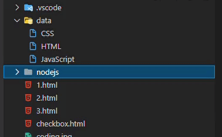

># 생활코딩

- [생활코딩 : Node.js 수업](https://opentutorials.org/course/3332)
- 생활코딩님의 강의를 들으면서 공부한 내용을 정리하는 용도로 작성되었으며, 본내용이 틀릴 수 도 있습니다.

<br>

># Node.js

>## APP - 홈페이지 구현

- 현재 `pathname`으로는 각각의 페이지를 구분이 불가함
- 그러면 home 인 경우 즉, queryData(queryString)이 없는 경우에 표시하고자 한다.
- 구조 : if pathname을 통해서 구분하고 -> 내부에서는 if queryData.id을 통해서 pathname만 있는 상황과, 그외의 queryString이 있는 상황의 조건을 걸어 표시되는 화면을 다르게 구성함


``` js
var http = require('http');
var fs = require('fs');
var url = require('url');


var app = http.createServer(function(request,response){
    var _url = request.url; // request.url : pathname + queryString = path
    var queryData = url.parse(_url, true).query; // queryString
    var pathname = url.parse(_url, true).pathname; // pathname
    
    // pathname check : '/'
    if (pathname === `/`) {
      // queryString check 01 - undefined
      if(!queryData.id) {
          // only home
          var title = 'Welcome';
          var description = 'Hello, Node.js';
          var template = `
          <!doctype html>
          <html>
          <head>
          <title>WEB1 - ${title}</title>
          <meta charset="utf-8">
          </head>
          <body>
          <h1><a href="/">WEB</a></h1>
          <ul>
          <li><a href="/?id=HTML">HTML</a></li>
          <li><a href="/?id=CSS">CSS</a></li>
          <li><a href="/?id=JavaScript">JavaScript</a></li>
          </ul>
          <h2>${title}</h2>
          <p>${description}<p>
          </body>
          </html>
          `;
          response.writeHead(200); // status(result)
          response.end(template); // render
        
      } else {
        // queryString check 02 - exist
        fs.readFile(`data/${queryData.id}`, 'utf8', (err, description) => {
          var title = queryData.id;
          var template = `
          <!doctype html>
          <html>
          <head>
          <title>WEB1 - ${title}</title>
          <meta charset="utf-8">
          </head>
          <body>
          <h1><a href="/">WEB</a></h1>
          <ul>
          <li><a href="/?id=HTML">HTML</a></li>
          <li><a href="/?id=CSS">CSS</a></li>
          <li><a href="/?id=JavaScript">JavaScript</a></li>
          </ul>
          <h2>${title}</h2>
          <p>${description}<p>
          </body>
          </html>
          `;
          response.writeHead(200); // status
          response.end(template); // render
        });
      }

    } else {
      // pathname check - not '/'
      response.writeHead(404); // status
      response.end('Not found'); // render
    }
    
  });
  // port number
  app.listen(3000);

```

<br>
<br>
<br>

>## Node.js 파일 목록 알아내기(directory list)

- filesystem 모듈의 `readdir` 함수
- `fs.readdir(path[, options], callback)`
  - Options : encoding (Default utf-8) , withFileTypes(Default false)
  - Callback : err , files

``` js
const testFolder = 'data';
const fs = require('fs');

fs.readdir(testFolder, (err, files) => {
    console.log(files);
    files.forEach((file) => {
        console.log(file);
    })
});


// [ 'CSS', 'HTML', 'JavaScript' ]

// CSS
// HTML
// JavaScript

```

<br>
<br>
<br>

>## App 제작 - 글목록 출력하기

- 개선할 부분

``` js
var list = `<ul>
            <li><a href="/?id=HTML">HTML</a></li>
            <li><a href="/?id=CSS">CSS</a></li>
            <li><a href="/?id=JavaScript">JavaScript</a></li>
          </ul>`
```

<br>

- data가 추가되면 li가 생성되게 하고, 해당 title도 변경하고, description도 반영되게 하는 법
  - data 폴더의 파일 이름을 자동으로 가져오게 해야 함
  - `readdir`함수 사용해서 data 폴더의 파일 이름들을 가져오게 함
  - 가져온 파일이름 들을 활용해서 render할 ul태그와 li 태그를 구성하여 변수에 저장


<br>

- while 문을 통한 li 요소 추가

``` js
fs.readdir('./data', (err , files) => {
          var list = '<ul>';
          var i = 0;
          while(i < files.length) {
            list = list + `<li><a href="/?id=${files[i]}">${files[i]}</a></li>`
            // i = i + 1 
            i += 1        
            }
            list = list + '</ul>';
```

<br>

- forEach를 통핸 li요소 추가

``` js
 fs.readdir('./data', (err , files) => {
          var list = '<ul>';
         files.forEach((file) => {
            list = list + `<li><a href="/?id=${file}">${file}</a></li>`
         })
            list = list + '</ul>';

```

<br>

- queryString 예외 처리
  - `includes`함수를 사용해서 queryString으로 들어온 id가 data파일에 있는지 확인하는 코드를 넣어, 주소창에 존재하지 않는 id가 나오면 not found를 출력하게 함

``` js
 fs.readdir('./data', (err , files) => {
    if (files.includes(queryData.id)){
      var list = '<ul>';
      files.forEach((file) => {
        list = list + `<li><a href="/?id=${file}">${file}</a></li>`
      });
        list = list + '</ul>';
      fs.readFile(`data/${queryData.id}`, 'utf8', (err, description) => { 
        var title = queryData.id;
        var template = `
        <!doctype html>
        <html>
        <head>
        <title>WEB1 - ${title}</title>
        <meta charset="utf-8">
        </head>
        <body>
        <h1><a href="/">WEB</a></h1>
        ${list}
        <h2>${title}</h2>
        ${description}
        </body>
        </html>
        `;
        response.writeHead(200);
        response.end(template); 
      });
    } else {
      response.writeHead(404);
      response.end('Not found');
    };
  });
```


<br>

- 코드 전문

```js
var http = require('http');
var fs = require('fs');
var url = require('url');


var app = http.createServer(function(request,response){
    var _url = request.url; // request.url은 요청한 pathname + queryString = path
    var queryData = url.parse(_url, true).query; // queryString
    var pathname = url.parse(_url, true).pathname;
    if (pathname === `/`) {
      if(!queryData.id) {
        fs.readdir('./data', (err , files) => {
          var list = '<ul>';
         files.forEach((file) => {
            list = list + `<li><a href="/?id=${file}">${file}</a></li>`
         })
            list = list + '</ul>';

          // var list = `<ul>
          //   <li><a href="/?id=HTML">HTML</a></li>
          //   <li><a href="/?id=CSS">CSS</a></li>
          //   <li><a href="/?id=JavaScript">JavaScript</a></li>
          // </ul>`

          var title = 'Welcome';
          var description = 'Hello, Node.js';
          var template = `
          <!doctype html>
          <html>
          <head>
          <title>WEB1 - ${title}</title>
          <meta charset="utf-8">
          </head>
          <body>
          <h1><a href="/">WEB</a></h1>
          ${list}
          <h2>${title}</h2>
          <p>${description}<p>
          </body>
          </html>
          `;
          response.writeHead(200);
          response.end(template);
          
        });
        
      } else {
        fs.readdir('./data', (err , files) => {
          if (files.includes(queryData.id)){
            var list = '<ul>';
            files.forEach((file) => {
              list = list + `<li><a href="/?id=${file}">${file}</a></li>`
           });
              list = list + '</ul>';
            fs.readFile(`data/${queryData.id}`, 'utf8', (err, description) => { 
              var title = queryData.id;
              var template = `
              <!doctype html>
              <html>
              <head>
              <title>WEB1 - ${title}</title>
              <meta charset="utf-8">
              </head>
              <body>
              <h1><a href="/">WEB</a></h1>
              ${list}
              <h2>${title}</h2>
              ${description}
              </body>
              </html>
              `;
              response.writeHead(200);
              response.end(template); 
            });
          } else {
            response.writeHead(404);
            response.end('Not found');
          };
        });
      };
    } else {
    response.writeHead(404);
    response.end('Not found');
  }
  
});
app.listen(3000);
```

<br>
<br>

- data 폴더에 Nodejs 파일 추가



<br>
<br>


- 브라우저에 바로 반영되어 추가 됨


<br>
<br>
<br>

>## App - 함수를 이용해서 정리 정돈하기

- 코드가 많아지면 복잡해지기 때문에 사람이 감당할 수 있게 함수를 사용하여 정리.
- 함수를 사용하는 예시를 보여주는 것이지 더 함수화 시키는 것은 가능 함

``` js
var http = require('http');
var fs = require('fs');
var url = require('url');

// render 할 HTML을 구조화 시키는 함수
const tmeplateHTML = (title, list, body) => {
  return `
  <!doctype html>
  <html>
  <head>
  <title>WEB1 - ${title}</title>
  <meta charset="utf-8">
  </head>
  <body>
  <h1><a href="/">WEB</a></h1>
  ${list}
  ${body}
  </body>
  </html>
  `;
}

// data 폴더의 file들을 ul li로 만들어 추가해주는 함수
const templateList = (files) => {
  var list = '<ul>';
  files.forEach((file) => {
     list = list + `<li><a href="/?id=${file}">${file}</a></li>`
  })
  list = list + '</ul>';
  return list;
}


var app = http.createServer(function(request,response){
    
    var _url = request.url; // request.url은 요청한 pathname + queryString = path
    var queryData = url.parse(_url, true).query; // queryString
    var pathname = url.parse(_url, true).pathname;
    
    if (pathname === `/`) {


      if(!queryData.id) {

        fs.readdir('./data', (err , files) => {
          var list = templateList(files); // data를 li에 추가해주는 함수
          var title = 'Welcome';
          var description = 'Hello, Node.js';
          var template = tmeplateHTML(title, list, `<h2>${title}</h2>
          <p>${description}<p>`); // render할 HTML를 구조화 시켜주는 함수 
          response.writeHead(200);
          response.end(template);
        });

      } else {
       
        fs.readdir('./data', (err , files) => {
          if (files.includes(queryData.id)){
            fs.readFile(`data/${queryData.id}`, 'utf8', (err, description) => { 
              var list = templateList(files); // data를 li에 추가해주는 함수
              var title = queryData.id;
              var template = tmeplateHTML(title, list, `<h2>${title}</h2>
                <p>${description}<p>`); // render할 HTML를 구조화 시켜주는 함수            
              response.writeHead(200);
              response.end(template); 
            });
          } else {
            response.writeHead(404);
            response.end('Not found');
          };
        });

      };


    } else {
    response.writeHead(404);
    response.end('Not found');
  }
  
});

app.listen(3000);
```


