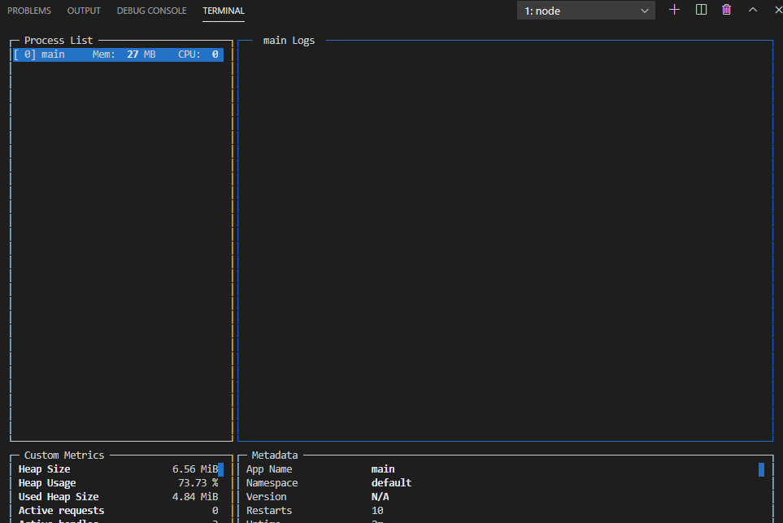
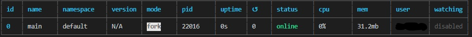
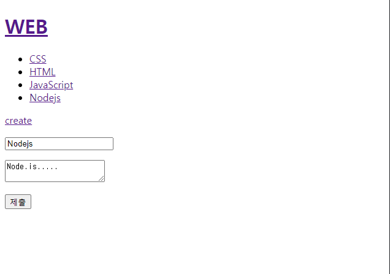
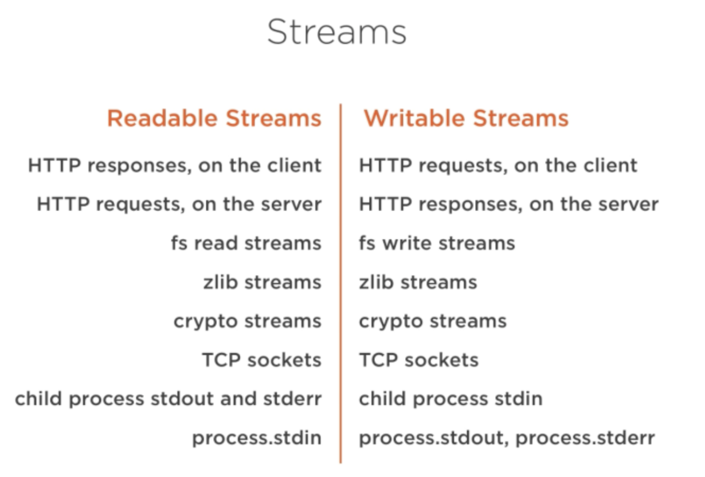
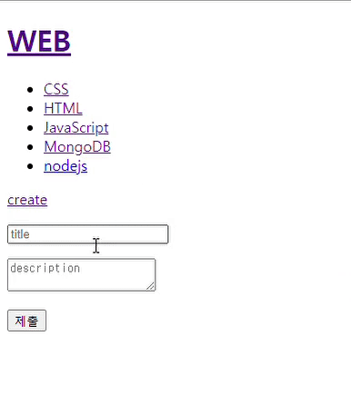
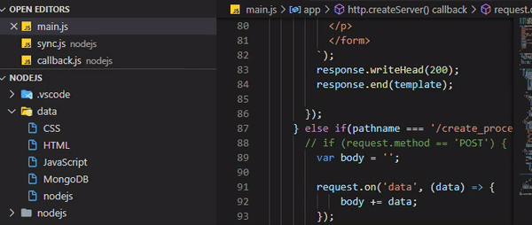

># 생활코딩

- [생활코딩 : Node.js 수업](https://opentutorials.org/course/3332)
- 생활코딩님의 강의를 들으면서 공부한 내용을 정리하는 용도로 작성되었으며, 본내용이 틀릴 수 도 있습니다.

<br>

># Node.js

>## Node.js 동기와 비동기 그리고 콜백 (Synchronous & Asynchronous)

- **동기 & 비동기(Sync & Async)**
  - 동기 : 직렬적(순서대로) 처리 (비효율적이지만 덜 복잡함)
  - 비동기 : 병렬적으로 처리 (효율적이지만 복잡함)
  - nodejs에서는 기본적으로 모두 async 임 그래서 따로 Sync관련 함수가 존재함

``` js
// nodejs/sample.txt = 'b' 
const fs = require('fs');

// readFileSync
console.log('a');
const result = fs.readFileSync('nodejs/sample.txt', 'utf8');
console.log(result);
console.log('c');
// a, b, c


// readFile
console.log('a');
fs.readFile('nodejs/sample.txt', 'utf8', (err, result) => {
    console.log(result);
});
console.log('c');
// a, c, b
```

<br>
<br>
<br>

- **콜백(callback)**
  - JavasCript에서 함수는 값이 되기도 함
  - callback 함수는 함수를 인자로 받는 파라미터 임
  - async에서 요청했을 때 완료가 되면 그때 callback을 실행시키는 특징이 있음

``` js
// 함수 표시 방법
function a() {
    console.log('A');
}

const a = function (){
    console.log('A');
}

const a = () => {
    console.log('A');
}

// javascript에서는 함수는 값이 되기도 함 (변수에 넣어서 할당하므로)

// callback
const slowfunc = (callback) => {
    callback();
}

slowfunc(a);
// A
```

<br>

>## nodejs Package Manager 와 PM2

- **Pakage Manager**
  - 독립적 및 프로그램에서 속한 작은 단위도 패키지인데 이를 관리하는 프로그램을 말함
  - NPM : nodejs에서 광범위 하게 사용되고 있는 패키지 관리 프로그램

<br>

- **PM2**
  - [PM2 Quick Start](https://pm2.keymetrics.io/docs/usage/quick-start/)
  - 실행중인 프로그램(nodejs로 만든 프로그램)이 꺼지는 경우에 다시켜주는 역할도 있고 
  - 파일 수정을 관찰하여 자동으로 프로그램을 껏다 다시켜 브라우저에 반영 시킴
  - `npm install pm2 -g` (-g 옵션은 독립된 소프트웨어로서 어디에서든 사용되게 함, 환경변수에 넣어주는것 같음)
  - `pm2 start app.js` : 서버 시작 및 pm2로 확인가능
  - `pm2 start app.js --watch` : 파일 수정이 이루어지면 서버 restart를 자동으로 해줌
  - `pm2 stop app.js` : 서버 중지
  - `pm2 monit` : CLI 용 Dashboard를 띄워줌



  - `pm2 list` : process list를 띄워서 현재 상태및 정보들을 table 형식으로 보여줌



  - `pm2 log` : pm2가 처리한 기록 및 서버 관련 이벤트를 볼수 있음

<br>
<br>
<br>

># node.js HTML FORM

- form 의 경우 submit 버튼을 눌렀을 때 form의 action 속성이 가르키는 서버로 queryString의 형태로 데이터를 전송하는 html의 기능임

- 하지만 그냥 주소를 사용하면 나중에 임의로 주소를 복사해서 누군가가 클릭해서 실행하면 서버의 정보가 삭제, 수정, 생성의 사건이 일어 날수 있음

- 그래서 읽어올 때(get)는 queryString을 사용하고(무한히 긴 데이터는 불가함) , 수정 행위의 경우 queryString이 안보이게 post method를 통해서 정보를 보냄 

- post method로 정보를 보내면 pathname만 나타나고 나머지 queryString은 은밀하게 서버에 보내짐(아주큰 데이터도 보낼 수 있음)

``` html
<form action="http://localhost:3000/process create" method="post">
  <p><input type="text" name="title"></p>
  <p>
    <textarea name="description"></textarea>
  </p>
  <p>
    <input type="submit">
  </p>
</form>
```

<br>
<br>
<br>

>## App 글쓰기 UI 만들기

- 기존에는 queryString로만 page를 분류 하였는데 create의 경우 create라는 pathname으로 page를 만들것 임

- 그래서 해당 페이지에 form 요소를 넣어서 data를 server로 받아올려고 함

``` js
 else if(pathname === '/create'){
      fs.readdir('./data', (err , files) => {
        var list = templateList(files);
        var title = 'WEB - create';
        var template = tmeplateHTML(title, list, `
        <form action="http://localhost:3000/create_process" method="post">
          <p><input type="text" name="title" placeholder="title"></p>
          <p>
            <textarea name="description" placeholder="description"></textarea>
          </p>
          <p>
            <input type="submit">
          </p>
          </form>
        `);
        response.writeHead(200);
        response.end(template);
      });
 }

```



<br>

- submit으로 제출시 크롬 브라우저 개발자 도구에서 Network tab에서 action에 대한 page가 생성되고, 눌러서 확인해보면 Form Data에 해당 정보가 들어가 있음

<br>
<br>
<br>

># App - POST 방식으로 전송된 데이터 받기

- create_process pathname에 대한 조건을 걸어준다.
- request method가 뭔지 검증 부터 받는다.
- nodejs에서는 interface인 stream을 제공하고 있다.
  - [Stream의 개념 (by감성프로그래밍)](https://programmingsummaries.tistory.com/363)
  - [(Stream과 Buffer (by TK-ONE)](https://tk-one.github.io/2018/08/28/nodejs-buffer/)
  -  nodejs는 비동기를 기반으로 하여 파일 시스템, HTTP 요청을 전달할 때 다른 이벤트를 비동기로 처리 가능하다. 이를 non-blocking I/O라고 하는데 stream은 확장된 개념으로 버퍼와 대역폭을 절약할수 있는 이벤트 기반의 I/O인터페이스라고 한다.



- 아무튼 가장 이해하기 어려운 난이도 높은 개념이라서 여기서 넘어가고, 일단 그냥 위와 같은 애들이 뿜는 event를 다루는 애라고 생각하면 될듯하다.

- 그런 event를 다룰수 있는 Stream의 한 함수로 `on(event, listener)` 가 있다.

- on을 통해서 request event인 `data`는 data를 받아 listener인 callback 함수로 받아온 데이터를 가공하여 전역변수에 저장하여 데이터를 어떻게 쌓을 지 결정하는 부분인듯 하다.

- 또 on이 받는 이벤트 중에 `end`가 있는데 이는 stream을 통해서 소모할 data가 없을 때 마지막으로 처리할 사항을 이야기 하는 듯 하다. 그래서 대부분은 `data`에서 쌓은 데이터를 어디로 어떻게 보낼건지를 결정하는 부분 같다. 

``` js
else if(pathname === '/create_process') {
  if (request.method == 'POST') {
    
    var body = '';

    request.on('data', (data) => {
       
        body += data;
    });

    request.on('end', () => {
        var post = qs.parse(body); // { title: 'nodejs', description: 'nodejs is' }
        var title = post.title;
        var description = post.description;
        console.log(post.title);
        console.log(post.description);
    });
  
  response.writeHead(200);
  response.end('success');
  
  }
} 

```

- 여기에서는 이렇게 `data`에서는 request data를 받아 body에 쌓고 end부분에서 받아온 queryString을 parse 하면 객체형식으로 보기 좋게 만들어 준다.
- 그것을 통해서 가공하여 값을 사용할 수 있다.

<br>

- 하지만 궁금한 점이 생겼다.
  - 왜 그냥 data로 찍어보면 buffer라고 뜨는 것일까? 그리고 단지 `''` 표시나 코드 백틱으로 묶어주면 제대로 나온다. 왜 그럴까? 물론, stream이 데이터를 끊어서 전송하는 것은 알겠지만 언제 buffer 모양의 코드들이 encoding이 되는지를 모르겠다.

``` js
var body = '';

        request.on('data', (data) => {
            body += data;
            console.log(data); 
            // <Buffer 74 69 74 6c 65 3d 6e 6f 64 65 6a 73 26 64 65 73 63 72 69 70 74 69 6f 6e 3d 6e 6f 64 65 6a 73 2b 69 73>
            console.log(`${data}`);
            // title=nodejs&description=nodejs+is
            console.log(body);
            // title=nodejs&description=nodejs+is
        });
        
        request.on('end', () => {
            console.log(body);
            // title=nodejs&description=nodejs+is
            var post = qs.parse(body);
            //{ title: 'nodejs', description: 'nodejs is' }
            var title = post.title;
            var description = post.description;
            console.log('end', post.title);
            console.log('end', post.description);
        });
```


<br>
<br>
<br>

># App - 파일 생성과 리다이렉션(create file &  redirection)

- 입력받은 데이터를 파일로 저장하고, 해당 페이지로 이동 하기
- [fs.writeFile](https://nodejs.org/dist/latest-v14.x/docs/api/fs.html#fs_fs_writefile_file_data_options_callback) 함수를 사용해서 입력받은 title이 파일 이름이 되고 description으로 받은 값을 데이터 값으로 하는 파일을 작성한다.
  - `fs.writeFile(file, data[, options], callback)`
    - file : filename or file descriptor
    - data : 파일안에 넣을 값
    - callback : (err) => {}
    - options : encoding(default : utf8), mode(default : 0o666), flag (default : 'w')

<br>

- [response.writeHead](https://nodejs.org/dist/latest-v14.x/docs/api/http.html#http_response_writehead_statuscode_statusmessage_headers)
- `response.writeHead(statusCode[, statusMessage][, headers])`를 통해서 redirect를 시켜서 Location props에 이동하고자 하는 path를 줌
- 완료시 해당 link로 이동

``` js
else if(pathname === '/create_process') {
      // if (request.method == 'POST') {
        var body = '';

        request.on('data', (data) => {
            body += data;
        });
        
        request.on('end', () => {
            var post = qs.parse(body);
            var title = post.title;
            var description = post.description;
            fs.writeFile(`data/${title}`, description, 'utf8', (err) => {
              if(err){
                throw err;
              } else{
                response.writeHead(302, {Location: `/?id=${title}`});
                response.end();
              }
            });
        });
    // }
    } 
```

- **데이터 입력 및 결과 페이지 이동**



<br>

- **data 파일 생성 확인**




