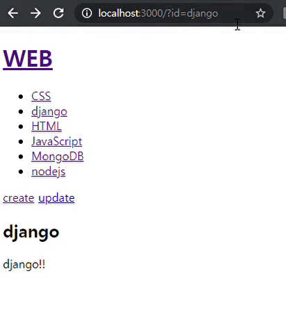
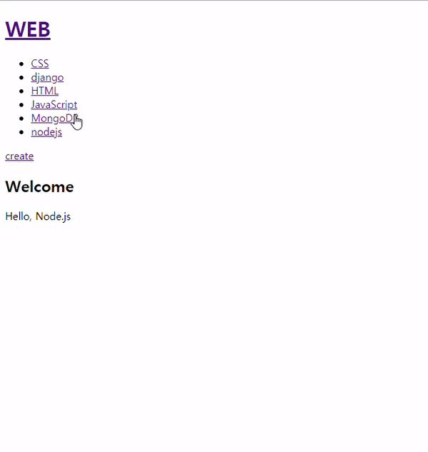
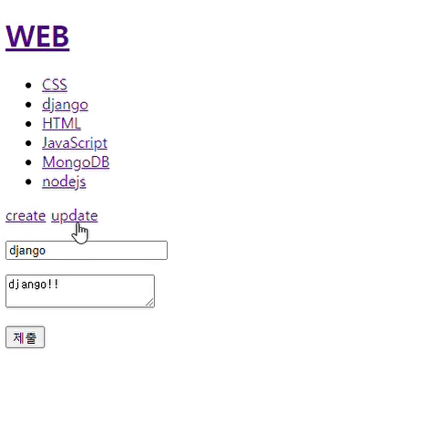
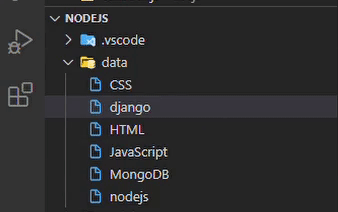
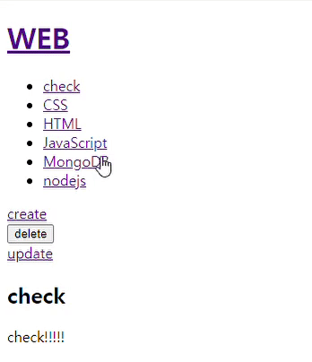
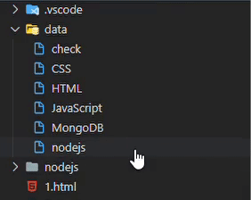

># 생활코딩

- [생활코딩 : Node.js 수업](https://opentutorials.org/course/3332)
- 생활코딩님의 강의를 들으면서 공부한 내용을 정리하는 용도로 작성되었으며, 본내용이 틀릴 수 도 있습니다.

<br>

># Node.js

>## App - 글 수정 - 수정 링크 생성

- 해당 페이지에 들어감 -> 글을 수정할 수 있는 버튼 클릭 -> page 연결
- 단, home에서는 update버튼은 없음

<br>

- **template 수정**
  - 기존의 버튼이 있던 부분은 control이라는 매개변수를 줌으로 써 조건을 걸어줄 예정(Home vs 기타 페이지)

``` js
const tmeplateHTML = (title, list, body, control) => {
  return `
  <!doctype html>
  <html>
  <head>
  <title>WEB - ${title}</title>
  <meta charset="utf-8">
  </head>
  <body>
  <h1><a href="/">WEB</a></h1>
  ${list}
  ${control}
  ${body}
  </body>
  </html>
  `;
}
```

<br>

- HOME 페이지
  - control로 받을 인자로 `<a href="/create">create</a>`만 있고 update는 없음

``` js
 if(!queryData.id) {
        fs.readdir('./data', (err , files) => {
          var list = templateList(files);
          var title = 'Welcome';
          var description = 'Hello, Node.js';
          var template = tmeplateHTML(title, list, `<h2>${title}</h2>
          <p>${description}<p>`, `<a href="/create">create</a>`);
          response.writeHead(200);
          response.end(template);
          
        });
        
      } 
```

<br>

- 기타 페이지
  - control 인자로 `<a href="/create">create</a> <a href="/update?id=${title}">update</a>` 를 줌
  - queryString에 어디에 update를 하는지 알려줘야 해서 id값으로 넣어 줌 


``` js
else {
        fs.readdir('./data', (err , files) => {
          if (files.includes(queryData.id)){
            fs.readFile(`data/${queryData.id}`, 'utf8', (err, description) => { 
              var list = templateList(files);
              var title = queryData.id;
              var template = tmeplateHTML(title, list, `<h2>${title}</h2>
                <p>${description}<p>`,
                `<a href="/create">create</a> <a href="/update?id=${title}">update</a>`);              
              response.writeHead(200);
              response.end(template); 
            });
          } else {
            response.writeHead(404);
            response.end('Not found');
          };
        });
      };
    }
```

<br>



<br>
<br>
<br>

>## App - 글수정 - 수정할 정보 전송

- `/update` 가 들어간 url로 연결되면 표시될 출력될 page 구성을 작성
- 폼요소를 가져오고 title, description에 data 폴더에 있는 해당 파일의 값을 가져와 적혀있는 상태로 출력
- 주의) 데이터를 통해서 파일 수정시 기존의 title을 가지고 수정을 시도하면 title은 데이터 폴더에서 파일 이름을 담당하고 있기 때문에 수정할 파일을 찾을수 가 없음(기존 title 과 수정할 title이 일치 하지 않으므로 어떤 파일을 어떻게 수정해야할지를 구현해야함)
  - 즉, 기존의 title은 가지고 있어야 수정할 파일을 선택가능하고 앞으로 바꾸려는 title 이름도 받아야 한다
  - 그래서 수정 대상 파일 찾기는 name="id"로 설정하고 hidden으로 하여 사용자가 변경하게 하지 못하게 하고 가지고 온다.
  - 그리고 원래 만들어 놓은 name="title"의 input은 바꾸려는 title 이름을 받아오게 한다.
- template에 submit 시에 제출되는 url `/update_process`로 변경

``` js
else if(pathname === `/update`) {
      fs.readdir('./data', (err , files) => {
        if (files.includes(queryData.id)){
          fs.readFile(`data/${queryData.id}`, 'utf8', (err, description) => { 
            var list = templateList(files);
            var title = queryData.id;
            var template = tmeplateHTML(title, list, 
              `
              <form action="/update_process" method="post">
              <input type="hidden" name="id" value="${title}">
              <p><input type="text" name="title" placeholder="title" value="${title}"></p>
              <p>
                <textarea name="description" placeholder="description">${description}</textarea>
              </p>
              <p>
                <input type="submit">
              </p>
              </form>
              `,
              `<a href="/create">create</a> <a href="/update?id=${title}">update</a>`);              
            response.writeHead(200);
            response.end(template); 
          });
        } else {
          response.writeHead(404);
          response.end('Not found');
        };
      });
    }
```

<br>



<br>
<br>
<br>

>## App- 글수정 - 수정된 내용 저장(data file에 반영)

- form을 통해서 전송된 정보는 `request.on('data', callback)`을 통해서 data event 로 처리되어 body 변수에  queryString이 할당됨
- `request.on('end', callback)` 을 통해서 수집된 정보를 가공하는데 받은 queryString을 `qs.parse`를 통해서 객체화 시켜 사용하기 편하게 만든다.
- 수정된 내용이 저장 될려면, 일단 파일 이름이 수정되어야 하고 파일의 내용도 수정되어야 한다.
  - [fs.rename](https://nodejs.org/dist/latest-v14.x/docs/api/fs.html#fs_fs_rename_oldpath_newpath_callback) : 특정 파일을 찾아서 이름을 바꿈
    - `fs.rename(oldPath, newPath, callback)` : Path는 경로이므로 현재 내가 실행하고 있는 위치를 잘 알아야 한다. 그리고 callback은 err 처리이다. **(중요한 점은 nodejs 자체가 비동기이기 때문에 조심해야 한다. 그래서 rename과 연관 되어 지장을 줄수 있는 코드는 callback으로 다음에 실행할 내용을 주어야 할 것이다.)**
    - 해당 부분에서는 전에 말한 것과 같이 oldpath에 사용자가 건드리지 못하는 name id를 주고, newpath에는 우리가 바꿀  name title을 준다.
- 그리고는 파일의 내용을 변화 및 생성하는 `writeFile`을 통해서 수정 저장한다. (어차피 이미 title이 변경 되었기 때문에 id같은 걸로 걱정할 필요는 없다.)


``` js
else if (pathname === '/update_process') {
      var body = '';

        request.on('data', (data) => {
            body += data;
        });
        
        request.on('end', () => {
            var post = qs.parse(body);
            var id = post.id;
            var title = post.title;
            var description = post.description;
            fs.rename(`data/${id}`, `data/${title}`, (err)=>{
                if (err) {
                  console.log('\n--Failed Rename--\n')
                  throw err;
                } else {
                  console.log('\nFile Renamed!\n')
                  fs.writeFile(`data/${title}`, description, 'utf8', (err) => {
                    if(err){
                      throw err;
                    } else{
                      console.log("\nUpdate Completed!")
                      response.writeHead(302, {Location: `/?id=${title}`});
                      response.end();
                    }
                  });
                }
            });
        });
    } 
```

<br>



<br>



<br>

- 참고로, pm2 에서 data 파일에 대한 ignore를 안해준 상태라서 계속 data가 바뀌면 server를 restart하게 된다. 그래서 `pm2 delete main`, `pm2  start main.js --watch --ignore-watch="data/*"` 를 통해서 restart대상에서 제외시켜 줘야 한다. 그래야 효율적이기 때문 


<br>
<br>
<br>

>## App - 글삭제 (버튼)

- 글삭제 버튼의 경우 바로 data file에 영향을 주기 때문에 get 방식이 아닌 post방식으로 해야함 그래서 link로 구현하지 않고, form으로 함 (즉, get = link , post = form)

- 안그러면 delete url을 누군가 복사해서 사용하면 data file이 문제가 생김

- 어떤것을 지울지 file 이름이 필요하므로 input hidden으로 name id로 title 값인 file 이름을 가지고 있게 한다. 그리고 input submit 버튼을 구현

- form action : `/delete_process` , method : post

``` js
else {
        fs.readdir('./data', (err , files) => {
          if (files.includes(queryData.id)){
            fs.readFile(`data/${queryData.id}`, 'utf8', (err, description) => { 
              var list = templateList(files);
              var title = queryData.id;
              var template = tmeplateHTML(title, list, `<h2>${title}</h2>
                <p>${description}<p>`,
                `<a href="/create">create</a>
                <form action="/delete_process" method="post"> 
                  <input type="hidden" name="id" value="${title}">
                  <input type="submit" value="delete"> 
                </form>
                <a href="/update?id=${title}">update</a>`);              
              response.writeHead(200);
              response.end(template); 
            });
          } else {
            response.writeHead(404);
            response.end('Not found');
          };
        });
      };
    } 
```

<br>
<br>
<br>

>## App - 글 삭제하기 (요청에 따른 data file 지우기)

- [fs.unlink](https://nodejs.org/dist/latest-v14.x/docs/api/fs.html#fs_fs_unlink_path_callback) 활용
  - `fs.unlink(path, callback)`
  - 마지막에는 어차피 페이지가 사라지기에 홈화면으로 가게 함

``` js
else if (pathname === "/delete_process") {
      var body = '';

      request.on('data', (data) => {
          body += data;
      });
      
      request.on('end', () => {
          var post = qs.parse(body);
          var id = post.id;
          fs.unlink(`data/${id}`, (err)=>{
              if (err) {
                console.log(`\n-- '${id} file' : Failed Delete --\n`)
                throw err;
              } else {
                console.log(`\n-- '${id} file' : Completed Delete --\n`)
                response.writeHead(302, {Location: `/`});
                response.end();
              }
          });
      });
    }
```

<br>



<br>




<br>
<br>
<br>

>## App - 객체를 이용해서 템플릿 기능 정리 정돈하기

- `Refactoring` : 동작방법은 똑같이 하면서 내부의 코드는 더 효율적으로 바꾸는 행위

- 코드의 복잡성 줄여주기
- 접두사, 접미사를 쓰기 보단, 객체를 통해서 효율적인 코드 사용이 가능하다.

- `templateHTML` , `templateList` 라는 함수는 비슷한 변수명을 가지므로 객체로 묶어서 꺼내 사용할 수 있게 하자

``` js
const template = {
  html : (title, list, body, control) => {
    return `
    <!doctype html>
    <html>
    <head>
    <title>WEB - ${title}</title>
    <meta charset="utf-8">
    </head>
    <body>
    <h1><a href="/">WEB</a></h1>
    ${list}
    ${control}
    ${body}
    </body>
    </html>
    `;
  },

  list : (files) => {
    var list = '<ul>';
    files.forEach((file) => {
       list = list + `<li><a href="/?id=${file}">${file}</a></li>`
    })
    list = list + '</ul>';
    return list;
  }
}
```

- 처음부터 이상적인 코드를 짜려고 하지말자 한줄도 못짠다. 그리고 코딩이 즐겁지 않고 부끄러울 수 있다. 그러니 일단 코딩을 하면서 점차 개선해나가야 함

<br>
<br>
<br>

>## Node.js - 모듈의 형식

- 지금 까지 배운 Array, Object는 코드를 정리하는 도구이다.
- 그중에서도 모듈은 정리 정돈을 하는 가장 큰 단위의 도구이다. 

``` js
// mpart.js
var M = {
    v: 'V',
    f: function() {
        console.log(this.v); // v
    }
}

module.exports = M;

// muse.js
var part = require('./mpart.js')
console.log(part); // { v: 'V', f: [Function: f] }
part.f(); // v
```

<br>

- 주의 : this -> General function vs Arrow function
  - GF는 실행된 위치에 따라 this가 변함
  - AF는 그냥 모두 global도 아니고 빈 객체가 나왔음

``` js
// General function 
var G = {
    v: 'V',
    f: function() {
        console.log(this); 
    }
}

G.f(); // { v: 'V', f: [Function: f] }

var outG = G.f;

outG(); // global Object (like web browser -> window)


// Arrow function
var A = {
    v: 'V',
    a: () => {
        console.log(this); // {}
    }
}

A.f.a(); // {}

var outA = A.f.a;

outA(); // {}

var outNA = new A.f.a;


// don't use Arrow function with object or class
// use AF with closures or callback
// this , arguments don't be binded on AF 
```

- 나중에 [생활코딩 : this](https://opentutorials.org/course/743/6571) 이것을 참고해 봐야 겠다.