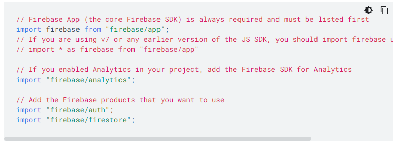

># Nomadcoder

- [노마드코더 : 트위터 클론 수업](https://nomadcoders.co/nwitter)
- 노마드코더님의 강의를 들으면서 공부한 내용을 정리하는 용도로 작성되었으며, 본내용이 틀릴 수 도 있습니다.

<br>

># Firebase

- [Firebase Site](https://firebase.google.com/?hl=ko)
- Firebase는 그냥 데이터베이스 였음, 구글에 속하지도 않았다가 구글에 인수되면서 확장되었음
- 이 프로젝트에서는 Firebase를 통해서 데이터 베이스이자 백엔드인 `Cloud Firestore`를 사용함(데이터베이스 관련 코드없이 데이터베이스를 사용하게 해줌!)
  - [Cloud Firestore : Detail](https://firebase.google.com/docs/firestore/data-model?hl=ko)

<br>

- [Fireabase : products](https://firebase.google.com/products-build?hl=ko)
  - `Firebase ML` : 머신러닝 기능 제공 
  - `Cloud Functions` : serverless function 기능 제공 (AWS, Lamda 같은것임)
  - `Cloud Storage` : 기본적으로 파일 업로드의 기능을 해줌 (AWS의 S3와 비슷함)
  - `Hosting` : assets들을 배포하려 하거나 , React Application을 배포하고자 한다면 hosting을 사용할 수 있음
  - `Authentication` : 제일 중요한 기능으로서 인증을 구현해 줌
  - `Realtime Database` : 원래의 Firebase database로서 Realtime database임
  - `Analytics 분야` : Crashlytics(application 충돌 확인), Perfromance Monitoring(app 성능 확인), Test Lab(웹사이트를 각종 기기별로 테스트 하게 해줌), App Distribution(ios, android 버전 배포 도와줌)
  - 그 외에도 엄청 많음

<br>

- AWS Amplify
  - firebase의 경쟁상대로 기능은 비슷하지만 GraphQL API, REST API, Push Notification, Interaction 등도 지원함
  - 근데, firebase가 더 오래되었고 커뮤니티도 훨씬 많이 활성화 되어 있음 (기능적으로 Amplify가 좋긴하지만 접근하기에는 firebase가 자료가 많아서 이 프로젝트에서 사용함)

<br>
<br>
<br>

>## Firebase를 사용하는 기준

- Firebase는 아주 빠르게 무언가를 시작할 수 있도록 도와줌
- 시간 투자 없이 중요한 백엔드 기능들인 인증, 파일 업로드, 데이터 CRUD 등 진입이 쉬움
- 하지만, 실 프로젝트에서는 쓰지 않음 왜냐하면 database가 자신의 서버의 것이 아니고 그외에도 사용자, 서버 등의 독립이 어려움
- Firebase, Amplify는 프로토타입을 만들어 아이디어를 테스트 하고자 할때 적합함(빠르게 시장의 반응을 볼수 있고, 백엔드를 구성하는데 드는 시간과 비용을 절약)
- 나중에 사용자가 원하고 아이디어가 좋을 때는 본격적인 서비스를 만들어 사용하면 됨(비즈니스 구상 단계시 사용)

<br>

>## Firebase 가격 정책

- [Firebase : 가격 정책](https://firebase.google.com/pricing?hl=ko)
- 무료로 지원하는 용량 및 횟수등이 존재하는데 그 이상으로 넘어가면 종량제 요금제로 해서 돈을 지불해야 함
- 하지만, 그렇게 부담 되는 가격은 아님 

<br>
<br>
<br>

># 프로젝트를 위한 환경설정 (SET UP)

- React 환경설정
  - `npx create-react-app appname` -> react frame 만들기
  - React 초기 환경설정 (필요한 것만 남기기)

  

<br>

- FIrebase 환경설정
  - firebase console 들어가기 - 프로젝트 생성 - 애널리틱스 체크 X - Continue
  - 플랫폼 선택(앱 추가하여 시작하기 - 웹 선택) - App 이름 넣고 hosting은 나중에 설정 
  - Firebase SDK 추가 - Web SDK API Reference (하단 링크) - CDN, npm package, Bower package 중 CDN 선택(콘텐츠 전송 네트워크) - 모듈 번들러로 사용하는 방법 
  - `npm install --save firebase` 
  - SDK script는 추가해줘야 함 그래서 src 폴더에 `firebase.js` 파일 만들고 `config`랑 initialize (`export default firebase.initializeApp(firebaseConfig);`)시키는 코드를 복붙 해줌
  - 그리고 설치한 패키지와의 연결을 위해서 import가 필요함 `import firebase from "firebase/app";`
  - `index.js`에 해당 파일 import하기 `import firebase from './firebase.js'`, 그리고 firebase console에 찍어 보기

- `npm run start` 로 서버 구동해 확인해 보기

<br>

- 사용하고 싶은게 있으면 아래 처럼 import해서 사용하면 됨



<br>
<br>
<br>

># Firebase API key 보안

- dir에 직접적(최상위 dir)으로 `.env` 파일을 만들어 환경변수들을 저장 할 수 있음 
  - creat-react-app을 사용해서 app을 만들었다면, 환경변수를 따로 보관시에 접두사로 `REACT_APP_'something'`을 붙여줘야함 

```
//.env

REACT_APP_API_KEY=code
REACT_APP_AUTH_DOMAIN=code
REACT_APP_PROJECT_ID=code
REACT_APP_STORAGE_BUCKET=code
REACT_APP_MESSAGING_ID=code
REACT_APP_APP_ID=code
```

``` js
// firebase.js
import firebase from "firebase/app";

const firebaseConfig = {
    apiKey: process.env.REACT_APP_API_KEY,
    authDomain: process.env.REACT_APP_AUTH_DOMAIN,
    projectId: process.env.REACT_APP_PROJECT_ID,
    storageBucket: process.env.REACT_APP_STORAGE_BUCKET,
    messagingSenderId: process.env.REACT_APP_MESSAGING_ID,
    appId: process.env.REACT_APP_APP_ID
  };

  export default firebase.initializeApp(firebaseConfig);
```

- **이것으로 보안이 끝난 것은 아니고 그냥 ignore에 .env를 올려서 github에 안올라가게 하는 것일 뿐 마지막 배포 전에 보안을 다룰 것이라고 함.**
- 어차피 배포시에는 모든 코드가 올라가기 때문에 사용자가 접근을 못하게 막아야 함


<br>
<br>
<br>

># Router Setup

- `src`폴더 안에 `components`폴더, `routes` 만들기 -> component 폴더안에 `App.js` 파일 옮기기 (index.js에 import path 수정할 것 물론, 옮길때 뜨는 알림에 yes하면 저절로 바뀜)

<br>

- routes에 `route` 만들기 (각 연결될 작은 부분 들)
  - Autentication (인증) 로그인 부분
  - Home
  - Profile
  - Edit profile

<br>

- **Route 형식**

``` js
import React from 'react';

const Auth = () => <span>Auth</span>;  
export default Auth ;
// 이런식으로 익명함수 말고 이름있는 함수로 사용해줘야 나중에 router에 import 할때 편함(특정 route 사용시 자동으로 path를 import 해줌)
```

<br>

- **Router 만들기**
  - `npm i react-router-dom` 설치
  - [react-router-dom 사이트](https://reactrouter.com/web/guides/quick-start)
  - components에 Router.js 만들기 (Route를 하나로 묶을 커다란 Router)
  - 삼항 조건 연산자를 사용해서 path가 `/` 인 경우에 isLoggedIn의 상태에 따라서 다르게 render 하도록 하였다.
  - Route에서 `exact path`는 다른 queryString 및 pathname 들어가는 것을 인식하게 하지 못하게 함이다.
    - `exact path`는 무조건 같아야 하는 것이고 `path`의 경우에는 해당 문자가 **포함되는 경우**의 url은 모두 render 시킨다.

<br>  

  - `Switch` 는 에러 발생시 notfound page 구현을 위해서 있다.
    - [<Switch>는 언제 써야 할까? : by baeharam](https://baeharam.netlify.app/posts/react/why-switch-is-needed) 
    - 기존의 route의 경우에는 에러 발생시 notfound의 path가 없어 그냥 render가 되어버린다. 
    - 하지만 Switch를 사용하는 경우  첫번째로 path가 match하는 경우의 그 요소만 render 하기 때문에 위에서 match가 안되면 마지막의 path가 없는 notfound가 render가 되는 것이라고 한다.
  
``` js
import React, {useState} from 'react';
import {HashRouter as Router, Route, Switch} from "react-router-dom";
import Auth from '../routes/Auth'; 
import Home from '../routes/Home';

const AppRouter = () => {
    const [isLoggedIn, setIsLoggedIn] = useState(false);
    return (
        <Router>
            <Switch>
                {isLoggedIn ? (
                    <>
                    <Route exact path="/">
                        <Home />
                    </Route>
                </> 
                ) : (
                    <Route exact path="/">
                        <Auth />
                    </Route>
                )}
            </Switch>
        </Router>
    )
}

export default AppRouter; 


// <> : Fragment 인데 부모요소가 없을 때  많은 요소들을 render 하고 싶을 때씀
```