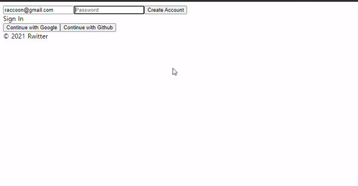

># Nomadcoder

- [노마드코더 : 트위터 클론 수업](https://nomadcoders.co/nwitter)
- 노마드코더님의 강의를 들으면서 공부한 내용을 정리하는 용도로 작성되었으며, 본내용이 틀릴 수 도 있습니다.

<br>

># Creating Account

## Provider 

- [Auth provider](https://firebase.google.com/docs/reference/js/firebase.auth.AuthProvider)
- [EmailAuthProvider](https://firebase.google.com/docs/reference/js/firebase.auth.EmailAuthProvider)
- [createuserwithemailandpassword](https://firebase.google.com/docs/reference/js/firebase.auth.Auth#createuserwithemailandpassword)
  - : 사용자의 새로운 계정을 생성 할수 있게 email, password를 받아 User Account를 생성시키고 바로 로그인 하며, 나중에 Account를 가지고 로그인 할 수 있음 (계정이 이미 존재하거나, 타당하지 않은 값인 경우 fail을 return)

<br>

- `newAccount`라는 useState를 사용한 hook을 생성해서 Account를 가지고 있는지 확인해서, newAccount 가 필요한 경우 true ruturn 하게 만듦
- `submit` 버튼이 눌린 경우 `onSubmit` 함수에서 `createUserWithEmailAndPassword` 함수를 사용할 경우 해당 함수는 promise를 반환하기 때문에 async를 걸어 준다. 그리고 newAccount hook의 상태에 따라서 create할건지 login을 할건지 조건을 걸어 실행 하게 된다. 그리고 해당 함수가 return 하는 promise를 data 변수에 담아 console.log에 찍어 봄으로써 어떤 데이터를 가지고 있는지 확인할 수 있다. 그리고 try 문, catch를 사용하여 error 처리를 할수 있다.
- 그리고 jsx 부분에서는 submit 버튼에 삼항연산자를 통해서 Account의 상태에 따라서 버튼 표시 글자가 log in 인지 Creat new Account인지 표시 됨

``` js
import { authService } from 'fBase';
import React, { useState } from 'react';

const Auth = () => {
    const [email, setEmail] = useState("");
    const [password, setPassword] = useState("");
    const [newAccount, setNewAccount] = useState(true); // Account를 가지고 있는지 확인해서, newAccount 가 필요한 경우 true 
    const onChange = (event) => {
        const {target: {name, value}} = event;
        if(name === "email") {
            setEmail(value)
        } else if (name === "password") {
            setPassword(value)
        }
    }
    const onSubmit = async (event) => { // createUserWithEmailAndPassword는 promise를 return 하기 때문에 async로 비동기화 시킴
        event.preventDefault();
        try {
            let data;
            if(newAccount) { // newAccount의 상태에 따라서 받은 input을 submit의 method로 계정 생성에 쓸건지, 로그인에 쓸건지 조건을 주고 있다.
                data = await authService.createUserWithEmailAndPassword(email, password);
            } else {
                data = await authService.signInWithEmailAndPassword(email, password);
            }
            console.log(data);
        } catch(error) {
            console.log(error);
        }
    };
    return (
    <div>
        <form onSubmit={onSubmit}>
            <input name="email" type="email" placeholder="Email" required value={email} onChange={onChange}/>
            <input name="password" type="password" placeholder="Password" required value={password} onChange={onChange}/>
            <input type="submit" value={newAccount ? "Create Account" : "Log In"} /> 
        </form>
        <div>
            <button>Continue with Google</button>
            <button>Continue with Github</button>
        </div>
    </div>
    );
}
export default Auth ;
```

<br>

- 이렇게 하여 Account를 만들면, firebase 사이트 console의 Authentication - user에서 사용자의 Account를 확인할 수 있다.
  
<br>
<br>
<br>


## setPersistence

- [Auth_setPersistence](https://firebase.google.com/docs/reference/js/firebase.auth.Auth#setpersistence)
- [Auth_Persistence Options](https://firebase.google.com/docs/reference/js/firebase.auth.Auth#persistence_1)
  - 사용자를 어떻게 기억할 것인지 선택할 수 있게 도와줌
    - web browser, react-native는 default 값이 local 되어 있음
    - local : web browser window가 닫혀도 사용자 정보를 기억함
    - session : web browser window가 닫히면 사용자 정보를 clear 함
    - none : web browser 말고 tab이 닫히면 사용자 정보를 clear 함 (새로고침 하면 저장값이 없어짐)

<br>

- 일단 기본적으로, Account를 만들면 바로 로그인이 되는데 이는 `브라우저 dev tool - Application - indexedDB - firebaselocalStorageDb - localStorage` 에서 user 정보를 확인 할 수 있다. 

<br>
<br>
<br>

># Log in

## onAuthStateChanged 개념

- 현재 curent user를 가져오는데 시간이 걸리기 때문에 아무리 user data가 browser에 있더라도 처음에는 인식하지 못하고 시간이 지나야 인식하기 시작 함 그래서 curent user를 인식할 때 화면이 표시 되어야 함. 표시되는 때를 Application이 초기화(인식) 되어 render가 된것을 표기해줘야 함

- [onAuthStateChanged](https://firebase.google.com/docs/reference/js/firebase.auth.Auth#onauthstatechanged)
  - event listener 처럼 event를 계속 듣기 위해 대기 하고 있고, 유저 상태에 변화가 있을 때(localstageDB) 그 변화를 알아 차리게 됨
  - 유저가 로그아웃 시에, 계정 생성시에도, firebase가 초기화 될 때도 실행 함으로서 로그인이 되는 순간도 알아 차리게 됨
  - `onAuthStateChanged ( nextOrObserver :  Observer < any > | ( ( a :  User | null ) => any ) ,  error ? :  ( a :  Error ) => any ,  completed ? :  firebase.Unsubscribe ) : firebase.Unsubscribe`

<br>

## onAuthStateChanged 활용

- `useEffect`를 통해서 DIdmount를 구현하는데 앞에서 init, isLoggedIn은 초기 셋팅으로 false 값으로 세팅이 시켜 user 를 인식 하기 전까지 사용자가 접근하는 것을 막는다. 
- 그리고 user가 인식 되었을 때 사용자가 접근시킬 수 있도록 `useEffect` 안에 `onAuthStateChanged`를 통해서 user 인식을 듣고 있는 상태에서 user가 발견 되면 `setIsLoggedIn`으로 `true`로 , 아니면 `false`로 설정하고
- user 상태가 결정 나면  `setInit`을 통해서 true로 설정 시켜 user가 있는지 없는지 판명이 났고 모든 것이 render가 되었으니 써도 좋게 해당하는 화면을 보이게 설정할 것이다.

<br>

- JSX 부분에서 `init`상태를 가지고 삼항 연산자를 통해서 `Home or Auth`을 띄울지 아니면 아직도 `초기화 중`인지를 띄울지 조건을 준다.

``` js
import React, {useEffect, useState} from 'react';
import AppRouter from 'components/Router';
import { authService } from "fBase";


function App() {
  const [init, setInit] = useState(false); 
  // 처음에는 false이고 나중에 사용자 존재 판명이 모두 끝났을 때 true를 통해 해당 화면을 render
  const [isLoggedIn, setIsLoggedIn] = useState(false); 
  useEffect(() => {
    authService.onAuthStateChanged((user) => { // user 판명을 듣고 
      if(user) { // 있으면
        setIsLoggedIn(true); // 로그인 됨
      } else {
        setIsLoggedIn(false); // 로그인 안됨
      }
      setInit(true); // user 판명 끝
    });
  }, [])
  
  return (
    <>
    {init ? <AppRouter isLoggedIn={isLoggedIn}/> : "Initializing..." }
    <footer>&copy; {new Date().getFullYear()}  Rwitter </footer>
    </>
  );
}

export default App;

```

<br>
<br>
<br>

## AppRouter 처리

- 그래서 user 판명이 끝나 화면을 띄울 때는 isLoggedIn값을 `AppRouter`에 보내어 Home 또는 Auth 창을 띄울지 `AppRouter`가 결정하게 된다.
- 그래서 user : non-null -> isLoggedIn : true 되고 render가 허용 되고 Router에서 로그인이 확인 되고 Home component 띄우게 됨
- user : null (null은 연산에서 false 임)-> isLoggedIn : false 되고 render 가 허용 되고 Router에서 로그인 또는 계정을 만들라는 Auth component으로 연결 시킴 

``` js
import React from 'react';
import {HashRouter as Router, Route, Switch} from "react-router-dom";
import Auth from 'routes/Auth'; 
import Home from 'routes/Home';

const AppRouter = ({isLoggedIn}) => {
    return (
        <Router>
            <Switch>
                {isLoggedIn ? (
                    <>
                    <Route exact path="/">
                        <Home />
                    </Route>
                </> 
                ) : (
                    <Route exact path="/">
                        <Auth />
                    </Route>
                )}
            </Switch>
        </Router>
    )
}

export default AppRouter; 
```

<br>
<br>
<br>

## Auth 처리

- user가 없어 Auth component를 render 하는 경우  `newAccount`는 `onSubmit`에서 계정 생성을 할지 로그인을 할지 결정하는 지표가 된다. newAccount는 버튼으로서 사용되기 때문에 true인 경우에는 계정 생성을 하는 것이고, false이면 로그인을 하는 것이다.
- 그러면 해당 버튼 상태를 제어하기 위해서 `toggleAccount`라는 함수를 만들어 해당 newAccout의 반대 값을 return하게 만들어 준다.
- 이를 통해서 `<span onClick={toggleAccount}>{newAccount ? "Sign In" : "Create Account"}</span>` 로 활용하여 sign in으로 이동하거나, Create Account로 이동하거나 컨트롤 할 수 있다. 예를 들어 현재 상태가 계정을 만드는 newAccount true 이면 toggle을 눌러 newAccount를 false로 변화 시켜  Sign in 상태로 만들 수 있는 것이다.
- 그리고 newAccount 값에 따라서 버튼과 반대로 글자를 표시하게 시켜 생성상태면, 로그인으로 갈수 있게 표시하고, 로그인 해야하는 상황이면 계정생성을 표시하여 해당 토글을 누르면 변화시키게 함.

- 추가적으로 error라는 useState를 만들어서 `setError`를 통해서 onsubmit에 대한 error message를 받아 jsx에서 `{error}`를 통해서 error 발생시 error 내용을 화면에 표시해줄 수 있게 한다.

``` js
import { authService } from 'fBase';
import React, { useState } from 'react';

const Auth = () => {
    const [email, setEmail] = useState("");
    const [password, setPassword] = useState("");
    const [newAccount, setNewAccount] = useState(true);
    const [error, setError] = useState("");
    const onChange = (event) => {
        const {target: {name, value}} = event;
        if(name === "email") {
            setEmail(value)
        } else if (name === "password") {
            setPassword(value)
        }
    }
    const onSubmit = async (event) => {
        event.preventDefault();
        try {
            let data;
            if(newAccount) {
                data = await authService.createUserWithEmailAndPassword(email, password);
            } else {
                data = await authService.signInWithEmailAndPassword(email, password);
            }
            console.log(data);
        } catch(error) {
            setError(error.message);
        }
    };
    const toggleAccount = () => {
        setNewAccount((prev) => !prev)
    } 

    return (
    <div>
        <form onSubmit={onSubmit}>
            <input name="email" type="email" placeholder="Email" required value={email} onChange={onChange}/>
            <input name="password" type="password" placeholder="Password" required value={password} onChange={onChange}/>
            <input type="submit" value={newAccount ? "Create Account" : "Sign In"} />
            {error}
        </form>
        <span onClick={toggleAccount}>{newAccount ? "Sign In" : "Create Account"}</span>
        <div>
            <button>Continue with Google</button>
            <button>Continue with Github</button>
        </div>
    </div>
    );
}
export default Auth ;
```

<br>
<br>
<br>

## 계정 생성 & 로그인

- 이미 계정은 만들어 둔 상태이고, 기존 계정을 구분하는 지 알아보고 로그인 함


