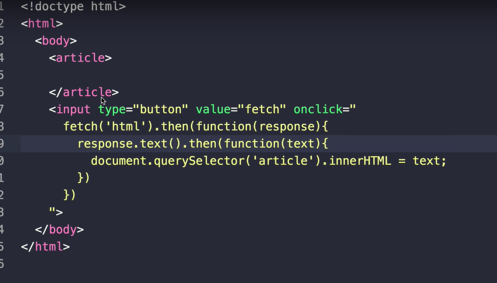

># Nomadcoder

- [노마드코더 : 트위터 클론 수업](https://nomadcoders.co/nwitter)
- 노마드코더님의 강의를 들으면서 공부한 내용을 정리하는 용도로 작성되었으며, 본내용이 틀릴 수 도 있습니다.

<br>

># Getting the Rweets

- rweet useState가 값을 입력하여 Database에 넣는 것이라면, rweets useState는 Database에서 값을 가져오기 위한 useState이다.
  - `rweets`는 빈 배열 형식을 띄고 있다. 그렇기 때문에 database collection의 Document를 하나씩 가져와서 배열안에 넣어 저장하고 화면으로 불러올 것이다.
- database에서 document를 가져오기 위해서는 collection에서 get method를 사용한다.

<br>

## Database에서 data를 가져오는 함수(firebase)

- [**<span style="color: blue">Firestore()</span>**](https://firebase.google.com/docs/reference/js/firebase.firestore.Firestore)
    - [**<span style="color: blue">Collection(collectionPath :  string ) : CollectionReference < DocumentData ></span>**](https://firebase.google.com/docs/reference/js/firebase.firestore.Firestore#collection) : collection 이름 넣어서 해당 이름의 collectionReference object return
      - [**<span style="color: blue">CollectionReference</span>**](https://firebase.google.com/docs/reference/js/firebase.firestore.CollectionReference) : collection object로서 이것을 가지고 할 수 있는 method를 가지고 있음
        - [**<span style="color: blue">get(options ? :  GetOptions ) : Promise < QuerySnapshot < T > </span>**](https://firebase.google.com/docs/reference/js/firebase.firestore.CollectionReference#get) : 해당 collection의 결과로 QeurySnapshot promise를 return
          - [**<span style="color: blue">QuerySnapshot</span>**](https://firebase.google.com/docs/reference/js/firebase.firestore.QuerySnapshot) QuerySnapshot은 DocumentSnapshot object들을 가지고 있음 (query 결과값) documents 는 array를 통해서 접근 가능한데 docs property 또는 forEach method를 통해서 가져올 수 있다.
            - [**<span style="color: blue">forEach( callback :  ( result :  QueryDocumentSnapshot < T > ) => void ,  thisArg ? :  any ) : void</span>**](https://firebase.google.com/docs/reference/js/firebase.firestore.QuerySnapshot#foreach) : forEach를 통해서 Array에 접근하여 callback 함수를 통해 QueryDocumentSnapshot에 접근 가능하다.
              - [**<span style="color: blue">QueryDocumentSnapshot</span>**](https://firebase.google.com/docs/reference/js/firebase.firestore.QueryDocumentSnapshot) : `QueryDocumentSnapshot`은 database의 document로 부터 읽은 data를 가지고 있음. `data()`, `.get(<field>)`를 통해서 특정 필드를 가져올 수 있음 (존재하는 document인 경우만 가져오기 때문에 undefined가 절대로 return되지 않음)

<br>

- forEach를 통해서 `rweetObject`에 [**<span style="color: blue">Spread Syntax</span>**](https://developer.mozilla.org/ko/docs/Web/JavaScript/Reference/Operators/Spread_syntax)을 통해서 배열, 문자열, 객체 등을 전개 시켜서 나열하여 함수인자 또는 배열 및 객체 내에서 자유롭게 사용 가능함 
  - `배열복사`, `객체병합01`(같은 객체에서 전개시 그 객체에 propeties가 전개되고 같은 이름은 덮어 씌워짐), `객체병합02`(함수로 객체를 인자로 받아서 전개식으로 추가되는 경우 각 객체가 모양을 유지한체 새로운 객체 안에 들어가는 형태, 각 property가 index num으로 자동으로 가지게 됨)

<br>

- [**<span style="color: blue">React : useState , prevState</span>**](https://ko.reactjs.org/docs/hooks-reference.html#usestate)
- setRweets를 통해서 반영된 rweets는 rweetObject를 가지게 됨 (즉, document를 하나씩 가지는 Array 형태가 됨)
- 그리고 rweets를 가지고 jsx부분에서 `map`을 통해서 각 object를 가져와 div로 만들어 보여줌

``` js
import { dbService } from 'fBase';
import React, { useEffect, useState } from 'react';

const Home = () => {
    const [rweet, setRweet] = useState("");
    // database에서 data를 가져오기 위한 useState
    const [rweets, setRweets] = useState([]);
    
    const getRweets = async () => {
        const dbRweets = await dbService.collection("rweets").get();
        
        dbRweets.forEach(document => {
            // document data를 하나씩 가져와서 객체병합01처럼 들어가서 합쳐짐
            const rweetObject = {
                ...document.data(), 
                id: document.id,
            }
            setRweets(prev => [rweetObject, ...prev]);   
            // 함수를 넣어주면 리액트는 이전 값에 접근 가능하게 해줌 (그런데 자동으로 합쳐지지는 않음)
        });
    }
    
    useEffect(() => {
        getRweets();
    }, [])
    
    const onSubmit = async (event) => {
        event.preventDefault();
        await dbService.collection("rweets").add({ // add가 promise를 return
            rweet,
            createdAt: Date.now(),
        })
        setRweet("");
    };
    const onChange = (event) => {
        const { target: {value}} = event;
        setRweet(value);
    }; 
    
    return (
    <div>
        <form onSubmit={onSubmit}>
            <input value={rweet} onChange={onChange} type="text" placeholder="What's on your mind?" maxLength={120} />
            <input type="submit" value="Rweet" />
        </form>
        <div>
            {rweets.map((rweet)=> (
            <div key={rweet.id}>
                <h4>{rweet.rweet}</h4>
            </div>
            ))
            } 
        </div>
    </div>
    ); 
}; 

    
export default Home; 
```

<br>
<br>
<br>

># Realtime Rweets

- 트윗한 사용자 정보 넣고 받아오기
- query가 아니고 snapshot을 사용했기 때문에 실시간이 가능함

- 기존의 `get`을 활용한`forEach` 방법은 구식이고 실시간이 아니라서 database에 넣으면 redirect를 시켜줘야 화면에 반영이 되어 표시됨

<br>

## 실시간으로 업데이트 하기

- [**<span style="color: blue">onSnapshot ( observer :  { complete ?: ( ) => void ; error ?: ( error :  FirestoreError ) => void ; next ?: ( snapshot :  QuerySnapshot < T > ) => void } ) : ( ) => void</span>**](https://firebase.google.com/docs/reference/js/firebase.firestore.CollectionReference#onsnapshot) : listener 형식으로 한번 호춠시키면 callback이 곧바로 해당 contents를 가진 document snapshot을 만들고 content가 변할때 마다 다른 호출이 document snapshot을 업데이트 함
- [**<span style="color: blue">실시간 업데이트 가져오기</span>**](https://firebase.google.com/docs/firestore/query-data/listen?hl=ko#web_6)

```js
import { dbService } from 'fBase';
import React, { useEffect, useState } from 'react';

const Home = ( {userObj} ) => {
    const [rweet, setRweet] = useState("");
    const [rweets, setRweets] = useState([]);
    // 실시간 업데이트 (onSnapshot)
    useEffect(() => {
        dbService.collection("rweets").onSnapshot(snapshot => {
            const rweetArray = snapshot.docs.map(doc => ({
                id: doc.id,
                ...doc.data()
            }));
            setRweets(rweetArray);
        });
    }, [])
    const onSubmit = async (event) => {
        event.preventDefault();
        await dbService.collection("rweets").add({ 
            text: rweet,
            createdAt: Date.now(),
            creatorId: userObj.uid, // user id를 넣음
        })
        setRweet("");
    };
    const onChange = (event) => {
        const { target: {value}} = event;
        setRweet(value);
    }; 
    return (
    <div>
        <form onSubmit={onSubmit}>
            <input value={rweet} onChange={onChange} type="text" placeholder="What's on your mind?" maxLength={120} />
            <input type="submit" value="Rweet" />
        </form>
        <div>
            {rweets.map((rweet)=> (
            <div key={rweet.id}>
                <h4>{rweet.text}</h4>
            </div>
            ))
            } 
        </div>
    </div>
    ); 
}; 

    
export default Home; 
```

<br>
<br>
<br>

## 유저 아이디 데이터 베이스에 넣기

- userid의 경우 app부분의 로그인 처리시 user을 가져와서 router component에 보내고, router component 에서는 home component로 보낸다.

### App.js

``` js
import React, {useEffect, useState} from 'react';
import AppRouter from 'components/Router';
import { authService } from "fBase";


function App() {
  const [init, setInit] = useState(false); // 처음에는 false이고 나중에 사용자 인식이 모두 끝났을 때 true를 통해 해당 화면을 render
  const [isLoggedIn, setIsLoggedIn] = useState(false); 
  const [userObj, setUserObj] = useState(null);
  useEffect(() => {
    authService.onAuthStateChanged((user) => {
      if(user) {
        setIsLoggedIn(true);
        setUserObj(user);
      } else {
        setIsLoggedIn(false);
      }
      setInit(true);
    });
  }, [])
  
  return (
    <>
    {init ? <AppRouter isLoggedIn={isLoggedIn} userObj={userObj} /> : "Initializing..." }
    <footer>&copy; {new Date().getFullYear()}  Rwitter </footer>
    </>
  );
}

export default App;
```

### Router.js

``` js
import React from 'react';
import {HashRouter as Router, Redirect, Route, Switch} from "react-router-dom";
import Auth from 'routes/Auth'; 
import Home from 'routes/Home';
import Profile from 'routes/Profile';
import Navigation from 'components/Navigation';

const AppRouter = ({isLoggedIn, userObj}) => {
    return (
        <Router>
            {isLoggedIn && <Navigation />}
            <Switch>
                {isLoggedIn ? (
                    <>
                    <Route exact path="/">
                        <Home userObj={userObj} />
                    </Route>
                    <Route exact path="/profile">
                        <Profile />
                    </Route>
                    <Redirect from="*" to="/" />
                    </> 
                ) : (
                    <>
                    <Route exact path="/">
                        <Auth />
                    </Route>
                    <Redirect from="*" to="/" />
                    </>
                )}
            </Switch>
        </Router>
    )
}

export default AppRouter; 
```

<br>
<br>
<br>


># Ajax (Asynchronous Javascript And Xml)

- firebase, react를 적용해서 서버통신을 하면서 서버통신에 대한 가려움이 존재했다. 다른 서버와 통신 할때는 어떻게 해야하고 연동을 시켜야 하는가라는 생각이 들기 시작했고 그 동안 그냥 이런거구나 하고 넘어 갔던 부분에 대해서 자세히 알고 싶어 졌다. 그래서 생활코딩님의 AJAX 수업을 들으면서 점검도하고 생활코딩님 만의 그 본질적인 코딩 수업이 듣고 싶어 졌다. 

<br>

- [생활코딩 : WEB-Ajax 수업](https://opentutorials.org/course/3281/20435)
  - 생활코딩님의 수업을 듣고 작성하였다.

## AJAX 개념과 목적

- 웹페이지의 정보를 부분적으로 변경하는 것으로서 부분적으로 리로딩 없이 웹브라우저가 서버통신을 통해서 부분적으로 정보를 가져오는 것을 말함. 예) 추천 검색어
  - 페이지 리로딩시 사용자의 관심이 분산됨
  - 서버입장에서도 모든 정보를 다시 전송하는것은 비효율적임
- **필요한 정보만을 부분적으로 낚아내어 서버는 지출을 줄여주고 사용자에게는 좋은 경험을 선사함**

<br>

- **`정적인 페이지`** 에서는 링크를 눌러 페이지 이동시 url이 변화하고 dev tool - network에서 모든 파일을 받게됨 (상상을 하면 엄청나게 큰 프로젝트 및 정보일 경우 엄청난 비효율성이 생김)
- **`동적인 페이지(AJAX)`** 를 적용하는 경우 url 변화가 없고 dev tool - network에서는 해당 부분을 표시하는 내용이 담긴 파일만 추가됨(즉, 필요할 때 그때만 통신을 통해서 받아옴)
- **상상력을 더해서 페이지 전환 없이 부분적으로 내용을 변경하면 사용자 입장에서는 스크롤이 바뀌거나 다른 부분의 변경 없이 변경되는 부분만 바뀌므로 사용성이 증대 됨, 서버 뿐만 아니라 사용자 입장에서도 시간과 돈과 네트워크 자원을 아낄수 있음**

<br>

## SPA

- 기본적인 index html을 재사용 함과 동시에 바뀔수 있는 부분(본문, 글목록, 등..)만 AJAX로 부분적으로 변경해주면 기본 틀인 index html만 변경해줘도 엄청나게 많은 모든 파일들이 반영이 되기 때문에 폭발적인 효율성을 보여준다. -> 이런 형식을 가진 application을 SPA라고 함
- SPA : Single-Page Application

<br>

## fetch API

- fetch API는 AJAX의 서버 통신 방법중 하나이다.



- `fetch('path')` : client가 server에게 해당 path의 파일을 가져다 줘 라고 요청
- `then(callback)`: 데이터를 받아오는데 걸리는 시간이 있어서 다른일을 할수 있게 promise의 then을 사용하고 fetch가 끝나면, callback 함수를 실행시키라고 약속하는 것임(Asynchronous) 또는 익명함수도 가능 
- `response` : response 객체 (fetch를 통해서 요청했을때 서버가 응답한 결과를 담고 있는 객체)
- 신기한것은 `onClick` 이벤트 핸들러의 경우 html에서도 바로 `""`안에 js코드를 넣어도 동작한다는 것

