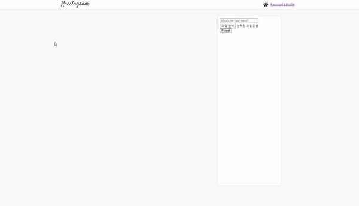

> # Nomadcoder

- [노마드코더 : 트위터 클론 수업](https://nomadcoders.co/nwitter)
- 노마드코더님의 강의를 들으면서 공부한 내용을 정리하는 용도로 작성되었으며, 본내용이 틀릴 수 도 있습니다.

<br>

> # useEffect error

```
Warning: Can't perform a React state update on an unmounted component.
This is a no-op, but it indicates a memory leak in your application.
To fix, cancel all subscriptions and asynchronous tasks in a useEffect cleanup
```

- [참고한 사이트 : router 이동시 메모리 lack 에러 (by 기억보다 기록을)](https://kyounghwan01.github.io/blog/React/cant-perform-a-React-state-update-on-an-unmounted-component/#%E1%84%87%E1%85%A1%E1%86%AF%E1%84%89%E1%85%A2%E1%86%BC-%E1%84%8B%E1%85%B5%E1%84%8B%E1%85%B2)

- [참고한 사이트 : 리액트의 Hooks 완벽 정복하기 (by velopert) ](https://velog.io/@velopert/react-hooks)

- 해당 에러의 경우에는 비동기 처리과정 이나, router 이동후 이동전의 component에서 state를 바꾸려고 하는 경우라고 한다.
- 아직 자세히 읽어 보지는 않고 진도를 나가기 위해서 해결책만 일단 써보았다.
- 그냥 useEffect에서 return시에 unmount를 관리하는데 이때 cleanup function을 써줘야 한다고 한다.

```js
const Home = ({ userObj }) => {
	const [rweets, setRweets] = useState([]);

	useEffect(() => {
		const getData = dbService
			.collection('rweets')
			.orderBy('createdAt', 'desc')
			.onSnapshot((snapshot) => {
				const rweetArray = snapshot.docs.map((doc) => ({
					id: doc.id,
					...doc.data(),
				}));
				setRweets(rweetArray);
			});
		return () => {
			getData();
		};
	}, []);
```

- 이렇게 했더니 되긴했다. 근데 왜 ? 고쳐졌는지는 잘 이해를 못해서 내일 알아볼 예정

<br>
<br>
<br>

> # fontawesome

- [fontawesome 사이트](https://fontawesome.com/)
- 여러가지 icon을 제공하고 있으며 react에서 편하게 사용할 수 있다.
- npm을 통해서 설치 가능하고 사용하기도 쉽다.

## loading component 에서 사용

- 설치
  - nico 쌤이 설치하신 것 처럼 해당 패키지를 npm을 통해서 설치했다.

```json
    "@fortawesome/fontawesome-free": "^5.15.3",
    "@fortawesome/fontawesome-svg-core": "^1.2.35",
    "@fortawesome/free-brands-svg-icons": "^5.15.3",
    "@fortawesome/free-regular-svg-icons": "^5.15.3",
    "@fortawesome/free-solid-svg-icons": "^5.15.3",
    "@fortawesome/react-fontawesome": "^0.1.14",
```

<br>

- 직접 찾아가면서 사용해 보았는데 편리하다. 이렇게 fontAwesomeIcon 이라는 component를 사용할수 있고 특정 icon을 사용하려면 icon의 이름을 알아야 한다.
- react가 아닌 일반적으로 사용하는 경우에는 class로 특정 icon 값을 줌으로써 작동하는데, react에서는 component icon prop에 이름 값을 주면 된다.
- 이름 값은 사이트에서 icons를 눌러 확인하면 된다.
- 좋은점은 무료 브랜드 icon이 많다. 그래서 클론 코딩시에 유용하다. 그 외에도 버튼을 보통 icon으로 표시하기 때문에 이때 유용함

```js
import React from "react";
import { FontAwesomeIcon } from "@fortawesome/react-fontawesome";
import { faInstagram } from "@fortawesome/free-brands-svg-icons";

const Load = () => {
  return (
    <>
      <div className="load_container">
        <h2 className="load_title">Racstagram</h2>
        <div className="icon_insta">
          <FontAwesomeIcon
            className={"fa-spin"}
            icon={faInstagram}
            size={"10x"}
          />
        </div>
      </div>
    </>
  );
};

export default Load;
```

<br>
<br>
<br>

> # Instagram CSS

- 원래는 트위터 이지만 창의력을 발휘해서 instagram CSS로 만들어 보기로 했다.
- 현재 loading, home 화면의 대략적인 구조 정도 완성시켰다.
- 구글 폰트로 instaram과 비슷한 서체로 logo를 만들었고, Racstagram으로 해놓았다.

<br>


