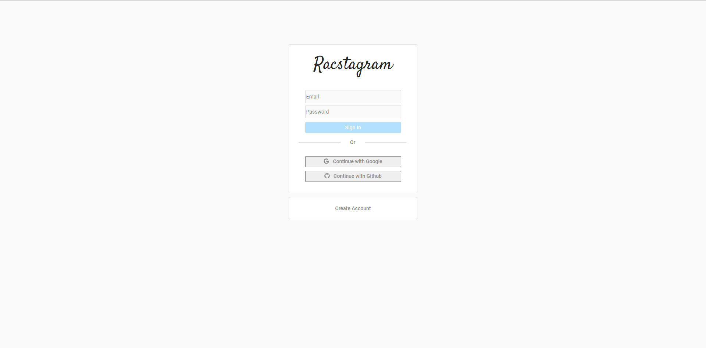
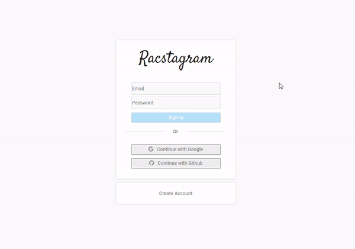
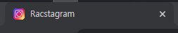
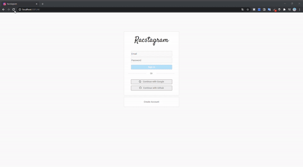

> # Nomadcoder

- [노마드코더 : 트위터 클론 수업](https://nomadcoders.co/nwitter)
- 노마드코더 수업을 거의다 듣고 CSS 작업은 내가 하고 싶은 대로 하고 있음, 트위터 수업이지만 instagram으로 만들고 있음

<br>

> # CSS 작업

- 일단, 각 유저의 photoURL 업데이트에 따라 사용자의 모든 작성글에 creator의 displayName과 photoUrl을 같이 업데이트 하는 것은 더 생각해야될 문제 같아서 나중으로 해두고 먼저 전체적인 app css에 더 신경썼다.

<br>

## Auth 페이지 CSS

- 로그인 페이지를 instagram 처럼 CSS 했다.
- 확실히 instagram page를 참고해서 CSS를 하니 한결 더 편하게 할수 있었다. (디자인 창조는 힘든 일이다 ;) )
  - 오랜만에 CSS를 하다 보니 CSS를 처음 할때는 좀 버벅였는데 하다보니 금방 다 생각났다.
  - 그러면서 CSS를 하면서 몰랐던 부분도 더 알게 되었다.

<br>

- 그리고 CSS 작업을 하면서 내가 생각했던 page 구성을 만들기 위해서는 어쩔수 없이 component 들도 정리하고 재편성하게 되는 경우도 생겼다.
  - 예를 들어, component의 jsx부분에 들어있는 부분이 CSS적으로 원하지 않는 container에 들어가있는 경우 다른 곳에 표시되게 하기 위해서는 상위 component로 옮기는 작업을 하기도 하고
  - 하위 component에서 컨트롤 하는 useState를 상위 component에서 사용하고 싶고, 하위 component에서는 단지 useState값만 받아 보고싶은 경우
    - 해당 useState를 공유하기 위하여 useState를 상위 component로 재배치하고 setState 함수를 전달하여 사용하게 하였다.
    - **즉, setState도 전달 가능하므로 component가 달라도 하위 component에서 상위 component의 state 값을 변화 시킬수 있다는 것!**

<br>

- 아직 CSS의 경우 class를 남발하면서 사용하고 있는데 그래도 class 명을 정확히 알수 있게 지정하여 사용하고는 있다. 하지만 효율성을 위해서 다완성 되면 CSS도 코드 중복을 막기위해 손볼 필요는 있다.
- 일단은, 직관적으로 CSS를 하고 있다. (물론, 나중을 생각해서 html container 구조를 생각해 체계적으로 구성해서 하고 있다.)

<br>



<br>

> # CSS 오늘 깨달은 것

## Element(요소) 정렬하는 법

1. width 값을 상위 요소와 같이 100%로 해놓고 `text-align : center;` -> 해당 글이 해당 요소를 기준으로 가로 중앙 정렬
2. text가 아닌 경우 쉽게 `margin` 값의 좌우를 같은 값으로 설정, (`auto` 값인 경우는 반응형 웹 가능) -> 부모 요소를 기준으로 안에서 가로 중앙 정렬
3. `display : flex` 와 `align-items: center` -> 자식 요소를 부모 요소 기준으로 수직 중앙 정렬 시켜줌
4. `vertical-align: center` 의 경우 inline, table-cell 엘리먼트안에서 적용할 수 있고, 예로 text 요소 안에서 img 요소를 정렬하고자 하는 경우 -> 자식 요소를 수직 중앙 정렬시킴
   - [MDN CSS : vertical-align](https://developer.mozilla.org/ko/docs/Web/CSS/vertical-align)

<br>

## 반응형 Element(요소)

- 하위 요소가 추가될 경우 상위 요소의 크기가 자동으로 늘어나게 하기
  - `height: fit-content;` 으로 주면 요소가 추가되는 경우 늘어난다.
  - 나는 로그인시 error check 요소가 나타나는 경우 사용했다.

<br>



<br>

> # favicon 업데이트

- favicon은 web page의 document title과 같이 놓이는 사이트 로고라고 볼 수 있다.
- favicon의 소스는 무료 instagram icon을 검색해서 사용하였다. (그냥 봐도 좀 다르긴 하다. 색감만 비슷할 뿐)

- [favicon 만들어주는 사이트 : degraeve](https://www.degraeve.com/favicon/)

- favicon 을 넣을려면 ico로 변환해주는 작업이 필요하다. react에서는 public에 `favicon.ico`이름으로 넣으면 자동으로 인식한다.
  - 아래와 같이 index.html에 favicon이 연결 되어 있기 때문이다.

```html
<!-- index.html -->
<link rel="icon" href="%PUBLIC_URL%/favicon.ico" />
```



<br>
<br>
<br>

> # 로그인 이후 화면



<br>
<br>
<br>

> # 할 예정인 것

- home, profile 에서 side_container의 form 부분 CSS 필요
- 작성글의 creator container의 menu_btn에 edit, delete 넣기
- edit 모드시 표시 CSS 설정

## 문제점

- 계정 생성시 user photoUrl, displayName이 없어서 오류가 나기 때문에 email 형식 계정의 경우 기본 photoUrl, displayName 값을 넣어주어야 함
  - 그리고 google, github 로그인시에는 provider로 기존의 정보를 가져와서 할당 시켜줘야함
- user profile update시 해당 작성글의 displayName, photoURL도 update시키기
- github 로그인 오류 발생(인증 된것 같으나 home으로 안가고 firebase에 계정 생성이 안됨)
- creator 이름 길어지면 margin으로 설정했기 때문에 menu 버튼이 밀림 (header position fixed 때문에 영향을 받아서 margin으로 했는데 다시 손봐야 함) -> stacking 문제인 듯
  - [MDN: stacking_context](https://developer.mozilla.org/ko/docs/Web/CSS/CSS_Positioning/Understanding_z_index/The_stacking_context)
