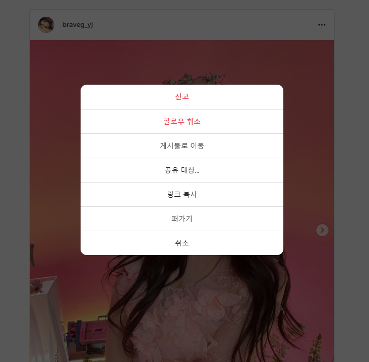
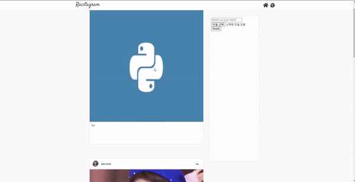

> # Nomadcoder

- [노마드코더 : 트위터 클론 수업](https://nomadcoders.co/nwitter)
- 노마드코더 수업을 거의다 듣고 CSS 작업은 내가 하고 싶은 대로 하고 있음, 트위터 수업이지만 instagram으로 만들고 있음

<br>

> # CSS 작업 및 react code 수정

#### 1. 일단 예전에 작성했던 문제점인 menu icon 밀림 현상을 해결하였다.

> "20210416 글에서"
> creator 이름 길어지면 margin으로 설정했기 때문에 menu 버튼이 밀림 (header position fixed 때문에 영향을 받아서 margin으로 했는데 다시 손봐야 함) -> stacking 문제인 듯
> [MDN: stacking_context](https://developer.mozilla.org/ko/docs/Web/CSS/CSS_Positioning/Understanding_z_index/The_stacking_context)

- 해당 작업의 경우에는 position fixed가 필요 없이 단순하게
  `position absoulte`로 해결 하였음(왜 absoulte를 사용안하려고 했는지는 이유가 생각이 안난다.)

<br>

### 2. 작성글의 creator container의 menu_btn에 edit, delete 넣기

- 해당 작업을 위해서 대대 적인 코드 수정이 필요했다.
- 처음에는 간단하게 `onModal` state를 정의해서 사용하면 되겠지 하고 어렴풋이 생각했는데 **instagram에서 보니 해당 메뉴 icon을 선택하면 modal 창이 나타나게 만들어져 있었다.**

<br>

### 3. Modal 구현하기

#### 1) instagram modal



- 해당 글의 메뉴 icon을 클릭하면 어떤 작업을 실시 할지 생각해 보았다.
- 위 사진처럼 여러가지가 있지만 현재 내가 가진 기능은 수정, 지우기 정도였기 때문에 이를 modal 창으로 넣기로 했다.

<br>

#### 2) Modal 이해하기

- 만들기 전에 일단 instagram에 있는 modal은 어떻게 동작하는지 browser tool을 이용해서 element를 확인해 보았다.
- 일단, modal의 경우 글 박스 상자 안에서 element가 발생하지 않고 완전 외부에서 (root 바로 밑) 발생하는 것을 확인했다.
- 그리고 다른 사람의 modal을 구현한 html 코드와 css를 확인해 보았다.
- 사람마다 다르지만 일단 modal안에 layer, content를 구성하는 것을 확인했다. 하지만 layer가 왜 필요한지는 이해가 가질 않았다. **"modal 부모 요소를 layer로 사용하면 되지 않을 까?"** 란 생각이 들었다.

<br>

#### 3) Modal 구현하기

- 그래서 일단 만들어 보기로 하였으나, Modal이 생성되는 위치가 거의 최상부 요소 구역이라서 대대적인 코드 수정작업이 필요해졌다.
- **문제점은 하부 요소에서 발생 trigger를 발생시키되, 상부요소 modal이 생성되고 지워져야 하기 때문에 원래 post박스에서 선언한 state, function들을 대대적으로 상부로 옮기고 필요한 state 및 function을 공유하게 해야했다.**

<br>

- modal component를 만들었고, modal component는 home component에서 발생한다.
- 하지만, home component 안에서 글을 보여주는 rweet component와 많은 정보를 공유해야했다.

<br>

- **modal에서 필요한 정보**
  - 글작성자와 현재유저를 비교하여 보여주는 madal 기능을 달리해야 할 필요가 있음 -> `user`, `post`
  - 모달을 켜야하는지 꺼야하는지에 대한 정보 -> `modalOn`

### Home component 수정

```js
import Rweet from "components/Rweet";
import { dbService } from "fBase";
import React, { useEffect, useState } from "react";
import RweetFactory from "components/RweetFactory";
import Modal from "components/Modal";

const Home = ({ userObj }) => {
  const [rweets, setRweets] = useState([]);
  const [rweetObj, setRweetObj] = useState();
  const [onModal, setOnModal] = useState(false);
  const [isOwner, setIsOwner] = useState();

  useEffect(() => {
    const getData = dbService
      .collection("rweets")
      .orderBy("createdAt", "desc")
      .onSnapshot((snapshot) => {
        const rweetArray = snapshot.docs.map((doc) => ({
          id: doc.id,
          ...doc.data(),
        }));
        setRweets(rweetArray);
      });
    return () => {
      getData();
    };
  }, []);

  return (
    <>
      <div className="home_container">
        <div className="main_container">
          {rweets.map((rweet) => (
            <Rweet
              key={rweet.id}
              rweetObj={rweet}
              setOnModal={setOnModal}
              setRweetObj={setRweetObj}
              setIsOwner={setIsOwner}
              userObj={userObj}
            />
          ))}
        </div>
        <div className="side_container">
          <RweetFactory userObj={userObj} />
        </div>
      </div>
      {onModal ? (
        <Modal
          rweetObj={rweetObj}
          setRweetObj={setRweetObj}
          setOnModal={setOnModal}
          isOwner={isOwner}
        />
      ) : (
        <></>
      )}
    </>
  );
};

export default Home;
```

<br>

### Rweet Component 수정 (post 영역)

```js
import { faEllipsisH } from "@fortawesome/free-solid-svg-icons";
import { FontAwesomeIcon } from "@fortawesome/react-fontawesome";
import React from "react";

const Rweet = ({ userObj, rweetObj, setOnModal, setRweetObj, setIsOwner }) => {
  const toggleOnModal = () => {
    setOnModal((prev) => !prev);
    setRweetObj(rweetObj);
    setIsOwner(rweetObj.creatorId === userObj.uid);
  };

  return (
    <div className="post">
      <>
        <div className="rweet_creator_container">
          
          <h4 className="rweet_creator_name">{rweetObj.displayName}</h4>
          <button className="rweet_creator_menu" onClick={toggleOnModal}>
            <FontAwesomeIcon icon={faEllipsisH} size="1x" />
          </button>
        </div>
        <div className="rweet_img_container">
          {rweetObj.attachmentUrl && (
            
          )}
        </div>
        <div className="rweet_text_container">
          <h4 className="rweet_text">{rweetObj.text}</h4>
        </div>
      </>
    </div>
  );
};

export default Rweet;
```

<br>

### Modal Component 구현

```js
import React, { useState } from "react";
import { dbService, storageService } from "fBase";

const Modal = ({ rweetObj, setRweetObj, setOnModal, isOwner }) => {
  const [newRweet, setNewRweet] = useState(rweetObj.text);
  const [editing, setEditing] = useState(false);

  const onDeleteClick = async (event) => {
    const ok = window.confirm("Are you sure you want to delete this rweet?");
    if (ok) {
      await dbService.doc(`rweets/${rweetObj.id}`).delete();
      if (rweetObj.attachmentUrl !== "") {
        await storageService.refFromURL(rweetObj.attachmentUrl).delete();
      }
    }
    goOut_modal();
  };

  const onSubmit = async (event) => {
    event.preventDefault();
    if (newRweet !== rweetObj.text) {
      await dbService.doc(`rweets/${rweetObj.id}`).update({
        text: newRweet,
      });
    }
    goOut_modal();
  };

  const onChange = (event) => {
    const {
      target: { value },
    } = event;
    setNewRweet(value);
  };

  const toggleEditing = () => {
    setEditing((prev) => !prev);
  };

  const goOut_modal = () => {
    setOnModal(false);
    setRweetObj(null);
    setEditing(false);
  };

  return (
    <div className="modal" onClick={goOut_modal}>
      <div className="modal_content" onClick={(ev) => ev.stopPropagation()}>
        {editing ? (
          <>
            {isOwner && (
              <>
                <form className="edit_form" onSubmit={onSubmit}>
                  <input
                    className="edit_text"
                    type="text"
                    placeholder="Edit your Rweet"
                    value={newRweet}
                    required
                    onChange={onChange}
                  />
                  <div className="edit_controller">
                    <input
                      className="edit_btn1"
                      type="submit"
                      value="Update Rweet"
                    />
                    <button
                      type="button"
                      className="edit_btn2"
                      onClick={toggleEditing}
                    >
                      Cancel
                    </button>
                  </div>
                </form>
              </>
            )}
          </>
        ) : (
          <>
            {isOwner && (
              <>
                <div className="modal_btn_controller">
                  <button
                    type="button"
                    className="modal_btn"
                    onClick={onDeleteClick}
                  >
                    Delete
                  </button>
                  <button
                    type="button"
                    className="modal_btn"
                    onClick={toggleEditing}
                  >
                    Edit
                  </button>
                </div>
              </>
            )}
          </>
        )}
        <button className="modal_btn" onClick={goOut_modal}>
          GoOut
        </button>
      </div>
    </div>
  );
};

export default Modal;
```

<br>

### 4) Event 전파 막기 (event bubbling, 처리 꿀팁)

#### 모달 content 영역 외 클릭시 나가기 구현

- 모달창을 구현하면서 layer 없이 상위 요소에 `goOut` 이라는 창을 닫는 함수를 onClick으로 해놓아 event를 받게 해놓는 경우 하위 요소에서 event를 발생 시키면 상위 요소 전파되면서 `goOut`도 함께 실행되는 경우를 말한다.
- 이러한 경우에는 `event.stopPropagation();`을 해당 event에 연결한 함수에 집어 넣어주면 해당요소의 함수만 실행되고 상위 요소는 event 전파가 막혀 함수가 실행되지 않는다.

<br>

- 나 같은 경우에는 form이 있기 때문에 input에서 focusing 할때 발생하는 버블링을 제거하기 위해서 노력했다.
- 그런데, input text type에서 발생하는 버블링은 신기하게도 onClick 했을 경우에만 발생한다. onfocus가 아닌 것이다.
- 그래서 bubbling을 없애기 위해서는 onClick을 `stopPropagation()`을 주면 input text에 focusing 했을때 발생하는 버블링은 제거가 된다.

<br>

- **하지만, 결과론적으로 바라보면 input 버블링은 제거할수 있지만 중간에 form이 존재하기 때문에 form으로도 버블링이 발생안해서 오히려 데이터 전송을 못하게 된다.**

- **<span style="color: red">차선책으로 중간에 있는 그저 CSS용으로 있는 container에 onClick event를 달고 'stopPropagation()' 을 넣어 form은 동작하지만 그 위로부터는 전파되지 않게 막았다. 그러면 굳이 하나하나 stopPropagtion 넣을 필요 없이 모두 해결이 된다.</span>**

```js
<div className="modal" onClick={goOut_modal}>
  <div className="modal_content" onClick={(ev) => ev.stopPropagation()}>
    <>
      <form className="edit_form" onSubmit={onSubmit}>
        <input
          className="edit_text"
          type="text"
          placeholder="Edit your Rweet"
          value={newRweet}
          required
          onChange={onChange}
          // onClick={(ev) => ev.stopPropagation()}
        />
        <input className="edit_btn1" type="submit" value="Update Rweet" />
      </form>
    </>
  </div>
</div>
```

<br>

### 5) CSS display flex 사용 (꿀팁 사이트 글)

- flex는 정말 유용한 기능이다. 정렬하거나 하는 경우 자유롭게 가능하다. 또한 반응형 웹에서 정말 중요한 기능을 담당한다.
- [이번에야말로 CSS Flex를 익혀보자 (by 1분 코딩)](https://studiomeal.com/archives/197) : 정말 잘 정리하신 글이다. !! 무조건 봐야한다. 그림도 아주 잘 그려 놓으셔가지고 눈물이 날정도 임
- 주요 기능은 `display: flex`를 기본으로 함
- 기준 : `flex-direction` 배치 기준 선 방향 세로로 쌓을지(column) 가로로 정렬(row)할지 (기본 row 값)
- `flex-direction`를 기준으로 `justify`(축위에서 배치), `align`(축 위아래로 배치)
- `justify-content: center;` `align-item: center;` -> **가로 세로 정 가운데 정렬**
- 반응형 웹 유용 -> 줄넘김 기능 : `flex-wrap`
- 자세한건 다시한번 자주보면서 익히자

<br>

### 6) CSS Animaiton site

- [Animation 기능 모음 사이트, npm 지원](https://animate.style/)

<br>

> # 결과

<br>



<br>
<br>
<br>

> # 할 예정인 것

- home, profile 에서 side_container의 form 부분 CSS 필요
- profile 페이지 rweet component 공유하기 때문에 수정 필요함

## 문제점

- 계정 생성시 user photoUrl, displayName이 없어서 오류가 나기 때문에 email 형식 계정의 경우 기본 photoUrl, displayName 값을 넣어주어야 함
  - 그리고 google, github 로그인시에는 provider로 기존의 정보를 가져와서 할당 시켜줘야함
- user profile update시 해당 작성글의 displayName, photoURL도 update시키기
- github 로그인 오류 발생(인증 된것 같으나 home으로 안가고 firebase에 계정 생성이 안됨)
