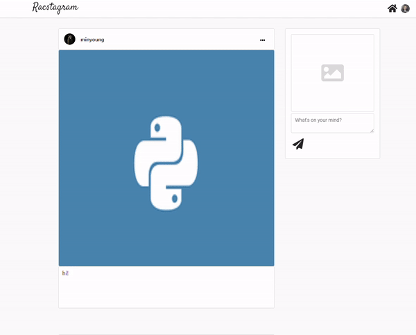

> # Nomadcoder

- [노마드코더 : 트위터 클론 수업](https://nomadcoders.co/nwitter)
- 노마드코더 수업을 거의다 듣고 CSS 작업은 내가 하고 싶은 대로 하고 있음, 트위터 수업이지만 instagram으로 만들고 있음

<br>

> # Modal 기능 profile route에 적용하기

## 접근

profile의 경우에는 자신이 쓴글을 볼수 있다. 그러다 보니 똑같이 Home component에서 사용한 rweet이라는 글 박스 component를 공유하게 된다.

<br>

다만, 처음에 잘못 한것이 profile page에서 글 박스를 render 할 때, get방식으로 가져온다는 것이다.
그러다 보니 home에서는 onSnapshot 방식으로 가져오는 것 다르게 database가 update가 되면 바로 반영되서 바뀌는 것이 아니고 update 마다 새로 database를 읽어서 데이터를 가져와서 render하라고 명령 처리해줘야 한다.

<br>

home route 같은 경우에는 많은 글들이 있으므로 많은 사용자가 update하는 것을 user가 보고 싶지는 않기 때문에 get방식으로 처리하는게 맞고,
profile route의 경우에는 자신의 글만 보기 때문에 update시에 바로 모두 반영되어도 상관 없다.

<br>

## 문제점

하지만, 이미 home을 onSnapshot으로 , profile을 get으로 했기 때문에 일단은 그대로 하기로 하였다.
그래서 profile route에 modal을 붙이는 작업은 home을 참고해서 쉽게 할수 있었으나 문제는 get 방식이 이기 때문에 **update, delete를 해도 reRender가 되지 않는 다는 것이다.**

<br>

## 해결을 위한 과정

### 1. Update useState 정의해서 활용하기

- profile에서 update useState를 정의하고 modal에서 update, delete할때 마다 setUpdate를 통해 값의 변화를 주어서 profile에 있는 render를 시키는 useEffect 부분을 다시 실행시키게 하는 것이다.

### 2. state 값 선정

#### `true, false`

- 처음에는 onModal등의 useState에 착안해서 아무 생각 없이 true, false 값으로 update시켜야 겠다고 생각했다.
- 하지만, update시에 true로 바꾸면 나중에 또 false로 바꿔줘야 하는 문제점이 생긴다. 그래서 useEffect가 실행될 때 false로 바꾸면 되지 않나? 했지만, 그러면 무한 loop가 될것임에 틀림 없다.
- true, false값이 주는 의미가 중요하다면 어떻게든 사용자 이벤트 발생시 false로 바꾸게 해야한다. (그렇게 되면 고민을 더해야 할듯)
- 그에 반해 의미를 과감하게 버린다면, **update 시에 true는 false로, false는 true로 바꾸는 토글 함수를 실행시킨다면 된다.**

<br>

#### `Date.now()`

- 위처럼 값에 대한 의미를 버린다면 그냥 **update시에 `Date.now()`를 통해서 state값을 가져와 변화를 주면 된다. 엄청 쉬워진다.**

<br>

### 3. 번외

#### `useHistory (react-route-dom)`

- useHistory를 통해서 다시 profile url로 가면 되지 않나? 라고 생각했지만, refresh 되지 않기 때문에 의미가 없다. (useHistory의 경우 refresh를 안 일으키기 때문에 유용하게 쓰는듯 하다.)
- 또한 react-route-dom의 redirect를 통해서 refresh를 한다고 해도, page를 다시 load 하면서 load page가 보여 user에게 불편하다.
- 우리가 추구하는 것은 SPA이고 refresh를 줄이기 위함인데 이는 역행임에 틀림없다. 이때까지 `event.preventDefault` 시켰던 것이 무의미 해진다.

<br>
<br>
<br>

> # 예상치 못한 문제점 (useRouteMatch 활용)

- profile과 home component에서 modal을 같이 쓰지만 home에서는 `setUpdate()` 함수를 사용하지 않기 때문에 에러가 발생한다. home에서는 setUpdate 함수를 주지 않기 때문에

  - #### 해결
  - profile과 home에 대한 현재 path를 구분 하여 `setUpdate()`함수의 실행을 if로 제어
  - `react-router-dom` 에 `useRouteMatch`를 활용했음 / [react-router-dom : useRouteMatch](https://reactrouter.com/web/api/Hooks/useroutematch)

<br>

#### useRouteMatch 사용법 (현재 경로 판별 값 반환)

```js
import { useRouteMatch } from "react-router-dom";

function BlogPost() {
  let match = useRouteMatch("/blog/:slug");
```

<br>
<br>
<br>

> # CSS : Home route - side section

#### 'input - type: file' Custom 하기

- img preview를 볼수 있는 공간에 `input file` 을 위치시켰고 input file의 경우 button custom이 불가하여, `label 태그`를 이용하여 input의 id, label의 for을 연결하고 (react에서는 hrmlFor로 표기, className 표기처럼 사유는 같은듯 하다.) file input은 `display: none` 속성을 통해 안보이게 했다. 덕분에 label을 custom 하여 icon을 넣었다.

<br>

#### textarea 태그 활용

##### 'input - type: text' 개행 모양 만들기 및 enter submit 방지

- 또한 원래 `text type의 input`을 활용 했지만 줄바꿈(개행)도 넣고 싶었기 때문에 `textarea 태그`를 활용했다. (아직, 출력 부분에 개행 표시는 아직 불가)
- 덕분에 버튼을 누르지 않는한, enter을 통한 submit을 방지 하였다.
- **'최종 목표는 개행 문자를 받아서 어떻게 표시 시킬것인가.'**
- textarea 태그의 경우 사용자가 임의로 size를 바꿀수 있어서, `resize: none;`, `resize: vertical;` 값을 통해서 resizing을 막고, vertical만 가능하게 하였다.

<br>

- 그리고 그외에, preview 사진 발생시 해당 preview 위에 x icon 모양으로 cancel버튼을 표시 시켰다.

```js
return (
		<form className="form_rweets" onSubmit={onSubmit}>
			<div className="preview_container">
				<>
					<label className="rweet_file_btn" htmlFor="input-file">
						<FontAwesomeIcon icon={faImage} size="4x" />
					</label>
					<input
						type="file"
						id="input-file"
						accept="image/*"
						onChange={onFileChange}
					/>
				</>
				{attachment && (
					<div>
						
						<button className="preview_cancel" onClick={onClearAttachment}>
							<FontAwesomeIcon icon={faTimesCircle} size="1x" />
						</button>
					</div>
				)}
			</div>
			<textarea
				className="form_rweets_text"
				value={rweet}
				onChange={onChange}
				placeholder="What's on your mind?"
				maxLength={120}
			></textarea>
			<div className="form_rweet_controller">
				<label className="rweet_submit_btn" htmlFor="input-submit">
					<FontAwesomeIcon icon={faPaperPlane} size="2x" />
				</label>
				<input type="submit" id="input-submit" value="Rweet" />
			</div>
		</form>
	);
};


```

<br>
<br>
<br>

> # 결과

## side-section CSS

- 전체적인 container 윤곽
- preview 부분
  - input file 버튼 -> img 아이콘
  - file cancel 버튼 -> preview 생성시 우측하단 cancel (x 모양) 아이콘
- text 입력 부분 -> textarea로 변경
- upload 버튼 -> paper plane 아이콘

<br>


