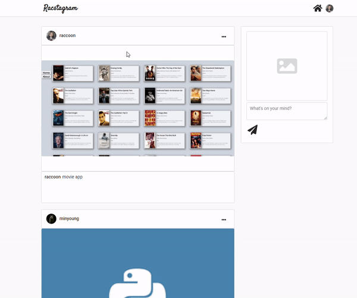
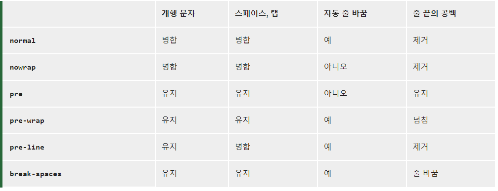
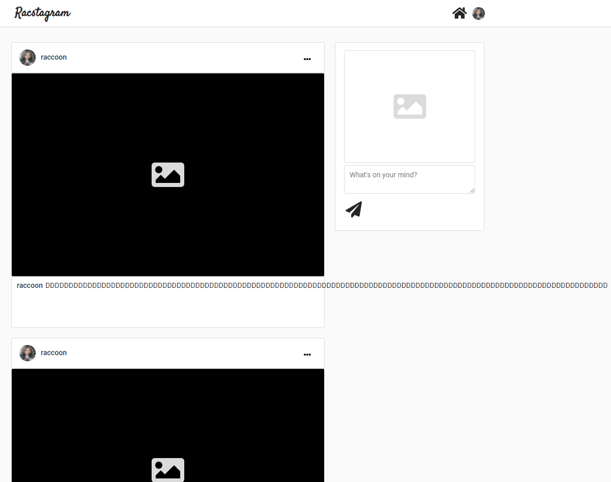
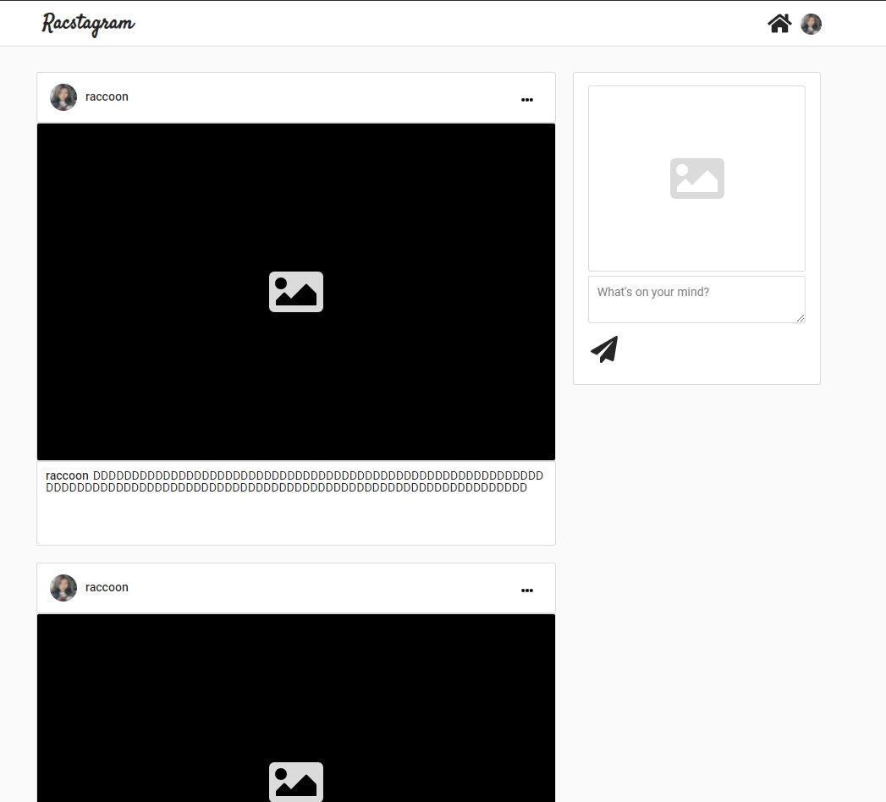

> # Nomadcoder

- [노마드코더 : 트위터 클론 수업](https://nomadcoders.co/nwitter)
- 노마드코더 수업을 거의다 듣고 CSS 작업은 내가 하고 싶은 대로 하고 있음, 트위터 수업이지만 instagram으로 만들고 있음

<br>

> # CSS : 반응형 웹

## Navigation bar 반응형으로 만들기

- `justify-content: space-between` 값을 적용시켜서 브라우저 크기가 작아져도 각 아이템은 좌우로 붙어 있는 상태를 유지하면서 작아지게 됨

<br>

## 글상자 img 비율 유지하는 반응형으로 만들기

- `width: 100%`로 주고, `heigth: fit-content`으로 주어 img비율을 유지하게 함
- 그리고 `min-width`, `max-width`를 주어서 적당히 크고 작게 변화줄수 있게 해줌

<br>
<br>
<br>

> # CSS : Profile Update 버튼 형으로 만들기


<br>
<br>

## 설명

- profile을 수정 하는 기능과 logOut을 user이름 표시 부분 옆에 down화살표 아이콘 버튼을 통해서 확인 가능하고
- 수정을 누르면 수정할수 있는 이미지 추가, 이름 form이 생성된다.

<br>

## 한계

- 예전 부터 생각하고 있었지만, profile 수정시 작성되었던 글의 경우 반영이 되지 않는다. 새로운 글부터 반영이 된다.

<br>
<br>
<br>

> # 글상자 개행 구현하기



<br>
<br>

- 일단 개행 구현에 앞서, 글상자에 작성자 이름이 처음에 표시되게 하였다.(instagram 처럼)

<br>

- 개행을 구현할려면 일단 form으로 받을때 textarea를 통해서 받아와야 한다.
- 처음에는 firebase에 개행문자가 표시가 되지 않기에 개행을 인식 못하나 싶었으나, 개행에 대한 정보도 들어가 있으나 공백으로 표시되게 처리되는 것 같다.(firebase console 에서)
- 하지만, 우려와 달리 textarea로 firebase의 text를 그대로 받아 output해주어도 잘 표시가 됨을 확인했다. 그치만, textarea가 아닌 div, span으로 표시하고 싶었다.
  - instagram이 그렇게 되있음

<br>
<br>

## 방법01 : textarea 의 경우

- textarea로 받아서 textarea로 표현
- 별문제 없이 그냥 연결하면 된다. 하지만, 작성자 이름을 자동으로 넣어주기가 어렵다. (넣어줄순 있지만, CSS를 주기가 어려움)

## 방법02 : div , span 의 경우 (`split`, `map`)

- div, span의 경우 개행문자를 `\n`을 인식하지 못하고 `<br>` 태그로 인식한다.
- [velopertLog : string 형태의 html을 렌더링하기, newline(\n) 을 BR 태그로 변환하기](https://velopert.com/1896)
  - react에서는 `innerHtml`을 `dangerouslySetInnerHTML`로 사용하는데, XSS를 막기 위해서 react에서는 가져온 html값을 모두 text로만 처리하고 html로는 인식을 막고있다. 사용하고 싶다면 `dangerouslySetInnerHTML`를 사용하면 된다고 하는데, XSS에 대해서 장담은 못한다는 것이다. (그래서 사용하기에 좀 그렇다.)
  - 대신 veloperLog page에서 찾은 방법으로 `split`, `map`함수를 사용해서 `/n`문자를 단위로 배열을 만들어 그 단위로 `<span>`과 `<br>`을 사용하여 return하여 render시키는 것이다.

```js
{
  data.split("\n").map((line) => {
    return (
      <span>
        {line}
        <br />
      </span>
    );
  });
}
```

- 참고로, instagram element를 확인해 보니 span, br로 이루어 진것을 보았다. `split`, `map` 방법을 쓰는듯 하다.

<br>

## 방법03 : CSS를 활용하는 경우 (`white-space`, `word-break`)

- CSS에서 개행을 처리하는 property인 `white-space`가 있었다.
- 이를 활용하면 `/n` 뿐만 아니라 `<br>`, `space`, `tab` 등을 어떻게 처리할 것인지 정할 수 있다.
- [MDN : white-space](https://developer.mozilla.org/ko/docs/Web/CSS/white-space)

- white-space property : Options



- 나같은 경우에 `pre-wrap`을 사용하였으며, 줄바꿈을 통한 한줄 비우기도 가능하다.
- 하지만 이렇게 하는 경우, 한단어로 길게 쓰는 경우 box를 넘치는 경우가 있다.
- 그래서 `word-break:break-all` 값을 사용하여 단어가 길어 넘치는 것도 줄바꿈을 시킬 수 있다.

#### `white-space : pre-wrap` : 넘치는 경우



<br>
<br>

#### `word-break:break-all` : 해결


