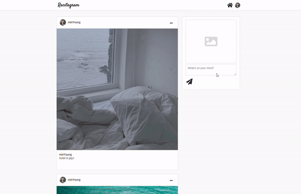

> # submit 처리시 laoding modal 구현하기

- submit을 보내는 경우 큰 이미지 파일을 올리거나 할때 처리 시간이 조금 걸리기 때문에 사용자에게 처리하고 있음을 알려줄 필요가 있다.
- 기존의 init load Component를 재활용 해서 사용하였다. 하지만 그전과 다르게 modal적인 요소를 넣어 현재 화면에 띄우는 형식으로 만들었다.

## component 넣기

- 기존 화면인 home route 또는 profile route 아래에 modal이 동작하는 것과 같이 추가하였다.
- 그리고 state를 변경하는 것은 글작성, profile update 하는 submit에 추가함으로서 보이거나 안보이게 할수 있도록 하였다.

```js
// Home component , profile component 하단에 추가
const [onLoad, setOnLoad] = useState(false);

return (
	{onLoad && <Load />}
)
```

```js
const onSubmit = async (event) => {
  event.preventDefault();
  if (!doubleSubmit) {
    setDoubleSubmit(true);
    setOnLoad(true); // 보이기
    let attachmentUrl = "";
    if (attachment !== "") {
      const attachmentRef = storageService
        .ref()
        .child(`${userObj.uid}/${uuidv4()}`);
      const response = await attachmentRef.putString(attachment, "data_url");
      attachmentUrl = await response.ref.getDownloadURL();
    }
    setAttachment("");
    const rweetObj = {
      text: rweet,
      createdAt: Date.now(),
      creatorId: userObj.uid,
      attachmentUrl,
      photoUrl: userObj.photoURL,
      displayName: userObj.displayName,
    };
    await dbService.collection("rweets").add(rweetObj);
    setRweet("");
    setOnLoad(false); // 안 보이기
    setDoubleSubmit(false);
  }
};
```

## CSS 수정

```css
.load_container {
  z-index: 5;
  position: fixed;
  animation: fadein 0.15s;
  text-align: center;
  width: 100%;
  height: 100%;
  position: fixed;
  content: "";
  background-color: rgba(0, 0, 0, 0.3);
  top: 0;
  left: 0;
  display: flex;
  align-items: center;
  justify-content: center;
  flex-direction: column;
}
```

## 결과


