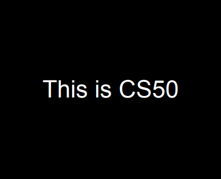
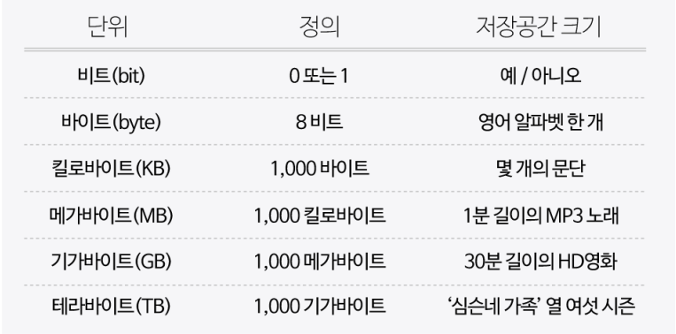
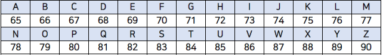
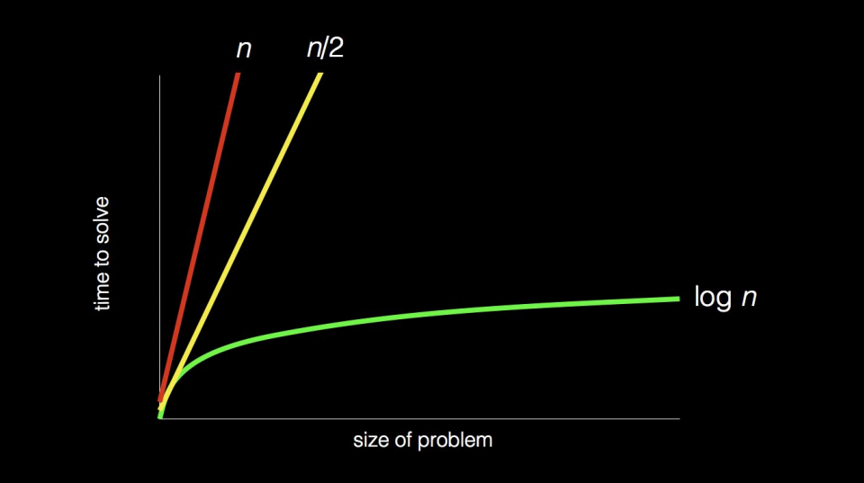
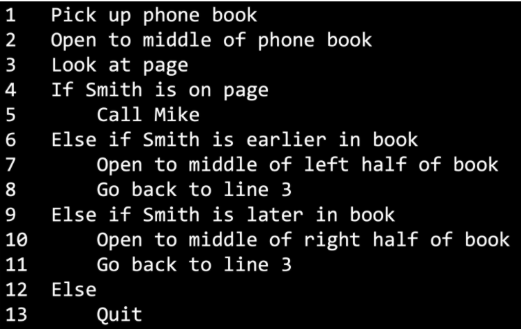

네이버 커넥트재단에서 운영하는 [부스트 코스](https://www.boostcourse.org/)라는 사이트의 **모두를 위한 컴퓨터 과학 (CS50) By David J. Malan**이라는 하버드대에서 강의한 CS 강의이다. 해당 글은 강의를 듣고서 정리한 내용 및 img 자료 입니다. (무료 강의)

 

> # CS50 : 컴퓨팅 사고 (Computational Thinking, Scratch)

- 컴퓨터 과학 : 단지 문제를 해결하는 것 (어떠한 입력이 있을 때 그로부터 어떠한 출력을, 그 문제에 대한 답을 찾는 과정)
- 기계는 입출력에 대한 동의가 필요함 (약속) -> 정보 자체의 표현 방법

> ## 2진법

- 우리는 10진법으로 0 ~ 9 까지의 숫자를 가졌지만 , 기계는 0, 1 단 두개의 숫자 뿐이 없다.
- 그럼에도 컴퓨터는 글, 이미지, 소리, 영상 등 많은 것을 저장하고 있다.

- 인간이 수를 자연스럽게 인식하는 체계는 10진법이며, 이는 사전에 **약속**이 있기 때문이다. 10진법은 10의 거듭제곱으로서 이러한 연산 과정을 자연습럽게 체득하고 있다.
- 컴퓨터는 각자리에 1, 0 을 사용한 **2의 거듭제곱을 사용** 즉, 2진법 (binary)를 사용
  - 예) 100 -> 4 (자리수를 증가시켜서 더 큰 숫자를 표현함 -> 숫자가 커질수록 0 과 1이 더 많이 필요함)
  - 0 또는 1을 가진 2진수를 비트라고 함
  - 물리적 행위를 통한 연결을 하는 경우 해당 행위를 간단하게는 0 또는 1 (켜짐, 꺼짐 / 진실 또는 거짓)로서 이진법으로 표현하는데 이는 표현하기에 적절하다.

### 비트& 바이트

- **비트(binary digit)** : 정보 저장과 연산을 위해서 비트라는 측정단위 사용
- 하지만 더 많은 정보를 표현하기 위해서 컴퓨터는 많은 수의 비트를 활용하여 정보를 표현함 -> 물리적으로 수행
- **바이트** : 8비트 (8개의 1과 0을 의미 -> 2^8 = 256개의 다른 바이트가 존재)
- 킬로바이트 : 1000 바이트
- 메가바이트 : 1000 킬로바이트 (100만 바이트)
- 기가바이트 : 1000 메가바이트 (10억 바이트)
- 테라바이트 : 1000 기가바이트 (1조 바이트)

### 트랜지스터

- 컴퓨터는 수백만, 수십억개의 스위치들을 가지고 있고 물리적으로 이용해서 정보를 표현하고 값을 저장 한다. 그 스위치를 트랜지스터 라고 함
  - 트랜지스터 : 컴퓨터 속에 있는 아주 작은 스위치 이다. (즉, 비트를 나타냄)

### 다양한 데이터 표현

 

> ## 정보의 표현

- 숫자로 다양한 정보(이미지, 알파벳, 이모티콘, 영상 등..)를 표현하기 위해서는 모두의 사전 동의가 필요함
- 예) 대문자 A -> 64를 표현하는 자리 + 1을 표현하는 자리 => 0100001

### ASCII code

- ASCII 코드는 알파벳과 문장 부호를 정보 교환을 위한 숫자로 표현하기 위한 미국 표준 코드로서 약속 체계를 갖추었다. (8개의 비트만 사용)

### UNICODE

- 미국 중심의 ASCII 코드에서 벗어나 더 많고 다양한 정보(이모티콘)를 표현하기 위해서 8 ~ 32 비트 까지 사용해서 표현
- 이모티콘의 경우 이미지로서 작은 점들로 이루어 져있음

### RGB

- 사진에서의 점들은 RGB라는 체계를 통해 표현 됨 (색깔)
- **RED, GREEN, BLUE** 이 3개의 색을 조합하여 무지개의 어느 색이든 만들어 낼수 있음
- 결국에는 하나의 점, 하나의 **픽셀**에 1가지의 색을 표하기 위해서는 **3개의 값**을 저장해야 함
- 예) 72 73 33 -> 빨강, 초록, 파랑의 양으로 받아 들임

### GIF(짤) & 비디오

- GIF 및 비디오는 사실 같은 파일에 저장되어 있는 여러장의 사진들임
- 단지 이러한 여러개의 사진들이 매우 빠르게 지나치는 것일 뿐임

### 음악

- 우리가 연주하는 음들 역시 숫자로 양자화 가능
- 음과 길이 음량 3가지 값 사용

### 결국, 어떠한 방법으로든지 0 과 1로 표현한다는 것

 

> ## 알고리즘

- 알고리즘 : 문제를 해결하는 단계적인 방법으로 input에서 받은 자료를 output 형태로 만드는 처리 과정을 뜻함

  - 즉, 규칙들의 순서적 나열
  - 일렬의 순서를 어떻게 나열하느냐, 즉, 알고리즘을 어떻게 짜느냐에 따라서 출력을 하기까지의 시간이 달라진다.

- 알고리즘은 **정확성**과 **효율성**이 중요하다.

- 예시) Q. 전화번호 부에서 특정 사람 번호 찾기

  - 방법01. 한장한장 넘겨서 찾는다.
  - 방법02. 두장씩 넘겨서 찾다가 넘어가면 한장 뒤로 가서 찾는다.
  - 방법03. 절반씩 펼쳐 확인해서 찾아간다.

- 모두 알고리즘이지만 평가를 할때는 방법3이 가장 효율적이다.
- 1024 페이지의 전화번호부에서 이름 찾기 -> 계속 반씩 나누어 줄여 간다. -> 10단계 만에 찾을 수 있음

- 각 방법에 대한 효율

## 의사코드 (Pseudocode)

- 생각을 간결하게 정리한 코드와 비슷한 구문을 말함
- 이미 가지고 있는 직관이나 생각들을 기계나 다른 사람들이 이해할 수 있는 방식으로 번역하는 것에 불과함

- 위와 같이 절자 지향적으로 알고리즘을 코드로 표현 할 수 있음
- 다른 프로그래밍 언어에서도 마찬가지이지만 의사 코드에서의 특징을 묶으면 함수, 조건, 불리언, 루프로 구성되고 그 외에 많이 있다.

## 생각해 보기

- 친구와 1부터 100까지 숫자 중 1가지 숫자를 맞추는 스무고개 게임을 하려고 합니다. 이 때 사용할 알고리즘을 의사코드로 표현하면 어떻게 될까요?

1 A가 1 ~ 100 까지 숫자 중 하나 X를 고른다
2 B는 "s는 1, f는 100임"을 기억한다.
3 B가 A에게 s에서 f의 중간 숫자 Y 부른다.
4 만약 Y와 X가 같으면
5 게임 종료
6 만약 X가 Y보다 크다면
7 A는 'Y보다 크다'라고 말한다.
8 B는 Y를 s로 기억하고 line 3번으로 간다.
9 그 외의 상황이면 (만약 X가 Y보다 작으면)
10 A는 'Y보다 작다'라고 말한다.
11 B는 Y를 f로 기억하고 line 3번으로 간다.

 
