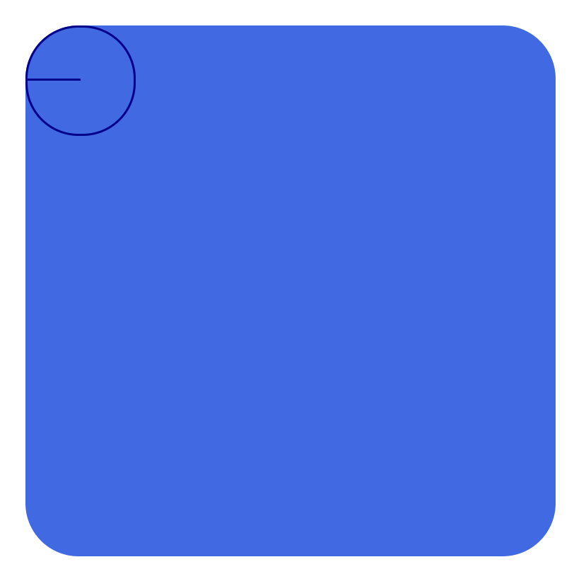

> # CSS02

<br>

<p align="center">

</p>

<br>

> ## 가상 요소 선택자

<br>

가상요소 선택자의 경우 내용을 삽입하기 때문에 무조건 가상요소를 사용할 때는 CSS **content 속성**을 최소한 `''` 빈값으로 해야할 정도로 무조건 사용해야 한다.

<br>

| 이름   | 기호          | 설명                                                                                         |
| ------ | ------------- | -------------------------------------------------------------------------------------------- |
| Before | `abc::before` | 선택자 abc요소의 **내부 앞에** 내용(content)을 삽입 <br>(**추가 되는 요소는 인라인 요소임**) |
| After  | `abc::after`  | 선택자 abc요소의 **내부 뒤에** 내용(content)을 삽입 <br>(**추가 되는 요소는 인라인 요소임**) |

<br>

```html
<div class="box">Tom&Jerry</div>
```

```css
.box {
  width: 100px;
  height: 100px;
  background-color: orange;
}
.box::after,
.box::before {
  content: "";
  display: block;
  width: 30px;
  height: 30px;
  background-color: royalblue;
}
/* 기본적으로 가상요소는 인라인 이므로 위아래 여백이 불가함 그래서 block으로 바꿈 */
```

<p class="codepen" data-height="265" data-theme-id="dark" data-default-tab="css,result" data-user="raccooncode96" data-slug-hash="poePBNa" style="height: 265px; box-sizing: border-box; display: flex; align-items: center; justify-content: center; border: 2px solid; margin: 1em 0; padding: 1em;" data-pen-title="poePBNa">
  <span>See the Pen <a href="https://codepen.io/raccooncode96/pen/poePBNa">
  poePBNa</a> by RaccoonCode96 (<a href="https://codepen.io/raccooncode96">@raccooncode96</a>)
  on <a href="https://codepen.io">CodePen</a>.</span>
</p>
<script async src="https://cpwebassets.codepen.io/assets/embed/ei.js"></script>

<br/>
<br/>
<br/>

> ## 속성 선택자

<br/>

| 이름       | 기호          | 설명                                                                                                                                       |
| ---------- | ------------- | ------------------------------------------------------------------------------------------------------------------------------------------ |
| Attr       | `[abc]`       | 속성 abc를 포함한 요소 선택 <br/> (값을 가지는 속성을 선택자로 쓰면 너무 광범위 해지기 때문에 **값을 가지지 않는 속성을 선택할 때 좋다.**) |
| Attr=Value | `[abc="xyz"]` | 속성 abc를 포함하고 값이 xyz인 요소 선택 <br/> (**값을 가지는 속성**을 디테일 하게 선택할때 사용)                                          |

<br/>

```html
<input type="text" />
<input type="password" />
<span data-fruit-name="apple">사과</span>
<span data-fruit-name="orange">오렌지</span>
```

```css
[type="text"] {
  width: 70px;
  background-color: orange;
}

[type="password"] {
  width: 70px;
  background-color: blue;
}

[data-fruit-name="apple"] {
  font-size: 40px;
  color: red;
}

[data-fruit-name="orange"] {
  font-size: 40px;
  color: orange;
}
```

<p class="codepen" data-height="265" data-theme-id="dark" data-default-tab="css,result" data-user="raccooncode96" data-slug-hash="GRWmjKo" style="height: 265px; box-sizing: border-box; display: flex; align-items: center; justify-content: center; border: 2px solid; margin: 1em 0; padding: 1em;" data-pen-title="GRWmjKo">
  <span>See the Pen <a href="https://codepen.io/raccooncode96/pen/GRWmjKo">
  GRWmjKo</a> by RaccoonCode96 (<a href="https://codepen.io/raccooncode96">@raccooncode96</a>)
  on <a href="https://codepen.io">CodePen</a>.</span>
</p>
<script async src="https://cpwebassets.codepen.io/assets/embed/ei.js"></script>

<br/>
<br/>
<br/>

> ## 스타일 상속

<br/>

부모 요소로 부터 자식,후손요소로 스타일이 상속되어 자식, 후손요소에 반영되는 것

### 상속되는 CSS 속성들

- 글자/문자 관련 속성들(모든 글자/문자 속성은 아님)
  - font-style, font-weight, font-size, font-family, line-height, color, text-align, ...

<br/>

### 강제 상속

- 상속이 안되는 속성을 강제로 상속 시킴
- 자식 또는 후손 요소의 속성값을 `inherit`을 주면 강제 상속 받음

```html
<div class="parent">
  parent
  <div class="child">child</div>
</div>
```

```css
.parent {
  text-align: center;
  width: 100px;
  /*   height, background-color : inherit을 통해서 강제 상속 함 */
  height: 400px;
  background-color: orange;
}
.child {
  width: 50px;
  height: inherit;
  background-color: inherit;
  position: fixed;
  top: 100px;
  left: 150px;
}
```

<p class="codepen" data-height="395" data-theme-id="dark" data-default-tab="css,result" data-user="raccooncode96" data-slug-hash="YzZVMry" style="height: 395px; box-sizing: border-box; display: flex; align-items: center; justify-content: center; border: 2px solid; margin: 1em 0; padding: 1em;" data-pen-title="YzZVMry">
  <span>See the Pen <a href="https://codepen.io/raccooncode96/pen/YzZVMry">
  YzZVMry</a> by RaccoonCode96 (<a href="https://codepen.io/raccooncode96">@raccooncode96</a>)
  on <a href="https://codepen.io">CodePen</a>.</span>
</p>
<script async src="https://cpwebassets.codepen.io/assets/embed/ei.js"></script>

<br/>
<br/>
<br/>

> ## 선택자 우선순위

<br/>

- 우선 순위 : 같은 요소가 여러 선언의 대상이 된 경우, 어떤 선언의 css 속성을 우선 적용할지 결정하는 방법 (즉, 여러가지 선택자들로 인해 같은 속성이 다른 값들로 지정해달라고 하는 경우 어떤 선택자의 값을 적용할지)
  - 점수가 높은 선언이 우선함
  - 점수가 같으면, 가장 마지막에 해석된 선언이 우선함!

<br/>

```html
<div id="color_yellow" class="color_green" style="color: orange">
  hello world!
</div>
<!--인라인 선언 1000점 -->
```

```css
div {
  /*   !important 9999999999점 */
  color: red !important;
}
#color_yellow {
  /*   id 선택자 100점 */
  color: yellow;
}
.color_green {
  /*   class 선택자 10점 */
  color: green;
}
div {
  /*   태그 선택자 1점 */
  color: blue;
}
* {
  /*   전체 선택자 0점 */
  color: darkblue;
}
body {
  /*   상속 X */
  color: violet;
}
```

- **명시도 : 점수 계산 하는 것**
- 중요도 : !important 키워드
- 선언순서 : 코드가 해석된 순서에 따라 우선한다
- !important 와 인라인 style선언은 되도록 사용하지 말것! (너무 우선순위 점수가 커져서 수정하기 어려움)
- `*` - `Tag` - `.Class` - `#Id` (0,1,10,100)

<br/>

| 선택방식                     | 점수              |
| ---------------------------- | ----------------- |
| !important 값                | 9999999999점      |
| 인라인 선언(style)           | 1000점            |
| ID선택자                     | 100점             |
| Class선택자(가상클래스 포함) | 10점              |
| 태그 선택자(가상요소 포함)   | 1점               |
| 전체 선택자 `*`              | 0점               |
| body 선택자                  | 상속은 점수계산 X |

<br/>

## 계산 예제

<br/>

```css
.list li.item {
  color: red;
}
/* 10 + 1 + 10 = 21점 */

.list li:hover {
  color: red;
}
/* 10 + 1 + 10 = 21점 */

.box::before {
  content: "";
  color: red;
}
/* 10 + 1 = 11점 */

#submit span {
  color: red;
}
/* 100 + 1 = 101점 */

header .menu li:nth-child(2) {
  color: red;
}
/* 1 + 10 + 1 + 10 = 22점*/

h1 {
  color: red;
}
/* 1점 */

:not(.box) {
  color: red;
}
/* 10점 */
```

<br/>
<br/>
<br/>
<br/>
<br/>
<br/>

---

> # CSS 속성(Properties)

<br/>

- HTML 속성 : Attributes
- CSS 속성 : Properties
- JS 속성 : Properties

<br/>

> ## 박스 모델

<br/>

## width , height

- 요소의 가로/세로 너비
- 기본 값 (property가 선언되지 않은 경우)
  - auto : 브라우저가 너비를 계산
  - **인라인 요소(auto 값)**
    - 콘텐츠 크기 만큼 width, height가 맞춰짐 (예. span 태그, 인라인 요소에서 특정 너비 값은 무시됨)
  - **블록 요소(auto 값)**
    - width는 부모 요소의 크기 만큼 자동으로 맞춰짐
    - height는 내부의 콘텐츠 크기만큼 자동으로 맞춰짐 (예. div 태그)
- 지정 할 수 있는 값
  - px, em, vw 등 단위로 지정

<br/>

## max-width, max-height

- 요소가 커질 수 있는 최대 가로/세로 너비
- 기본 값 (property가 선언되지 않은 경우)
  - none : 최대 너비 제한 없음
- 지정 할 수 있는 값
  - px, em, vw 등 단위로 지정
  - auto (브라우저가 너비를 계산, 잘 사용하지 않음)

<br/>

## min-width, min-height

- 요소가 작아질 수 있는 최소 가로/세로 너비
- 기본 값 (property가 선언되지 않은 경우)
  - 0 : 최소 너비 제한 없음
- 지정 할 수 있는 값
  - px, em, vw 등 단위로 지정
  - auto (브라우저가 너비를 계산, 잘 사용하지 않음)

<br/>

## 정리

<br/>

| 항목            | width                   | height          |
| --------------- | ----------------------- | --------------- |
| 기본값          | auto                    | auto            |
| 인라인(auto)    | 콘텐츠에 맞춤           | 콘텐츠 맞춤     |
| **블록 (auto)** | **부모 요소 크기 맞춤** | **콘텐츠 맞춤** |
| max(기본값)     | none                    | none            |
| min(기본값)     | 0                       | 0               |

<br/>
<br/>
<br/>

> ## 표현 단위

<br/>

- 표현 단위 : 속성 값의 크기 단위
- 일반적인 모니터 : 1920 \* 1080 사용함 (픽셀 개수)
- 기본적으로 명시되어 있지 않으면 모든 요소는 **16px 만큼의 폰트 크기**를 가짐
- 0이라는 값은 단위 상관 없이 모두 0이므로 단위를 붙이지 말자

<br/>

| 기호    | 이름                                                                                                                                            |
| ------- | ----------------------------------------------------------------------------------------------------------------------------------------------- |
| px      | 픽셀                                                                                                                                            |
| %       | 상대적 백분율 <br/> (부모 요소의 상대적 백분율)                                                                                                 |
| em      | 요소의 글꼴 크기 <br/> (부모의 폰트 사이즈가 요소에 상속되면 문제를 일으킴, 지정된 값이 아니라서 비교가 어려움)                                 |
| **rem** | 루트 요소 (최상위 요소->html)의 글꼴 크기 <br/> (주변 상황이 바뀌더라도 html의 글꼴 크기가 변하지 않는 이상 다른 요소에 영향을 받지 않아 좋다.) |
| vw      | viewport 가로 너비의 백분율                                                                                                                     |
| vh      | viewport 세로 너비의 백분율                                                                                                                     |

<br/>
<br/>
<br/>

> ## 외부 여백 (margin)

<br/>

- 요소의 외부 여백(공간)을 지정하는 단축 속성
- 기본 값 (property가 선언되지 않은 경우)
  - 0 : 외부 여백 없음
- 지정 할 수 있는 값
  - auto (브라우저가 여백을 계산, 가로(세로)너비가 있는 요소의 **가운데 정렬에 활용**)
  - px, em, vw 등 단위로 지정
  - **음수 값도 가능함 (예. -10px -> 외부의 여백이 줄어 겹쳐짐)**
  - % : 부모 요소의 가로 너비에 대한 비율로 지정 (잘 사용하지 않음)
- 단축 속성 : 한번에 여러 값을 받아 들여 디테일 하게 모든 방향을 지정 다룸 (**띄어쓰기로 구분**)
- 개별 속성 : `margin-방향: 값` -> 한번에 한값만 받아들여 하나의 방향만 지정

<br/>

| 사용 표현                       | 값 개수               | 설명                  |
| ------------------------------- | --------------------- | --------------------- |
| `margin: top right bottom left` | 4개 값을 지정(단축)   | 시계방향, 상 우 하 좌 |
| `margin: top rightLeft bottom`  | 3개 값을 지정(단축)   | 상 중 하              |
| `margin: topBottom rightLeft`   | 2개 값을 지정 (단축)  | 상하, 좌우            |
| `margin: topRightBottomLeft`    | 1개 값을 지정 (단축)  | 상하좌우 모두         |
| `margin-top: value`             | 1 개 값을 지정 (개별) | 상                    |
| `margin-right: value`           | 1 개 값을 지정 (개별) | 우                    |
| `margin-bottom: value`          | 1 개 값을 지정 (개별) | 하                    |
| `margin-left: value`            | 1 개 값을 지정 (개별) | 좌                    |

<br/>
<br/>
<br/>

> ## 내부 여백 (padding)

<br/>

- 요소의 내부 여백(공간)을 지정하는 단축 속성
- 기본 값 (property가 선언되지 않은 경우)
  - 0 : 내부 여백 없음
- 지정 할 수 있는 값
  - px, em, vw 등 단위로 지정
  - **음수 값도 가능함 (예. -10px -> 외부의 여백이 줄어 겹쳐짐)**
  - % : 부모 요소의 가로 너비에 대한 비율로 지정 (어느정도 유용함)
- **padding 값이 커질수록 요소의 크기가 커짐**
- 단축 속성, 개별속성은 margin 과 동일하게 사용

| 사용 표현                        | 값 개수               | 설명                  |
| -------------------------------- | --------------------- | --------------------- |
| `padding: top right bottom left` | 4개 값을 지정(단축)   | 시계방향, 상 우 하 좌 |
| `padding: top rightLeft bottom`  | 3개 값을 지정(단축)   | 상 중 하              |
| `padding: topBottom rightLeft`   | 2개 값을 지정 (단축)  | 상하, 좌우            |
| `padding: topRightBottomLeft`    | 1개 값을 지정 (단축)  | 상하좌우 모두         |
| `padding-top: value`             | 1 개 값을 지정 (개별) | 상                    |
| `padding-right: value`           | 1 개 값을 지정 (개별) | 우                    |
| `padding-bottom: value`          | 1 개 값을 지정 (개별) | 하                    |
| `padding-left: value`            | 1 개 값을 지정 (개별) | 좌                    |

<br/>
<br/>
<br/>

> ## 테두리 선 (border)

<br/>

## border

<br/>

- 요소의 테두리 선을 지정하는 단축 속성
- **요소의 크기가 커지는 특징이 있다.**
- 기본값 : none
- **단축 속성**
  - `border: 두께(width) 종류(style) 색상(color)`
  - 3가지 값을 모두 넣어 주어야 테두리 선이 생김
  - width , style color 순으로 작성하자 (물론, 섞여도 상관은 없지만 통일감을 주자)
- **개별 속성**:
  - `border-width` : 요소 테두리 선의 두께
    - 보통 px, em, vw 등 단위로 지정
    - 개별 속성이면서 단축 속성임
      - **margin, padding 처럼 4방향 top right bottom left를 사용 가능**
  - `border-style` : 요소 테두리 선의 종류
    - 기본값 : none
    - 지정할 수 있는 값
      - `solid`(실선) , `dashed`(파선), dotted, double, groove, ridge, inset, outset
      - 개별 속성이면서 단축 속성임
      - **margin, padding 처럼 4방향 top right bottom left를 사용 가능**
  - `border-color` : 요소 테두리 선의 색상
    - 기본값 : black
    - 지정할 수 있는 값
      - `color 값 or 키워드`, `transparent`(투명)
    - 개별 속성이면서 단축 속성임
      - **margin, padding 처럼 4방향 top right bottom left를 사용 가능**
- **기타 속성**
  - `border-방향` , `border-방향-속성`

| top                                | right                                |
| ---------------------------------- | ------------------------------------ |
| `border-top: widthV styleV colorV` | `border-right: widthV styleV colorV` |
| `border-top-width: value`          | `border-right-width: value`          |
| `border-top-style: value`          | `border-right-style: value`          |
| `border-top-color: value`          | `border-right-color: value`          |

| bottom                                | left                                |
| ------------------------------------- | ----------------------------------- |
| `border-bottom: widthV styleV colorV` | `border-left: widthV styleV colorV` |
| `border-bottom-width: value`          | `border-left-width: value`          |
| `border-bottom-style: value`          | `border-left-style: value`          |
| `border-bottom-color: value`          | `border-left-color: value`          |

<br/>
<br/>
<br/>

## border-radius

<br/>

- 요소의 모서리를 둥글게 깎음
- 기본값 : 0 (둥글게 없음)
- 지정할 수 있는 값 : px, em vw 등 단위로 지정
- 단축 속성
  - `border-radius: topLeft topRight bottomRight bottomLeft`
- 픽셀의 의미
  - 모서리의 가로 세로 n픽셀을 반지름(radius)으로 하는 원의 호로 둥글게 처리

<p align="center">

</p>

<br/>
<br/>
<br/>

> ## 색상 표현

<br/>

- 색을 사용하는 모든 속성에 적용가능한 색상 표현

| 이름            | 설명                            | 사용기호                  |
| --------------- | ------------------------------- | ------------------------- |
| 색상키워드      | 브라우저에서 제공하는 색상 이름 | red,tomato,royalblue      |
| **Hex생상코드** | **16진수 색상**                 | **#000, #FFFFFF**         |
| **RGB**         | **빛의 삼원색**                 | **rgb(255, 255, 255)**    |
| **RGBA**        | **빛의 삼원색 + 투명도**        | **rgba(0, 0, 0, 0.5)**    |
| HSL             | 색상, 채도, 명도                | hsl(120, 100%, 50%)       |
| HSLA            | 색상, 채도, 명도 + 투명도       | hsla(120, 100%, 50%, 0.3) |

<br/>
<br/>
<br/>

> ## 크기 계산(box-sizing)

<br/>

- padding과 border의 값은 요소의 크기를 키우기 때문에 수정시 계산하기 어려운 문제가 발생함

<br/>

## box-sizing

<br/>

- 요소의 크기 계산 기준을 지정
- 기본값 : `content-box` (요소의 내용으로 크기 계산)
- **지정할 수 있는 값 : `border-box` (요소의 내용 + padding + border로 크기 계산)**

<br/>
<br/>
<br/>

> ## 넘침 제어(overflow)

<br/>

- 요소의 크기 이상으로 내용이 넘쳤을때(자식이 부모의 크기를 넘치는 경우), 보여짐을 제어하는 단축 속성
- 넘치는 주체가 아닌 부모 요소에 사용
- 기본값 : `visible` (넘친 내용을 삐져나오게 그대로 보여줌)
- 지정 가능한 값
  - `hidden` : 넘친 내용을 잘라냄
  - `auto` : 넘친 내용이 있는 경우에만 잘라내고 스크롤바 생성
  - `scroll` : 무조건 넘친 내용을 잘라내고, 스크롤바 생성(x축, y축 모두)
- 개별 속성
  - `overflow-x : value` (x축으로 넘치는 경우)
  - `overflow-y : value` (y축으로 넘치는 경우)

<br/>
<br/>
<br/>

> ## 출력 특성(display)

<br/>

## display

<br/>

- 요소의 화면 출력(보여짐) 특성
- 기본값
  - 일단, 각 요소들마다 기본으로 가지는 값이 달라짐(이미 지정되어 있는 값)
  - `block` : 상자요소 (**가로세로 너비 지정 가능**)
  - `inline` : 글자요소 (**가로세로 너비 지정 불가**)
  - `inline-block` : 글자 + 상자요소
  - 기타 (`table, table-row,table-cell ...`)
- 지정 가능한 값
  - `flex` : 플렉스 박스 (1차원 레이아웃)
  - `grid` : 그리드 (2차원 레이아웃)
  - `none` : 보여짐 특성 없음, 화면에서 사라짐(안보임, devTool의 element 분석에는 나옴)

<br/>
<br/>
<br/>

> ## 투명도 (opacity)

<br/>

## opacity

<br/>

- 요소의 투명도를 결정
- 기본값 : 1 (불투명)
- 지정 가능한 값
  - 0 ~ 1 (0 부터 1사이의 소수점 숫자, 숫자가 클수록 불투명)
- 예시) `opacity: 0.07`

<br/>
<br/>
<br/>

> ## 글꼴

<br/>

## 요약정리

<br/>

| 속성          | 설명                      | 기본값                            | 지정 가능한 값(권장 값)       |
| ------------- | ------------------------- | --------------------------------- | ----------------------------- |
| `font-style`  | 글자의 기울기 지정        | `normal`                          | `italic` <br/> `oblique`      |
| `font-weight` | 글자의 두께(가중치)       | `normal`, `400`                   | `bold`, `700` <br> `100~900`  |
| `font-size`   | 글자의 크기 지정          | `16px`                            | px, em, rem 등                |
| `line-height` | 한 줄의 높이, 행간과 유사 | `normal`                          | `숫자` <br> `px, em, rem ...` |
| `font-family` | 글꼴 지정                 | 글꼴 계열 <br/> `sans-serif` 권장 | `serif`                       |

<br/>

## font-style

- 글자의 기울기 지정
- 기본값 : `normal` (기울기 없음)
- 지정 가능한 값 : `italic` (이텔릭체), `oblique`(기울어진 글자, 보통 안쓰고 이텔릭 씀)

<br/>

## font-weight

- 글자의 두께 지정
- 기본값 : `normal`, `400` (기본 두께)
- 지정 가능한 값
  - `bold`, `700` (두껍게)
  - `100~900`(100 단위 숫자9개, normal과 bold이외 두께)
  - bolder (상위,부모요소 보다 더 두껍게)
  - liter (상위,부모요소 보다 더 얇게)

<br/>

## font-size

- 글자의 크기 지정
- 기본값 : `16px` (기본 크기)
- 지정 가능한 값
  - **단위 px, em, rem 등 단위로 지정**
  - % : 부모 요소의 폰트 크기에 대한 비율
  - smaller : 상위(부모) 요소보다 작은 크기
  - larger : 상위(부모) 요소보다 큰 크기
  - xx-small ~ xx-large : 가장 작은 크기 ~ 가장 큰 크기까지 7단계의 크기를 지정

<br/>

## line-height

- 한 줄의 높이, 행간과 유사
- 기본값 : `normal` 브라우저의 기본 정의를 사용
  - (보통 css reset 되면서 1값을 가지게 됨)
- 지정 가능한 값
  - **숫자 : 요소의 글꼴 크기의 배수로 지정 (권장-> 수정시 편함)**
  - **단위 px, em, rem 등 단위로 지정**
  - % : 요소의 글꼴 크기의 비율로 지정
- **Tip!**
  - flex를 못쓰고 인라인 요소(문자)를 세로 중앙 정렬 하고싶은 경우
  - **-> line-height를 요소의 height와 같게 하면 content가 가운데로 감**

<br/>

## font-family

- 글꼴(서체) 지정
- `font-family: 글꼴1, "글꼴2", ... 글꼴 계열(필수)`
- 쉼표 구분하여 여러 글꼴 후보 지정 가능
- **띄어쓰기 등 특수문자가 포함된 글꼴 이름은 큰 따옴표로 묶어야 함**
- 글꼴 계열 (마지막 최선의 후보)
  - **`sans-serif` : 고딕체 계열 (깔끔하게 떨어짐, 권장)**
  - `serif` : 바탕체 계열 (뻗침이 있음)
  - `monospace` : 고정너비(가로폭이 동등) 글꼴 계열
  - `cursive` : 필기체 계열
  - `fantasy` : 장식 글꼴 계열
- body 태그에 지정해서 하위 요소에 모두 상속시킴

<br/>
<br/>
<br/>

> ## 문자 관련 속성

<br/>

## color

- 글자의 색상
- 기본값 : `rgb(0, 0, 0)` (검정색)
- 가능한 값 : `색상코드, rgb, rgba ...` (기타 지정 가능한 색상)

<br/>

## text-align

- 문자의 정렬 방식
- 기본값 : `left` (왼쪽 정렬)
- 가능한 값
  - `right` (오른쪽)
  - `center` (가운데)
  - `justify` (양쪽 정렬)

<br/>

## text-decoration

- 문자의 장식(선)
- 기본값 : `none` (장식 없음)
- 가능한 값
  - **`underline` (밑줄)**
  - **`line-through` (중앙선)**
  - `overline` (윗줄)
- **Tip !**
  - **보통 a태그, 링크의 밑줄형태 없애고자 할때 자주 사용함**

<br/>

## text-indent

- 문자의 첫 줄의 들여쓰기
- 기본값 : `0` (없음)
- 가능한 값
  - **`단위 px, em, rem ...`**
  - `%` (요소의 가로 너비에 대한 비율)
  - **음수 사용이 가능함 -> 내어쓰기 (outdent)**

<br/>
<br/>
<br/>

> ## 배경 관련 속성

<br/>

## background-color

- 요소의 배경 색상
- 기본값 : `transparent` (투명함)
- 가능한 값 : `색상코드, rgb, rgba ...`
- background-image가 들어가면 이미지의 배경에 color가 깔림

<br/>

## background-image

- 요소의 배경 이미지 삽입
- 기본값 : `none` (이미지 없음)
- 가능한 값 : `url("경로")` (이미지 경로, **따옴표 주의**)
- **이미지가 추가되면 기본적으로 바둑판식으로 배열되어 반복적으로 출력되어 요소를 채움**

<br/>

## background-repeat

- 요소의 배경 이미지 반복
- 기본값 : `repeat` (이미지를 수직, 수평 반복 -> 바둑판식)
- 가능한 값
  - `repeat-x` (이미지 수평 반복)
  - `repeat-y` (이미지 수직 반복)
  - **`no-repeat` (이미지 반복 없음)**

<br/>

## background-position

- 요소의 배경 이미지 위치를 결정하는 **단축 속성**
- 기본값 : `0%0%` (0% ~ 100%의 값)
  - 브라우저에서 x, y축은 4사분면 느낌임 (y축이 아래로 갈수록 숫자가 커짐)
- 가능한 값
  - `방향` (top, bottom, left, right, center 방향)
    - 예) `background-position: top right` -> 우 상단 위치에 배치
    - 예) `background-position: center` -> 중앙 위치에 배치
  - `단위` (px, em, rem ...) -> x, y축의 개념으로 들어감
    - 예) `background-position: 100px 30px` -> 좌상을 기준으로 x: 100px, y: 30px에 배치

<br/>

## background-size

- 요소의 배경 이미지 크기
- 기본값 : `auto` (이미지의 실제 크기)
- 가능한 값
  - `단위` (px, em, rem ...)
    - -> 단축 속성으로 `background-size: 100px 150px` 처럼 배경의 width, height 설정가능
    - -> **하지만 비율 관리가 힘들기 때문에 `background-size: 100px` 처럼 값 하나만 넣어도 알아서 비율을 조정함**
  - `cover` (비율을 유지, 요소의 width, height 중에 더 넓은 너비에 맞춤)
  - `contain` (비율을 유지, 요소의 width, height 중에 더 짧은 너비에 맞춤)

<br/>

## background-attachment

- 요소의 배경 이미지 스크롤 특성
- 기본값 : `scroll`
  - **(이미지가 요소를 따라서 같이 스크롤 됨)**
  - **-> 같은 배경의 일부만 유지되고 스크롤시 변화없이 지나감**
- 가능한 값
  - **`fixed`**
    - **(이미지가 뷰포트에 고정, 배경은 스크롤 X)**
    - **-> 배경의 일부를 전체적으로 훑음면서 스크롤시 이미지가 변하면서 지나감)**
  - `local` (요소 내 스크롤시 이미지가 같이 스크롤)
