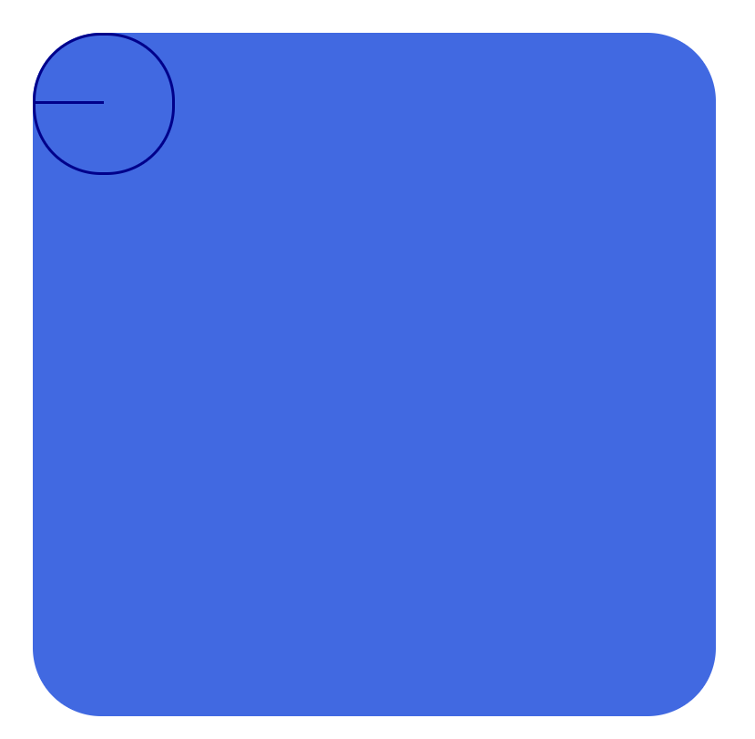

> # CSS03

 

 

> # CSS 속성(Properties)

 

- HTML 속성 : Attributes
- CSS 속성 : Properties
- JS 속성 : Properties

 

> ## 박스 모델

 

## width , height

- 요소의 가로/세로 너비
- 기본 값 (property가 선언되지 않은 경우)
  - auto : 브라우저가 너비를 계산
  - **인라인 요소(auto 값)**
    - 콘텐츠 크기 만큼 width, height가 맞춰짐 (예. span 태그, 인라인 요소에서 특정 너비 값은 무시됨)
  - **블록 요소(auto 값)**
    - width는 부모 요소의 크기 만큼 자동으로 맞춰짐
    - height는 내부의 콘텐츠 크기만큼 자동으로 맞춰짐 (예. div 태그)
- 지정 할 수 있는 값
  - px, em, vw 등 단위로 지정

 

## max-width, max-height

- 요소가 커질 수 있는 최대 가로/세로 너비
- 기본 값 (property가 선언되지 않은 경우)
  - none : 최대 너비 제한 없음
- 지정 할 수 있는 값
  - px, em, vw 등 단위로 지정
  - auto (브라우저가 너비를 계산, 잘 사용하지 않음)

 

## min-width, min-height

- 요소가 작아질 수 있는 최소 가로/세로 너비
- 기본 값 (property가 선언되지 않은 경우)
  - 0 : 최소 너비 제한 없음
- 지정 할 수 있는 값
  - px, em, vw 등 단위로 지정
  - auto (브라우저가 너비를 계산, 잘 사용하지 않음)

 

## 정리

 

| 항목            | width                   | height          |
| --------------- | ----------------------- | --------------- |
| 기본값          | auto                    | auto            |
| 인라인(auto)    | 콘텐츠에 맞춤           | 콘텐츠 맞춤     |
| **블록 (auto)** | **부모 요소 크기 맞춤** | **콘텐츠 맞춤** |
| max(기본값)     | none                    | none            |
| min(기본값)     | 0                       | 0               |

 
 
 

> ## 표현 단위

 

- 표현 단위 : 속성 값의 크기 단위
- 일반적인 모니터 : 1920 \* 1080 사용함 (픽셀 개수)
- 기본적으로 명시되어 있지 않으면 모든 요소는 **16px 만큼의 폰트 크기**를 가짐
- 0이라는 값은 단위 상관 없이 모두 0이므로 단위를 붙이지 말자

 

| 기호    | 이름                                                                                                                                            |
| ------- | ----------------------------------------------------------------------------------------------------------------------------------------------- |
| px      | 픽셀                                                                                                                                            |
| %       | 상대적 백분율   (부모 요소의 상대적 백분율)                                                                                                 |
| em      | 요소의 글꼴 크기   (부모의 폰트 사이즈가 요소에 상속되면 문제를 일으킴, 지정된 값이 아니라서 비교가 어려움)                                 |
| **rem** | 루트 요소 (최상위 요소->html)의 글꼴 크기   (주변 상황이 바뀌더라도 html의 글꼴 크기가 변하지 않는 이상 다른 요소에 영향을 받지 않아 좋다.) |
| vw      | viewport 가로 너비의 백분율                                                                                                                     |
| vh      | viewport 세로 너비의 백분율                                                                                                                     |

 
 
 

> ## 외부 여백 (margin)

 

- 요소의 외부 여백(공간)을 지정하는 단축 속성
- 기본 값 (property가 선언되지 않은 경우)
  - 0 : 외부 여백 없음
- 지정 할 수 있는 값
  - auto (브라우저가 여백을 계산, 가로(세로)너비가 있는 요소의 **가운데 정렬에 활용**)
  - px, em, vw 등 단위로 지정
  - **음수 값도 가능함 (예. -10px -> 외부의 여백이 줄어 겹쳐짐)**
  - % : 부모 요소의 가로 너비에 대한 비율로 지정 (잘 사용하지 않음)
- 단축 속성 : 한번에 여러 값을 받아 들여 디테일 하게 모든 방향을 지정 다룸 (**띄어쓰기로 구분**)
- 개별 속성 : `margin-방향: 값` -> 한번에 한값만 받아들여 하나의 방향만 지정

 

| 사용 표현                       | 값 개수               | 설명                  |
| ------------------------------- | --------------------- | --------------------- |
| `margin: top right bottom left` | 4개 값을 지정(단축)   | 시계방향, 상 우 하 좌 |
| `margin: top rightLeft bottom`  | 3개 값을 지정(단축)   | 상 중 하              |
| `margin: topBottom rightLeft`   | 2개 값을 지정 (단축)  | 상하, 좌우            |
| `margin: topRightBottomLeft`    | 1개 값을 지정 (단축)  | 상하좌우 모두         |
| `margin-top: value`             | 1 개 값을 지정 (개별) | 상                    |
| `margin-right: value`           | 1 개 값을 지정 (개별) | 우                    |
| `margin-bottom: value`          | 1 개 값을 지정 (개별) | 하                    |
| `margin-left: value`            | 1 개 값을 지정 (개별) | 좌                    |

 
 
 

> ## 내부 여백 (padding)

 

- 요소의 내부 여백(공간)을 지정하는 단축 속성
- 기본 값 (property가 선언되지 않은 경우)
  - 0 : 내부 여백 없음
- 지정 할 수 있는 값
  - px, em, vw 등 단위로 지정
  - **음수 값도 가능함 (예. -10px -> 외부의 여백이 줄어 겹쳐짐)**
  - % : 부모 요소의 가로 너비에 대한 비율로 지정 (어느정도 유용함)
- **padding 값이 커질수록 요소의 크기가 커짐**
- 단축 속성, 개별속성은 margin 과 동일하게 사용

| 사용 표현                        | 값 개수               | 설명                  |
| -------------------------------- | --------------------- | --------------------- |
| `padding: top right bottom left` | 4개 값을 지정(단축)   | 시계방향, 상 우 하 좌 |
| `padding: top rightLeft bottom`  | 3개 값을 지정(단축)   | 상 중 하              |
| `padding: topBottom rightLeft`   | 2개 값을 지정 (단축)  | 상하, 좌우            |
| `padding: topRightBottomLeft`    | 1개 값을 지정 (단축)  | 상하좌우 모두         |
| `padding-top: value`             | 1 개 값을 지정 (개별) | 상                    |
| `padding-right: value`           | 1 개 값을 지정 (개별) | 우                    |
| `padding-bottom: value`          | 1 개 값을 지정 (개별) | 하                    |
| `padding-left: value`            | 1 개 값을 지정 (개별) | 좌                    |

 
 
 

> ## 테두리 선 (border)

 

## border

 

- 요소의 테두리 선을 지정하는 단축 속성
- **요소의 크기가 커지는 특징이 있다.**
- 기본값 : none
- **단축 속성**
  - `border: 두께(width) 종류(style) 색상(color)`
  - 3가지 값을 모두 넣어 주어야 테두리 선이 생김
  - width , style color 순으로 작성하자 (물론, 섞여도 상관은 없지만 통일감을 주자)
- **개별 속성**:
  - `border-width` : 요소 테두리 선의 두께
    - 보통 px, em, vw 등 단위로 지정
    - 개별 속성이면서 단축 속성임
      - **margin, padding 처럼 4방향 top right bottom left를 사용 가능**
  - `border-style` : 요소 테두리 선의 종류
    - 기본값 : none
    - 지정할 수 있는 값
      - `solid`(실선) , `dashed`(파선), dotted, double, groove, ridge, inset, outset
      - 개별 속성이면서 단축 속성임
      - **margin, padding 처럼 4방향 top right bottom left를 사용 가능**
  - `border-color` : 요소 테두리 선의 색상
    - 기본값 : black
    - 지정할 수 있는 값
      - `color 값 or 키워드`, `transparent`(투명)
    - 개별 속성이면서 단축 속성임
      - **margin, padding 처럼 4방향 top right bottom left를 사용 가능**
- **기타 속성**
  - `border-방향` , `border-방향-속성`

| top                                | right                                |
| ---------------------------------- | ------------------------------------ |
| `border-top: widthV styleV colorV` | `border-right: widthV styleV colorV` |
| `border-top-width: value`          | `border-right-width: value`          |
| `border-top-style: value`          | `border-right-style: value`          |
| `border-top-color: value`          | `border-right-color: value`          |

| bottom                                | left                                |
| ------------------------------------- | ----------------------------------- |
| `border-bottom: widthV styleV colorV` | `border-left: widthV styleV colorV` |
| `border-bottom-width: value`          | `border-left-width: value`          |
| `border-bottom-style: value`          | `border-left-style: value`          |
| `border-bottom-color: value`          | `border-left-color: value`          |

 
 
 

## border-radius

 

- 요소의 모서리를 둥글게 깎음
- 기본값 : 0 (둥글게 없음)
- 지정할 수 있는 값 : px, em vw 등 단위로 지정
- 단축 속성
  - `border-radius: topLeft topRight bottomRight bottomLeft`
- 픽셀의 의미
  - 모서리의 가로 세로 n픽셀을 반지름(radius)으로 하는 원의 호로 둥글게 처리

 
 
 

> ## 색상 표현

 

- 색을 사용하는 모든 속성에 적용가능한 색상 표현

| 이름            | 설명                            | 사용기호                  |
| --------------- | ------------------------------- | ------------------------- |
| 색상키워드      | 브라우저에서 제공하는 색상 이름 | red,tomato,royalblue      |
| **Hex생상코드** | **16진수 색상**                 | **#000, #FFFFFF**         |
| **RGB**         | **빛의 삼원색**                 | **rgb(255, 255, 255)**    |
| **RGBA**        | **빛의 삼원색 + 투명도**        | **rgba(0, 0, 0, 0.5)**    |
| HSL             | 색상, 채도, 명도                | hsl(120, 100%, 50%)       |
| HSLA            | 색상, 채도, 명도 + 투명도       | hsla(120, 100%, 50%, 0.3) |

 
 
 
