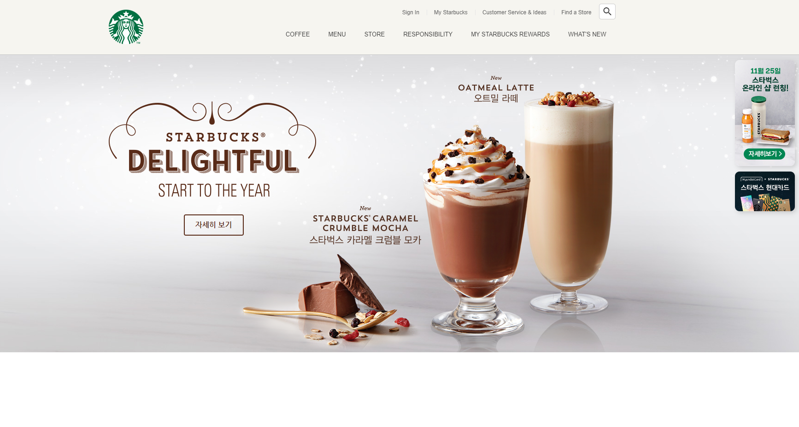

> # Starbucks Clone02

<br>

<p align="center">

</p>

<br/>

> ## 메인 메뉴 (드롭다운 메뉴)

- 드롭다운 메뉴 : 메뉴에 커서를 올리면 하위 메뉴가 보이는 메뉴
- 핵심 포인트는 드롭다운 하위 메뉴들을 평소에 `display: none` 으로 하고, 메인 메뉴의 item이 hover되는 때 `display: block`처리를 해서 보이게 하는 것이다.
- 또한, 스크롤 시에도 계속 따라 보이게 하기 위해서 `position: fixed;`를 사용함

## html 구조

```html
<ul class="main-menu">
  <li class="item">
    <div class="item__name">COFFEE</div>
    <div class="item__contents">
      <div class="contents__menu">
        <ul class="inner">
          <li>
            <h4>음료</h4>
            <ul>
              <li>콜드 브루</li>
              <li>브루드 커피</li>
              <li>에스프레소</li>
              <li>프라푸치노</li>
              <li>블렌디드 음료</li>
              <li>스타벅스 피지오</li>
              <li>티(티바나)</li>
              <li>기타 제조 음료</li>
              <li>스타벅스 주스(병음료)</li>
              <!-- inner > li ul li 추가시 하위 메뉴 블럭 안에 들어갈 메뉴 개수 만큼 넣음 -->
            </ul>
          </li>
          <!-- inner > li 추가시 하위 메뉴 블럭의 개수 만큼 넣음 -->
        </ul>
      </div>
      <div class="contents__texture">
        <div class="inner">COFFEE</div>
      </div>
    </div>
  </li>
  <!-- <li class="item">추가시 메인 메뉴 개수 만큼 넣음  -->
</ul>
```

- item\_\_name 부분은 메인 메뉴에서 원래 보이는 부분
- item\_\_contents 부분은 메인 메뉴 hover시 보이는 부분
- inner 부분은 직접적으로 내용이 들어가는 곳이 페이지 적으로 가운데, width 를 맞춰 통일감을 주기 위함

<br/>

## CSS

- inner 통일을 위해서 CSS를 공통으로 사용하기 위해서 최상단에 개별로 관리

```css
.inner {
  width: 1100px;
  margin: 0 auto;
  position: relative;
}
```

- `z-index` 값을 1로 줌으로써 hover시 다른 배경을 무조건 덮도록 함

```css
header .main-menu {
  position: absolute;
  bottom: 0;
  right: 0;
  display: flex;
  z-index: 1;
}
```

<br/>

- 드롭다운 하위 메뉴를 기본으로 `display: none` 처리, `position: fixed`를 통해 스크롤 시에도 뷰포트에 고정되게 해놓음

```css
header .main-menu .item .item__contents {
  width: 100%;
  position: fixed;
  left: 0;
  display: none;
}
```

<br/>

- 메인 메뉴가 hover시 `display: block`처리를 통해 보이게 함
- 원래 안보이던 메뉴도 item에 속하므로 메뉴hover가 되고 안보이던 메뉴 위에 커서가 올라가도 item에 hover가 된것으로 인식

```css
header .main-menu .item:hover .item__contents {
  display: block;
}
```

<br/>

- div 요소는 내부에 요소가 없는 경우 기본적인 height가 있어야 나타남
- 내부에 요소가 있는 경우에는 height 값 없이 내부 요소 크기 만큼 부모 div는 height가 맞춰짐

```css
header .main-menu .item .item__contents .contents__menu {
  background-color: #2c2a29;
  /* height: 200px; 처음에 요소 넣기 전에 보는 용 */
}
header .main-menu .item .item__contents .contents__texture {
  background-color: orange;
  /* height: 200px; 처음에 요소 넣기 전에 보는 용 */
}
```

<br/>

- 드롭 메뉴 2번째 줄의 경우 배경이 image로서 반복됨
- background-repeat의 경우 기본 값이 repeat 이기 때문에 그냥 추가만 해주면 됨

```css
header .main-menu .item .item__contents .contents__texture {
  font-size: 12px;
  padding: 26px 0;
  background-image: url("../images/main_menu_pattern.jpg");
}
```

<br/>
<br/>
<br/>

> ## BEM (Block Element Modifier, 클래스 명 관리)

- HTML 클래스 속성의 작명법
- 중복되는 이름을 줄이고 가독성을 높이기 위해서
  - `요소__일부분` : Underscore(Lodash) 기호로 **요소의 일부분**을 표시
  - `요소--상태` : Hyphen(Dash) 기호로 **요소의 상태**를 표시

```html
<!-- 일부분 -->
<div class="container">
  <div class="container__name"></div>
  <div class="item">
    <div class="item__name"></div>
  </div>
</div>

<!-- 상태 -->
<div class="btn btn--primary"></div>
<div class="btn btn--success"></div>
<div class="btn btn--error"></div>
```

<br/>
<br/>
<br/>

> ## 전역 배지 (Badge)

<br>

- 배지 : 화면 사이드나 어느 위치에 사용자의 뷰포트에 고정되어 스크롤을 따라가는 요소 (버튼이 되기도하고, 단순히 표시하는 용도로 쓰이기도 함)

- 여기서 구현할 배지는 header 처럼 뷰포트에 고정된다. 그래서 header안에 같이 구성한다.

## HTML

- 두개의 사진을 가진 badges를 만들었다.

```html
<div class="badges">
  <div class="badge">
    
  </div>
  <div class="badge">
    
  </div>
</div>
```

## CSS

- 뱃지의 위치는 absolute를 통해서 위치 시키는 데, 참조하는 기준이 header의 상태이기 때문에 header를 fixed로 해놨기 때문에 충분히 부모로서 기준점이 된다.
- 그리고 부모 요소가 fixed 상태이기 때문에 기준점이 계속 뷰포트로 고정이 되어 값이 움직이다 보니, 똑같이 absolute로 참조한 badges도 똑같이 뷰포트로 고정되는 것 처럼 보이게 된다.
- **`relative 또는 static`인 경우 width 값이 없는 block이 width를 화면 전체(최대한)를 쓰려고 하는 특징이 있는데**
- **`fixed, absolute` 가 적용되면 width 값이 없으면 최소 한으로 안에 들어간 요소를 기준으로 사용하려고 한다.**
- 그렇기 때문에 `width: 100%` 를 통해 전체를 쓰도록 명시해야 한다.

```css
header {
  width: 100%;
  background-color: #f6f5f0;
  border-bottom: 1px solid #c8c8c8;
  position: fixed;
}

header .badges {
  position: absolute;
  top: 132px;
  right: 12px;
}

header .badges .badge {
  border-radius: 10px;
  overflow: hidden;
  margin-bottom: 12px;
  box-shadow: 4px 4px 10px rgba(0, 0, 0, 0.15);
  cursor: pointer;
}
```

- 그런데 이렇게 설정하면, badges 영역이 사라지지 않아서 화면의 다른 요소들이 있으면 그것을 덮어서 사용못하게 하기 때문에 스크롤을 통해 다른 요소들이 보이기 시작하면 방해하지 않게 badges를 없애야 한다.

<br/>

## JS (Lodash , Gsap 사용)

- 스크롤시 badges가 없어지는 기능 구현하기
- 해당 기능을 구현하는데 도움을 받을 라이브러리가 있다
  - [Lodash CDN](https://cdnjs.com/libraries/lodash.js) : js 를 좀더 활용할수 있게 만든 라이브러리
    - `_.throttle(함수, 시간)` : 아무리 호출이 와도 해당 시간동안 한번 함수가 실행 될수 있게 부하를 주는 함수
  - [Gsap CDN](https://cdnjs.com/libraries/gsap) : js를 통해서 animation을 다루는 것을 도와주는 라이브러리
    - `gsap.to(요소, 지속시간, 속성)` : 요소를 해당 속성으로 지속시간에 걸쳐 변화 시키게 하는 함수
      - 속성 인자는 **필요한 속성들을 객체**에 넣어 인자로 넣음
- CSS `opacity: 0` 속성 :
  - 요소를 완전히 없애는 것은 아니고, 보이지만 않음 (자리를 차지하고 클릭이 가능하기에 의도치 않는 사용이 될 수 있음)
  - 대신 해당 요소를 자연스럽게 없애는 전환효과를 주기 좋음
- CSS `display: "none"` 속성 : 요소를 완전히 없앰, 클릭이 불가함 (물론 dev tool에는 존재함)
  - 단순히 있고 없고이기 때문에 자연스럽게 없애는 것은 불가함
- `window` : document가 웹페이지를 뜻하면, window는 브라우저 탭이라고 생각하면 됨
  - `scrollY` : 스크롤의 Y좌표를 뜻함
  - `scrollX` : 스크롤의 X좌표를 뜻함

```js
const badgeEl = document.querySelector("header .badges");

window.addEventListener(
  "scroll",
  _.throttle(function () {
    if (window.scrollY > 500) {
      // badgeEl.style.display = 'none';
      // gsap.to(요소, 지속시간, 옵션)
      gsap.to(badgeEl, 0.6, {
        opacity: 0,
        display: "none",
      });
    } else {
      // badgeEl.style.display = 'block';
      gsap.to(badgeEl, 0.6, {
        opacity: 1,
        display: "block",
      });
    }
  }, 300)
);
// _.throttle(함수, 시간) : 함수를 시간 당 한번 발생
```

<br/>
<br/>
<br/>

> ## Section 영역 - 순차적 애니메이션

- section 영역은 본격적인 화면 내용이 나오는 부분임
- 일단, 순차적 애니메이션을 나타내는 메뉴 영역을 만듦

## HTML

- `section` 태그를 통해서 본격적인 visual 부분을 나타냄
- 그리고 `inner class 요소`를 통해 가운데 정렬을 해줌
- 사용되는 요소들
  - 타이틀 이미지와 버튼세트 \* 1
  - `자세히 보기 버튼` 같은 경우 CSS 클래스를 버튼 요소로 적용해 놓고, 직접적인 태그는 `a`태그를 사용함
  - 메뉴 이미지와 텍스트 세트 \* 3
  - 스푼 이미지 \* 1
- 사용되는 파트 4개를 순차적으로 화면에 나타나게 하기 위해서 공통적으로 `fade-in`이라는 클래스를 넣어줌 (처음에는 안보이도록 설정하고 나중에 JS를 통해서 보이게 하기 위함)

```html
<section class="visual">
  <div class="inner">
    <div class="title fade-in">
      
      <a href="javascript:void(0)" class="btn btn--brown">자세히 보기</a>
    </div>
    <div class="fade-in">
      
      
    </div>
    <div class="fade-in">
      
      
    </div>
    <div class="fade-in">
      
    </div>
  </div>
</section>
```

<br/>

## CSS

- 해당 section 영역의 배경을 지정하는데, section 영역이 `fixed` 된 `header`에 겹쳐서 안보이지 않게 `margin-top` 값을 줌
- section영역 안의 inner 클래스 요소에 `height`를 주어 사용할 높이를 지정함
- 기본적으로 html 구조에서 inner 클래스 요소 안에 있기 때문에 최종적으로 position 속성의 부모는 `inner 클래스 요소`가 됨
- 전체적으로 사용되는 파트들 하나하나 `position: absolute;` 를 통해서 배치 위치를 적용함 (다 적진 않음 대표적으로 title 배치에 사용된 속성처럼 활용)
- title 관련 이미지와 버튼을 title 클래스 요소로 묶어 title 위치만 변경해도 **내부적으로 다같이 한번에 변경 될수 있도록 함**
- `fade-in 클래스 요소`의 경우 기본적으로 안보이게 `opacity: 0;`을 줌

```css
.visual {
  margin-top: 120px;
  background-image: url("../images/visual_bg.jpg");
  background-position: center;
}
.visual .inner {
  height: 646px;
}
.visual .title {
  position: absolute;
  top: 88px;
  left: -10px;
}
.visual .title .btn {
  position: absolute;
  top: 259px;
  left: 173px;
}
.visual .fade-in {
  opacity: 0;
}
```

<br/>

## btn 클래스 CSS (버튼별 CSS 지정)

- `.btn` 을 기본적인 버튼의 외형을 지정해 놓음
  - 혹시모를 inline 요소에 클래스를 붙일수 있으므로 너비 조정을 위해서 `display: block`을 지정
  - `:hover`을 자연스럽게 하기 위해서 `transition` 값을 줌
  - `:hover`시에는 `background-color`, `color`, `border-color` 를 변경함
- 버튼에 대한 상태, 특징 별로 버튼 CSS를 미리 만들어 둠 (BEM을 지켜서 `--`을 사용함)

```css
.btn {
  width: 130px;
  padding: 10px;
  border: 2px solid #333;
  border-radius: 4px;
  color: #333;
  font-weight: 700;
  text-align: center;
  cursor: pointer;
  box-sizing: border-box;
  display: block;
  transition: 0.4s;
}
.btn:hover {
  background-color: #333;
  color: #fff;
}
.btn.btn--reverse {
  background-color: #333;
  color: #fff;
}
.btn.btn--reverse:hover {
  background-color: transparent;
  color: #333;
}
.btn.btn--brown {
  border-color: #592b18;
  color: #592b18;
}
.btn.btn--brown:hover {
  background-color: #592b18;
  color: #fff;
}
.btn.btn--gold {
  border-color: #d9aa8a;
  color: #d9aa8a;
}
.btn.btn--gold:hover {
  background-color: #d9aa8a;
  color: #fff;
}
.btn.btn--white {
  border-color: #fff;
  color: #fff;
}
.btn.btn--white:hover {
  background-color: #333;
  color: #fff;
}
```

<br/>

## JS을 통한 순차적 이미지 출력

- fade-in 클래스가 들어간 요소를 `querySelectorAll`를 통해 모두 가져와 배열로 만듦
- `forEach`를 통해 각 요소들에 `gsap.to` 를 사용해서 `opacity: 1`로 변경시켜 보이게 만듦
  - 각각 순차적으로 출력되게 하기 위해서 `gsap.to`의 옵션인 `delay`(지연시간)를 활용함
  - `forEach`에서 하나 처리하고 하나를 처리하는게 아니고 모두다 호출을 불러 놓기 때문에 `delay`의 경우 하나의 값으로 만들면, 모든 요소가 한번 같이 나타나게됨
  - 그래서 **각 배열 index를 활용해서 delay 값을 일정 배수로 늘려가게 설정함으로써 순차적으로 나타나게 구현함**

```js
const fadeEls = document.querySelectorAll(".visual .fade-in");
fadeEls.forEach(function (fadeEl, index) {
  gsap.to(fadeEl, 1, {
    delay: (index + 1) * 0.7,
    opacity: 1,
  });
});
```
