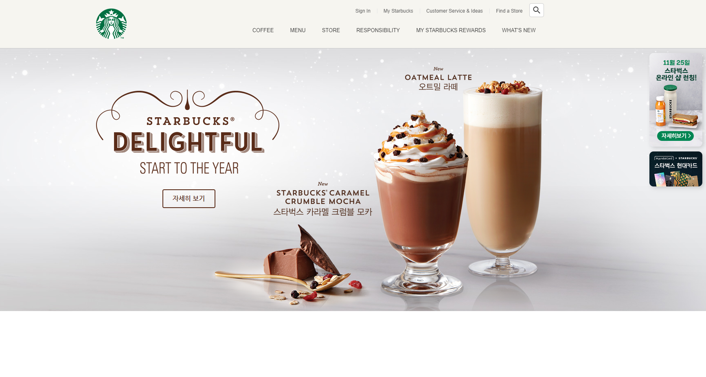

> # Starbucks Clone04

<br>

<p align="center">

</p>

<br/>

> ## 유튜브 영상 배경 - 반복 애니메이션

- 유튜브 영상 배경위에 일정 하게 반복되는 애니메이션을 구현하고자 함
- [Gsap : easing ](https://greensock.com/docs/v2/Easing)
- [Gsap : to 함수 사용법 (옵션 포함)](<https://greensock.com/docs/v3/GSAP/gsap.to()>)

<br/>

## HTML, CSS

- 반복되게 할 이미지를 inner에 추가함
- CSS는 알맞은 위치에 배치 함

```html
<div class="youtube__cover">
  <div class="inner">
    
    
    
  </div>
</div>
```

<br/>

## JS 반복 애니메이션

<br/>

- 랜덤한 숫자를 생성하는 함수
  - 각 애니메이션에 특정 옵션값을 랜덤하게 줌으로써 볼때마다 다르게 움직이게 하려고 함

```js
function random(min, max) {
  return parseFloat((Math.random() * (max - min) + min).toFixed(2));
}
```

- `floatingObject`라는 함수느 선택자, 지연시간, y축 이동 거리를 인자로 받아서 gsap의 to 함수에 사용되어진다.
- `gsap.to(요소, 지속시간, 옵션)`

```js
function floatingObject(selector, delay, size) {
  gsap.to(selector, random(1.5, 2.5), {
    y: size, // y축 이동 거리
    repeat: -1, // 반복횟수 (-1은 무한 반복)
    yoyo: true, // 실행한 애니메이션 반대로 돌아오기
    ease: Power1.easeInOut, // 애니메이션의 실행 느낌
    delay: random(0, delay), // 지연시간 (몇초뒤에 시작하는 가)
  });
}
floatingObject(".floating1", 1, 15); // 선택자를 넣어도 요소로 간주함
floatingObject(".floating2", 0.5, 15);
floatingObject(".floating3", 1.5, 20);
```

<br/>
<br/>
<br/>

> ## 고정 이미지 배경 (패럴렉스 구조)

- 기본적으로 요소의 배경은 요소가 스크롤 되면 요소와 같이 움직여서 화면에서 사라짐
- 하지만, **고정이미지 배경은 특정 요소의 배경이 viewport에 고정되어 화면을 따라 가는 것을 말함**
- 요소의 크기가 작아 배경의 일부분만 보이는 경우
  - 스크롤시 요소는 위로 올라가고, 배경은 viewport를 따라감으로서 요소의 배경이 스크롤 되듯이 보임

## CSS

- `background-attachment: fixed;`를 사용해서 고정 이미지 배경을 만들 수 있음

```css
.pick-your-favorite {
  background-image: url("../images/favorite_bg.jpg");
  background-repeat: no-repeat; /* 반복 없음 */
  background-position: center; /* 배경이미지의 중앙 기준 */
  background-attachment: fixed; /* 배경 화면 고정 */
  background-size: cover; /* 배경이미지를 요소 전체를 덮음 (height, width 중 제일 큰 사이즈 기준으로)*/
}
```

<br/>
<br/>
<br/>
 
> ## 3D 애니메이션

<br/>

- transform의 rotateY 함수를 이용해서 이미지를 앞뒤로 두어 transition 효과로 입체적인 구현이 가능함
- 코인, 메달과 같이 앞뒤에 정보를 보여주는 형태

<br/>

## 원리

<p class="codepen" data-height="409" data-theme-id="dark" data-default-tab="css,result" data-user="raccooncode96" data-slug-hash="PopOGBY" style="height: 409px; box-sizing: border-box; display: flex; align-items: center; justify-content: center; border: 2px solid; margin: 1em 0; padding: 1em;" data-pen-title="PopOGBY">
  <span>See the Pen <a href="https://codepen.io/raccooncode96/pen/PopOGBY">
  PopOGBY</a> by RaccoonCode96 (<a href="https://codepen.io/raccooncode96">@raccooncode96</a>)
  on <a href="https://codepen.io">CodePen</a>.</span>
</p>
<script async src="https://cpwebassets.codepen.io/assets/embed/ei.js"></script>

<br/>

## HTML

- medal : 3d 애니메이션으로 이미지가 움직이는 공간
  - front : 기본 앞면
  - back : 뒷면

```html
<section class="reserve-store">
  <div class="inner">
    <div class="medal">
      <div class="front">
        
      </div>
      <div class="back">
        
        <a href="javascript:void(0)" class="btn">매장 안내</a>
      </div>
    </div>
  </div>
</section>
```

## CSS

- 입체적인 효과를 낼수 있는 속성

1. front, back 요소 겹치기 -> `position: abosolute;`
2. front, back 기본 rotate 배치 (컨테이너 안에서 back만 뒤집는 것)
   - front -> `transform: rotateY(0deg);` (컴퓨터가 인하게 편하게 현재상태가 0임을 명시함)
   - back -> `transform: rotateY(-180deg);`
3. back, front 요소 각자의 뒷명을 투명하게 만듦 -> `backface-visibility: hidden;`
4. hover 상태시 rotateY 수정하기
   - ratateY의 변화 값이 양수면 오른쪽(반시계)으로 돌게 됨, 음수면 왼쪽(시계)로 돌게됨 (즉, 값이 커지면 우, 작아지면 좌)
   - front -> `transform: rotateY(180deg);` (180 커짐 -> 우턴)
   - back -> `transform: rotateY(0deg);` (180 커짐 -> 우턴)
5. 전환효과 주기 -> `transition: 1s` (상태가 변하기 전 해당 요소에 주어야 함)
6. 원근감 주기 -> `perspective: 600px` (돌아가는 요소의 부모요소에 주어야 함)

- 포인트 -> 요소를 뒤집어 앞뒤로 배치한다 하더라도, 각 요소를 제어해줘야함 부모요소를 뒤집는 다고 해서 안에 있는 요소 모두 뒤집히지 않음

```css
.reserve-store .medal {
  width: 334px;
  height: 334px;
  perspective: 600px;
}
.reserve-store .medal .back,
.reserve-store .medal .front {
  width: 334px;
  height: 334px;
  position: absolute;
  backface-visibility: hidden;
  transition: 1s;
}
.reserve-store .medal .front {
  transform: rotateY(0deg);
}
.reserve-store .medal:hover .front {
  transform: rotateY(180deg);
}

.reserve-store .medal .back {
  transform: rotateY(-180deg);
}
.reserve-store .medal:hover .back {
  transform: rotateY(0deg);
}
```

<br/>
<br/>
<br/>
 
> ## 스크롤 위치 계산 - ScrollMagic

<br/>

- 현재 스크롤을 계산하여, 특정 요소에 도달하였을 때를 알려주는 `ScrollMagic` 스크롤 라이브러리를 사용함
- 특정 요소를 target으로 하여 여러가지 스크롤 옵션을 넣어, 스크롤이 해당 요소에 도착하면 특정 클래스를 넣었다 뺐다 가능함.
- [ScrollMagic CDN](https://cdnjs.com/libraries/ScrollMagic)
- [Scrollmagic Docs](http://scrollmagic.io/docs/)

<br/>

## 전체적인 맥락

- 여기에서는 `scroll-spy` 클래스를 필요한 `section` 클래스에 추가하고, ScrollMagic이 `scroll-spy` 가 붙은 요소들에 스크롤이 만족되면 `show` 클래스를 넣음
- 애니메이션 : 특정 요소가 처음에는 다른곳에서 투명하다가 right 나 left로 이동하여 의도한 자리에 나타남
  - 기본적으로 위치를 변경해주고, 투명인 상태를 유지하도록 하고, `show`가 붙었을 때 원래자리로 돌아오고, 다 보일수 있게 함
  - 그리고, 애니메이션이 한 파트에서도 `delay`를 가지며 순차적으로 실행되게 하고자 함

## CSS

- `.back-to-position` 을 붙인 요소는 기본적으로 투명하고 변할때, 전환효과(`transition`)를 가지도록함
- 오른쪽에서 이동할지, 왼쪽에서 이동할지 `.to-right` 또는 `.to-left`를 지정함
  - 각 클래스는 150px을 해당 자리에서 각 방향으로 물린다. (**일치선택자 주의**)
- `.show .back-to-position`를 `opacity: 1`, `transitionX(0)`으로 설정하여 스크롤 트리거가 작동시 나타나게 함
- `.show .back-to-position.delay-0`를 delay 마다 지정함 으로써 파트안에서도 각 요소들이 다른 delay를 가지게 하여 순차적으로 애니메이션이 실행되게 함

```css
.back-to-position {
  opacity: 0;
  transition: 1s;
}
.back-to-position.to-right {
  transform: translateX(-150px);
}
.back-to-position.to-left {
  transform: translateX(150px);
}
.show .back-to-position {
  opacity: 1;
  transform: translateX(0);
}
.show .back-to-position.delay-0 {
  transition-delay: 0s;
}
.show .back-to-position.delay-1 {
  transition-delay: 0.3s;
}
.show .back-to-position.delay-2 {
  transition-delay: 0.6s;
}
.show .back-to-position.delay-3 {
  transition-delay: 0.9s;
}
```

<br/>

## JS

- target 부분을 `section.scroll-spy` 선택자가 있는 요소들 모두를 가져와 `spyEls`에 할당
- 배열인 `spyEls`를 `forEach`를 통해서 반복문 실행
- new 키워드로 `ScrollMagic` 클래스를 생성
- `.Scene` 함수를 통해서 스크롤이 감시할 요소(`triggerElement`)와 스크롤 센서의 화면 위치(`triggerHook`)을 지정함
- `.setClassToggle` 함수를 이용해서 감시할 요소에 붙일 html 클래스명을 지정
- `.addTo` 함수를 통해서 `Controller`가 실행할수 있게 부착함

```js
const spyEls = document.querySelectorAll("section.scroll-spy");
spyEls.forEach(function (spyEl) {
  new ScrollMagic.Scene({
    triggerElement: spyEl, // 보여짐 여부를 감시할 요소 (target)
    triggerHook: 0.8, // target 센서의 화면 지점 (0 ~ 1)
  })
    .setClassToggle(spyEl, "show")
    .addTo(new ScrollMagic.Controller()); // 내부에 컨트롤러에 실제 동작하도록 넣음
});
```

<br/>
<br/>
<br/>

> ## 푸터 만들기

<br/>

- 푸터도 header 처럼 아무 기능 없는 footer라는 태그를 사용함
- copyright 기호를 쓰기 위해서 `&copy;`라는 html entity를 사용해야 함
- 그리고 매년 해당 연도를 기재하기 위해서 html에서 span 태그로 요소의 자리를 추가해 놓고 JS로 `textContent`, `Date`, `getFullYear()`로 업데이트 하도록함

```js
const thisYear = document.querySelector(".this-year");
thisYear.textContent = new Date().getFullYear();
```

- img 요소 `display: block; + margin: 0 auto;` -> width 속성 없이도 가운데 정렬이 가능함 (img는 요소는 그 크기를 자신이 인자하고 있어서)
- **가상요소 before 가 특정 요소의 뒤, after가 앞인데 -> 뒤가 나중에 앞이 처음에 쓴 부분임 `after요소before`**

<br/>
<br/>
<br/>

> ## To Top (제일 위로 가기 버튼)

- 제일 위로가기 버튼을 만들어 스크롤의 상태를 0으로 가게 함
- 그리고 뱃지와 반대로 스크롤이 내려가면 생기고, 특정 지점 위로 올라가면 사라지게 함

## HTML

- 스크롤의 위치를 변경시키는 라이브러리는 Gsap에서 제공하고 있는데, Gsap의 경우 너무 많은 애니메이션 기능을 한번에 제공하면 페이지가 기능하기 까지 너무 오래 걸리기 때문에 따로, 기능별로 CDN을 나누어 놓았다.
- 해당 기능을 제공하는 라이브러리 CDN -> Gsap ScrollToPlugin

```html
<script
  src="https://cdnjs.cloudflare.com/ajax/libs/gsap/3.6.1/ScrollToPlugin.min.js"
  integrity="sha512-kSI9CgGh60rJbNVeMJvfNX0UTKAq8LEOea/yKJQbFpIroxT7bf9/zUFXbnfsQP5F6xlOOHtCfBPgsE1ceiHnRw=="
  crossorigin="anonymous"
  referrerpolicy="no-referrer"
></script>

<!-- TO-TOP -->
<div id="to-top">
  <div class="material-icons">arrow_upward</div>
</div>
```

## JS

- 일단, 스크롤에 따른 **버튼 화면in , out**은 기존의 gsap 기능으로 하여 `x` 옵션값을 변경해서 가능함
- 스크롤를 0으로 되돌리는 것은 `scrollTo` 옵션으로 가능함 (targer은 window로 해야함)

```js
window.addEventListener(
  "scroll",
  _.throttle(function () {
    if (window.scrollY > 500) {
      // 뱃지 사라지기
      gsap.to(badgeEl, 0.6, {
        opacity: 0,
        display: "none",
      });
      // 위로가기 버튼 화면 안으로 이동
      gsap.to(toTopEl, 0.2, {
        x: 0,
      });
    } else {
      // 뱃지 보이기
      gsap.to(badgeEl, 0.6, {
        opacity: 1,
        display: "block",
      });
      // 위로가기 버튼 화면 밖으로 이동
      gsap.to(toTopEl, 0.2, {
        x: 100,
      });
    }
  }, 300)
);

// 화면이동
// window는 브라우저임
toTopEl.addEventListener("click", function () {
  gsap.to(window, 0.7, {
    scrollTo: 0,
  });
});
```
