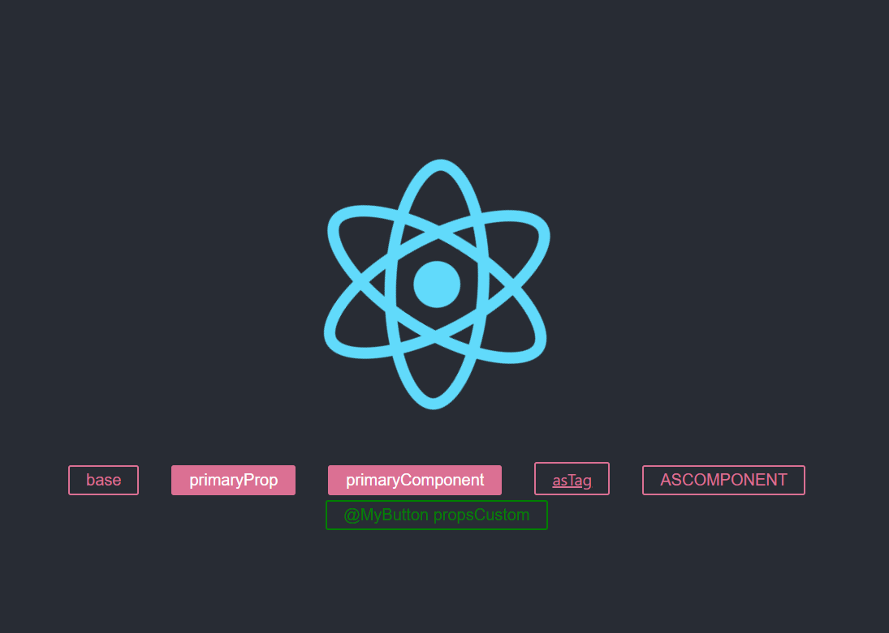

> # React 06

<br/>

<p align="center">

</p>

<br/>

> # Styled Components

<br/>

- react, CRA를 통해서가 아닌 별도의 라이브러리를 이용해서 편하게 사용하는 방법
- [Styled-Components Official Site](https://styled-components.com/)
- styled Components : 컴포넌트 자체에 style이 있어 별도의 css, css module 필요 없이 하는 방식
  - styled components, emotion 등이 있음
- 설치 : `npm i styled-components`

<br/>

## 기본 사용법

<br/>

- styled-components를 import로 연결하여 styled객체를 가져와서 사용함
- ES6에서 제공하는 Tagged Template Literals 기능을 활용함
  - [styled-components : Tagged Template Literals](https://styled-components.com/docs/advanced#tagged-template-literals)
  - [more explaination : TTL](https://mxstbr.blog/2016/11/styled-components-magic-explained/)
- 사용하는 태그이름을 속성으로 연결하고, 옆에 ` `` `를 붙여 안에 CSS 내용을 적으면 됨
- 그리고 그것을 export 해서 사용하고자 하는 곳에서 component로 사용하면 style이 적용되어 져서 나타남
- **그리고, dev tool에서 확인해보면 styled-component가 알아서 클래스를 생성하여 스타일을 지정하고, 해당 component에 집어 넣어줌**
- styled-component를 통해서 만들어진 component의 경우 **기본적으로 props로 `children`과 `className`을 가지고 있음**
  - styled component 에서 `children`은 component에서 사용된 inner, `className`은 SC 가 임의적으로 붙인 className임

```js
import styled from "styled-components";
const StyledButton = styled.button`
  background: transparent;
  border-radius: 3px;
  border: 2px solid palevioletred;
  color: palevioletred;
  margin: 0 1em;
  padding: 0.25em 1em;
  font-size: 20px;
`;

export default StyledButton;
```

```js
import logo from "./logo.svg";
import "./App.css";
import StyledButton from "./components/StyledButton";

function App() {
  return (
    <div className="App">
      <header className="App-header">
        
        <p>
          <StyledButton>base</StyledButton>
        </p>
      </header>
    </div>
  );
}

export default App;
```

<br/>
<br/>

## props 를 가진 component의 경우 (props에 따른 style 제어)

- `<StyledButton primary={true}>버튼</StyledButton>` 표현과 `<StyledButton primary>버튼</StyledButton>`는 같은 표현임
- primary라는 props를 넣음

```js
import logo from "./logo.svg";
import "./App.css";
import StyledButton from "./components/StyledButton";

function App() {
  return (
    <div className="App">
      <header className="App-header">
        
        <p>
          <StyledButton>base</StyledButton>
          <StyledButton primary>primaryProp</StyledButton>
        </p>
      </header>
    </div>
  );
}

export default App;
```

- 해당 백틱안에 사용해서 `${}`을 사용하여 안에 함수를 넣어 사용함
- 함수는 props를 받아 `&&` 논리 연산자를 통해서 지정한 props가 있으면 css가 표현 될수 있게 설정함
- `css`라는 키워드를 앞에 넣어주어 더 명시적으로 css임을 알수있게 함

```js
import styled, { css } from "styled-components";
const StyledButton = styled.button`
  background: transparent;
  border-radius: 3px;
  border: 2px solid palevioletred;
  color: palevioletred;
  margin: 0 1em;
  padding: 0.25em 1em;
  font-size: 20px;

  ${(props) =>
    props.primary &&
    css`
      background: palevioletred;
      color: white;
    `}
`;

export default StyledButton;
```

<br/>

## 기존의 컴포넌트를 활용하여 style을 추가한, 새로운 컴포넌트 만들기

- styled 객체를 **함수처럼 사용**해서 안에 해당 컴포넌트를 넣고 옆에 `` 안에 추가적인 css를 넣어 가능함
- **이를 받아와 바로 사용하면 component가 됨**

```js
import logo from "./logo.svg";
import "./App.css";
import StyledButton from "./components/StyledButton";
import styled from "styled-components";

// 기존 컴포넌트에 css 추가 작업 -> 새로운 컴포넌트
const PrimaryStyledButton = styled(StyledButton)`
  background: palevioletred;
  color: white;
`;

function App() {
  return (
    <div className="App">
      <header className="App-header">
        
        <p>
          <StyledButton>base</StyledButton>
          <PrimaryStyledButton>primaryComponent</PrimaryStyledButton>
        </p>
      </header>
    </div>
  );
}

export default App;
```

<br/>
<br/>

## 기존 컴포넌트의 스타일만 다른 태그에 사용하고자 하는 경우

- 컴포넌트의 `as` 속성에 `태그 이름`을 넣고, 그 태그에 대한 필수 속성을 지정 해주면 됨
- 또 `as` 속성에 특정 component를 넣어 사용도 가능함
- **`as` 사용시, 대체 되어지는 component에 props 연결시 `Spread syntax`사용 가능함**

```js
import logo from "./logo.svg";
import "./App.css";
import StyledButton from "./components/StyledButton";

// UpperCaseButton 컴포넌트 - props를 받고 해당 JSX에서 props를 사용 해야함
// children 항목에 함수를 넣어서 children도 바꿀 수 있음
// props = // {children: "button", className: "sc-bdnxRM fLecOq"}
const UpperCaseButton = (props) => (
  <button {...props} children={props.children.toUpperCase()} />
);

function App() {
  return (
    <div className="App">
      <header className="App-header">
        
        <p>
          <StyledButton>base</StyledButton>
          <StyledButton as="a" href="/">
            asTag
          </StyledButton>
          <StyledButton as={UpperCaseButton}>asComponent</StyledButton>
        </p>
      </header>
    </div>
  );
}

export default App;
```

<br/>
<br/>

## js로 만든 컴포넌트를 SC를 통해서 스타일을 입히고 사용하는 경우

- SC로 바로 만든 component가 아닌 순수한 컴포넌트의 경우 나중에 sc를 통해서 styled가 되면,
- **SC의 기본적인 props인 className, children을 순수 컴포넌트 까지 연결 시켜줘야 함**
  - **`Spread syntax`로 사용하면 안되고 `className`, `children` 각각 연결 시켜줘야 함**
- 컴포넌트가 사용되어 지는 경우, props를 받아서 styled에서 css에 활용 될수 있음
- 그리고, 추가 css 부분에, 가상클래스, 가상요소도 사용할 수 있음

```js
import logo from "./logo.svg";
import "./App.css";
import StyledButton from "./components/StyledButton";
import styled from "styled-components";

// props = {children: "button", className: "sc-dlnjwi jjrKEV"}
const MyButton = (props) => (
  <button className={props.className} children={`MyButton ${props.children}`} />
);

const StyledMyButton = styled(MyButton)`
  background: transparent;
  border-radius: 3px;
  border: 2px solid ${(props) => props.color || "palevioletred"};
  color: ${(props) => props.color || "palevioletred"};
  margin: 0 1em;
  padding: 0.25em 1em;
  font-size: 20px;

  :hover {
    border: 2px solid red;
  }

  :: before {
    content: "@";
  }
`;

function App() {
  return (
    <div className="App">
      <header className="App-header">
        
        <p>
          <StyledMyButton color="green">propsCustom</StyledMyButton>
        </p>
      </header>
    </div>
  );
}
```

<p align="center">

</p>

<br/>

## 글로벌 스타일(Global Style) 만들기

<br/>

- 이때 까지는 className의 오염을 막기 위해서, componet 마다 독립적인 style을 가질 수 있도록 SC를 활용 했다.
- 그런데, 전역 스타일로 common Style을 따로 빼서 사용할 수 도 있다.
- SC의 `createGlobalStyle`을 사용해서 만들수 있음

```js
import logo from "./logo.svg";
import "./App.css";
import styled, { createGlobalStyle } from "styled-components";

// Global Style 만들기
const GlobalStyle = createGlobalStyle`
button {
  color: yellow;
}
`;

function App() {
  return (
    <div className="App">
      <GlobalStyle />
      <header className="App-header">
        
        <p></p>
      </header>
    </div>
  );
}

export default App;
```

<br/>

## 컴포넌트 styled 하면서 속성 까지 지정하기

- 굳이 component를 사용할 때 component 속성을 같이 제시하지 않고 사용할 수 있음
- styled 할때 component에 속성까지 미리 지정해서 반복적인 기본 속성을 독립적으로 사용할 수 있다.

```js
// StyledA.jsx
import styled from "styled-components";

// 새탭에서 열기, 주소 설정
const StyledA = styled.a.attrs((props) => ({
  target: "_BLANK",
  href: "https://google.com",
}))`
  color: ${(props) => props.color};
`;

export default StyledA;
```

```js
//App.js
import logo from "./logo.svg";
import "./App.css";
import StyledA from "./components/StyledA";

function App() {
  return (
    <div className="App">
      <header className="App-header">
        
        <p>
          <StyledA>attrs</StyledA>
        </p>
      </header>
    </div>
  );
}

export default App;
```

<br/>
<br/>
<br/>

> # 웹 컴포넌트 (React-Shadow)

<br/>

- 컴포넌트 개념에 대한 표준을 이야기 함
- [MDN : Web_Components](https://developer.mozilla.org/ko/docs/Web/Web_Components)

## Shadow DOM

- 본래 html과 영향을 주지 않는 별도의 html 덩어리
- style에 대한 완전한 오염을 막는 기술
- `npm i react-shadow`

## React-Shadow 사용

- react-shadow를 받아 root component를 받아 사용함
- `<root.div></root.div>` 태그 안에 component를 넣고, `style 태그`를 넣어 작성하면
  - 해당 부분만 style 영향을 받음
- 즉, 오염되지 않고 독립적으로 사용가능 함

```js
import logo from "./logo.svg";
import root from "react-shadow";

const styles = `
.App {
  text-align: center;
}

.App-logo {
  height: 40vmin;
  pointer-events: none;
}

@media (prefers-reduced-motion: no-preference) {
  .App-logo {
    animation: App-logo-spin infinite 20s linear;
  }
}

.App-header {
  background-color: #282c34;
  min-height: 100vh;
  display: flex;
  flex-direction: column;
  align-items: center;
  justify-content: center;
  font-size: calc(10px + 2vmin);
  color: white;
}

.App-link {
  color: #61dafb;
}

@keyframes App-logo-spin {
  from {
    transform: rotate(0deg);
  }
  to {
    transform: rotate(360deg);
  }
}

p {
  color: yellow;
}
`;

function App() {
  return (
    <root.div>
      <div className="App">
        <header className="App-header">
          
          <p>
            Edit <code>src/App.js</code> and save to reload.
          </p>
          <a
            className="App-link"
            href="https://reactjs.org"
            target="_blank"
            rel="noopener noreferrer"
          >
            Learn React
          </a>
        </header>
      </div>
      <style type="text/css">{styles}</style>
    </root.div>
		<p>Go</p>
    // Go는 p 태그 style yellow를 적용 받지 않음
  );
}

export default App;
```

## 단점

- 공통적인 스타일의 경우 계속 반복적으로 작성해줘야 함
- 외부 내부가 차단되어 있어서, document에서 값을 받아서 사용하기는 힘듦

<br/>
<br/>
<br/>

> # Ant Design

- 하나의 컴포넌트 모음
- 이미 디자인된 component를 사용해서 디자인
- `npm i antd`

## 전역 스타일, 컴포넌트 사용

```js
import "antd/dist/antd.css"; // 전역 스타일 추가 index.js
import { Calendar } from "antd"; // 리액트 컴포넌트 사용 App.js
```

## 부분 스타일, 컴포넌트 사용

```js
import "antd/es/date-picker/style/css";
import DatePicker from "antd/es/date-picker";
```

## 자동화 부분 스타일 가져오기

- eject를 해야함 -> `npm run eject`
- `npm i babel-plugin-import -D`

```js
{
  ...
  "babel": {
    "presets": [
      "react-app"
    ],
    "plugins": [
      [
        "import",
        {
          "libraryName": "antd",
          "libraryDirectory": "es",
          "style": "css",
        }
      ]
    ]
  },
  ...
}
```

<br/>

## ant design icons

- `npm i --save @ant-design/icons`
- [Ant Design : icons](https://ant.design/components/icon/)

<br/>

## ant design layout (Grid)

- Row Component
  - **`gutter` 속성**은 Column 끼리의 떨어짐을 이야기 하고 숫자가 의미하는 단위는 px임
    - `<Row gutter={16+8n의 정수}></Row>`
    - 16, 24, 32, 40, 48 ...
  - `justify` 속성, `align` 속성
    - `<Row type="flex" justify="좌우" align="위아래">`
    - start , center, end, space-between, space-around / top, middle, bottom
- Col Component
  - Column의 경우 전체 24를 기준으로 되어 있음
  - Col Component의 **`span` 속성**에 값을 넣어 column 크기 조절, 비율을 조정함
    - `<Col span={24중의 비율}/>`
  - **`offset` 속성**은 span이 가지고 있는 값중의 일부를 사용해서 사이를 띄움
    - `<Col offset={24중 건너띄고 싶은 정수} />`

<br/>
<br/>
<br/>
