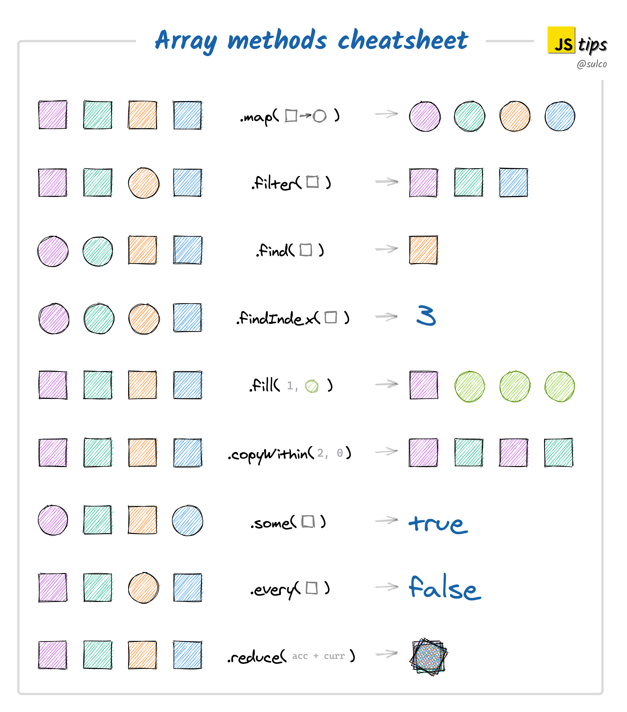

> # React 14

<br/>

<p align="center">

</p>

<br/>

> # JS Array Cheat Sheet

<br/>

<p align="center">

<a herf="https://twitter.com/sulco/status/1281545450273865730/photo/1">by TomekSulkowsi</a>
</p>

<br/>
<br/>
<br/>

> # React Project : 쇼핑몰

<br/>

> # 프로젝트 개요

<br/>

- Context API로 상품 리스트와 상품주문의 상태를 공유하고 이를 Hooks를 이용해서 변경하고 사용하는 개발 형태
- 장바구니에 담기 기능이 있는 쇼핑몰 만들기
- 기본적인 디자인을 보는 것이 아닌 기능과, 코드 관리에 중점을 둠

<br/>
<br/>
<br/>

> # 기본 컴포넌트 구성

<br/>

- `Header` : 쇼핑몰 안내 관련 기본적인 Header 형태
- `Prototypes` : 상품이 진열 되는 곳
  - 개별 상품 : video, title, price, description, addButton
- `Order` : 장바구니 역할
  - Prototypes 컴포넌트에서 addButton 클릭시 장바구니로 1개의 수량 씩 추가됨
  - 같은 품목을 중복해서 누르는 경우 장바구니에 들어있는 품목의 수량만 늘어남
  - 다른 품목을 누르는 경우 장바구니에 새로운 품목이 추가됨 (품목 기준의 장바구니 임)
- `Footer` : 기본적인 footer

<br/>
<br/>
<br/>

> # ContextAPI를 통한 제품 정보 및 사용 함수 관리

<br/>

- 컴포넌트 끼리 States, Props를 통해서 정보를 전달하고 활용하게 되면 점점 State, Props의 연결이 복잡하게 됨으로써 관리가 까다로워 지고 서로 영향을 주게 됨
- ContextAPI를 통해서 전달하는 정보, 함수(Actions)를 관리하게 되면, 독립적으로 사용되어 깔끔하게 사용 할 수 있음

<br/>
<br/>
<br/>

## context 만들기

<br/>

- 기본적으로 Context Provider를 만들어 정보를 나누기전에 Context 객체가 필요함

```js
// AppStateContext.js
import React from "react";

// context 객체 생성, defaultValue 설정
const AppStateContext = React.createContext();

export default AppStateContext;
```

<br/>
<br/>
<br/>

## Custom Context.Provider Component (with Children)

<br/>

- 사실은 context를 만들면 context.provider에 바로 접근하여 데이터를 공유할 컴포넌트를 묶어주면 사용준비가 끝난 상태이다.
- 하지만, 위처럼 App.js에서 바로 context.provider로 묶고 App.js에서 공유할 정보를 작성하면 App.js가 복잡하게 느껴짐
- 그래서, **따로 Custom context.provider이 Children을 받아들이도록 만들어서 provider를 깔끔하게 App.js에서 사용할 수 있고 공유할 정보를 독립적으로 관리할 수 있다.**
- 모든 state, method들은 이곳에서 만들어 지기 때문에 **어떤 컴포넌트에서 setState를 사용하는 경우 setState를 전달할 필요도 없이** 그냥 이곳에서 setState를 활용하는 해당 method를 넣어 구현하고 method를 전달하면 됨

```js
// AppStateProvider.jsx
import { useCallback, useState } from "react";

// Context 가져오기
import AppStateContext from "../contexts/AppStateContext";

const AppStateProvider = ({ children }) => {
  // Datas : useState
  const [orders, setOrders] = useState([]);
  const [prototypes] = useState([
    {
      id: "pp-01",
      title: "Kids-story",
      artist: "Thomas Buisson",
      desc: "This prototype was made with ProtoPie, the interactive prototyping tool for all digital products.",
      thumbnail:
        "https://prototype-shop.s3.ap-northeast-2.amazonaws.com/thumbnails/Kids-story_1.mp4",
      price: 10,
      pieUrl: "https://cloud.protopie.io/p/8a6461ad85",
    },
    {
      id: "pp-02",
      title: "mockyapp",
      artist: "Ahmed Amr",
      desc: "This prototype was made with ProtoPie, the interactive prototyping tool for all digital products.",
      thumbnail:
        "https://prototype-shop.s3.ap-northeast-2.amazonaws.com/thumbnails/mockyapp.mp4",
      price: 20,
      pieUrl: "https://cloud.protopie.io/p/27631ac9d5",
    },
    {
      id: "pp-03",
      title: "macOS Folder Concept",
      artist: "Dominik Kandravý",
      desc: "Folder concept prototype by Dominik Kandravý.",
      thumbnail:
        "https://prototype-shop.s3.ap-northeast-2.amazonaws.com/thumbnails/macOS_Folder_Concept_-_Folder_concept.mp4",
      price: 30,
      pieUrl: "https://cloud.protopie.io/p/acde5ccdf9",
    },
    {
      id: "pp-04",
      title: "Translator",
      artist: "Tony Kim",
      desc: "This prototype was made with ProtoPie, the interactive prototyping tool for all digital products.",
      thumbnail:
        "https://prototype-shop.s3.ap-northeast-2.amazonaws.com/thumbnails/Translator.mp4",
      price: 40,
      pieUrl: "https://cloud.protopie.io/p/b91edba11d",
    },
    {
      id: "pp-05",
      title: "In-car voice control",
      artist: "Tony Kim",
      desc: "This prototype was made with ProtoPie, the interactive prototyping tool for all digital products.",
      thumbnail:
        "https://prototype-shop.s3.ap-northeast-2.amazonaws.com/thumbnails/In-car_voice_control.mp4",
      price: 50,
      pieUrl: "https://cloud.protopie.io/p/6ec7e70d1a",
    },
  ]);

  // Actions : useCallback
  const addToOrder = useCallback(() => {});
  const remove = useCallback(() => {});
  const removeAll = useCallback(() => {});

  // Children에 context로 전달하는 값 연결
  return (
    <AppStateContext.Provider
      value={{
        orders,
        prototypes,
        addToOrder,
        remove,
        removeAll,
      }}
    >
      {children}
    </AppStateContext.Provider>
  );
};

export default AppStateProvider;
```

<br/>

- 최종적으로 AppStateProvider 컴포넌트 자체에는 어떤 값을 줄지는 모두 설정 되어 있고, 어느 컴포넌트에 값을 공유 해줄 것인지 정하여 children으로 들어가게 해주면 됨
- **즉, 컴포넌트 표현 형태로 공유해주고 싶은 컴포넌트들을 묶어 주어 사용하면 됨**

```js
// App.js
import Header from "./components/Header";
import Prototypes from "./components/Prototypes";
import Orders from "./components/Orders";
import Footer from "./components/Footer";
import AppStateProvider from "./providers/AppStateProvider";

function App() {
  return (
    <AppStateProvider>
      <Header />
      <div className="container">
        <Prototypes />
        <Orders />
        <Footer />
      </div>
    </AppStateProvider>
  );
}

export default App;
```

<br/>
<br/>
<br/>

> # Context CustomHooks로 관리하기 (Hooks 폴더)

- context에서 제공하고 있는 state 인, Prototypes, Orders를 좀더 가독성 좋게 사용하고 정리하기 위해 Hooks로 만들어 관리
  - `useActions.js` -> addToOrder, remove, removeAll
  - `useOrders.js` -> orders
  - `usePrototypes.js` -> Prototypes
- **`useContext()` 함수를 활용하여 해당 Context를 인자로 넣으면** value 형태로 값을 모두 가져올 수 있는데, **구조 분해 할당을 활용**하여 사용할 값만 가져와 사용 할 수 있음

```js
import { useContext } from "react";
import AppStateContext from "../contexts/AppStateContext";

export default function usePrototypes() {
  // useContext를 통해서 AppstateContext에서 제공하고 있는 정보 중에서 prototypes를 받음
  const { prototypes } = useContext(AppStateContext);

  return prototypes;
}
// 사용하고 싶은 곳에서 usePrototypes() 만 사용하면 쉽게 값을 가져올 수 있음
```

```js
import { useContext } from "react";
import AppStateContext from "../contexts/AppStateContext";

export default function useOrders() {
  const { orders } = useContext(AppStateContext);

  return orders;
}
```

```js
import { useContext } from "react";
import AppStateContext from "../contexts/AppStateContext";

export default function useActions() {
  const { addToOrder, remove, removeAll } = useContext(AppStateContext);

  return { addToOrder, remove, removeAll };
}
```

<br/>
<br/>
<br/>

> # 상품 목록 만들기 (Prototypes Component)

<br/>

- usePrototypes를 사용해서, 상품 목록 정보 가져오기 (prototypes)
- useActions를 사용해서, 상품 추가 mothod 가져오기 (addToOrder)

<br/>

- 상품목록에서 상품을 꺼내서 각 상품별 정보 담아 오기
  - `prototypes.map()` -> 각 상품 prototype 구조 분해 할당으로 정보 담아옴 -> 각 상품 별 JSX 반복
  - button에 달려있는 Click 함수 정의 -> `addToOrder()` 에 해당 상품 id 넣어 추가

```js
import useActions from "../hooks/useActions";
import usePrototypes from "../hooks/usePrototypes";

export default function Prototypes() {
  // 사용할 값, method 가져오기
  const prototypes = usePrototypes();
  const { addToOrder } = useActions();

  return (
    <main>
      <div className="prototypes">
        {
          // 상품 리스트에서 상품 가져와 각 상품에 대한 JSX 반복
          prototypes.map((prototype) => {
            const { id, thumbnail, title, price, desc, pieUrl } = prototype;
            const click = () => {
              addToOrder(id);
            };
            // 상품 1개에 대한 출력 모양
            return (
              <div className="prototype" key={id} /*id 추가 주의*/>
                {/*Thumnail 표현 부분*/}
                <a href={pieUrl} target="_BLANK" rel="noreferrer">
                  <div
                    style={{
                      padding: "25px 0 33px 0",
                    }}
                  >
                    <video
                      autoPlay
                      loop
                      playsInline
                      className="prototype__artwork prototype__edit"
                      src={thumbnail}
                      style={{
                        objectFit: "contain",
                      }}
                    ></video>
                  </div>
                </a>
                <div className="prototype__body">
                  {/* title, button 표현 부분*/}
                  <div className="prototype__title">
                    <div
                      className="btn btn--primary float--right"
                      onClick={click}
                    >
                      <i className="icon icon--plus" />
                    </div>
                    {title}
                  </div>
                  {/* Price, Desc 표현 부분*/}
                  <p className="prototype__price">$ {price}</p>
                  <p className="prototype__desc">{desc}</p>
                </div>
              </div>
            );
          })
        }
      </div>
    </main>
  );
}
```

<br/>
<br/>
<br/>

> # 주문 목록 만들기 (Orders Component)

```js
import { useMemo } from "react";
import useActions from "../hooks/useActions";
import useOrders from "../hooks/useOrders";
import usePrototypes from "../hooks/usePrototypes";

export default function Orders() {
  // 사용할 값, method 가져오기
  const orders = useOrders();
  const prototypes = usePrototypes();
  const { remove, removeAll } = useActions();

  // 주문 총합계 금액 계산
  const totalPrice = useMemo(() => {
    return orders
      .map((order) => {
        const { id, quantity } = order;
        const prototype = prototypes.find((p) => p.id === id);
        return prototype.price * quantity;
      })
      .reduce((l, r) => l + r, 0);
  }, [orders, prototypes]);

  // 주문 목록에 주문이 없는 경우 JSX
  if (orders.length === 0) {
    return (
      <aside>
        <div className="empty">
          <div className="title">You don't have any orders</div>
          <div className="subtitle">Click on a + to add an order</div>
        </div>
      </aside>
    );
  }

  // 주문 목록에 주문이 있는 경우 JSX
  return (
    <aside>
      <div className="order">
        <div className="body">
          {
            // 주문 리스트(orders)에서 주문(order) 가져와 각 주문에 대한 JSX 반복
            orders.map((order) => {
              const { id } = order;

              // 주문 id와 상품 목록에 있는 상품 id가 일치하는 경우, 해당 상품 정보 가져오기
              const prototype = prototypes.find((p) => p.id === id);

              // 해당 주문 제거하는 method
              const click = () => {
                remove(id);
              };

              // 주문 품목 1개에 대한 출력 모양
              return (
                <div className="item" key={id} /*id 추가 주의*/>
                  {/*주문 상품 Thumnail*/}
                  <div className="img">
                    <video src={prototype.thumbnail}></video>
                  </div>
                  {/*주문 상품 Title*/}
                  <div className="content">
                    <p className="title">
                      {prototype.title} X {order.quantity}
                    </p>
                  </div>
                  {/*주문 품목 수량 Total Price & 품목 제거 버튼 */}
                  <div className="action">
                    <p className="price">
                      $ {prototype.price * order.quantity}
                    </p>
                    <button className="btn btn--link">
                      <i className="icon icon--cross" onClick={click}></i>
                    </button>
                  </div>
                </div>
              );
            })
          }
        </div>
        {/* 주문 목록 Total Price 창 */}
        <div className="total">
          <hr />
          <div className="item">
            <div className="content">Total</div>
            {/* Total Price 표시 */}
            <div className="action">
              <div className="price">$ {totalPrice} </div>
            </div>
            {/* 주문 목록 전체 제거 버튼*/}
            <button className="btn btn--link" onClick={removeAll}>
              <i className="icon icon--delete" />
            </button>
          </div>
          {/* 주문 하기 버튼*/}
          <button
            className="btn btn--secondary"
            style={{ width: "100%", marginTop: 10 }}
          >
            CheckOut
          </button>
        </div>
      </div>
    </aside>
  );
}
```

<br/>
<br/>
<br/>

> # Provider Methods 로직 작성하기

- **setState에서 callback을 넣으면 해당 callback의 첫번째 매개변수는 state임**
- useCallback, useMemo를 사용하는 이유가 state, props의 변경으로 인해서 컴포넌트 자체가 rerender시 재선언 되는 현상을 제어를 위함임
- [이화랑 블로그 : useMemo&useCallback](https://leehwarang.github.io/2020/05/02/useMemo&useCallback.html)

```js
import { useCallback, useState } from 'react';
import AppStateContext from '../contexts/AppStateContext';

const AppStateProvider = ({ children }) => {
	const [prototypes] = useState([...]]);
	const [orders, setOrders] = useState([]);

// Methods

  const addToOrder = useCallback((id) => {
		// 버튼클릭으로 주문요청 id를 받아 orders에 해당 id와 수량 정보가 들어오게 함 ([{id, quantity: 1}] 형태)
    // useCallback으로 로직이 재선언 되는 것을 막음 (최초에 선언 되면 그 로직을 계속 활용하도록 함)
		setOrders((orders) => {
      // 주문 목록(orders)에서 주문요청 id와 주문 목록(orders)의 상품 id와 같은 상품의 정보(finded)를 가져옴
			const finded = orders.find((order) => order.id === id);

      // 주문 목록과 주문요청이 같은 것이 없는 경우
			if (finded === undefined) {
        // 원래 주문 목록에 주문요청 id 항목의 수량 1을 추가
				return [...orders, { id, quantity: 1 }];

      // 주문 목록과 주문요청이 같은 것이 있는 경우
			} else {
        // 주문 목록(orders)을 돌면서,
				return orders.map((order) => {

          // 주문목록의 상품(order)과 주문요청 상품(id)과 같으면,
					if (order.id === id) {
            // 해당 주문목록의 상품의 경우 주문요청 상품 id에 quantity를 기존 order의 quantity에 1추가
						return {
							id,
							quantity: order.quantity + 1,
						};

          // 주문목록의 상품과 주문요청 상품이 같지 않으면,
					} else {
            // 해당 주문목록의 상품은 그대로 둔다.
						return order;
					}
				});
			}
		});
	}, []);

	const remove = useCallback((id) => {
    // 주문 목록을 돌면서, 제거하는 품목의 아이디가 아닌 주문 상품만 주문목록에 설정함
		setOrders((orders) => {
			return orders.filter((order) => order.id !== id);
		});
	}, []);

	const removeAll = useCallback(() => {
    // 주문목록을 빈 배열로 설정함
		setOrders([]);
	}, []);

	return (
		<AppStateContext.Provider
			value={{
				orders,
				prototypes,
				addToOrder,
				remove,
				removeAll,
			}}
		>
			{children}
		</AppStateContext.Provider>
	);
};

export default AppStateProvider;

```

<br/>
<br/>
<br/>
