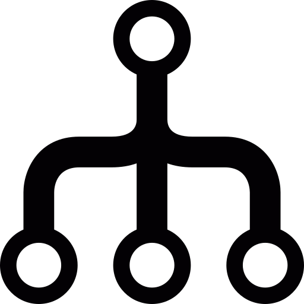

> # DataStructure 04

<br/>

<p align="center">

</p>

<br/>
<br/>

> # 시간 복잡도 : 알고리즘 복잡도 표현 방법01

<br/>

- 하나의 문제를 푸는 알고리즘은 다양할 수 있는데, **다양한 알고리즘 중 어느 알고리즘이 더 좋은지 분석하기 위해서 복잡도를 정의하고 계산함 (성능의 판단 기준)**
  - 예) 정수의 절대값 구하기 : 방법01 - 정수값을 제곱하여 루트사용 / 방법02 - 양수는 그대로 , 음수는 -1을 곱해서 출력 -> 둘중 어떤것이 좋은 것인지 알아야 할 필요는 있음

<br/>

## 알고리즘 복잡도 계산 항목(요소)

<br/>

- 알고리즘의 성능을 판단하는 알고리즘 복잡도에 대한 계산 항목이 존재한다.
  - `시간 복잡도` : 알고리즘 실행 속도
  - `공간 복잡도` : 알고리즘이 사용하는 메모리 사이즈
- 둘을 비교하자면, **가장 중요한 건 실행 속도이므로 시간 복잡도**를 필수적으로 이해하고 계산할 수 있어야 함

<br/>

## 알고리즘 시간 복잡도의 주요 요소

<br/>

- **반복문을 가지고 시간 복잡도를 계산함**
  - 하나의 알고리즘을 구성하는 여러 코드들을 보고 있으면, 보통 반복문이 시간이 제일 오래 걸리는 코드이므로 시간복잡도에 가장 큰 영향을 미치는 것은 반복문 이다.
  - 예) 차로 서울에서 부산가기 :
    - 자동차 문열기 - 자동차 문닫기 - 자동차 운전석 등받이 조정하기 - 자동차 시동걸기
    - 운전하여 서울에서 부산가기 (가장 오래 걸리는 작업)
    - 자동차 문열기 - 자동차 문닫기
  - 또한, 반복문 안에서 입력 개수를 몇개를 지정하느냐에 따라서 반복문의 `반복회수`도 달라지고, `한 회수에 처리하는 일의 양`에 따라서 반복문이 일을 처리하는데 걸리는 시간이 많이 차이남
  - **즉, 반복문을 어떻게 구성하느냐에 따라서 시간 복잡도가 많이 차이가 남**

<br/>

## 알고리즘 성능 표기법

<br/>

- **Big O(빅-오) 표기법: O(N)**
  - 알고리즘 `최악의 실행 시간`을 표기
  - **가장 많이/일반적으로 사용**
  - **보수적 지표로, 아무리 최악의 상황이라도 이정도 성능은 보장한다는 의미**
- Ω(오메가) 표기법: Ω(N)
  - 알고리즘 최상 실행 시간 표기
- θ(세타) 표기법: θ(N)
  - 알고리즘 평균 실행 시간 표기
- N 에는 성능 표현식이 들어감

<br/>
<br/>
<br/>

> # Big-O 표기법

- Big-O, 빅 오 표기법이라고 부름
- `O(입력)`
  - 입력은 n으로 된 표현식으로 시간 복잡도 함수를 나타냄
  - n은 사용자의 입력에 따라서 결정되는 반복문의 반복 횟수를 이야기 함
  - **반복문에서 n을 사용하는 구성을 어떻게 짜느냐(n으로 된 표현식)에 따라 사용자가 입력(n)에 숫자 크게 넣을 수록 반복횟수의 변화가 달라져 시간 복잡도가 달라짐**

<br/>

- O(1), O(𝑙𝑜𝑔𝑛), O(n), O(n𝑙𝑜𝑔𝑛 ), O( 𝑛2 ), O( 2𝑛 ), O(n!) 등으로 표기함
  - **시간복잡도 : O(1) < O( 𝑙𝑜𝑔𝑛 ) < O(n) < O(n 𝑙𝑜𝑔𝑛 ) < O( 𝑛2 ) < O( 2𝑛 ) < O(n!)**
  - 𝑙𝑜𝑔𝑛의 밑은 2임

<br/>

- 사용자의 입력 n에 따라 , 몇번 실행되는지 계산 하면됨
- n으로된 표현식에는 가장 큰 영향을 미치는 n의 단위로 표기함
- 즉, **n이 무한히 커진다고 했을 때 급격히 커지는 n의 표현을 사용함 (가장 높은 차수 표현을 표기)**

<br/>

<p align="center">

<div style="text-align: center">Big-O graph by mingcoder</div>
</p>

## 예시

<br/>

- `O(1)` : 사용자의 입력에 상관없이 상수번 실행하는 경우 (횟수가 정해져 있음)

```python
if n > 89
  print(n)
# 1번 또는 2번 실행 -> n이 커지던 작아지던, 횟수가 정해져 있음
```

<br/>

- `O(n)` : 사용자의 입력 n에 의해서 n번 실행함 (직선 형태)

```python
numberOne = 1
for num in range(3):
  for i in range(n):
    print(i)
# 3n + 1 번 실행함 -> 주요 영향은 n -> O(n) 으로 표기
```

<br/>

- `O(n^2)` : 사용자의 입력 n에 의해서 n^2번 실행함

```python
numberOne = 1
for n in range(300):
  for i in range(n):
    for k in range(n):
      print(k)
# 300n^2 + 1 번 실행함 -> 주요 영향은 n^2 -> O(n^2)으로 표기 함
```

<br/>
<br/>
<br/>

> # 실제 알고리즘을 예시로 시간 복잡도 구해보기 (Big-O)

<br/>

- 1 부터 N까지의 합을 구하는 알고리즘

<br/>

## 알고리즘01 : 1에서 1씩 N번 증가 시키기

<br/>

- 사용자 입력에 따라 코드를 n + 1번 실행 -> 시간 복잡도: n, 빅오 표기법: O(n)

```python
def sumAll(n):
  total = 0
  for num in range(1, n+1):
    total += num
  return total
```

<br/>
<br/>

## 알고리즘02 : 시그마 n 공식 사용

<br/>

- [시그마 공식 유도 by yusseong40](https://sseong40.tistory.com/9)
- ∑n = `n(n+1)/2`
  - N = 1 + 2 + 3 + ... + (n-1) + n
  - N = n + (n-1) + (n-2) ... + 2 + 1
  - 두 식을 더함 -> 2N
  - (n+1) + (n+1) + ... + (n+1) + (n+1)
  - (n+1)이 n번 더해짐 -> 2N = n(n+1) => N = n(n+1)/2
- **사용자 입력에 따라 n이 변해도 코드를 1번만 실행 -> 시간 복잡도: 1, 빅오 표기법: O(1)**

```python
def sumAll(n):
  return int(n(n+1)/2)
```

<br/>

## 결론

<br/>

- N번 증가: O(n) vs 시그마N 공식 : O(1)
- -> 시그마N 공식 알고리즘이 시간복잡도가 낮아 성능면에서 더 좋음
