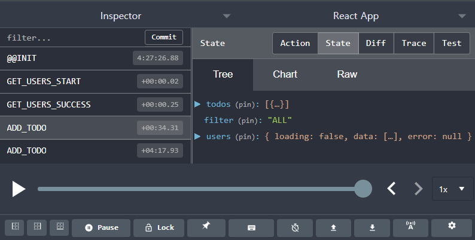

> # Redux 04

<br/>

<p align="center">

</p>

<br/>
<br/>
<br/>

> # Redux MiddleWare (리덕스 미들웨어)

<br/>

- [Redux : MiddleWare](https://lunit.gitbook.io/redux-in-korean/advanced/middleware)
- [velopert : Redux MiddleWare](https://velopert.com/3401)

<br/>

- 미들웨어가 **dispatch** 의 앞뒤에 코드를 추가할 수 있게 해줌
- dispatch 메소드를 통해 store로 가고 있는 Action을 가로채는 코드
- 미들웨어가 여러개면 미들웨어가 **순차적으로** 실행됨
  - 스토어를 만들때, 미들웨어를 설정함
    - `applyMiddleware()`함수로 미들웨어들을 묶어서 `createStore()`함수의 두번째 인자로 넣어줌
  - 디스패치가 호출 될때 실제로 미들웨어를 통과하는 부분
    - **디스패치가 호출 될때 마다 미들웨어에서 action을 인자로 받는 부분이 실행됨**

<br/>

- `next()` :
  - next()가 호출된 곳의 미들웨어 다음에 다른 미들웨어가 있는 경우 -> 다음 미들웨어의 action을 받는 함수를 가르킴
  - next()가 호출된 곳의 미들웨어 다음에 다른 미들웨어가 없는 경우 -> dispatch method

<br/>

- 보통 로깅 및 충돌 보고서를 받고자 하는 경우 사용함
- **실무에서는 미들웨어를 만들어서 사용하지 않고 리덕스 미들웨어 라이브러리를 활용해서 redux의 고급기능을 사용함**
- middleware를 통해서 dispatch가 되기전에 다른 state를 가져오거나, 다른 dispatch를 보내는 등의 행위를 부가적으로 할 수 있음

```js
import { applyMiddleware, createStore } from "redux";
import reducer from "./reducers/reducer";

function middleware1(store) {
  // store를 받는 것은 dispatch, getState 를 사용하려고
  console.log("middleware1", 0); // (1)
  return (next) => {
    console.log("middleware1", 1, next); // (4)
    return (action) => {
      console.log("middleware1", 2); // (5)
      const returnValue = next(action); // (6) - 다음 미들웨어 action을 받는 함수로 이동함
      // (11) dispatch를 받고, returnValue에 할당
      console.log("middleware1", 3); // (12)
      return returnValue; // (13) - reducer로 보냄
    };
  };
}

function middleware2(store) {
  console.log("middleware2", 0); // (2)
  return (next) => {
    console.log("middleware2", 1, next); // (3)
    return (action) => {
      console.log("middleware2", 2); // (7)
      const returnValue = next(action); // (8) - dispatch에 action을 담아 넣음
      console.log("middleware2", 3); // (9)
      return returnValue; // (10)
    };
  };
}

const store = createStore(reducer, applyMiddleware(middleware1, middleware2));

export default store;
```

<br/>
<br/>
<br/>

> # Redux-Devtools

<br/>

- `npm i redux-devtools-extension -D`
- `applyMiddleware()`를 `composeWithDevTools()`안에 넣어주어 연결하면, 브라우저에서 redux-devtools를 사용할 수 있음
- Chrom의 경우 redux devtools 익스텐션을 설치해서 사용가능 함

<br/>

```js
import { applyMiddleware, createStore } from "redux";
import reducer from "./reducers/reducer";
import { composeWithDevTools } from "redux-devtools-extension";

const store = createStore(reducer, composeWithDevTools(applyMiddleware()));

export default store;
```

<br/>

- 각 타입 이름에 따른 reduer, State, Action, Diff 등을 볼수 있고, 그 외의 다양한 기능들을 제공함

<br/>

<p align="center">

</p>

<br/>
<br/>
<br/>

> # Redux-thunk

<br/>

- 많이 사용하는 리덕스 미들웨어 라이브러리 중 하나
- 리덕스 만든 사람이 만들었음
- **리덕스에서 비동기 처리를 위한 라이브러리**
- 액션 생성자를 활용하여 비동기 처리
- 액션 생성자가 액션을 리턴하지 않고, 함수를 리턴
- `npm i redux-thunk`
- **thunk는 액션 생성자가 함수를 return 할때만 반응하고**,
  - 액션 생성자가 원래대로 action 객체 return 하면 기존 동작 처럼 동작함

<br/>

## store, middleware 부분에 thunk 연결

<br/>

- `applyMiddleware()`안에 `thunk`를 넣음 (thunk도 미들웨어임)
- ActionCreator이 Action이 아닌 함수를 return 하므로, dispatch 하기 전에 미들웨어인 thunk에서 이를 먼저 받아서 그냥 함수를 실행 해버림

```js
import { applyMiddleware, createStore } from "redux";
import reducer from "./reducers/reducer";
import { composeWithDevTools } from "redux-devtools-extension";
import thunk from "redux-thunk";

// thunk 연결
const store = createStore(reducer, composeWithDevTools(applyMiddleware(thunk)));

export default store;
```

<br/>

## 비동기 작업 함수를 return 하는 ActionCreator 만들기

<br/>

- **액션을 생성하는 쪽에서 비동기 작업을 하고 다시 dispatch 할 수 있는 함수를 return 하게하는 ActionCreator를 만듦**
- getUsersThunk라는 ActionCreator를 만들어서 사용하는데, Thunk가 있으니까 Action 객체가 아니어도 반응하게 됨
- 그리고, ActionCreator를 생성하는 곳에서 비동기 작업 함수를 만들기 때문에 **더 편하게, 다른 ActionCreator를 활용해 dispatch 할수 있게 구현할수 있음**

```js
// Actions.js

// Thunk로 구현한 비동기 작업 함수
export function getUsersThunk() {
  return async (dispatch) => {
    try {
      dispatch(getUsersStart());
      const res = await axios.get("https://api.github.com/users");
      dispatch(getUsersSuccess(res.data));
    } catch (error) {
      dispatch(getUsersFail(error));
    }
  };
}
```

<br/>

## Container에서 비동기 작업 함수 요청하기

<br/>

```js
import { useCallback } from "react";
import { useDispatch, useSelector } from "react-redux";
import UserList from "../components/UserList";
import { getUsersThunk } from "../redux/actions";

export default function UserListContainer() {
  const users = useSelector((state) => state.users.data);
  const dispatch = useDispatch();

  // 과거 비동기 작업 함수
  // const getUsers = useCallback(async () => {
  // 	try {
  // 		dispatch(getUsersStart());
  // 		const res = await axios.get('https://api.github.com/users');
  // 		dispatch(getUsersSuccess(res.data));
  // 	} catch (error) {
  // 		dispatch(getUsersFail(error));
  // 	}
  // }, [dispatch]);

  // Thunk 활용한 비동기 작업 함수 요청하기
  const getUsers = useCallback(() => {
    dispatch(getUsersThunk());
  }, [dispatch]);

  return <UserList users={users} getUsers={getUsers} />;
}
```

<br/>
<br/>
<br/>

> # Redux-promise-middleware

<br/>

- 또 다른 리덕스 비동기 미들웨어
- `npm i redux-promise-middleware`
- store에 `applyMiddleware()` 안에 `promise` 를 넣어 연결함

<br/>

## 프로미스 미들웨어 Store에 연결

<br/>

```js
// store.js
import { applyMiddleware, createStore } from "redux";
import reducer from "./reducers/reducer";
import { composeWithDevTools } from "redux-devtools-extension";
import promise from "redux-promise-middleware";

const store = createStore(
  reducer,
  composeWithDevTools(applyMiddleware(promise))
);

export default store;
```

<br/>

## 비동기 작업 함수를 가진 ActionCreator 만들기

<br/>

- 프로미스 미들웨어의 특징은, 비동기 작업 함수를 ActionCreator에서 Action 객체 형태로 return 하는 구조로 만듦
- `{type: "", payload: async() => {비동기 작업}}` 형식

```js
// redux-promise-middleware Types&ActionCreator
const GET_USERS = "GET_USERS";

// promise가 자동으로 만들어 주는 Action의 Type이름
export const GET_USERS_PENDING = "GET_USERS_PENDING";
export const GET_USERS_FULFILLED = "GET_USERS_FULFILLED";
export const GET_USERS_REJECTED = "GET_USERS_REJECTED";

export function getUsersPromise() {
  return {
    type: GET_USERS,
    payload: async () => {
      const res = await axios.get("https://api.github.com/users");
      return res.data;
    },
  };
}
```

<br/>

## Container에서 요청 함수 만들기

<br/>

- 비동기 작업 Action을 dispatch 하는 함수 만들고 Component에 연결
- 해당 ActionCreator로 dispatch 하면 payload에 있는 함수를 실행하고 해당 함수에 의해 store에 반영할 데이터를 return 함
- promise 에서 비동기 작업 함수 Action을 dispatch 하면 작업을 수행하면서, 이 Action을 참고하여 type을 변조한 시작, 실패, 성공 Action을 만들어 dispatch 함
  - **요청 작업 type명에 `_PENDING`, `_FULFILLED`, `_REJECT` 붙여 type을 만들어 해당 Action까지 만들어서 보내줌**
  - 그래서 굳이 해당 **시작, 성공, 실패에 대한 ActionCreator를 만들 필요를 없게 만들어 줌**

```js
import { useCallback } from "react";
import { useDispatch, useSelector } from "react-redux";
import UserList from "../components/UserList";
import { getUsersPromise } from "../redux/actions";

export default function UserListContainer() {
  const users = useSelector((state) => state.users.data);
  const dispatch = useDispatch();

  const getUsers = useCallback(() => {
    dispatch(getUsersPromise());
  }, [dispatch]);

  // GET_USERS를 dispatch 했지만, devtools에서는 GET_USERS_PENDING, GET_USERS_FULFILLED 로 되어 있음
  // promise 에서 비동기 작업 합수 Action을 dispatch 하면 작업을 수행하면서, 이 Action을 참고하여 type을 변조한 시작, 실패, 성공 Action을 만들어 dispatch 함

  return <UserList users={users} getUsers={getUsers} />;
}
```

<br/>

## Dispatch한 Action을 처리할 Reducer 만들기

<br/>

- **redux-promise-middleware가 만든 Action을 처리할 Reducer를 만들어서 store에 어떻게 저장 할건지 정해야함**
  - 데이터를 받아오는 Action의 Reducer라면, 해당 데이터는 `action.payload` 를 통해서 가져와 store에 반영함

```js
import {
  GET_USERS_FULFILLED,
  GET_USERS_PENDING,
  GET_USERS_REJECTED,
} from "../actions";

const initialState = {
  loading: false,
  data: [],
  error: null,
};

export default function users(state = initialState, action) {
  // redux-promise-middleware Reducer

  if (action.type === GET_USERS_PENDING) {
    // 시작 변경이라서 딱히 데이터를 받아오지 않아서 값만 바꾸어 주면됨
    return {
      ...state,
      loading: true,
      error: null,
    };
  }

  if (action.type === GET_USERS_FULFILLED) {
    // action의 payload로 데이터를 가져옴 (payload에 들어 있던 함수의 return)
    return {
      ...state,
      loading: false,
      data: action.payload,
    };
  }

  if (action.type === GET_USERS_REJECTED) {
    // error 또한, paylaod로 들어옴
    return {
      ...state,
      loading: false,
      error: action.payload,
    };
  }

  return state;
}
```
