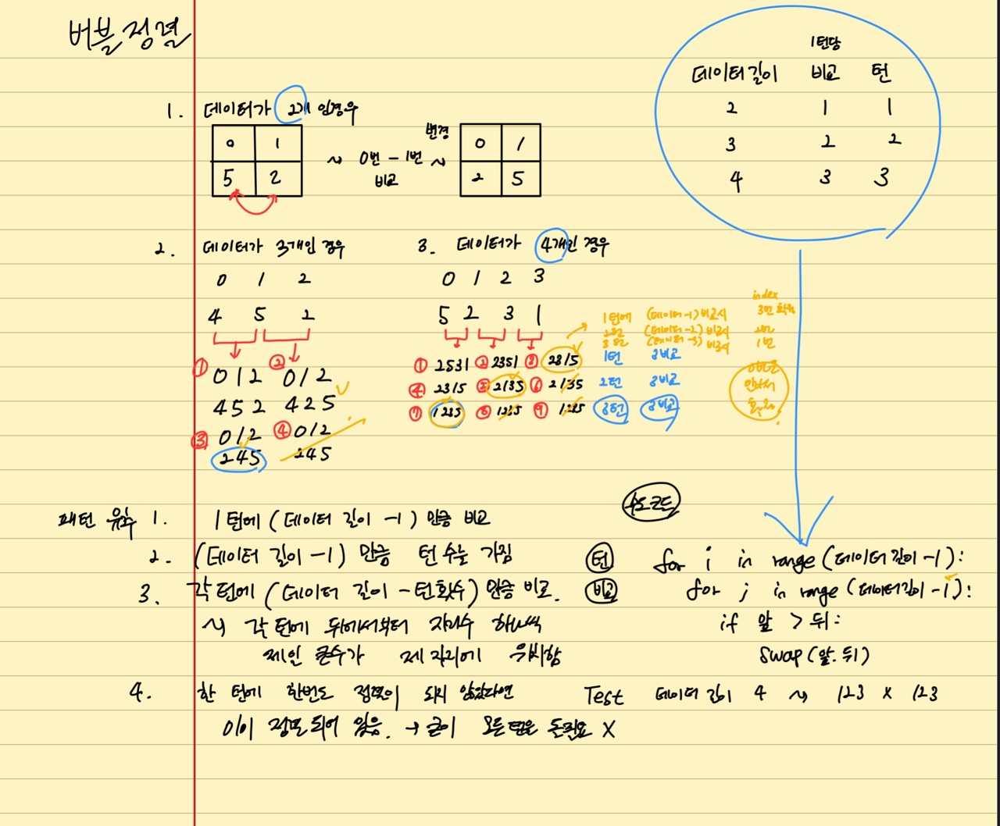
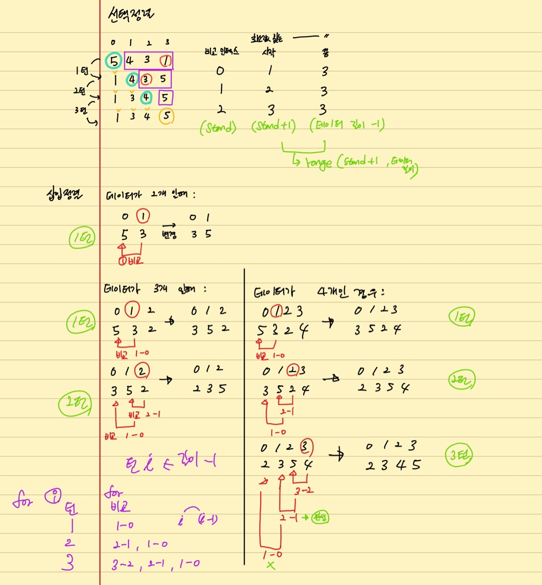

> # Algorithm 01

<br/>

<p align="center">

</p>

<br/>
<br/>
<br/>

> # 알고리즘

<br/>

- 실제로 개발자들이 해당 알고리즘을 하나하나 작성하여 쓰지는 않음, 모두 좋은 패키지로 함수화 되어 나와 있음
- 그럼에도 익히는 이유는 지금까지 존재하는 알고리즘 중에 잘 만들어진 알고리즘을 익힘으로서 잘 알고리즘을 만들수 방법을 잘 이해하고, 이를 기반으로 새로운 문제들을 풀수 있는 능력을 기르기 위함

<br/>

## 알고리즘 연습 방법

<br/>

- 효과적인 알고리즘을 작성하기 위해서는 바로 코드를 작성하지 말고, 전통적인 알고리즘 연습 방법으로 진행하자
  - 문제를 쓰고, 연습장에 고안해서 최종적으로 에디터에 코드를 작성해서 테스트를 함
  - 효율적인 알고리즘을 고안을 하고 테스트를 해야함

<br/>

1. 연습장과 펜 준비
2. 알고리즘 문제를 읽고 분석
3. **간단하게 테스트용으로 매우 간단한 경우부터 복잡한 경우 순서대로 생각해보면서**, 연습장과 펜을 이용하여 알고리즘을 생각해 본다.
4. 가능한 알고리즘이 보인다면, 구현할 알고리즘을 세부 항목으로 나누고, **문장으로 세부 항목으로 나누어서 적어 본다.**
5. 코드화 하기 위해, **데이터 구조 또는 사용할 변수를 정리** (노트에)
6. 각 문장을 코드 레벨로 적음
7. 데이터 구조 또는 사용할 변수가 코드에 따라 어떻게 변하는지를 손으로 적으면서, 임의 데이터로 코드가 정상 동작하는지를 연습장과 펜으로 검증

<br/>
<br/>
<br/>

> # Bubble sort (버블 정렬)

<br/>

## 정렬 (sorting)

<br/>

- 정렬 : 어떤 데이터들이 주어졌을 때 이를 정해진 순서대로 나열하는 것
  - 데이터 (4, 6, 1, 7) -> 정렬 알고리즘 -> 정렬된 데이터 (1, 4, 6, 7)
- 정렬은 프로그램 작성시 빈번하게 필요로 함
- 다양한 알고리즘이 고안되었고, 알고리즘 학습의 필수
- 동일 문제에 다양한 알고리즘 고안, 알고리즘 간 성능 비교를 통한 성능 분석 이해 가능

<br/>

## 버블 정렬

<br/>

- 두 인접한 데이터를 비교해서, 앞 데이터 > 뒤 데이터 이면 자리를 바꾸어 뒤로 갈수록 큰 값을 가지게 정렬함
- 비교할 때 인접한 데이터를 비교하는 경우의 수가 모두 자리에 맞게 되었을 경우 멈춤
- [해당 알고리즘 눈으로 확인하기](https://visualgo.net/en/sorting)

<br/>

> ## 알고리즘 고안

<br/>

## 패턴 분석해 보기

<br/>

- 데이터가 2개인 경우
  - (5, 2)
  - 첫번째 턴: (2, **5**)
  - 데이터 길이: 2, 전체 턴: 1, 비교: 1

<br/>

- 데이터가 3개인 경우
  - (4, 5, 2)
  - 첫번째 턴: (4, 5, 2) - (4, 2, **5**)
  - 두번째 턴: (2, **4**, 5) - ~~(2, 4, 5)~~
  - 데이터 길이: 3, 전체 턴: 2, 비교: 2

<br/>

- 데이터가 4개인 경우
  - (5, 2, 3, 1)
  - 첫번째 턴: (2, 5, 3, 1) - (2, 3, 5, 1) - (2, 3, 1, **5**)
  - 두번째 턴: (2, 3, 1, 5) - (2, 1, **3**, 5) - ~~(2, 1, 3, 5)~~
  - 세번째 턴: (1, **2**, 3, 5) - ~~(1, 2, 3, 5)~~ - ~~(1, 2, 3, 5)~~
  - 데이터 길이: 4, 전체 턴: 3, 비교: 3

<br/>

- 패턴 결과
  - 1턴에 (데이터 길이 - 1) 만큼 비교
  - 전체 턴수는 (데이터 길이 - 1) 임
  - 각 턴별로 (데이터 길이 - 턴 번호(zero based) - 1) 번 비교하면, 각턴에 배열 뒤부터 제자리를 맞춰감
    - 각턴을 살펴보면, 각턴 마다 (데이터 길이 - 턴번호 - 1) 만큼의 비교 횟수면 제일큰 숫자, 그다음으로 큰 숫자 ... 순으로 제 자리에 위치하게 됨
  - 한턴에 한번도 정렬이 되지 않았다면 이미 그 턴에 데이터가 잘 위치한 것이므로 빨리 빠져 나올 수 있음

<br/>

| 데이터 길이 | 비교 | 턴  |
| :---------: | :--: | :-: |
|      2      |  1   |  1  |
|      3      |  2   |  2  |
|      4      |  3   |  3  |

<br/>

- 최대 비교해야 하는 횟수
  - N = n-1 + n-2 ... + 1
  - 2N = n(n-1)
  - N = n(n-1)/2

<br/>

## 수도 코드 고안

- range(0) -> 아무 것도 안함

```python
for turn in range(데이터 길이 - 1): # turn : 0 부터 시작
  for comparison in range(데이터 길이 - 1 - turn):
    if 앞 데이터 > 뒤 데이터:
      swap(앞, 뒤)
```

<br/>

## 코드 고안

- 한턴에 바꾸는 것이 일어나지 않으면, 바로 나온다는 것도 고려함

```python
def bubblesort(data):
  for index in range(len(data) - 1):
    swap = False
    for index2 in range(len(data) - index - 1):
      if data[index2] > data[index2+1]:
        data[index2], data[index2+1] = data[index2+1], data[index2]
        swap = True
    if swap == False:
      break
  return data

import random
data_list = random.sample(range(100), 50) # sample 함수는 알아서 list로 만들어 줌
bubblesort(data_list)
```

<br/>

## 시간 복잡도

<br/>

- 반복문이 두개로 `O(n^2)`
  - 최악의 경우, `n*(n-1)/2`
- 완전 정렬시 최선의 경우 `O(n)`

<br/>
<br/>
<br/>

<p align="center">

</p>

<br/>
<br/>

---

<br/>
<br/>
<br/>

> # Selection sort (선택 정렬)

<br/>

- 주어진 데이터중, 최소값을 찾음
- 해당 최소값을 데이터 맨 앞에 위치한 값과 교체
- 교체한 자리를 제외한 나머지 데이터에서 동일한 방법을 반복
- [해당 알고리즘 눈으로 확인하기](https://visualgo.net/en/sorting)

<br/>
<br/>

> ## 알고리즘 고안

<br/>

## 패턴 분석해 보기

<br/>

| i    | 0     | 1     | 2     | 3   |
| ---- | ----- | ----- | ----- | --- |
| 기본 | 5     | 4     | 3     | 1   |
| 1턴  | **1** | 4     | 3     | 5   |
| 2턴  | **1** | **3** | 4     | 5   |
| 3턴  | **1** | **3** | **4** | 5   |

<br/>

- 최솟값을 찾는 비교
  - 1턴에서는 0, 1, 2, 3 인덱스 비교해서 최솟값 추출
  - 2턴에서는 1, 2, 3 인덱스 비교해서 최솟값 추출
  - 3턴에서는 2, 3 인덱스 비교해서 최솟값 추출

<br/>

- 굵은 숫자의 경우 변경되어 제자리에 최솟 값이 들어가 고착된 부분
  - 1턴에서는 0번 인덱스 고착
  - 2턴에서는 1번 인덱스 고착
  - 3턴에서는 3번 인덱스 고착 (데이터 길이가 4라서 4번 인덱스는 자동으로 고착)

<br/>

- 데이터 4개인 경우, 데이터 N개인 경우

| 턴  | 비교 | 턴  | 비교 |
| :-: | :--: | :-: | :--: |
|  1  |  3   |  1  | N-1  |
|  2  |  2   |  2  |  2   |
|  .  |  .   | ... | ...  |
|  3  |  1   | N-1 |  1   |

<br/>

## 수도 코드 고안

```python
for stand in range(len(data) -1):
  lowest = stand
  for index in range(stand + 1, len(data)): # 최솟값을 검색하는 부분에서 서로 비교해서, 최소값의 인덱스 추출 (여기에서는 검색 시작이 0번 부터임)
    if data[lowest] > data[index]:
      lowest = index
  swap(lowest, stand)
```

<br/>

## 코드 고안

```python
def selection_sort(data):
  for stand in range(len(data) - 1):
    lowest = stand
    for index in range(stand + 1, len(data)):
      if data[lowest] > data[index]:
        lowest = index
    data[lowest], data[stand] = data[stand], data[stand]
  return data

# TEST

import random
data_list = random.sample(range(100), 10)
selection_sort(data_list)
```

<br/>

## 시간 복잡도

- 반복문이 두 개 `O(n^2)`
  - `n*(n-1)/2`

<br/>
<br/>
<br/>

> # Insertion sort(삽입 정렬)

<br/>

- [해당 알고리즘 눈으로 확인하기](https://visualgo.net/en/sorting)
- 인덱스 1번 부터 시작해서, 해당 데이터를 좌로 이동시켜서 좌로 이동시킨 값들과 비교해서 올바른 위치에 위치시킴
- 삽입 시키는 값(기준)은 계속 좌에 있는 이미 삽입되어 있는 데이터와 비교하고, 자신보다 큰 값을 만나면 넘기고, 자신보다 작은 값을 만나면 그때 그 뒤에 위치하게 됨

<br/>
<br/>
<br/>

> ## 알고리즘 고안

<br/>

## 패턴 분석해 보기

<br/>

- 데이터가 2개 일때:

| 턴, 비교 |     |     |       |     |     |     |
| -------- | --- | --- | ----- | --- | --- | --- |
| 1        | i   | 0   | **1** | ->  | 0   | 1   |
| 1-0      | v   | 5   | 3     |     | 3   | 5   |

<br/>

- 데이터가 3개 일때:

| 턴, 비교 |     |     |       |       |     |     |     |     |
| -------- | --- | --- | ----- | ----- | --- | --- | --- | --- |
| 1 turn   | i   | 0   | **1** | 2     | ->  | 0   | 1   | 2   |
| 1-0      | v   | 5   | 3     | 2     |     | 3   | 5   | 2   |
| 2 turn   | i   | 0   | 1     | **2** | ->  | 0   | 1   | 2   |
| 2-1, 1-0 | v   | 3   | 5     | 2     |     | 2   | 3   | 5   |

<br/>

- 데이터가 4개 일때:

| 턴, 비교      |     |     |       |       |       |     |     |     |     |     |
| ------------- | --- | --- | ----- | ----- | ----- | --- | --- | --- | --- | --- |
| 1 turn        | i   | 0   | **1** | 2     | 3     | ->  | 0   | 1   | 2   | 3   |
| 1-0           | v   | 5   | 3     | 2     | 4     |     | 3   | 5   | 2   | 4   |
| 2 turn        | i   | 0   | 1     | **2** | 3     | ->  | 0   | 1   | 2   | 3   |
| 2-1, 1-0      | v   | 3   | 5     | 2     | 4     |     | 2   | 3   | 5   | 4   |
| 3 turn        | i   | 0   | 1     | 2     | **3** | ->  | 0   | 1   | 2   | 3   |
| 3-2, 2-1, 1-0 | v   | 2   | 3     | 5     | 4     |     | 2   | 3   | 4   | 5   |

<br/>

| 턴  | 비교          |
| --- | ------------- |
| 1   | 1-0           |
| 2   | 2-1, 1-0      |
| 3   | 3-2, 2-1, 1-0 |

<br/>

- 전체 turn 수 = 데이터 길이 - 1 -> for 반복
- 1턴에서 비교 횟수 = 턴 숫자 -> for 반복
- 각 턴에서의 비교 구조 -> (턴수, 턴수-1)의 구조가 턴수가 1일 될때 까지 반복

<br/>
<br/>

## 코드 고안

<br/>

- turn은 비교를 시작하는 특정 인덱스가 좌측과 비교되는 전체 과정을 말함
  compare은 1 turn에 특정 인덱스가 좌측의 값과 비교하는 하나하나의 과정을 말함

```python
def insertion_sort(data):
  for turn in range(len(data) -1): # 0, 1, 2
    for compare in range(turn + 1, 0, -1): # (0: 1) -> (1: 1, 2) -> (2: 1, 2, 3)
      if data[compare] < data[compare - 1]: # 비교 값이 작으면 변경
        data[compare], data[compare - 1] = data[compare - 1], data[compare]
      else:
        break
  return data

# TEST
import random

data_list = random.sample(range(100), 50)
print(insertion_sort(data_list))
```

<br/>
<br/>

## 시간 복잡도

- 반복문이 2개로 `O(n^2)`
  - 최악 `n*(n-1)/2`
- 완전 정렬되어 있는 경우 `O(n)`

<br/>

<p align="center">

</p>
