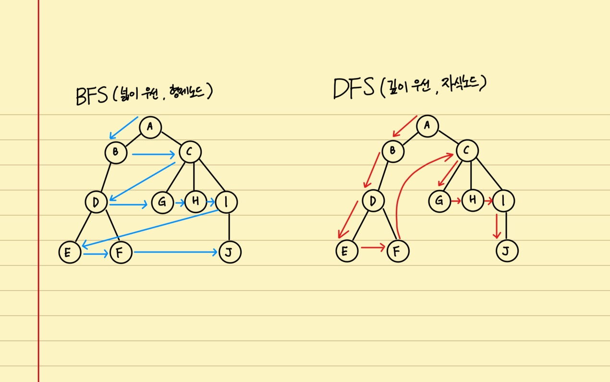

> # Algorithm 04

<br/>

<p align="center">

</p>

<br/>
<br/>
<br/>

> # Binary Search (이진 탐색)

<br/>

- 탐색할 자료를 둘로 나누어 해당 데이터가 있을만한 곳을 탐색하는 방법
  - 정열이 되어 있다는 가정하에 순차적으로 탐색하지 않고, 중간을 탐색해서 어디에 있는지 판단하는 방식

<br/>

## 분할 정복 알고리즘과 이진 탐색

<br/>

- 분할 정복 알고리즘 : Divide(문제를 하나 또는 둘 이상으로 분할), Conquer(나눠진 문제가 충분히 작고, 해결가능하면 해결하고 그렇지 않으면 다시 분할함)
- 이진 탐색:
  - Divide : 리스트를 두 개의 서브 리스트로 나눔
  - Conquer :
    - 검색할 숫자 > 중간값 -> 뒷부분의 서브 리스트에서 검색할 숫자를 찾음
    - 검색할 숫자 < 중간값 -> 앞부분의 서브 리스트에서 검색할 숫자를 찾음
- 이진 탐색도 분할 정복 알고리즘에 해당하므로, 전형적으로 재귀함수를 활용하여 구현할 수 있음

<br/>

## 알고리즘 고안

<br/>

- 데이터가 일단, 정렬되어 있는 상태
- 데이터 리스트와, 검색할 데이터를 인자로 받아 해당 함수를 구현

<br/>

## 알고리즘 구현

<br/>

```python
def binary_search(data, search):
  if len(data) == 1 and search == data[0]: # 최종적으로 1개의 데이터인 경우 비교 데이터와 비교
    return True
  if len(data) == 1 and search != data[0]:
    return False
  if len(data) == 0:
    return False

  medium = len(data) // 2 # 몫을 구하면 중간 인덱스를 구할 수 있음
  if search == data[medium]:
    return True
  else:
    if search > data[medium]:
      return binary_search(data[medium:], search)
    else:
      return binary_search(data[:medium], search)

# TEST

import random
data_list = random.sample(range(100), 10)
data_list.sort() # 정렬이 필요 하므로, list 내장 함수 sort()를 사용
# [10, 11, 18, 36, 42, 65, 68, 69, 71, 89]
binary_search(data_list, 66)
# [10, 11, 18, 36, 42, 65, 68, 69, 71, 89]
# [68, 69, 71, 89]
# [68, 69]
# [68]
# False
```

<br/>

## 이진 탐색의 시간 복잡도

<br/>

- 한번 처리하는 과정(1턴)에서, 전체의 데이터가 1/2씩 줄어 들고 데이터가 1개가 될 때 까지 이를 반복
  - 1턴에 1번 밖에 처리 안함(안에 반복문은 없음)
  - 데이터의 개수가 1이 될때 까지 반복 이니까, 턴의 개수는 `log n` 번
    - n _ (1/2) _ (1/2) _ (1/2) _ ... = 1
    - n \* (1/2)^k = 1 (1일 될 때까지 k 번 반복)
    - n = 2^k
    - log n = k
  - `O(log n)`

<br/>
<br/>
<br/>

> # Sequential Search (순차 탐색)

<br/>

- 탐색은 여러 데이터 중에서 원하는 데이터를 찾아내는 것을 의미
- 데이터가 담겨있는 리스트를 앞에서 부터 하나씩 비교해서 원하는 데이터를 찾는 방법

<br/>

## 프로그래밍 연습

<br/>

- 임의 리스트 존재시 원하는 데이터의 위치를 return 하는 순차탐색 알고리즘 작성하기

```python
from random import *

rand_data_list = list()
for num in range(10):
  rand_data_list.append(randint(1, 100)) # 1 ~ 100 의 int를 10회 수행
print(rand_data_list)
# [71, 63, 75, 33, 6, 37, 81, 79, 3, 29] 중복된 숫자도 가능함

def sequential(data_list, search_data):
  for i in range(len(data_list)):
    if data_list[i] == search_data:
      return i
  return -1

# TEST
sequential(rand_data_list, 37) # 5
sequential(rand_data_list, 3) # -1
```

<br/>

## 순차 탐색의 시간 복잡도

<br/>

- 최악의 경우 list 길이가 n일 때, n번 비교해야함
  - `O(n)`

<br/>
<br/>
<br/>

> # 그래프(Graph) 이해

<br/>

- 그래프는 실제 세계의 현상이나 사물을 **정점(Vertex) 또는 노드(Nord)** 와 **간선(Edge)**로 표현하기 위해 사용
  - 예제) 집에서 회사로 가는 경로를 그래프로 표현

<br/>

## 용어

<br/>

- `노드 (Node)`: 위치를 말함, 정점(Vertex)라고도 함
- `간선 (Edge)`: 위치 간의 관계를 표시한 선으로 노드를 연결한 선이라고 보면 됨 (link or branch라고도 함)
- `인접 정점 (Adjacent Vertex)`: 간선으로 직접 연결된 정점(또는 노드), 인접노드
- 참고 용어
  - `무방향 그래프`: 간선이 방향이 없는 경우
  - `방향 그래프`: 간선이 방향이 있는 경우
  - `정점의 차수 (Degree)`: 무방향 그래프에서 하나의 정점에 인접한 정점의 수 (특정 노드에 무방향으로 연결된 노드의 수)
  - `진입 차수(In-Degree)`: 방향 그래프에서 외부에서 오는 간선의 수(자기 노드에서 몇개의 간선을 받느냐)
  - `진출 차수(Out-Degree)`: 방향 그래프에서 외부로 향하는 간선의 수(자기 노드에서 몇개의 간선을 보내냐)
  - `경로 길이 (Path Length)`: 경로를 구성하기 위해 사용된 간선의 수
  - `단순 경로 (Simple Path)`: 처음 정점과 끝 정점을 제외하고 중복된 정점이 없는 경로(경로 중에 중복된 정점을 가진 경로를 제외한 것, 즉, Start, End가 동일한 경우를 제외하고 중복된 정점을 가지지 않은 경로)
  - `사이클 (Cycle)`: 단순 경로의 시작 정점과 종료 정점이 동일한 경우
    - 단순 경로는 사이클 일 수 있다, 사이클은 단순 경로이다.

<br/>
<br/>
<br/>

> ## 그래프의 종류

<br/>

### 무방향 그래프 (Undirected Graph)

- 간선에 방향이 없는 그래프
- 간선을 통해, 노드는 양방향으로 갈 수 있음
- 보통 노드 A, B가 연결 되어 있을 경우, `(A, B)`, `(B, A)` 로 표기

<br/>

### 방향 그래프 (Directed Graph)

- 간선에 방향이 있는 그래프
- 간선을 통해, 노드는 지정된 방향으로만 갈 수 있음
- 보통 노드 A, B가 연결 되어 있을 경우,
  - A -> B: `<A, B>` 로 표기
  - B -> A: `<B, A>` 로 표기
  - 순서가 있음을 주의 하자

<br/>

### 가중치 그래프 (Weighted Graph) 또는 네트워크(Network)

- 간선에 비용 또는 가중치가 할당된 그래프
  - 그림에서는 간선 위에 숫자를 적어 표현
  - 거리가 될수도 있고, 그런 간선간의 차이를 표현할 수 있음

<br/>

### 연결 그래프 (Connected Graph)와 비연결 그래프 (Disconnected Graph)

- 연결 그래프
  - 일단 무방향 그래프 이어야 함
  - 무방향 그래프에 있는 모든 노드에 대해 항상 경로가 존재하는 경우
  - **모든 노드가 어느 하나라도 연결 되어 있어 접근이 가능한 경우를 말함, 하나에 모두 연결(완전 그래프)이 아님**
- 비연결 그래프
  - 무방향 그래프에서 특정 노드에 대해 경로가 존재하지 않는 경우

<br/>

### 사이클(Cycle)과 비순환 그래프(Acyclic Graph)

- 사이클
  - 단순 경로의 시작 노드와 종료 노드가 동일한 경우
- 비순환 그래프
  - 사이클이 없는 그래프

<br/>

### 완전 그래프 (Complete Graph)

- 그래프의 모든 노드가 서로 연결되어 있는 그래프
  - 각각의 노드가 모든 노드로 바로 연결 되어 있음

<br/>
<br/>
<br/>

> ## 그래프와 트리의 차이

<br/>

- 트리는 그래프 중에 속한 특별한 종류임
  - `그래프 ⊃ 트리`

<br/>

|   항목\종류    |                             그래프                             |                     트리                     |
| :------------: | :------------------------------------------------------------: | :------------------------------------------: |
|      정의      |       노드와 노드를 연결하는 간선으로 표현되는 자료구조        | 그래프의 한종류, 방향성이 있는 비순환 그래프 |
|     방향성     |                   O (방향, 무방향 모두 가능)                   |            O (방향 그래프만 가능)            |
|     사이클     |                   O (순환, 비순환 모두 가능)                   |              X (비순환만 가능)               |
|   루트 노드    | X (루트 노드를 정의하고 있지 않지만, <br/> 스스로 추가는 가능) |        O (루트 노드를 정의하고 있음)         |
| 부모/자식 관계 |  X (부모자식 정의하고 있지 않지만, <br/> 스스로 추가는 가능)   |           O (부모 자식 관계 존재)            |

<br/>
<br/>
<br/>

> # BFS (Breadth-First Search, 너비 우선 탐색)

<br/>

## BFS 와 DFS

<br/>

- 대표적인 그래프 **탐색** 알고리즘
  - 너비 우선 탐색(Breadth First Search, **BFS**): 정점들과 **같은 레벨에 있는 노드들(형제 노드들)**을 먼저 탐색하는 방식
  - 깊이 우선방식(Depth First Search, **DFS**): 정점의 **자식들을 먼저 탐색**하는 방식
  - 둘다, 약간 트리같은 사이클이 없는 그래프에서 탐색

<br/>
<br/>

## BFS/DFS 방식 이해를 위한 예제

<br/>

- BFS : 한 단계씩 내려가면서, 해당 노드와 같은 레벨있는 노드 먼저 순회
  - 가로 방향의 지그재그
- DFS : 한 노드의 자식을 타고 끝까지 순회한 후, 다시 돌아와서 다른 형제들의 자식을 타고 내려가며 순회
  - 세로 방향의 지그재그

<br/>
  
<p align="center">

</p>

<br/>
<br/>

## Python으로 그래프를 표현하는 방법

<br/>

- 파이썬에서 제공하는 딕셔너리와 리스트 자료구조 활용하여 그래프 표현
  - 딕셔너리의 key - values 구조 item을 노드로 활용하여, key는 해당 DATA를 표현하고 values는 해당 노드에 연결된 노드를 가르키게 함
  - values 는 리스트 형태로 여러 개의 노드를 가르키게 함

|  Key  | Values |     |     |     |
| :---: | :----: | :-: | :-: | :-: |
| **A** |   B    |  C  |     |     |
| **B** |   A    |  D  |     |     |
| **C** |   A    |  G  |  H  |  I  |
| **D** |   B    |  E  |  F  |     |
| **E** |   D    |     |     |     |
| **F** |   D    |     |     |     |
| **G** |   C    |     |     |     |
| **H** |   C    |     |     |     |
| **I** |   C    |  J  |     |     |
| **J** |   I    |     |     |     |

```python
graph = dict()

graph['A'] = ['B', 'C']
graph['B'] = ['A', 'D']
graph['C'] = ['A', 'G', 'H', 'I']
graph['D'] = ['B', 'E', 'F']
graph['E'] = ['D']
graph['F'] = ['D']
graph['G'] = ['C']
graph['H'] = ['C']
graph['I'] = ['C', 'J']
graph['J'] = ['I']

print(graph)

# {'A': ['B', 'C'],
#  'B': ['A', 'D'],
#  'C': ['A', 'G', 'H', 'I'],
#  'D': ['B', 'E', 'F'],
#  'E': ['D'],
#  'F': ['D'],
#  'G': ['C'],
#  'H': ['C'],
#  'I': ['C', 'J'],
#  'J': ['I']}
```

<br/>
<br/>
<br/>

> ## BFS 알고리즘 구현

<br/>

- 자료구조 큐를 활용
  - **need_visit 큐와 visited 큐, 두 개의 큐를 생성**

<br/>

- visited 큐의 경우 다녀온 노드의 값을 저장하여 다녀온 노드를 구분하기 위함
- need_visit 큐의 경우에는 실질적으로 다음에 이동할 노드를 알려줌
  - need_visit는 visited 큐와 비교하여 visited 큐에 존재하는 노드의 경우에는 아무작업도 하지 않음
  - visited 큐에 이동할 노드가 존재하지 않는 경우 해당 노드를 집어 넣고, 해당 노드에서 이동 할 수 있는 노드를 순서대로 need_visit에 추가한다

<br/>

## 패턴

<br/>

1. current에 있던 노드A -> visited (visited에 없는 경우)

- visited에 있는 경우 아무것도 하지 않고, 3번으로 가서, needvisit에서 하나를 빼서 current로 올림

2. visited에 들어가진 노드 A의 이동 가능한 노드(B, C) -> need_visit
3. need_visit에 있는 노드 B, C에서 하나를 -> current
4. 반복

```python
# {'A': ['B', 'C'],
#  'B': ['A', 'D'],
#  'C': ['A', 'G', 'H', 'I'],
#  'D': ['B', 'E', 'F'],
#  'E': ['D'],
#  'F': ['D'],
#  'G': ['C'],
#  'H': ['C'],
#  'I': ['C', 'J'],
#  'J': ['I']}
```

- 큐의 특징으로 FIFO 방식으로, 선입 선출 형태로 need_visit의 값이 넣고 빠짐

| 1          |      |     |            |     |               |        |                        |                 |                 |
| ---------- | ---- | --- | ---------- | --- | ------------- | ------ | ---------------------- | --------------- | --------------- |
| current    | 초기 | A   | A추가      | B   | B추가         | C      | C추가                  | A               | A추가X          |
| visited    | [ ]  | [ ] | [A]        | [A] | [A, B]        | [A, B] | [A, B, C]              | [A, B, C]       | [A, B, C]       |
| need_visit | [A]  | [ ] | [B, **C**] | [C] | [C, **A, D**] | [A, D] | [A, D, **A, G, H, I**] | [D, A, G, H, I] | [D, A, G, H, I] |

| 2          |              |                           |                    |                    |                 |                        |
| ---------- | ------------ | ------------------------- | ------------------ | ------------------ | --------------- | ---------------------- |
| current    | D            | D추가                     | A                  | A추가X             | G               | G추가                  |
| visited    | [A, B, C]    | [A, B, C, D]              | [A, B, C, D]       | [A, B, C, D]       | [A, B, C, D]    | [A, B, C, D, G]        |
| need_visit | [A, G, H, I] | [A, G, H, I, **B, E, F**] | [G, H, I, B, E, F] | [G, H, I, B, E, F] | [H, I, B, E, F] | [H, I, B, E, F, **C**] |

| 3          |                 |                        |                    |                           |                       |                       |
| ---------- | --------------- | ---------------------- | ------------------ | ------------------------- | --------------------- | --------------------- |
| current    | H               | H추가                  | I                  | I추가                     | B                     | B추가X                |
| visited    | [A, B, C, D, G] | [A, B, C, D, G, H]     | [A, B, C, D, G, H] | [A, B, C, D, G, H, I]     | [A, B, C, D, G, H, I] | [A, B, C, D, G, H, I] |
| need_visit | [I, B, E, F, C] | [I, B, E, F, C, **C**] | [B, E, F, C, C]    | [B, E, F, C, C, **C, J**] | [E, F, C, C, C, J]    | [E, F, C, C, C, J]    |

| 4          |                       |                          |                          |                             |
| ---------- | --------------------- | ------------------------ | ------------------------ | --------------------------- |
| current    | E                     | E추가                    | F                        | F추가                       |
| visited    | [A, B, C, D, G, H, I] | [A, B, C, D, G, H, I, E] | [A, B, C, D, G, H, I, E] | [A, B, C, D, G, H, I, E, F] |
| need_visit | [F, C, C, C, J]       | [F, C, C, C, J, **D**]   | [C, C, C, J, D]          | [C, C, C, J, D, **D**]      |

| 5          |                             |                             |                             |                             |
| ---------- | --------------------------- | --------------------------- | --------------------------- | --------------------------- |
| current    | C                           | C추가X                      | C                           | C추가X                      |
| visited    | [A, B, C, D, G, H, I, E, F] | [A, B, C, D, G, H, I, E, F] | [A, B, C, D, G, H, I, E, F] | [A, B, C, D, G, H, I, E, F] |
| need_visit | [C, C, J, D, D]             | [C, C, J, D, D]             | [C, J, D, D]                | [C, J, D, D]                |

| 6          |                             |                             |                             |                                |
| ---------- | --------------------------- | --------------------------- | --------------------------- | ------------------------------ |
| current    | C                           | C추가X                      | J                           | J추가                          |
| visited    | [A, B, C, D, G, H, I, E, F] | [A, B, C, D, G, H, I, E, F] | [A, B, C, D, G, H, I, E, F] | [A, B, C, D, G, H, I, E, F, J] |
| need_visit | [J, D, D]                   | [J, D, D]                   | [D, D]                      | [D, D, **I**]                  |

| 7          |                                |                                |                                |                                |
| ---------- | ------------------------------ | ------------------------------ | ------------------------------ | ------------------------------ |
| current    | D                              | D추가X                         | D                              | D추가X                         |
| visited    | [A, B, C, D, G, H, I, E, F, J] | [A, B, C, D, G, H, I, E, F, J] | [A, B, C, D, G, H, I, E, F, J] | [A, B, C, D, G, H, I, E, F, J] |
| need_visit | [D, I]                         | [D, I]                         | [I]                            | [I]                            |

| 8          |                                |                                |
| ---------- | ------------------------------ | ------------------------------ |
| current    | I                              | I추가X                         |
| visited    | [A, B, C, D, G, H, I, E, F, J] | [A, B, C, D, G, H, I, E, F, J] |
| need_visit | []                             | []                             |

<br/>

- 결국, A - B - C - D - G - H - I - E - F - J 순으로 탐색함

<br/>
<br/>
<br/>

## 코드 구현

<br/>

```python
# graph =
# {'A': ['B', 'C'],
#  'B': ['A', 'D'],
#  'C': ['A', 'G', 'H', 'I'],
#  'D': ['B', 'E', 'F'],
#  'E': ['D'],
#  'F': ['D'],
#  'G': ['C'],
#  'H': ['C'],
#  'I': ['C', 'J'],
#  'J': ['I']}

def bfs(graph, start_node):
  visited = list()
  need_visit = list()

  # 시작하는 초기 노드 넣기
  need_visit.append(start_node)
  # count = 0
  while need_visit: # need_visit의 원소가 없을 때 까지
    # count += 1
    node = need_visit.pop(0)
    if node not in visited:
      visited.append(node)
      need_visit.extend(graph[node]) # extend는 뒤에 리스트를 붙여줌
  # print(count)

  # need_visit 원소가 없을 때
  return visited

# TEST
bfs(graph, 'A')
# [A, B, C, D, G, H, I, E, F, J]
# count를 넣었다면
# 19
```

<br/>
<br/>
<br/>

## BFS 시간 복잡도

<br/>

- 사용자가 입력하여 지정할 수 있는 것이, 노드 수와 간선수 이기 때문에 시간복잡도에서 고려하게 됨
- 노드 수: V, 간선수: E
  - while need_visit을 V+E만큼 실행
- 시간 복잡도 : `O(V + E)`

<br/>
<br/>
<br/>
<br/>
<br/>

> # DFS (Depth-First Search, 깊이 우선 탐색)

<br/>

- 자기와 연결된 노드의 맨 밑의 레벨(Leaf node) 까지 탐색하고 다음으로 진행하는 형태

<br/>

> ## DFS 알고리즘 구현

<br/>

- 자료구조 스택과 큐를 활용
  - need_visit 스택과 visited큐, 두개의 자료 형태를 사용함
  - 스택의 특징으로 LIFO 방식으로, 후입 선출 형태로 need_visit의 값이 넣고 빠짐

<br/>

## 패턴

- BFS와 동일하지만, 다음 값으로 진행할 때, stack으로 후입선출 (LIFO)로 값을 빼서 진행함

```python
# {'A': ['B', 'C'],
#  'B': ['A', 'D'],
#  'C': ['A', 'G', 'H', 'I'],
#  'D': ['B', 'E', 'F'],
#  'E': ['D'],
#  'F': ['D'],
#  'G': ['C'],
#  'H': ['C'],
#  'I': ['C', 'J'],
#  'J': ['I']}
```

| 1          |      |     |            |     |                     |              |                        |                 |                        |
| ---------- | ---- | --- | ---------- | --- | ------------------- | ------------ | ---------------------- | --------------- | ---------------------- |
| current    | 초기 | A   | A추가      | C   | C추가               | I            | I추가                  | J               | J추가                  |
| visited    | [ ]  | [ ] | [ **A** ]  | [A] | [A, **C**]          | [A, C]       | [A, C, **I**]          | [A, C, I]       | [A, C, I, **J**]       |
| need_visit | [A]  | [ ] | [B, **C**] | [B] | [B, **A, G, H, I**] | [B, A, G, H] | [B, A, G, H, **C, J**] | [B, A, G, H, C] | [B, A, G, H, C, **I**] |

| 2          |                 |                 |              |              |              |                     |
| ---------- | --------------- | --------------- | ------------ | ------------ | ------------ | ------------------- |
| current    | I               | I추가X          | C            | C추가X       | H            | H추가               |
| visited    | [A, C, I, J]    | [A, C, I, J]    | [A, C, I, J] | [A, C, I, J] | [A, C, I, J] | [A, C, I, J, **H**] |
| need_visit | [B, A, G, H, C] | [B, A, G, H, C] | [B, A, G, H] | [B, A, G, H] | [B, A, G]    | [B, A, G, **C**]    |

| 3          |                 |                 |                 |                        |                    |                    |
| ---------- | --------------- | --------------- | --------------- | ---------------------- | ------------------ | ------------------ |
| current    | C               | C추가X          | G               | G추가                  | C                  | C추가X             |
| visited    | [A, C, I, J, H] | [A, C, I, J, H] | [A, C, I, J, H] | [A, C, I, J, H, **G**] | [A, C, I, J, H, G] | [A, C, I, J, H, G] |
| need_visit | [B, A, G]       | [B, A, G]       | [B, A]          | [B, A, **C**]          | [B, A]             | [B, A]             |

| 4          |                    |                    |                    |                           |
| ---------- | ------------------ | ------------------ | ------------------ | ------------------------- |
| current    | A                  | A추가X             | B                  | B추가                     |
| visited    | [A, C, I, J, H, G] | [A, C, I, J, H, G] | [A, C, I, J, H, G] | [A, C, I, J, H, G, **B**] |
| need_visit | [B]                | [B]                | []                 | [**A, D**]                |

| 5          |                       |                              |                          |                                 |
| ---------- | --------------------- | ---------------------------- | ------------------------ | ------------------------------- |
| current    | D                     | D추가                        | F                        | F추가                           |
| visited    | [A, C, I, J, H, G, B] | [A, C, I, J, H, G, B, **D**] | [A, C, I, J, H, G, B, D] | [A, C, I, J, H, G, B, D, **F**] |
| need_visit | [A]                   | [A, **B, E, F**]             | [A, B, E]                | [A, B, E, **D**]                |

| 6          |                             |                             |                             |                                    |
| ---------- | --------------------------- | --------------------------- | --------------------------- | ---------------------------------- |
| current    | D                           | D추가X                      | E                           | E추가                              |
| visited    | [A, C, I, J, H, G, B, D, F] | [A, C, I, J, H, G, B, D, F] | [A, C, I, J, H, G, B, D, F] | [A, C, I, J, H, G, B, D, F, **E**] |
| need_visit | [A, B, E]                   | [A, B, E]                   | [A, B]                      | [A, B, **D**]                      |

| 7          |                                |                                |                                |                                |
| ---------- | ------------------------------ | ------------------------------ | ------------------------------ | ------------------------------ |
| current    | D                              | D추가X                         | B                              | B추가X                         |
| visited    | [A, C, I, J, H, G, B, D, F, E] | [A, C, I, J, H, G, B, D, F, E] | [A, C, I, J, H, G, B, D, F, E] | [A, C, I, J, H, G, B, D, F, E] |
| need_visit | [A, B]                         | [A, B]                         | [A]                            | []                             |

<br/>

- 결국, A - C - I - J - H - G - B - D - F - E 순으로 탐색함
- 왼쪽, 오른쪽 방향은 상관 없이 똑같음

<br/>
<br/>
<br/>

## 코드 작성하기

<br/>

```python
def dfs(graph, start_node):
  visited, need_vist = list(), list()
  need_visit.append(start_node)

  while need_visit:
    node = node_visit.pop()
    if node not in visited:
      visited.append(node)
      need_visit.extend(graph[node])

  return visited

# TEST
dfs(graph, 'A')
# ['A', 'C', 'I', 'J', 'H', 'G', 'B', 'D', 'F', 'E']
```

<br/>

## DFS의 사간 복잡도

<br/>

- BFS와 마찬가지로 `O(V + E)` 이다
  - 노드수 + 간선 수
