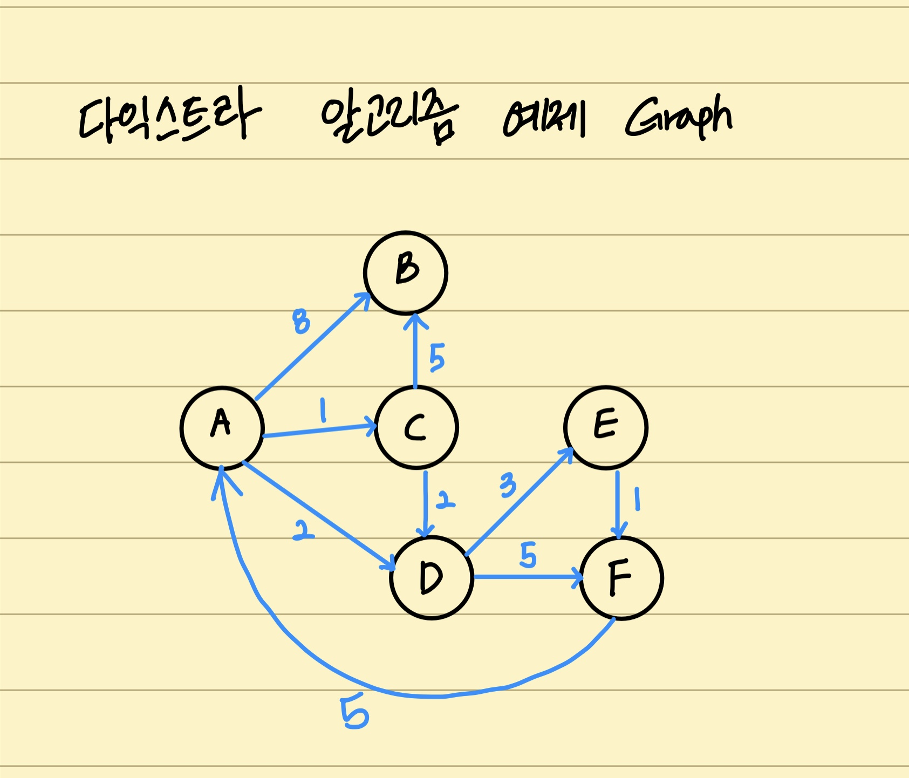

> # Algorithm 05

<br/>

<p align="center">

</p>

<br/>
<br/>
<br/>

> # Greedy algorithm(탐욕 알고리즘) 의 이해

<br/>

- Greedy algorithm 또는 탐욕 알고리즘 이라고 불림
- 최적의 해에 가까운 값을 구하기 위해 사용됨
- 여러 경우 중 **하나를 결정해야 할 때마다**, **매순간 최적이라고 생각되는 경우를 선택하는 방식**으로 진행해서, 최종적인 값을 구하는 방식
- 총체적인 고려보단, 현재 활용하는 것에서 최적을 선택

<br/>

## 탐욕 알고리즘 예

<br/>

### 예시1: 동전 문제

<br/>

- 지불해야 하는 값이 4720원 일 때 1원, 50원, 100원, 500원 짜리 동전으로 가장 적은 동전의 수로 값을 지불하는 경우
  - 가장 금액이 큰 동전부터 최대한 지불해서 값을 채우는 방식으로 구현 가능
    - 500원 짜리로 4500원까지 채우기 -> 9개
    - 100원 짜리로 4700원까지 채우기 -> 2개
    - 1원 짜리로 4720원까지 채우기 -> 20개
    - Total -> 31개
  - 탐욕 알고리즘을 활용하여 매순간 최적의 경우를 선택

```python
coin_list = [500, 100, 50, 1]

def min_coin_count(value, coin_list):
  total_coin_count = 0
  details = list()
  coin_list.sort(reverse=True) # reverse 옵션을 통해서 내림차순으로 정렬할 수 있음

  for coin in coin_list:
    # 큰 값의 동전으로 최대한 해당 비교 금액을 채워야 함으로,몫을 구해서 동전의 개수를 구함
    coin_num = value // coin
    total_coin_count += coin_num # 전체 코인 개수를 해당 동전 개수 만큼 올림
    value -= coin_num * coin  # 비교 금액에서 방금 채운 금액 만큼 뺌
    details.append([coin, coin_num]) # 더 자세히 알아보기 위해서 해당 턴의 코인 금액과 개수를 기록
  return total_coin_count
```

<br/>
<br/>
<br/>

### 예시2: 부분 배낭 문제 (Fractional Knapsack Problem)

<br/>

- 무개 제한이 k인 배낭에 최대 가치를 가지도록 물건을 넣는 문제
  - 각 물건은 무게(W)와 가치(V)로 표현될 수 있음
  - 물건을 쪼개서 물건의 일부분을 배낭에 넣을 수 있음

| 물건 | 1   | 2   | 3   | 4   | 5   |
| ---- | --- | --- | --- | --- | --- |
| 무게 | 10  | 15  | 20  | 25  | 30  |
| 가치 | 10  | 12  | 10  | 8   | 5   |

- 무게당 가치 : 1, 0.8, 0.5, 0.32, 0.1666..
- 무게당 가치가 큰 것을 우선적으로 선택하여 넣으면 됨(탐욕 알고리즘)

```python
# data_list 만들기
data_list = [(10, 10), (15, 12), (20, 10), (25, 8), (30, 5)]
data_list = sorted(data_list, key=lambda x: x[1]/x[0], reverse=True)
print(data_list)
# [(10, 10), (15, 12), (20, 10), (25, 8), (30, 5)]

# 최대 가치 갖게 하는 함수 구현
def get_max_value(data_list, capacity):
  data_list = sorted(data_list, key=lambda x: x[1]/x[0], reverse=True)
  total_value = 0
  data_capacity = 0
  details = list()

  for data in data_list:
    if capacity >= data[0]: # 저장 공간이 남거나 딱 맞는 경우
      total_value += data[1]
      capacity -= data[0]
      details.append([data[0], data[1], 1]) # [해당 품목 무게, 가치, 넣은 비율]
    else: # 저장 공간이 부족한 경우(일부분 저장 필요)
      fraction = capacity/data[0]]
      total_value += data[1] * fraction
      capacity -= data[0] * fraction
      details.append([data[0], data[1], fraction])
      break

  return total_value, details

# TEST
get_max_value(data_list, 30)
# (24.5, [[10, 10, 1], [15, 12, 1], [20, 10, 0.25]])
get_max_value(data_list, 101)
# (45, [[10, 10, 1], [15, 12, 1], [20, 10, 1], [25, 8, 1], [30, 5, 1]])
get_max_value(data_list, 102)
# (45, [[10, 10, 1], [15, 12, 1], [20, 10, 1], [25, 8, 1], [30, 5, 1]])
# 어차피 베닝 공간은 넣으려는 물건들의 총 무게 보다 크면 배낭에 무조건 들어가고, 공간이 남는 것이니 모두 넣은것이 최대 가치로 나옴 (해당 data_list에서는 100 이상은 항상 45의 가치가 나옴)
```

<br/>
<br/>
<br/>

## 탐욕 알고리즘의 한계

<br/>

- 탐욕 알고리즘은 근사치 추정에 활용 (해에 대한 정확성을 보장해 주진 않음)
- 항상 최적의 해를 구할 수는 없음
- 최적의 해에 **가까운 값**을 구하는 방법 중의 하나임
  - 일단, 탐욕 알고리즘에 타당한 정렬인지 확인해야 될 필요가 있음

<br/>

- 예시: 최소 선택
  - 시작 -> (7, 10)
    - 7 -> (12, 15)
    - 10 -> (5, 7)
  - 탐욕 알고리즘 방식: 시작 -> 7 -> 12 => 19
  - 하지만, 실제 최소값을 가지는 경우: 시작 -> 10 -> 5 => 15

<br/>
<br/>
<br/>

> # 최단 경로 알고리즘의 이해

<br/>

- 최단경로 문제 : 두 노드를 잇는 가장 짧은 경로를 찾는 문제
- 가중치 그래프 (Weighted Graph)에서 간선(Edge)의 가중치 합이 최소가 되도록 하는 경로를 찾는 것이 목적

<br/>

## 최단 경로 문제 종류

<br/>

### 1. 단일 출발 및 단일 도착(single-source and single-destination) 최단 경로 문제

- 그래프 내의 특정 노드 u에서 출발, 또 다른 특정 노드 v에 도착하는 가장 짧은 경로를 찾는 문제

<br/>

### 2. 단일 출발(single-destination) 최단 경로 문제

- 그래프 내의 특정 노드 u와 그래프 내 다른 모든 노드 각각의 가장 짧은 경로를 찾는 문제
- A -> B, C, D(모든 노드)로 가는 각각의 가장 짧은 경로 문제

<br/>

### 3. 전체 쌍(all-pair) 최단 경로

- 그래프 내의 모든 노드 쌍(u, v)에 대한 최단 경로를 찾는 문제

<br/>
<br/>
<br/>

> # 최단 경로 알고리즘 : Dijkstra Algorithm (다익스트라 알고리즘)

<br/>

- **단일 출발 최단 경로 문제**에 해당함
  - 하나의 노드에서 다른 모든 노드 간의 각각 가장 짧은 거리를 구하는 문제

<br/>

## 다익스트라(Dijkstra) 알고리즘 로직

<br/>

<p align="center">

</p>

- 첫 노드를 기준으로 연결되어 있는 정점들을 추가해 가며, 최단 거리를 갱신하는 기법
  - 최단거리의 경우, 직접적으로 노드로 가는 거리 보다 다른 노드를 통해서 가는 경우가 더 짧을 수도 있음
    - 예시) A-C > A-B-C
  - 그래서, 모든 간선(노드 간의 거리)들을 합치면서 경로 길이를 비교해 볼 필요가 있음
  - **즉, 첫 노드를 기준으로 다른 노드들을 순회하면서, 각 노드들 간의 거리를 고려하여 최단 거리만 반영하여 최종적으로 첫 노드에서 모든 노드 까지의 최단 거리를 구할 수 있음**
  - **순회하는 과정이 너비우선탐색(BFS)과 유사**
    - 첫 정점부터 각 노드 간의 거리를 저장하는 배열을 만듦
    - 첫 정점의 인접 노드 간의 거리부터 먼저 계산
    - 첫 정점부터 해당 노드간의 가장 짧은 거리를 해당 배열에 업데이트

<br/>

- 필요한 자료
  - 배열 : 결과적으로 첫 노드(기준 노드)에서 다른 모든 노드 까지의 최단 거리를 저장하기 위한 공간
    - 예시) A - (B, C, D, E, F)의 최단 거리들을 저장
  - 우선순위 큐 : 인접 노드를 순회하며 거리가 저장된 배열과 비교하기 위한 최단 거리 기준 순서에 활용됨
    - 우선순위 큐를 활용하게 되면, 최단거리만 계속 빠르게 배열에 반영되고
    - 거리가 길어 쌓인 노드들의 경우에는 나중에 비교 되어 계산이 줄어 듦
    - 우선순위가 아니라면 긴 거리의 값도 배열에 참여하게 되어 Update하는 횟수가 늘어나게 됨

<br/>

- 초기화
  - 배열: `[(시작노드, 0), (다른노드1, inf), (다른노드2, inf), (다른노드3, inf), ... (다른노드n, inf)]`
    - 시작노드에서 시작노드의 거리는 0임
    - 아직 다른 노드를 순회하면서 비교하기 전인 상태
    - 순회하면서, 쌓은 거리와 배열의 값을 비교하여 해당 순회의 쌓은 거리(경로 길이)가 더 작으면, 배열에 반영하여 Update함
      - 순회 경로 길이 < 배열의 해당 노드 최단거리 -> Update
  - 우선순위 큐 : `[(시작노드, 0)]`
    - 처음에는 추출하여 기준이 될 노드를 넣게 됨
    - 나중에 순회하면서 배열이 update 된후 update된 해당 노드를 우선순위 큐에 넣게 됨

<br/>
<br/>
<br/>

> ## 예제로 이해하는 다익스트라 알고리즘 (우선순위 큐 활용)

<br/>

## 초기화

- 시작되는 첫 노드 설정
  - 거리는 시작 첫 노드의 경우 0, 나머지 노드 inf
  - 우선순위 큐에 첫 노드 추가

| \              | 초기화                                                     |
| -------------- | ---------------------------------------------------------- |
| 현재 추출된 값 | X                                                          |
| 거리 저장 배열 | [(A, 0), (B, inf), (C, inf), (D, inf), (E, inf), (F, inf)] |
| 우선순위 큐    | [(A, 0)]                                                   |

<br/>

## 큐추출& 거리계산

- 우선 순위 큐에서 추출 후 추출된 노드를 기준으로 한 인접 노드의 거리계산 시작
- `거리 저장 배열에 있는 해당 노드 거리` > `추출값 기준 그래프의 인접 노드의 거리` + `추출 값의 거리`
  - -> **거리 저장 배열의 해당 노드 거리 값** `update`
  - -> **해당 노드 우선순위 큐에 넣음** (우선 순위 큐는 알아서 정렬 됨)

| A0 - (B8, C1, D2) | 큐추출& 인접노드 B 거리계산 : inf > 0 + 8 -> Update          |
| ----------------- | ------------------------------------------------------------ |
| 현재 추출된 값    | [(A, 0)]                                                     |
| 거리 저장 배열    | [(A, 0), (B, **8**), (C, inf), (D, inf), (E, inf), (F, inf)] |
| 우선순위 큐       | [**(B, 8)**]                                                 |

| A0 - (B8, C1, D2) | 인접노드 C 거리계산 : inf > 0 + 1 -> Update                |
| ----------------- | ---------------------------------------------------------- |
| 현재 추출된 값    | [(A, 0)]                                                   |
| 거리 저장 배열    | [(A, 0), (B, 8), (C, **1**), (D, inf), (E, inf), (F, inf)] |
| 우선순위 큐       | [**(C, 1)**, (B, 8)]                                       |

| A0 - (B8, C1, D2) | 인접노드 D 거리계산 : inf > 0 + 2 -> Update              |
| ----------------- | -------------------------------------------------------- |
| 현재 추출된 값    | [(A, 0)]                                                 |
| 거리 저장 배열    | [(A, 0), (B, 8), (C, 1), (D, **2**), (E, inf), (F, inf)] |
| 우선순위 큐       | [(C, 1), **(D, 2)**, (B, 8)]                             |

- 추출된 값을 기준으로 그래프에서 인접노드가 없으면, 아무 것도 하지 않고 **큐를 추출**

| C1 - (B5, D2)  | 큐추출& 인접노드 B 거리계산: 8 > 1 + 5 -> Update         |
| -------------- | -------------------------------------------------------- |
| 현재 추출된 값 | [(C, 1)]                                                 |
| 거리 저장 배열 | [(A, 0), (B, **6**), (C, 1), (D, 2), (E, inf), (F, inf)] |
| 우선순위 큐    | [(D, 2), **(B, 6)**, (B, 8)]                             |

| C1 - (B5, D2)  | 인접노드 D 거리계산: 2 < 1 + 2 -> Update X           |
| -------------- | ---------------------------------------------------- |
| 현재 추출된 값 | [(C, 1)]                                             |
| 거리 저장 배열 | [(A, 0), (B, 6), (C, 1), (D, 2), (E, inf), (F, inf)] |
| 우선순위 큐    | [(D, 2), (B, 6), (B, 8)]                             |

| D2 - (E3, F5)  | 인접노드 E 거리계산: inf > 2 + 3 -> Update             |
| -------------- | ------------------------------------------------------ |
| 현재 추출된 값 | [(D, 2)]                                               |
| 거리 저장 배열 | [(A, 0), (B, 6), (C, 1), (D, 2), (E, **5**), (F, inf)] |
| 우선순위 큐    | [**(E, 5)**, (B, 6), (B, 8)]                           |

| D2 - (E3, F5)  | 인접노드 F 거리계산: inf > 2 + 5 -> Update           |
| -------------- | ---------------------------------------------------- |
| 현재 추출된 값 | [(D, 2)]                                             |
| 거리 저장 배열 | [(A, 0), (B, 6), (C, 1), (D, 2), (E, 5), (F, **7**)] |
| 우선순위 큐    | [(E, 5), (B, 6), **(F, 7)**, (B, 8)]                 |

| E5 - (F1)      | 큐추출& 인접노드 F 거리계산: 7 > 5 + 1 -> Update     |
| -------------- | ---------------------------------------------------- |
| 현재 추출된 값 | [(E, 5)]                                             |
| 거리 저장 배열 | [(A, 0), (B, 6), (C, 1), (D, 2), (E, 5), (F, **6**)] |
| 우선순위 큐    | [(B, 6), **(F, 6)**, (F, 7), (B, 8)]                 |

| B6 - (X)       | 큐추출& 인접 노드가 없음 -> Update X             |
| -------------- | ------------------------------------------------ |
| 현재 추출된 값 | [(B, 6)]                                         |
| 거리 저장 배열 | [(A, 0), (B, 6), (C, 1), (D, 2), (E, 5), (F, 6)] |
| 우선순위 큐    | [(F, 6), (F, 7), (B, 8)]                         |

| F6 - (A5)      | 큐추출& 인접 노드 A 거리계산: 0 < 6 + 5 -> Update X |
| -------------- | --------------------------------------------------- |
| 현재 추출된 값 | [(F, 6)]                                            |
| 거리 저장 배열 | [(A, 0), (B, 6), (C, 1), (D, 2), (E, 5), (F, 6)]    |
| 우선순위 큐    | [(F, 7), (B, 8)]                                    |

| F7 - (A5)      | 큐추출& 인접 노드 A 거리계산: 0 < 7 + 5 -> Update X |
| -------------- | --------------------------------------------------- |
| 현재 추출된 값 | [(F, 7)]                                            |
| 거리 저장 배열 | [(A, 0), (B, 6), (C, 1), (D, 2), (E, 5), (F, 6)]    |
| 우선순위 큐    | [(B, 8)]                                            |

| B8 - (X)       | 큐추출& 인접 노드 X -> Update X                  |
| -------------- | ------------------------------------------------ |
| 현재 추출된 값 | [(B, 8)]                                         |
| 거리 저장 배열 | [(A, 0), (B, 6), (C, 1), (D, 2), (E, 5), (F, 6)] |
| 우선순위 큐    | []                                               |

<br/>
<br/>
<br/>

> ## 다익스트라 알고리즘 파이썬 구현 (우선순위 큐 활용)

<br/>
<br/>

## heapq 라이브러리를 활용해 우선순위 큐 사용

<br/>
 
- 리스트 형태의 데이터인 경우 0번 인덱스를 우선순위 지표로 사용

```python
import heapq

queue = []
heapq.heappush(queue, [2, 'A'])
heapq.heappush(queue, [5, 'B'])
heapq.heappush(queue, [1, 'C'])
heapq.heappush(queue, [7, 'D'])
print(queue)
# [[1, 'C'], [5, 'B'], [2, 'A'], [7, 'D']]
# 배열 형태의 구조이지만, 트리 형태로 저장되어 있어서 겉으로는 정렬이 된건지 모름
# 뽑아 사용할 때 정렬 순서대로 나오게 됨
for i in range(len(queue)):
  print(heapq.heappop(queue))
# [1, 'C']
# [2, 'A']
# [5, 'B']
# [7, 'D']
```

<br/>
<br/>
<br/>

## Graph 지정

<br/>

<p align="center">

</p>

```python
mygraph = {
  'A': {'B':8, 'C':1, 'D':2},
  'B': {},
  'C': {'B': 5, 'D':2},
  'D': {'E': 3, 'F':5},
  'E': {'F':1},
  'F': {'A':5}
}
```

<br/>
<br/>
<br/>

## 코드로 구현하기

<br/>

```python
import heapq

def dijkstra(graph, start):
  # 초기화
  distances = {node:float('inf') for node in graph}
  # 예) {'A':inf, 'B':inf, 'C':inf, 'D':inf, 'E':inf, 'F':inf}
  distances[start] = 0
  # 예) {'A':0, 'B':inf, 'C':inf, 'D':inf, 'E':inf, 'F':inf}
  queue = []
  heapq.heappush(queue, [distances[start], start]) # 앞의 값을 우선순위 판단하므로 순서 주의!
  # 예) queue = [[0, 'A']]

  while queue: # 우선순위 큐에 값이 없을 때 까지
    current_distance, current_node = heapq.heappop(queue)
    # 우선순위 큐에서 추출 -> 추출 거리, 노드 (구조 분해 할당)

    if distances[current_node] < current_distance:
    # 배열에서 추출노드에 해당하는 거리 < 추출 노드의 거리
      continue # 밑의 작업을 하지 않고 지나감 -> 계산양, 시간복잡도를 낮추기 위함

    for adjacent, weight in graph[current_node].items():
    # 그래프에서 추출 노드의 인접 노드 추출 반복
      distance = current_distance + weight
      # 추출 노드 거리 + 인접 노드 거리

      if distance < distances[adjacent]:
      # 추출 + 인접 노드 거리 < 거리 저장 배열의 인접노드의 경로의 최단거리
        distances[adjacent] = distance # Update
        heapq.heappush(queue, [distance, adjacent]) # 큐에 추가

  return distances

# TEST
dijkstra(mygraph, 'A')
# {'A': 0, 'B': 6, 'C': 1, 'D': 2, 'E': 5, 'F': 6}
```

<br/>
<br/>
<br/>

## 최단 경로 출력하기

<br/>

```python
import heapq

def dijkstra(graph, start, end):
  # 초기화
  distances = {node:float('inf') for node in graph}
  # 기존과 달리 해당 노드 경로의 이전 노드 정보를 포함하게 할 것임
  distances[start] = [0, start]
  queue = []
  heapq.heappush(queue, [distances[start], start])

  while queue:
    current_distance, current_node = heapq.heappop(queue)

    if distances[current_node] < current_distance:
      continue

    for adjacent, weight in graph[current_node].items():
      distance = current_distance + weight

      if distance < distances[adjacent]:
        distances[adjacent] = [distance, current_node]
        # 해당 경로 최단 거리로 가는 마지막 노드에 대한 정보 가짐
        heapq.heappush(queue, [distance, adjacent])

  path = end
  path_output = end + '->'
  while distances[path][1] != start: # 마지막 노드가 start 이면 멈춤
    path_output += distances[path][1] + '->'
    path = distancesp[path][1] # 마지막 노드로 이동
  path_output += start
  print(path_output)
  return distances

# TEST
dijkstra(mygraph, 'A', 'F')
# F->E->D->A (즉, 거꾸로 최단 경로를 추적)
# {'A': [0, 'A'], 'B': [6, 'C'], 'C': [1, 'A'], 'D': [2, 'A'], 'E': [5, 'D'], 'F': [6, 'E']}
```

<br/>
<br/>
<br/>

## 다익스트라 시간 복잡도

<br/>

- 두가지 과정으로 나눌 수 있음
  - 과정1: 각 노드마다 인접한 간선들을 모두 검사
  - 과정2: 우선순위 큐에 노드/거리 정보를 넣고 삭제하는 과정

<br/>

- 각 과정별 시간 복잡도
  - 과정1: 각 노드는 최대 한번씩 방문하여, 그래프의 모든 간선을 최대 한번씩 검사함
    - `O(E)` 시간이 걸림
  - 과정2: 모든 간선을 연산하는 과정에서, 최악의 경우 가면 갈수록 거리가 작아지는 형태인 Graph라고 한다면, 해당 비교 작업에서 모두 우선순위 큐에서 Update를 하게 됨
    - 우선순위 큐는 minHeap 구조이므로, `E` 만큼의 간선이 우선순위 큐에 들어가 정렬(최소값의 데이터를 root로 유지)하는데 걸리는 시간은 `O(logE)`가 됨
    - 간선의 개수 _ 해당 간선 정렬유지 횟수 = `O(E)` _ `O(ElogE)` = `O(ElogE)`

<br/>

- 과정1 + 과정2 = `O(E)`+`O(ElogE)` = `O(ElogE)`
