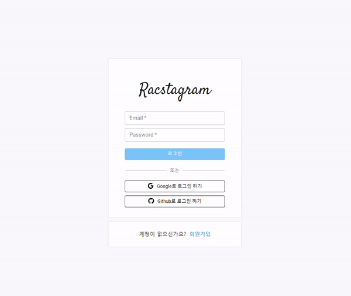

> # 리팩토링 Instagram 클론 프로젝트 by Redux-toolkit18

 

 

> # 📄 프로젝트 설명

 

이 프로젝트는 기존에 React & firebase를 통해서 만든 인스타그램 클론 프로젝트 리팩토링 프로젝트 입니다. (해당 프로젝트는 프로젝트 카테고리에서 확인 가능합니다.)

 

해당 프로젝트에서는 `redux-toolkit(Slice 모델)`을 사용하여 상태관리를 구현하고 있습니다.

 

더불어 나중에, styled component나 sass 중에 채택하여 css 작업을 할 예정 입니다.

 
 
 

# 💻 화면 개요

 

체크는 현재 기능적으로 구현된 상황을 의미합니다.

 

- [x] `로딩 화면 또는 Component` : 앱 실행 초기화 작업시 로딩 또는 다른 작업시 사용할 로딩 화면 및 Component
  - [x] 스타일링 완료

 

- [x] `로그인 화면` : 기본 Email 로그인, Social 로그인, 로그인 에러
  - [x] `Email 로그인` : Email, Password input, 로그인 버튼
  - [x] `Social 로그인` : google로그인 버튼, github로그인 버튼
  - [x] `로그인 에러` : Email로그인, google로그인, github 로그인 에러 발생시 사용자에게 출력

 

- [x] `회원가입 화면` : Email 로그인을 위한 계정을 만드는 화면, 회원가입 에러
  - [x] `Email 형식 가입` : Email, Password input, 회원가입 버튼
    - [x] 가입시 사용자 Nickname 지정 input (추가 사항)

 

- [x] `피드 화면` : 사용 유저의 모든 게시글을 표시하는 화면
  - [x] `게시글 박스` :
    - [x] `타이틀 영역` : 최상단의 작성자 사진 + 이름, 게시글 수정 탭
      - [x] `편집버튼` : 글 수정하기, 삭제하기 모달 -> 해당 버튼 누르면 삭제 또는 수정 페이지로 이동(아니면 모달이 수정하는 모달로 변경)
        - [x] `삭제하기`
        - [x] `수정하기`
    - [x] `사진 영역` : 기존에는 1개만 가능했음 (욕심내면, 여러개 슬라이드 형식으로 가능하게 하고 싶음)
    - [x] `내용 영역` : 게시글 내용

 

- [x] `글 작성 화면` : 글을 작성하는 화면
  - [x] `이미지 리사이징`

 

- [x] `현재 유저 프로필 화면` : 로그인한 현재 유저의 게시물과 대략적인 프로필를 표시하는 화면
  - [x] `유저 프로필 수정하기` : 유저 프로필을 수정하는 화면 (userImage, userDisplayname, userIntro)
  - [x] `작성 글` : 유저가 작성한 작성 글의 image 표 -> 클릭시 post detail
    - [x] `작성 글 detail view` : image 표에서 해당 이미지 클릭시 해당 글 detail view 화면
  - [x] `로그아웃`

 

- [x] `다른 유저 프로필 화면` : 다른 유저가 작성한 글의 유저 이름을 클릭하여 해당 유저의 프로필 화면 구현
  - [x] `프로필 보기` : userImage, userDisplayname, userIntro
  - [x] `작성 글` : 유저가 작성한 작성 글의 image 표 -> 클릭시 post detail
    - [x] `작성 글 detail view` : image 표에서 해당 이미지 클릭시 해당 글 detail view 화면

 

- [x] `네비게이션 바` : 앱로고 - 피드(Home)탭 - 글 작성탭 - 현재 유저 프로필(프로필 수정, 프로필 이동, 로그아웃) 탭
  - [ ] Navigation-profile 눌렀을 때 로그아웃, 프로필 수정, 프로필 이동 드롭 다운 필요

 
 
 

> # 📅 TIL (Today I Learned, 오늘 깨달은 것들)

 

# 2021.07.30 사항

 

## 작업 개요

 

- `material ui 도입`
  - material ui는 매우 깔끔하며 편하게 사용할 수 있어 좋다.
  - input Element의 경우 material ui의 TextFiled Component를 사용하였음 (깔끔하고 좋았음)
  - 하지만, button Element에 id, name 같은 property로 정보를 제공해야 하는 경우에는 material ui의 Button Component는 이를 지원하지 않음
    - scss로 버튼 스타일을 직접 만들어 사용하였음

 

- `로그인, 회원가입 창 스타일링 완료`
  - 로그인, 회원가입, userName 중복 요청하여 처리하는 중에는 material ui CircularProgress Component가 보이게 하였음

 

 

- `createPortal를 통해 Modal 재구현`
  - modal 스타일링 구현
  - Error: Target container is not a DOM element. 에러 발생

 

## 다음에 필요한 사항

 

- [ ] Navigation-profile 눌렀을 때 로그아웃, 프로필 수정, 프로필 이동 드롭 다운 필요

 

- [ ] profile 정보 요청 시기 조정
  - 더 빠른 연산을 위해서, 화면이 render 되고 profile에 관련된 정보를 가져오지 말고 profile 보기위해 버튼을 눌렀을 때 부터 미리 profile 정보를 요청하게 하자

 

- [ ] Post Detail View로 이동시 해당 글의 scrollX 위치로 이동하게 구현하기 (스타일링 이후에 scroll 위치 계산이 필요한 작업임)
