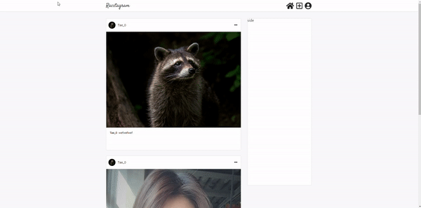
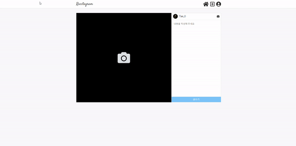

> # 리팩토링 Instagram 클론 프로젝트 by Redux-toolkit20

 

 

> # 📄 프로젝트 설명

 

이 프로젝트는 기존에 React & firebase를 통해서 만든 인스타그램 클론 프로젝트 리팩토링 프로젝트 입니다. (해당 프로젝트는 프로젝트 카테고리에서 확인 가능합니다.)

 

해당 프로젝트에서는 `redux-toolkit(Slice 모델)`을 사용하여 상태관리를 구현하고 있습니다.

 

더불어 나중에, styled component나 sass 중에 채택하여 css 작업을 할 예정 입니다.

 
 
 

# 💻 화면 개요

 

체크는 현재 기능적으로 구현된 상황을 의미합니다.

 

- [x] `로딩 화면 또는 Component` : 앱 실행 초기화 작업시 로딩 또는 다른 작업시 사용할 로딩 화면 및 Component
  - [x] 스타일링 완료

 

- [x] `로그인 화면` : 기본 Email 로그인, Social 로그인, 로그인 에러
  - [x] `Email 로그인` : Email, Password input, 로그인 버튼
  - [x] `Social 로그인` : google로그인 버튼, github로그인 버튼
  - [x] `로그인 에러` : Email로그인, google로그인, github 로그인 에러 발생시 사용자에게 출력

 

- [x] `회원가입 화면` : Email 로그인을 위한 계정을 만드는 화면, 회원가입 에러
  - [x] `Email 형식 가입` : Email, Password input, 회원가입 버튼
    - [x] 가입시 사용자 Nickname 지정 input (추가 사항)

 

- [x] `피드 화면` : 사용 유저의 모든 게시글을 표시하는 화면
  - [x] `게시글 박스` :
    - [x] `타이틀 영역` : 최상단의 작성자 사진 + 이름, 게시글 수정 탭
      - [x] `편집버튼` : 글 수정하기, 삭제하기 모달 -> 해당 버튼 누르면 삭제 또는 수정 페이지로 이동(아니면 모달이 수정하는 모달로 변경)
        - [x] `삭제하기`
        - [x] `수정하기`
    - [x] `사진 영역` : 기존에는 1개만 가능했음 (욕심내면, 여러개 슬라이드 형식으로 가능하게 하고 싶음)
    - [x] `내용 영역` : 게시글 내용

 

- [x] `글 작성 화면` : 글을 작성하는 화면
  - [x] `이미지 리사이징`

 

- [x] `현재 유저 프로필 화면` : 로그인한 현재 유저의 게시물과 대략적인 프로필를 표시하는 화면
  - [x] `유저 프로필 수정하기` : 유저 프로필을 수정하는 화면 (userImage, userDisplayname, userIntro)
  - [x] `작성 글` : 유저가 작성한 작성 글의 image 표 -> 클릭시 post detail
    - [x] `작성 글 detail view` : image 표에서 해당 이미지 클릭시 해당 글 detail view 화면
  - [x] `로그아웃`

 

- [x] `다른 유저 프로필 화면` : 다른 유저가 작성한 글의 유저 이름을 클릭하여 해당 유저의 프로필 화면 구현
  - [x] `프로필 보기` : userImage, userDisplayname, userIntro
  - [x] `작성 글` : 유저가 작성한 작성 글의 image 표 -> 클릭시 post detail
    - [x] `작성 글 detail view` : image 표에서 해당 이미지 클릭시 해당 글 detail view 화면

 

- [x] `네비게이션 바` : 앱로고 - 피드(Home)탭 - 글 작성탭 - 현재 유저 프로필(프로필 수정, 프로필 이동, 로그아웃) 탭
  - [ ] Navigation-profile 눌렀을 때 로그아웃, 프로필 수정, 프로필 이동 드롭 다운 필요

 
 
 

> # 📅 TIL (Today I Learned, 오늘 깨달은 것들)

 

# 2021.08.02 사항

 

## 작업 및 고찰

 

- `Home 페이지 스타일링 수정`
  - nav와 side 영역을 `position : sticky` 속성으로 변경함
    - side 영역의 경우 `display : flex`와 `position : fixed`를 같이 쓰는 경우 absolute 와 같이 공간을 차지하지 않게 됨으로 `position : sticky`로 변경 함
    - sticky를 사용하면 nav의 fixed 때문에 사용했던, padding을 사용할 필요가 없어짐
  - 반응형 웹을 위한, side 영역은 일정 width 값 이하로 좁아지는 경우 `flex-flow: wrap` 을 통해서 main 영역의 밑으로 가게 함
  - 또한, side가 밑으로 이동하였을 경우 main이 화면 중앙에 위치할 수 있도록 `justify-content: center` 값을 줌

 

 

 
 
 

- `write 페이지 스타일링`
  - 반응형 웹을 위한 이미지 비율 조정 문제 발생
    - 보통은 height를 없애고 padding을 %값을 주어 div의 일정 비율을 유지할 수 있게 할 수 있음
  - media query와 flex-flow wrap을 이용해서 일정 크기 이하로 되면, 아래에 붙어 크기가 맞게 구현함
  - 이미지가 없으면 기본 검정 화면에 카메라 아이콘을 눌러, 이미지 첨부 가능
  - material ui의 textarea인 textFiled를 사용하려고 했지만, 상황상 이미지 height에 따른 textFiled height를 주기가 어려워서 직접 textarea 태그를 이용해서 동적인 height를 가지게 함

 

 

 
 
 

## 다음에 필요한 사항

 

- [ ] Navigation-profile 눌렀을 때 로그아웃, 프로필 수정, 프로필 이동 드롭 다운 필요

 

- [ ] profile 정보 요청 시기 조정
  - 더 빠른 연산을 위해서, 화면이 render 되고 profile에 관련된 정보를 가져오지 말고 profile 보기위해 버튼을 눌렀을 때 부터 미리 profile 정보를 요청하게 하자

 

- [ ] Post Detail View로 이동시 해당 글의 scrollX 위치로 이동하게 구현하기 (스타일링 이후에 scroll 위치 계산이 필요한 작업임)

 

- [ ] validation 구현 필요함
  - input 같은 경우, display none 적용시 browser에서 제공하는 validation 말풍선이 뜨지 않기 때문에 따로 구현 필요함

 

- [ ] 글 작성 시간 (클라이언트 단에서 뿌리는 경우 로컬 시간 변경으로 조작 가능한지 테스트 필요함)
