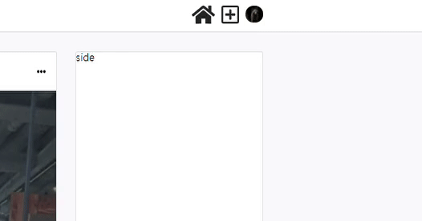
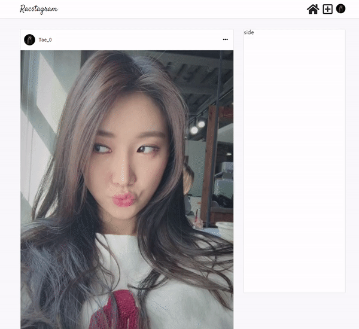

> # 리팩토링 Instagram 클론 프로젝트 by Redux-toolkit21

<br/>

<p align="center">

</p>

<br/>

> # 📄 프로젝트 설명

<br/>

이 프로젝트는 기존에 React & firebase를 통해서 만든 인스타그램 클론 프로젝트 리팩토링 프로젝트 입니다. (해당 프로젝트는 프로젝트 카테고리에서 확인 가능합니다.)

<br/>

해당 프로젝트에서는 `redux-toolkit(Slice 모델)`을 사용하여 상태관리를 구현하고 있습니다.

<br/>

더불어 나중에, styled component나 sass 중에 채택하여 css 작업을 할 예정 입니다.

<br/>
<br/>
<br/>

# 💻 화면 개요

<br/>

체크는 현재 기능적으로 구현된 상황을 의미합니다.

<br/>

- [x] `로딩 화면 또는 Component` : 앱 실행 초기화 작업시 로딩 또는 다른 작업시 사용할 로딩 화면 및 Component
  - [x] 스타일링 완료

<br/>

- [x] `로그인 화면` : 기본 Email 로그인, Social 로그인, 로그인 에러
  - [x] `Email 로그인` : Email, Password input, 로그인 버튼
  - [x] `Social 로그인` : google로그인 버튼, github로그인 버튼
  - [x] `로그인 에러` : Email로그인, google로그인, github 로그인 에러 발생시 사용자에게 출력

<br/>

- [x] `회원가입 화면` : Email 로그인을 위한 계정을 만드는 화면, 회원가입 에러
  - [x] `Email 형식 가입` : Email, Password input, 회원가입 버튼
    - [x] 가입시 사용자 Nickname 지정 input (추가 사항)

<br/>

- [x] `피드 화면` : 사용 유저의 모든 게시글을 표시하는 화면
  - [x] `게시글 박스` :
    - [x] `타이틀 영역` : 최상단의 작성자 사진 + 이름, 게시글 수정 탭
      - [x] `편집버튼` : 글 수정하기, 삭제하기 모달 -> 해당 버튼 누르면 삭제 또는 수정 페이지로 이동(아니면 모달이 수정하는 모달로 변경)
        - [x] `삭제하기`
        - [x] `수정하기`
    - [x] `사진 영역` : 기존에는 1개만 가능했음 (욕심내면, 여러개 슬라이드 형식으로 가능하게 하고 싶음)
    - [x] `내용 영역` : 게시글 내용

<br/>

- [x] `글 작성 화면` : 글을 작성하는 화면
  - [x] `이미지 리사이징`

<br/>

- [x] `현재 유저 프로필 화면` : 로그인한 현재 유저의 게시물과 대략적인 프로필를 표시하는 화면
  - [x] `유저 프로필 수정하기` : 유저 프로필을 수정하는 화면 (userImage, userDisplayname, userIntro)
  - [x] `작성 글` : 유저가 작성한 작성 글의 image 표 -> 클릭시 post detail
    - [x] `작성 글 detail view` : image 표에서 해당 이미지 클릭시 해당 글 detail view 화면
  - [x] `로그아웃`

<br/>

- [x] `다른 유저 프로필 화면` : 다른 유저가 작성한 글의 유저 이름을 클릭하여 해당 유저의 프로필 화면 구현
  - [x] `프로필 보기` : userImage, userDisplayname, userIntro
  - [x] `작성 글` : 유저가 작성한 작성 글의 image 표 -> 클릭시 post detail
    - [x] `작성 글 detail view` : image 표에서 해당 이미지 클릭시 해당 글 detail view 화면

<br/>

- [x] `네비게이션 바` : 앱로고 - 피드(Home)탭 - 글 작성탭 - 현재 유저 프로필(프로필 수정, 프로필 이동, 로그아웃) 탭
  - [x] Navigation-profile 눌렀을 때 로그아웃, 프로필 수정, 프로필 이동 드롭 다운 필요

<br/>
<br/>
<br/>

> # 📅 TIL (Today I Learned, 오늘 깨달은 것들)

<br/>

# 2021.08.03 사항

<br/>

## 작업개요 및 고찰

<br/>

- `Navigation profile 이미지 아이콘 구현`
- `Navigation 드롭 메뉴`
  - Navigation에 profile 이미지 아이콘 클릭시 드롭 메뉴를 사용하고자 하였다.
  - materai ui의 Menu 컴포넌트를 사용하면 손쉽게 구현할 수 있었다.
  - 하지만, **findDOMNode 에러가 발생하였다**

<br/>

- `Material ui Error`

```
index.js:1 Warning: findDOMNode is deprecated in StrictMode. findDOMNode was passed an instance of Transition which is inside StrictMode.
Instead, add a ref directly to the element you want to reference.
Learn more about using refs safely here: https://reactjs.org/link/strict-mode-find-node
```

- 리액트에서는 사용자가 직접적으로 DOM을 제어하는 것을 권장하지 않는다. 이는 리액트의 가상 돔을 통한 돔을 추정하는데 오류를 일으킬 수 있기 때문이다.
- 그래서, 보통은 useRef를 통해 제어를 하게 된다 하지만, material ui가 내부적으로 이를 받아서 다르게 사용하여 발생시키는 오류 같다.
- 이를 해결 하기 위해서 직접 드롭 메뉴를 구현하였다.

<br/>
<br/>
<br/>

- `Drop Menu UI 구현 (드롭 메뉴)`
  - 구현하고자 하는 드롭메뉴의 주요 특징 두가지를 맞추고자 하였다.
    - 특징1) 드롭 메뉴를 활성화 하는 버튼의 위치 아래에 드롭 메뉴가 위치해야 한다.
    - 특징2) 드롭 메뉴의 밖의 영역을 클릭하는 경우 드롭메뉴가 비활성화 되어야 한다.
  - 드롭메뉴의 외부 클릭 비활성화의 경우, 밖에 fixed 상태인 투명한 background 영역을 두어 클릭시 비활성화 시키게 해야한다.
  - keyPoint는 background속에 container를 구성하지 않고, background와 container를 형제 요소로 두어야 상위 요소의 위치를 참조하여 위치 시킬수 있다.

```js
import "./Menu.scss";

const Menu = ({ children, toggle, isOn, location }) => {
  return isOn ? (
    <div className="menu" onClick={toggle}>
      <div className="menu_background"></div>
      <div className={`menu_container ${location}`}>{children}</div>
    </div>
  ) : (
    <></>
  );
};

export default Menu;

/* 
children : 항목 역할로 className으로 menu_item을 가지는 요소들
isOn : Menu를 보여줄지 말지 결정해주는 true 또는 false를 가지는 값 
toggle : isOn의 true 또는 false 값을 변경시키는 함수
location : menu_container 클래스 이름을 가지는 요소에 추가하는 
container 위치 top, left, right, bottom 기준을 가지는 className을 넣어줌
*/
```

<br/>

- 사용 예시

```js
<Menu toggle={toggle} isOn={isOn} location={"nav_menu_location"}>
  <Link to="/profile" className="menu_item">
    프로필
  </Link>
  <div className="menu_item">
    <SignOutContainer />
  </div>
  <div className="menu_item" onClick={toggle}>
    나가기
  </div>
</Menu>
```

<p align="center">

</p>

<br/>
<br/>
<br/>

- `Modal UI 재구현 (형제 요소인 background를 사용함)`
  - `기존 모달`
    - 기존에 구현한 부모 요소인 background를 사용한 모달의 경우에는 background 역할을 하는 element가 최상위 요소이며, container 요소가 자식 요소로 구성되었다.
    - 부모 요소인 background 사용시 background 클릭 시 모달 off가 되는 기능을 적용할 때 container의 내부 항목을 클릭하는 경우에도 닫히는 경우가 생기게 됨
    - **즉, 내부 요소의 항목 클릭 시 내부 요소 항목이 작동하지 않는 결과가 발생하게 됨**
  - `현재 구현하는 모달`
    - background 요소와 container 요소를 형제 요소로서 분리하여 onClick을 안 겹치게 함
    - 형제 요소로서 사용하게 되면, style을 주는 경우에 container를 background의 중앙에 위치시켜야 하는데 이때는 fixed 속성에 기준 값을 `top: 50%, left: 50%`로 주고, 해당 container width, height의 반 만큼을 위치를 옮겨 주어야 함 (`transform: translate(-width/2, -height/2)`)
    - `특이사항`
      - 현재 구현하는 모달의 경우에는 항목을 몇개를 가지느냐에 따라서 height가 동적으로 결정이 되어서 항목의 개수 rowNum을 받아서 height를 계산하여 translateX 값을 주도록 함
      - row height는 48px로 고정임

```js
const Modal = ({ children, toggle, isOn, rowNum }) => {
  const [hasMounted, setHasMounted] = useState(false);
  const set = { transform: `translate(-200px ,${-(48 * rowNum) / 2}px)` };
  useEffect(() => {
    setHasMounted(true);
  }, []);
  if (!hasMounted) {
    return <></>;
  }
  const modal = document.querySelector(".modal_root");
  return ReactDOM.createPortal(
    isOn ? (
      <div className="modal">
        <div className="modal_background" onClick={toggle}></div>
        <div className="modal_container" style={set}>
          {children}
        </div>
      </div>
    ) : (
      <></>
    ),
    modal
  );
};

export default Modal;
```

<p align="center">

</p>

<br/>
<br/>
<br/>

- `Confirm UI 구현`
  - Confirm UI의 경우 modal과 비슷하지만, width 와 height가 고정적으로 결정되어 있기 때문에 rowNum을 받을 필요가 없이 css에서 tranform 의 transition을 결정해 둠
  - modal과 다르게 message를 가지고 있기 때문에 message를 받으며, message의 경우에는 meterial ui의 Alert 컴포넌트를 활용하였다.

```js
const Confirm = ({ children, isOn, toggle, message }) => {
  const [hasMounted, setHasMounted] = useState(false);
  useEffect(() => {
    setHasMounted(true);
  }, []);
  if (!hasMounted) {
    return <></>;
  }
  const modal = document.querySelector(".modal_root");
  return ReactDOM.createPortal(
    isOn ? (
      <div className="confirm">
        <div className="confirm_background" onClick={toggle}></div>
        <div className="confirm_container">
          <Alert severity="warning" className="message">
            {message}
          </Alert>
          <div className="confirm_items">{children}</div>
        </div>
      </div>
    ) : (
      <></>
    ),
    modal
  );
};

export default Confirm;
```

- 사용예시

```js
const SignOut = ({ onSignOutClick }) => {
  const [isOn, setIsOn] = useState(false);
  const toggle = () => {
    setIsOn(!isOn);
  };
  return (
    <>
      <span className="profile_btn" onClick={toggle}>
        로그아웃
      </span>
      <Confirm
        isOn={isOn}
        toggle={toggle}
        message="정말로 로그아웃 하시겠습니까?"
      >
        <button className="confirm_item" onClick={onSignOutClick}>
          예
        </button>
        <button className="confirm_item" onClick={toggle}>
          아니오
        </button>
      </Confirm>
    </>
  );
};

export default SignOut;
```

<p align="center">

</p>

<br/>
<br/>
<br/>

## 생각

<br/>

- Material UI의 경우, 유용한 부분도 많지만 React에 맞추어서 이루어진 UI가 아닌 것도 있기 때문에 잘 골라서 사용해야 할 것 같다.
- 어떤 UI를 구현하려고 한다면, 개발자 툴로 비슷한 UI의 Element 및 CSS를 참고하여 구현하면 좋은듯 하다.
  - 모달의 backgorund 요소 분리도 그러한 과정에서 참고 하여 알게 되었다.

<br/>
<br/>
<br/>

## 다음에 필요한 사항

<br/>

- [x] Navigation-profile 눌렀을 때 로그아웃, 프로필 수정, 프로필 이동 드롭 다운 필요

<br/>

- [ ] profile 정보 요청 시기 조정
  - 더 빠른 연산을 위해서, 화면이 render 되고 profile에 관련된 정보를 가져오지 말고 profile 보기위해 버튼을 눌렀을 때 부터 미리 profile 정보를 요청하게 하자

<br/>

- [ ] Post Detail View로 이동시 해당 글의 scrollX 위치로 이동하게 구현하기 (스타일링 이후에 scroll 위치 계산이 필요한 작업임)

<br/>

- [ ] validation 구현 필요함
  - input 같은 경우, display none 적용시 browser에서 제공하는 validation 말풍선이 뜨지 않기 때문에 따로 구현 필요함

<br/>

- [ ] 글 작성 시간 (클라이언트 단에서 뿌리는 경우 로컬 시간 변경으로 조작 가능한지 테스트 필요함)
