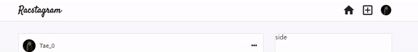
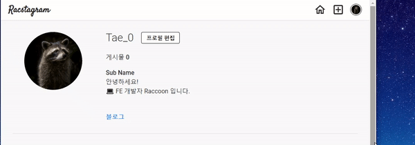

> # 리팩토링 Instagram 클론 프로젝트 by Redux-toolkit22

<br/>

<p align="center">

</p>

<br/>

> # 📄 프로젝트 설명

<br/>

이 프로젝트는 기존에 React & firebase를 통해서 만든 인스타그램 클론 프로젝트 리팩토링 프로젝트 입니다. (해당 프로젝트는 프로젝트 카테고리에서 확인 가능합니다.)

<br/>

해당 프로젝트에서는 `redux-toolkit(Slice 모델)`을 사용하여 상태관리를 구현하고 있습니다.

<br/>

더불어 나중에, styled component나 sass 중에 채택하여 css 작업을 할 예정 입니다.

<br/>
<br/>
<br/>

# 💻 화면 개요

<br/>

체크는 현재 기능적으로 구현된 상황을 의미합니다.

<br/>

- [x] `로딩 화면 또는 Component` : 앱 실행 초기화 작업시 로딩 또는 다른 작업시 사용할 로딩 화면 및 Component
  - [x] 스타일링 완료

<br/>

- [x] `로그인 화면` : 기본 Email 로그인, Social 로그인, 로그인 에러
  - [x] `Email 로그인` : Email, Password input, 로그인 버튼
  - [x] `Social 로그인` : google로그인 버튼, github로그인 버튼
  - [x] `로그인 에러` : Email로그인, google로그인, github 로그인 에러 발생시 사용자에게 출력

<br/>

- [x] `회원가입 화면` : Email 로그인을 위한 계정을 만드는 화면, 회원가입 에러
  - [x] `Email 형식 가입` : Email, Password input, 회원가입 버튼
    - [x] 가입시 사용자 Nickname 지정 input (추가 사항)

<br/>

- [x] `피드 화면` : 사용 유저의 모든 게시글을 표시하는 화면
  - [x] `게시글 박스` :
    - [x] `타이틀 영역` : 최상단의 작성자 사진 + 이름, 게시글 수정 탭
      - [x] `편집버튼` : 글 수정하기, 삭제하기 모달 -> 해당 버튼 누르면 삭제 또는 수정 페이지로 이동(아니면 모달이 수정하는 모달로 변경)
        - [x] `삭제하기`
        - [x] `수정하기`
    - [x] `사진 영역` : 기존에는 1개만 가능했음 (욕심내면, 여러개 슬라이드 형식으로 가능하게 하고 싶음)
    - [x] `내용 영역` : 게시글 내용

<br/>

- [x] `글 작성 화면` : 글을 작성하는 화면
  - [x] `이미지 리사이징`

<br/>

- [x] `현재 유저 프로필 화면` : 로그인한 현재 유저의 게시물과 대략적인 프로필를 표시하는 화면
  - [x] `유저 프로필 수정하기` : 유저 프로필을 수정하는 화면 (userImage, userDisplayname, userIntro)
  - [x] `작성 글` : 유저가 작성한 작성 글의 image 표 -> 클릭시 post detail
    - [x] `작성 글 detail view` : image 표에서 해당 이미지 클릭시 해당 글 detail view 화면
  - [x] `로그아웃`

<br/>

- [x] `다른 유저 프로필 화면` : 다른 유저가 작성한 글의 유저 이름을 클릭하여 해당 유저의 프로필 화면 구현
  - [x] `프로필 보기` : userImage, userDisplayname, userIntro
  - [x] `작성 글` : 유저가 작성한 작성 글의 image 표 -> 클릭시 post detail
    - [x] `작성 글 detail view` : image 표에서 해당 이미지 클릭시 해당 글 detail view 화면

<br/>

- [x] `네비게이션 바` : 앱로고 - 피드(Home)탭 - 글 작성탭 - 현재 유저 프로필(프로필 수정, 프로필 이동, 로그아웃) 탭
  - [x] Navigation-profile 눌렀을 때 로그아웃, 프로필 수정, 프로필 이동 드롭 다운 필요

<br/>
<br/>
<br/>

> # 📅 TIL (Today I Learned, 오늘 깨달은 것들)

<br/>

# 2021.08.04 사항

<br/>

## 작업개요 및 고찰

<br/>

- `페이지 반응형 Navigation Icon`
  - Navigation 메뉴 아이콘을 Filled, Outlined로 변환시켜 현재 페이지 위치 표시
  - pathName로 조건을 걸어 변경 하였다.
    - 기본적으로 아이콘은 모두 Outlined 상태 및 profile 이미지 아이콘은 border가 없는 상태
    - pathName === '/' 인경우 -> Filled Home 아이콘
    - pathName === '/write' 인경우 -> Filled write 아이콘
    - pathName == '/profile' 인경우 -> profile 이미지 아이콘에 border 가지기

<p align="center">

</p>

<br/>
<br/>
<br/>

- `SCSS '/' (나누기 연산자) 기능 Deprecated 경고 (Deprecation Warning of sass devision operator)`
  - scss에서 나누기 연산자로 사용하고 있는 slash ('/')가 비추천으로 경고를 띄우고 있다. 물론, 그 전에도 논란이 있어서 괄호로 묶어 사용하는 등의 주의를 기울여야 했었다.
  - dart 기반의 scss 경우에는 나중에 나누기 연산자의 기능을 아예 폐지한다고 한다.
  - **대신에, scss math의 div 함수 사용을 권장하고 있다.**
  - 이를 사용하려면, `@use 'scss:math'`를 선언하여 사용하며, **항상 module 내에서 최우선으로 선언되어야 한다.**

```scss
/* 
@import "./variable"; // 다른 rule이 먼저 있으면 안됨 
*/
@use 'scss:math';
@import "./variable";

.test {
  width: math.div(4px, 2px);
}
```

<br/>
<br/>
<br/>

- `a 태그 클릭시 새탭으로 열기(target: '_blank')`
  - a 태그를 클릭하여 href로 지정한 주소를 새 탭으로 열리게 하려면 **a 태그에 target 프로퍼티에 '\_blank' 값을 주면 된다.**
  - 이때, 새 탭으로 어떤 주소로 가게 하는 경우 보안적인 문제가 발생하기도 한다. 연결된 새탭으로 새탭을 만든 어플리케이션의 정보를 전달하고, 더 나아가 어플리케이션에 접근 할 수도 있다고 한다.
  - 그래서 React에서는 기본적으로 a 태그 `target: '_blank'`를 설정하는 경우 rel 속성을 선택하게 알려준다.
  - rel 속성 : noreferrer, noopener, nofollow
    - [쓰리래빗츠 블로그 : rel 속성 - noreferrer, noopener, nofollow](https://3rabbitz.com/blog_ko/08d34c69855fbcad)

<br/>
<br/>
<br/>

- `Profile 페이지 스타일링 구현`
  - 반응형 유저 정보 UI
    - 현재 프로젝트의 경우에는 Profile 페이지의 유저 이미지, 이름, 여러 정보들로 구성됨
    - 그런데, 현재 원하는 스타일을 구현하기 위해서는 CSS 뿐만아니라, 요소 자체의 쌓임 구조를 변경할 수 밖에 없다고 생각했다. 그래서 js로 window의 size를 가져오는 hook을 사용하였다.
    - [useWindowsSize by usehooks site](https://usehooks.com/useWindowSize/)

```js
import { useState, useEffect } from "react";

// Hook
const useWindowSize = () => {
  const [windowSize, setWindowSize] = useState({
    width: undefined,
    height: undefined,
  });
  useEffect(() => {
    function handleResize() {
      setWindowSize({
        width: window.innerWidth,
        height: window.innerHeight,
      });
    }
    window.addEventListener("resize", handleResize);
    handleResize();
    return () => window.removeEventListener("resize", handleResize);
  }, []);
  return windowSize;
};

export default useWindowSize;
```

<p align="center">

</p>

<br/>
<br/>
<br/>

- `인스타그램의 Image Table 구현하기` (profilePostImages 컴포넌트 스타일링)
  - profilePostImages의 경우 유저의 포스트 이미지가 모여 있는 table을 말한다.
  - 인스타그램의 경우에는 한줄에 3개의 포스트 이미지로 구성되어 있고, 반응형으로 이미지 사이즈가 반응한다. 그리고 포스트가 3개가 안되는 경우에도 3개의 영역을 구분하여 유지하고 있다.
  - 이를 구현하기 위해서는 받아오는 포스트를 3개씩 나누어 처리해야 했다. 그래서, devidePosts라는 함수를 만들게 되었다.
    - 기존의 Array의 요소를 3개씩 담아 다른 Array에 담는 형태의 이중 배열
    - return 예시) `[ [1, 2, 3], [4, 5, 6], [7, 8] ]`
  - 가장 외부 배열에서의 내부 요소들을 row로 표기하였고, 이를 활용해서 row 내부의 요소를 반복하여 내보냈지만, row에 이미지가 부족하게 들어오는 경우 빈 요소를 출력하지 못하여 구조가 무너지므로 강제로 3번 반복할수 있도록 하였다. (빈 값에도 요소를 만들기 위함)

<p align="center">

</p>

```js
import "./ProfilePostImages.scss";
const ProfilePostImages = ({ posts, postsOnToggle }) => {
  // posts를 3개씩 담아 이중 배열로 변환
  const devidePosts = (posts) => {
    const arr = [...posts];
    let tmp = [];
    const length = posts.length;
    for (let i = 0; i <= length / 3; i++) {
      tmp = [...tmp, [...arr.splice(0, 3)]];
    }
    return tmp;
  };

  return (
    <>
      <div className="post_table">
        {devidePosts(posts).map((row, index) => (
          <div className="posts_row" key={index.toString()}>
            {[0, 1, 2].map((i) =>
              row[i] ? (
                <div className="post_image_container" key={i.toString()}>
                  
                </div>
              ) : (
                <div className="none_image" key={i}></div>
              )
            )}
          </div>
        ))}
      </div>
    </>
  );
};
```

<br/>

- `REACT key Error`
  - **REACT에서의 요소에 지정해야 하는 key는 항상 string 타입이여야 함**

<br/>
<br/>
<br/>

## 다음에 필요한 사항

<br/>

- [ ] profile 정보 요청 시기 조정
  - 더 빠른 연산을 위해서, 화면이 render 되고 profile에 관련된 정보를 가져오지 말고 profile 보기위해 버튼을 눌렀을 때 부터 미리 profile 정보를 요청하게 하자

<br/>

- [ ] Post Detail View로 이동시 해당 글의 scrollX 위치로 이동하게 구현하기 (스타일링 이후에 scroll 위치 계산이 필요한 작업임)

<br/>

- [ ] validation 구현 필요함
  - input 같은 경우, display none 적용시 browser에서 제공하는 validation 말풍선이 뜨지 않기 때문에 따로 구현 필요함

<br/>

- [ ] 글 작성 시간 (클라이언트 단에서 뿌리는 경우 로컬 시간 변경으로 조작 가능한지 테스트 필요함)

<br/>

- [ ] User Profile 데이터 베이스 추가 필드 구현 필요
  - 이름 (subName) : 사용자 이름이 아닌 '부가적인 이름'
  - 웹사이트 (webSite) : 자신의 사이트로 이동시킬 사이트
  - 소개 (intro) : 자신의 소개 Coment(기존에 있었음)
  - 게시글 수 (Post Count) : 유저의 게시글 수
