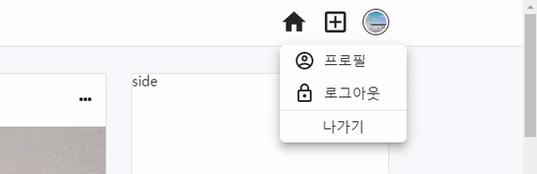
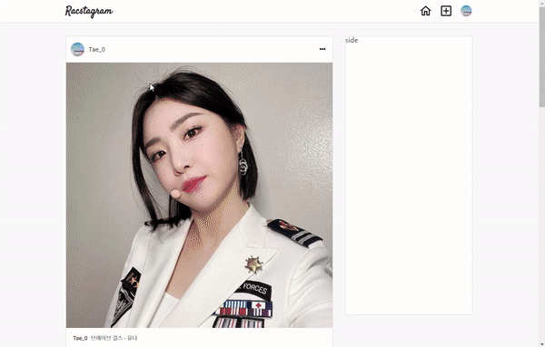
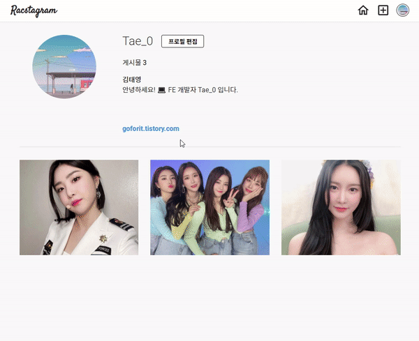
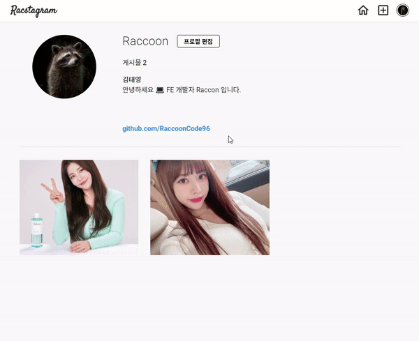

> # 리팩토링 Instagram 클론 프로젝트 by Redux-toolkit24

<br/>

<p align="center">

</p>

<br/>

> # 📄 프로젝트 설명

<br/>

이 프로젝트는 기존에 React & firebase를 통해서 만든 인스타그램 클론 프로젝트 리팩토링 프로젝트 입니다. (해당 프로젝트는 프로젝트 카테고리에서 확인 가능합니다.)

<br/>

## 상태 관리

해당 프로젝트에서는 `redux-toolkit(Slice 모델)`을 사용하여 상태관리를 구현하고 있습니다.

<br/>

## 스타일

현재 SCSS를 채택하여 css 작업을 진행중에 있으며, 부분적으로 Material UI를 사용하고 있습니다.
대부분의 경우에는, Material UI와 React 호환성 문제로 대부분은 SCSS로 직접 구현하고 있습니다.

<br/>
<br/>
<br/>

# 💻 화면 개요

<br/>

체크는 현재 기능적으로 구현된 상황을 의미합니다.

<br/>

- [x] `로딩 화면 또는 Component` : 앱 실행 초기화 작업시 로딩 또는 다른 작업시 사용할 로딩 화면 및 Component
  - [x] 스타일링 완료

<br/>

- [x] `로그인 화면` : 기본 Email 로그인, Social 로그인, 로그인 에러
  - [x] `Email 로그인` : Email, Password input, 로그인 버튼
  - [x] `Social 로그인` : google로그인 버튼, github로그인 버튼
  - [x] `로그인 에러` : Email로그인, google로그인, github 로그인 에러 발생시 사용자에게 출력

<br/>

- [x] `회원가입 화면` : Email 로그인을 위한 계정을 만드는 화면, 회원가입 에러
  - [x] `Email 형식 가입` : Email, Password input, 회원가입 버튼
    - [x] 가입시 사용자 Nickname 지정 input (추가 사항)

<br/>

- [x] `피드 화면` : 사용 유저의 모든 게시글을 표시하는 화면
  - [x] `게시글 박스` :
    - [x] `타이틀 영역` : 최상단의 작성자 사진 + 이름, 게시글 수정 탭
      - [x] `편집버튼` : 글 수정하기, 삭제하기 모달 -> 해당 버튼 누르면 삭제 또는 수정 페이지로 이동(아니면 모달이 수정하는 모달로 변경)
        - [x] `삭제하기`
        - [x] `수정하기`
    - [x] `사진 영역` : 기존에는 1개만 가능했음 (욕심내면, 여러개 슬라이드 형식으로 가능하게 하고 싶음)
    - [x] `내용 영역` : 게시글 내용

<br/>

- [x] `글 작성 화면` : 글을 작성하는 화면
  - [x] `이미지 리사이징`

<br/>

- [x] `현재 유저 프로필 화면` : 로그인한 현재 유저의 게시물과 대략적인 프로필를 표시하는 화면
  - [x] `유저 프로필 수정하기` : 유저 프로필을 수정하는 화면 (userImage, userDisplayname, userIntro)
  - [x] `작성 글` : 유저가 작성한 작성 글의 image 표 -> 클릭시 post detail
    - [x] `작성 글 detail view` : image 표에서 해당 이미지 클릭시 해당 글 detail view 화면
  - [x] `로그아웃`

<br/>

- [x] `다른 유저 프로필 화면` : 다른 유저가 작성한 글의 유저 이름을 클릭하여 해당 유저의 프로필 화면 구현
  - [x] `프로필 보기` : userImage, userDisplayname, userIntro
  - [x] `작성 글` : 유저가 작성한 작성 글의 image 표 -> 클릭시 post detail
    - [x] `작성 글 detail view` : image 표에서 해당 이미지 클릭시 해당 글 detail view 화면

<br/>

- [x] `네비게이션 바` : 앱로고 - 피드(Home)탭 - 글 작성탭 - 현재 유저 프로필(프로필 수정, 프로필 이동, 로그아웃) 탭
  - [x] Navigation-profile 눌렀을 때 로그아웃, 프로필 수정, 프로필 이동 드롭 다운 필요

<br/>
<br/>
<br/>

> # 📅 TIL (Today I Learned, 오늘 깨달은 것들)

<br/>

# 2021.08.05 사항

<br/>

## 작업개요 및 고찰

<br/>

- `드롭 메뉴 스타일 변경`
  - height, width 사이즈 변경
  - button 스타일 변경 (hover black style -> gray)
  - split border 제거, 마지막 item만 split border 적용
  - item 마다 글자 옆에 해당하는 로그아웃 아이콘, 프로필 아이콘 표시
  - Navigation 프로필 아이콘 클릭하여 드롭메뉴가 보여질때 프로필 아이콘 border 적용 (이전에는 프로필 페이지로 이동해야 적용 되었음)
  - img 태그에 잠시동안 photoUrl이 들어오지 않아 alt 속성 발현을 막음

<p align="center">

</p>

<br/>
<br/>
<br/>

- `Auth Error Code를 통한 Message 설정`
  - auth/user-not-fount , auth/wrong-password
  - -> 가입되지 않은 아이디이거나, 잘못된 비밀번호입니다.

<br/>
<br/>
<br/>

- `Profile 수정 페이지 스타일링 및 website, subDisplayName input 추가`
  - Profile 수정 페이지 스타일링 (인스타그램 스타일 참고)
  - website, subDisplayName input 추가해서 website 연결 기능, subDisplayName 설정 가능하게 함

<p align="center">

</p>

<br/>
<br/>
<br/>

- `정규 표현식을 통한 사용자 website Url 포맷팅`
  - Profile 페이지에 website Url 표시
    - Url 전부가 아닌 domain과 path 까지 표시
    - path가 없으면 domain 만, path가 있으면 domain에 path 까지

```js
const websiteMatch = (website) => {
  if (!website) {
    return "";
  }
  const check = website.match(/\/\/([A-Za-z0-9.]+)\/?([A-Za-z0-9]*)/);
  if (!check[2]) {
    return check[1];
  } else {
    return website.match(/\/\/([A-Za-z0-9.]+\/[A-Za-z0-9]+)/)[1];
  }
};
```

<p align="center">

</p>

<p align="center">

</p>

<br/>

- `게시글 개수 표시 구현`
  - 사용자 게시글들을 가져와서 게시글 개수인 length 프로퍼티 전달

<br/>
<br/>
<br/>

- `Noto Sans KR 폰트 적용`

  - roboto만 적용하는 경우 한글과 영어의 font-weight 차이가 남
  - Noto Sans KR 폰트 적용하여 weigth를 비슷하게 만듦

<br/>

- `JSX 영역의 함수 사용에 관한 생각`
  - React functional Component에서 함수를 정의하여 함수가 반환하는 값을 사용하는 경우, 바로 Component의 return인 jsx부분에서 함수를 호출하여 넣어도 괜찮았다. 물론, 이것이 올바른 방향인지는 잘 모르겠지만 나중에 hooks를 만들어 관리해야 겠다.

<br/>
<br/>
<br/>

## 다음에 필요한 사항

<br/>

- [ ] profile 정보 요청 시기 조정
  - 더 빠른 연산을 위해서, 화면이 render 되고 profile에 관련된 정보를 가져오지 말고 profile 보기위해 버튼을 눌렀을 때 부터 미리 profile 정보를 요청하게 하자

<br/>

- [ ] Post Detail View로 이동시 해당 글의 scrollX 위치로 이동하게 구현하기 (스타일링 이후에 scroll 위치 계산이 필요한 작업임)

<br/>

- [ ] validation 구현 필요함
  - input 같은 경우, display none 적용시 browser에서 제공하는 validation 말풍선이 뜨지 않기 때문에 따로 구현 필요함
  - required를 사용하지 말고, submit 함수 단에서 input값이 들어 왔는지 체크하여 validation error 구현 필요
  - [x] post 관련한 input의 check 대략적인 (PostUpdateContainer, postFormContainer)
  - [x] auth 관련한 input의 check 대략적인 조건 구현
  - [ ] 각 input 별로 데이터 형태에 따른 구체적인 조건 설정이 필요함
    - [ ] 이메일, 패스워드, 유저 네임, 글 내용의 형식(조건, 제한) 지정 필요

<br/>

- [ ] 글 작성 시간 (클라이언트 단에서 뿌리는 경우 로컬 시간 변경으로 조작 가능한지 테스트 필요함)

<br/>

- [x] User Profile 데이터 베이스 추가 필드 구현 필요
  - 이름 (subName) : 사용자 이름이 아닌 '부가적인 이름'
  - 웹사이트 (webSite) : 자신의 사이트로 이동시킬 사이트
  - 소개 (intro) : 자신의 소개 Coment(기존에 있었음)
  - 게시글 수 (Post Count) : 유저의 게시글 수

<br/>

- [ ] profileUpdateContainer과 postFormContainer 통합 시도

<br/>

- [ ] 효과적인 렌더링 제한을 위해서 container에 있는 함수들을 hook으로 만들어 구현하기

<br/>
<br/>
<br/>

# 나중에 구현하고 싶은 기술

<br/>

- side 바에 유저 랜덤 추천 및 푸터 정보
- 유저 이름 검색을 통한 프로필 보기 (이름 검색)
- 무한 스크롤
- 게시글 장소 태그로 장소 지도 보기 (지도 API)
