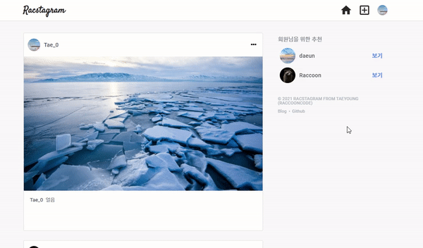

> # 리팩토링 Instagram 클론 프로젝트 by Redux-toolkit28

<br/>

<p align="center">

</p>

<br/>

> # 📄 프로젝트 설명

<br/>

이 프로젝트는 기존에 React & firebase를 통해서 만든 인스타그램 클론 프로젝트 리팩토링 프로젝트 입니다. (해당 프로젝트는 프로젝트 카테고리에서 확인 가능합니다.)

<br/>

## 상태 관리

해당 프로젝트에서는 `redux-toolkit(Slice 모델)`을 사용하여 상태관리를 구현하고 있습니다.

<br/>

## 스타일

현재 SCSS를 채택하여 css 작업을 진행중에 있으며, 부분적으로 Material UI를 사용하고 있습니다.
대부분의 경우에는, Material UI와 React 호환성 문제로 대부분은 SCSS로 직접 구현하고 있습니다.

<br/>
<br/>
<br/>

# 💻 화면 개요

<br/>

체크는 현재 기능적으로 구현된 상황을 의미합니다.

<br/>

- [x] `로딩 화면 또는 Component` : 앱 실행 초기화 작업시 로딩 또는 다른 작업시 사용할 로딩 화면 및 Component
  - [x] 스타일링 완료

<br/>

- [x] `로그인 화면` : 기본 Email 로그인, Social 로그인, 로그인 에러
  - [x] `Email 로그인` : Email, Password input, 로그인 버튼
  - [x] `Social 로그인` : google로그인 버튼, github로그인 버튼
  - [x] `로그인 에러` : Email로그인, google로그인, github 로그인 에러 발생시 사용자에게 출력

<br/>

- [x] `회원가입 화면` : Email 로그인을 위한 계정을 만드는 화면, 회원가입 에러
  - [x] `Email 형식 가입` : Email, Password input, 회원가입 버튼
    - [x] 가입시 사용자 Nickname 지정 input (추가 사항)

<br/>

- [x] `피드 화면` : 사용 유저의 모든 게시글을 표시하는 화면
  - [x] `게시글 박스` :
    - [x] `타이틀 영역` : 최상단의 작성자 사진 + 이름, 게시글 수정 탭
      - [x] `편집버튼` : 글 수정하기, 삭제하기 모달 -> 해당 버튼 누르면 삭제 또는 수정 페이지로 이동(아니면 모달이 수정하는 모달로 변경)
        - [x] `삭제하기`
        - [x] `수정하기`
    - [x] `사진 영역` : 기존에는 1개만 가능했음 (욕심내면, 여러개 슬라이드 형식으로 가능하게 하고 싶음)
    - [x] `내용 영역` : 게시글 내용

<br/>

- [x] `글 작성 화면` : 글을 작성하는 화면
  - [x] `이미지 리사이징`

<br/>

- [x] `현재 유저 프로필 화면` : 로그인한 현재 유저의 게시물과 대략적인 프로필를 표시하는 화면
  - [x] `유저 프로필 수정하기` : 유저 프로필을 수정하는 화면 (userImage, userDisplayname, userIntro)
  - [x] `작성 글` : 유저가 작성한 작성 글의 image 표 -> 클릭시 post detail
    - [x] `작성 글 detail view` : image 표에서 해당 이미지 클릭시 해당 글 detail view 화면
  - [x] `로그아웃`

<br/>

- [x] `다른 유저 프로필 화면` : 다른 유저가 작성한 글의 유저 이름을 클릭하여 해당 유저의 프로필 화면 구현
  - [x] `프로필 보기` : userImage, userDisplayname, userIntro
  - [x] `작성 글` : 유저가 작성한 작성 글의 image 표 -> 클릭시 post detail
    - [x] `작성 글 detail view` : image 표에서 해당 이미지 클릭시 해당 글 detail view 화면

<br/>

- [x] `네비게이션 바` : 앱로고 - 피드(Home)탭 - 글 작성탭 - 현재 유저 프로필(프로필 수정, 프로필 이동, 로그아웃) 탭
  - [x] Navigation-profile 눌렀을 때 로그아웃, 프로필 수정, 프로필 이동 드롭 다운 필요

<br/>

- [x] `무한 스크롤`
  - [x] 유저 스크롤 위치 기억 (뒤로가기가 아닌 페이지 변해도 기억 함)

<br/>

- [x] `랜덤 유저 추천`

<br/>
<br/>
<br/>

> # 📅 TIL (Today I Learned, 오늘 깨달은 것들)

<br/>

# 2021.08.13 사항

<br/>

## 1. 랜덤 유저 추천 개선

<br/>

<p align="center">

</p>

### 기존의 랜덤 유저 추천 기능

- 기존에 랜덤 유저 추천 방식은 일정한 색인 내에서 자신의 프로필을 제외한 유저 프로필를 2개 가져오는 방식이었다. 그래서 유저가 추가되어 색인이 조금 변동이 생기지 않는이상 다양한 유저를 보여주지 못하는 한계가 있었다.
- 원래도 useRandom이라는 hook을 만들어 활용하고 싶었다. Javascript의 set 자료구조를 이용해서 랜덤한 숫자의 중복을 제거한 배열을 반환하도록 만들었었다.
- 하지만, 랜덤 유저 추천을 하려면 자신을 제외해야하는 로직이 필요했었다. 그 당시에는 firebase에서 두가지 필드를 조건으로 해서 데이터를 요청하고자 했는데 firebase는 두가지 다른 필드를 조건으로 해서 데이터 요청이 불가능 했었다.

<br/>

### 접근

- 그래서 임시적으로 자신을 제외한 2명의 유저 정보를 가져오는 것으로 사용하고 있었고, 어느 순간 useRandom에서 자신을 제외한 값을 가지는 radom 숫자 배열을 반환하는 형태로 변경하면 될 것 같다는 생각이 들었다.

<br/>

### useRandom hook (useState, useEffect 등의 hook이 사용되진 않음)

<br/>

```js
const useRandom = (count, range, except) => {
  if (count > range - 1) {
    return "범위 크기 보다 뽑으려는 개수가 많습니다.";
  }
  const randomSet = new Set();
  while (randomSet.size < count) {
    const temp = Math.floor(Math.random() * (range + 1));
    if (temp === except) {
      continue;
    }
    randomSet.add(temp);
  }
  return [...randomSet];
};

export default useRandom;

/* 
count : 뽑을 개수
range : 정수 숫자 범위
except : 뽑는 숫자중에 제외할 정수
return : 일정 범위(0이상 ~ range 이하) 숫자에서 일정한 개수의 랜덤 숫자가 들어간 배열을 반환 (except 고려)
*/
```

<br/>

### 랜덤 유저 정보 요청 함수 (getRandomUserInfoThunk)

- 기본적으로 모든 유저는 회원 가입시에 count라는 필드에 가입된 순서대로 숫자를 가짐 (나중에 회원 수를 구하고 싶을때 가장 최근 유저 count 값을 통해 회원수를 가져올 때 활용 가능, 모든 유저를 가져올 필요 없이)
- count는 각 회원의 고유한 숫자이기 때문에, random 한 숫자를 가지고 해당 숫자에 맞는 회원을 가져올 수 있음
- getUserMaxCountThunk를 통해서 가장 최근 가입 유저의 정보에서 count 값을 가져옴 으로서 회원 range를 가져와서 활용함
- useRandom(count, range, except)를 활용하여 랜덤 유저 숫자 배열 생성

```js
export const getRandomUserInfoThunk = createAsyncThunk(
  "redux-racstagram/users/getRandomUserInfoThunk",
  async (_, thunkAPI) => {
    try {
      // 회원 수 요청
      await thunkAPI.dispatch(getUserMaxCountThunk());
      const {
        users: {
          currentUserInfo: { count },
          userMaxCount,
        },
      } = await thunkAPI.getState();

      // 현재 유저 count(제외 수)와 회원 수(range)를 가져와 useRandom hook을 돌림
      const random = useRandom(2, userMaxCount, count);

      // firestore에 해당 숫자에 맞는 유저 정보 요청
      const { docs } = await dbService
        .collection("users")
        .where("count", "in", random)
        .get();

      // 각 유저의 displayName, userPhotoUrl 정보만 가진 데이터로 가공 -> array
      const res = docs.map((doc) => {
        const { displayName, userPhotoUrl } = doc.data();
        return { displayName, userPhotoUrl };
      });

      return res;
    } catch ({ code, message }) {
      return thunkAPI.rejectWithValue({ code, message });
    }
  }
);
```

<br/>
<br/>
<br/>

## 2. 스크롤 위치 기억 (useScroll 구현)

<br/>

- 뒤로가기 버튼이 아닌, 페이지 컴포넌트가 unmount 되고 다시 mount가 되는 경우 unmount 되었을 때의 스크롤 위치를 기억하는 기능 구현

<p align="center">

</p>

<br/>

### 접근

- window.scrollY 값을 활용하여 redux에 prevScrollY state에 저장하게 하고 다시 mount 되는 경우 prevScrollY를 참조하여 window.scrollTo 함수를 통해서 해당 스크롤 위치로 이동시키게 하고자 함

<br/>
  
### 문제 발생 
- unmount 되는 때에 해당 컴포넌트의 window.scrollY 값을 받고 싶지만 useEffect에서 unmount를 관리하는 return 부분은 컴포넌트가 unmount 되고나서 실행되기 때문에 다른 컴포넌트가 mount 되어 다른 컴포넌트의 window.scrollY 값을 참조하게 됨
- 라이프 사이클을 디테일하게 다룰수 있는 방법을 찾아 보았지만, Before Unmount 에 관한 이야기는 없었다.

<br/>
  
### 시도1 : Scroll Event 리스너 부착하여 useEffect return 부분에 useState 참조 방식
- useEffect를 가지고 unmount 문제가 아닌 것인가 하여 scroll event 리스너를 부착하는 방식을 시도 해보았다.
  - scroll event 리스너를 부착하는 방식은 불필요하게 너무 많은 event를 발생시키기 때문에 사용하고 싶지 않았다. 딱, unmount 때를 감지하여 값을 참조하고 싶었다. 
- 리스너가 scroll을 감지해 계속 컴포넌트 내부 useState에 값을 반영하도록 하였다. 그리하여 useEffect return 부분에 state를 참조 하려고 시도 하였다.
  - 하지만 결과는 최초 mount 되었을 때 useState의 초기값 만을 참조되고, 스크롤 event로 인해 변경된 값은 참조되지 않았다.
- 이렇다고 해서, unmount를 감지 하지 않고 mount 된 상태에서 계속 Scroll Event를 받으면 dispatch를 요청하는 것을 정말 아닌 것 같았다.

<br/>

### 시도2 : 리스너 없이 useEffect return 부분에서 setState(window.scrollY)를 시도하고 state 참조 방식

- 기존에 있던 리스너를 빼고, useEffect return 부분에 setState로 값을 바로 변경하고, state를 참조하여 dispatch 하는 방식을 시도해 보았다.
- 하지만, 시도1과 같이 state의 초기값만 참조하고, setState에 의해 변경된 값은 반영되어 지지 않았다.

<br/>
  
### 차선책 : 해당 페이지를 unmount 시키는 버튼들에 모두 window.scrollY값을 dispatch하게 하는 방식

- 엄청 돌고 돌아서, 간접적으로 원하는 페이지에서 unmount 시키는 즉, 다른 page로 이동시키는 nav 버튼 등에 onClick시 모두 window.scrollY 값을 dispatch 요청하는 것
- 가능할것 같지만, 원하는 페이지가 아닌 다른 페이지에서 이런 버튼들을 누르게 되면 쓸데 없는 요청을 하게 됨
- 진짜 진짜, 할 수 없으면 최종 책으로 사용하고자 함

<br/>

### **최종 해결책 : useLayoutEffect**

<br/>

- 하루 종일 google을 돌아다니다가, 어떻게 하다보니 React에서 useLayoutEffect hooks를 지원한다는 것을 알게 되었고 useLayoutEffect는 좀더 디테일한 라이프 사이클을 활용할 수 있게 도와주는 hook임을 알게 되었다. useLayoutEffect를 통해서 내가 원하는 Before Unmount인 라이프 사이클을 활용할 수 있게 되었다.
- [useLayoutEffect 소개 by 찬민](https://merrily-code.tistory.com/46)

<p align="center">

</p>

<br/>

- useScroll 구현 (해당 프로젝트에서만 재사용 가능함)
  - redux state 값을 참조하고 update 함
  - unmount 시의 사용자 window.scrollY 값을 redux의 prevScrollY에 올림
  - 그리고 mount 되고 prevScrollY 값을 참조받아 scrollTo 메서드로 스크롤을 해당 위치로 이동

```js
import { useLayoutEffect } from "react";
import { useDispatch, useSelector } from "react-redux";
import { setPrevScrollY } from "../redux/modules/post";

const useScroll = () => {
  const dispatch = useDispatch();
  const prevScrollY = useSelector((state) => state.post.prevScrollY);

  useLayoutEffect(() => {
    if (prevScrollY) {
      window.scrollTo(0, prevScrollY);
    }
    return () => {
      dispatch(setPrevScrollY(window.scrollY));
    };
  }, []);
};

export default useScroll;
```

## 다음에 필요한 사항

- [ ] 댓글 좋아요 기능

<br/>

- [ ] 자동 input 체크 (이름 중복 확인시)

<br/>

- [ ] 새 게시글 보기 버튼 또는 로고 클릭시 데이터 진입점 갱신 기능 구현하기

<br/>

- [x] 랜덤 유저 개선하기 : useRandom 제외 값 지정하게 변경하기

<br/>

- [ ] validation 구현 필요함
  - input 같은 경우, display none 적용시 browser에서 제공하는 validation 말풍선이 뜨지 않기 때문에 따로 구현 필요함
  - required를 사용하지 말고, submit 함수 단에서 input값이 들어 왔는지 체크하여 validation error 구현 필요
  - [x] post 관련한 input의 check 대략적인 (PostUpdateContainer, postFormContainer)
  - [x] auth 관련한 input의 check 대략적인 조건 구현
  - [ ] 각 input 별로 데이터 형태에 따른 구체적인 조건 설정이 필요함
    - [ ] 이메일, 패스워드, 유저 네임, 글 내용의 형식(조건, 제한) 지정 필요

<br/>

- [ ] 스켈레톤 UI 필요

<br/>

- [ ] propType으로 type 지정 또는 typeScript 도입

<br/>

- [ ] sementic tag 적절한 태그로 수정하기 (검토)

<br/>

- [ ] 효과적인 렌더링 제한을 위해서 container에 있는 함수들을 hook으로 만들어 구현하기

<br/>

- [ ] route '/profile' pathName을 '/user/:userName' pathName 사용하게 통합하여 pathname에 대한 조건을 줄여 보자

<br/>

- [ ] profileUpdateContainer과 postFormContainer 통합 시도

<br/>

- [ ] 글 작성 시간 (클라이언트 단에서 뿌리는 경우 로컬 시간 변경으로 조작 가능한지 테스트 필요함)

<br/>
<br/>
<br/>

# 나중에 구현하고 싶은 기술

<br/>

- [x] side 바에 유저 랜덤 추천 및 푸터 정보
- [x] 무한 스크롤
- [ ] 댓글 기능
- [ ] 좋아요 기능
- [ ] 유저 이름 검색을 통한 프로필 보기 (이름 검색)
- [ ] 게시글 장소 태그로 장소 지도 보기 (지도 API)
