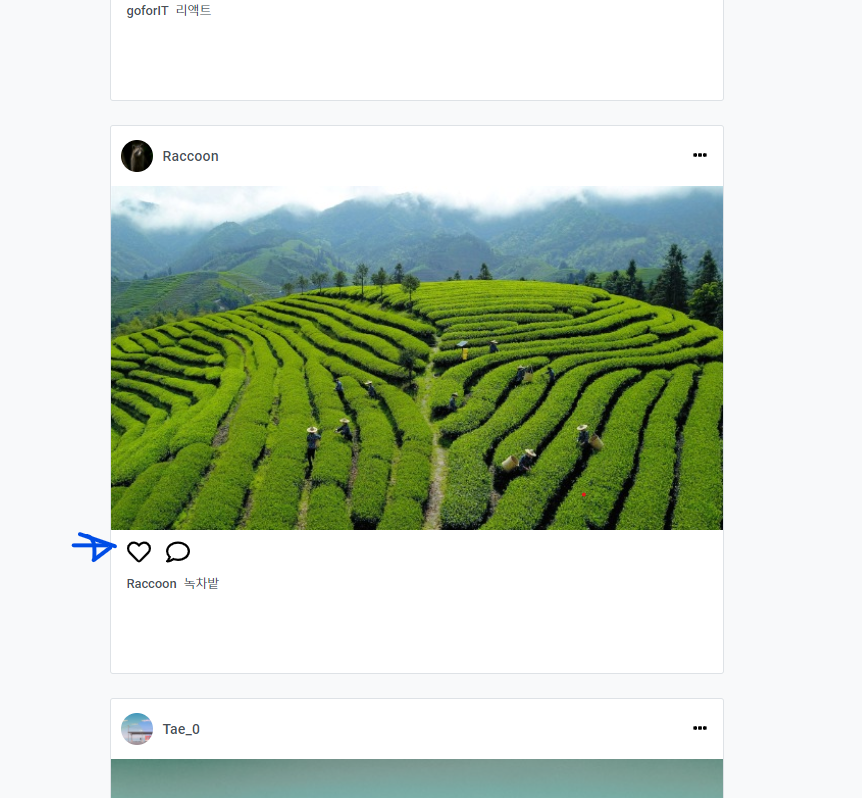
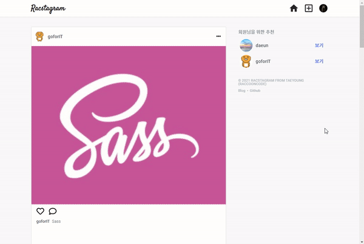

> # 리팩토링 Instagram 클론 프로젝트 by Redux-toolkit30

<br/>

<p align="center">

</p>

<br/>

> # 📄 프로젝트 설명

<br/>

이 프로젝트는 기존에 React & firebase를 통해서 만든 인스타그램 클론 프로젝트 리팩토링 프로젝트 입니다. (해당 프로젝트는 프로젝트 카테고리에서 확인 가능합니다.)

<br/>

## 상태 관리

해당 프로젝트에서는 `redux-toolkit(Slice 모델)`을 사용하여 상태관리를 구현하고 있습니다.

<br/>

## 스타일

현재 SCSS를 채택하여 css 작업을 진행중에 있으며, 부분적으로 Material UI를 사용하고 있습니다.
대부분의 경우에는, Material UI와 React 호환성 문제로 대부분은 SCSS로 직접 구현하고 있습니다.

<br/>
<br/>
<br/>

# 💻 화면 개요

<br/>

체크는 현재 기능적으로 구현된 상황을 의미합니다.

<br/>

- [x] `로딩 화면 또는 Component` : 앱 실행 초기화 작업시 로딩 또는 다른 작업시 사용할 로딩 화면 및 Component
  - [x] 스타일링 완료

<br/>

- [x] `로그인 화면` : 기본 Email 로그인, Social 로그인, 로그인 에러
  - [x] `Email 로그인` : Email, Password input, 로그인 버튼
  - [x] `Social 로그인` : google로그인 버튼, github로그인 버튼
  - [x] `로그인 에러` : Email로그인, google로그인, github 로그인 에러 발생시 사용자에게 출력

<br/>

- [x] `회원가입 화면` : Email 로그인을 위한 계정을 만드는 화면, 회원가입 에러
  - [x] `Email 형식 가입` : Email, Password input, 회원가입 버튼
    - [x] 가입시 사용자 Nickname 지정 input (추가 사항)

<br/>

- [x] `피드 화면` : 사용 유저의 모든 게시글을 표시하는 화면
  - [x] `게시글 박스` :
    - [x] `타이틀 영역` : 최상단의 작성자 사진 + 이름, 게시글 수정 탭
      - [x] `편집버튼` : 글 수정하기, 삭제하기 모달 -> 해당 버튼 누르면 삭제 또는 수정 페이지로 이동(아니면 모달이 수정하는 모달로 변경)
        - [x] `삭제하기`
        - [x] `수정하기`
    - [x] `사진 영역` : 기존에는 1개만 가능했음 (욕심내면, 여러개 슬라이드 형식으로 가능하게 하고 싶음)
    - [x] `내용 영역` : 게시글 내용

<br/>

- [x] `글 작성 화면` : 글을 작성하는 화면
  - [x] `이미지 리사이징`

<br/>

- [x] `현재 유저 프로필 화면` : 로그인한 현재 유저의 게시물과 대략적인 프로필를 표시하는 화면
  - [x] `유저 프로필 수정하기` : 유저 프로필을 수정하는 화면 (userImage, userDisplayname, userIntro)
  - [x] `작성 글` : 유저가 작성한 작성 글의 image 표 -> 클릭시 post detail
    - [x] `작성 글 detail view` : image 표에서 해당 이미지 클릭시 해당 글 detail view 화면
  - [x] `로그아웃`

<br/>

- [x] `다른 유저 프로필 화면` : 다른 유저가 작성한 글의 유저 이름을 클릭하여 해당 유저의 프로필 화면 구현
  - [x] `프로필 보기` : userImage, userDisplayname, userIntro
  - [x] `작성 글` : 유저가 작성한 작성 글의 image 표 -> 클릭시 post detail
    - [x] `작성 글 detail view` : image 표에서 해당 이미지 클릭시 해당 글 detail view 화면

<br/>

- [x] `네비게이션 바` : 앱로고 - 피드(Home)탭 - 글 작성탭 - 현재 유저 프로필(프로필 수정, 프로필 이동, 로그아웃) 탭
  - [x] Navigation-profile 눌렀을 때 로그아웃, 프로필 수정, 프로필 이동 드롭 다운 필요

<br/>

- [x] `무한 스크롤`
  - [x] 유저 스크롤 위치 기억 (뒤로가기가 아닌 페이지 변해도 기억 함)

<br/>

- [x] `랜덤 유저 추천`

<br/>

- [ ] `댓글 기능`

<br/>
<br/>
<br/>

> # 📅 TIL (Today I Learned, 오늘 깨달은 것들)

<br/>

# 2021.08.15 사항

<br/>

## 1. 댓글 관련 컴포넌트 스타일링

<br/>

### PostControl 컴포넌트 스타일링

- PostText와 PostImage 사이에 PostControl을 위치시킴
- 좋아요의 하트 버튼, 댓글의 말풍선 버튼을 구성 함

<p align="center">

</p>

<br/>
<br/>
<br/>

### 댓글 페이지 스타일링

<br/>

<p align="center">

</p>

- 댓글 페이지 스타일링
  - 댓글 페이지 배치 스타일링 : Navigation 아래 inner 안에 main, side가 양옆으로 나란히 있는 구성으로 배치함

<br/>

- CommentForm 컴포넌트 스타일링
  - fixed 형태가 아닌 flex를 걸어서, main 안에 CommentForm, comments_container가 나란히 존재하고 conmments_container 안에서 여러 comment가 overflow scroll 형태로 움직이게 함
  - submit 버튼 색
    - disabled 때는 회색
    - disabled가 제거된는 때 하늘색 (input 값이 있는 경우)
    - hover 시에는 파란색

<br/>

- Comment 스타일링
  - 각 Comment는 댓글 작성자 이미지, 작성자 이름, 댓글 내용이 들어가 있는 형태이다.
  - 작성자 이미지는 동그라미가 되게하고 작성자 이름은 a tag를 사용하여 굵게 처리함 (작성자 이름 클릭시 해당 작성자 profile로 이동할 수 있게)
  - 댓글을 span tag를 사용하고 mixins 로 지정한 기본적인 text 컬러로 지정

<br/>
<br/>
<br/>

## 2. 컴포넌트에 Comment Read, Create 연결 하기

<p align="center">

</p>

### PostControlContainer

- PostControlContainer에서 PostControl 컴포넌트로 goComments라는 함수를 생성하여 넘김
- goComments 함수에서 **getCommentsThunk는 postId를 인자로 받아 Read 요청**하고, postId에 맞는 '/postId/comments' path로 이동 시킴
- goComments 함수를 말풍선 아이콘을 클릭시 실행

```js
// ... 생략

const goComments = useCallback(async () => {
  await dispatch(getCommentsThunk(post.postId));
  history.push({ pathname: `/${post.postId}/comments`, state: { post } });
}, []);

// ...
```

### CommentFormContainer

- CommentFormContainer에서 CommentForm 컴포넌트로 onSubmit 함수 생성하여 넘기
- onSubmit 함수에서 setCommentThunk는 postId와 comment를 인자로 받아 Create 요청
  - 그리고, input에 연결된 comment useState를 빈 문자열 '' 상태로 초기화 함

```js
// ... 생략

const onSubmit = useCallback(
  (event) => {
    event.preventDefault();
    dispatch(setCommentThunk({ postId, comment }));
    setComment("");
  },
  [dispatch, postId, comment]
);

// ...
```

<br/>
<br/>
<br/>

## 3. Comment delete 구현하기

<br/>

- delete 구현시 고려할 점
  - Posts와 Comments를 따로 관리하기 때문에 Post, Comments가 상황에 일치 할 수 있도록 모두 신경 써야 함
  - 경우1) post가 글 작성자에 의해서 지워지는 경우, 모든 댓글도 같이 지워야 됨
  - 경우2) 댓글 작성자가 자신의 댓글만 지우는 경우
    - 이때, 만약 Post에도 2개의 comments view가 있는 경우 지우려는 댓글과 comments view에 있는 댓글과 일치하면, 반영해주어야 함

<br/>

- **현재는 간단하게 경우1 만 구현**하여 해당 글의 댓글을 모두 지우는 요청으로 만들고, post delete 요청 함수안에 같이 요청하게 넣었다.

```js
// 해당 글에 대한 댓글 모두 지우기 요청 함수
export const deleteCommentsThunk = createAsyncThunk(
  "redux-racstagram/comment/deleteCommentsThunk",
  async (postId, thunkAPI) => {
    try {
      const { docs } = await dbService
        .collection("comments")
        .where("postId", "==", postId)
        .get();
      const promises = docs.forEach((doc) => {
        dbService.collection("comments").doc(doc.id).delete();
      });
      await Promise.all(promises);
      return true;
    } catch ({ code, message }) {
      return thunkAPI.rejectWithValue({ code, message });
    }
  }
);
```

```js
// 해당 글 지우기 요청 함수
export const deletePostThunk = createAsyncThunk(
  "redux-racstagram/post/deletePostThunk",
  async (post, thunkAPI) => {
    try {
      const {
        profile: { currentUser },
      } = await thunkAPI.getState();
      const { postId, postImageUrl, userId } = post;
      // 유저 방어 코드
      if (userId === currentUser.uid) {
        // 글 지우기 요청
        await dbService.collection("posts").doc(postId).delete();
        // 해당글의 모든 댓글 지우기 요청
        thunkAPI.dispatch(deleteCommentsThunk(postId));
        if (postImageUrl !== "") {
          await thunkAPI.dispatch(deleteImageUrlThunk(postImageUrl));
        }
      } else {
        throw new Error("Invalid user access!");
      }
      await thunkAPI.dispatch(resetImage());
      return true;
    } catch ({ code, message }) {
      return thunkAPI.rejectWithValue({ code, message });
    }
  }
);
```

<br/>
<br/>
<br/>

## 다음에 필요한 사항

- [ ] 댓글 좋아요 기능 -> 진행중
  - [x] 기본적인 comments page, comment, commentForm 스타일링
  - [x] comment read, create 요청 함수 컴포넌트에 연결 하기
  - [ ] post의 comments view 구현과 이에 맞게 comment create, read, delete 수정하기
  - [ ] comment update 구현하기

<br/>

- [ ] 자동 input 체크 (이름 중복 확인시)

<br/>

- [ ] 새 게시글 보기 버튼 또는 로고 클릭시 데이터 진입점 갱신 기능 구현하기

<br/>

- [ ] validation 구현 필요함
  - input 같은 경우, display none 적용시 browser에서 제공하는 validation 말풍선이 뜨지 않기 때문에 따로 구현 필요함
  - required를 사용하지 말고, submit 함수 단에서 input값이 들어 왔는지 체크하여 validation error 구현 필요
  - [x] post 관련한 input의 check 대략적인 (PostUpdateContainer, postFormContainer)
  - [x] auth 관련한 input의 check 대략적인 조건 구현
  - [ ] 각 input 별로 데이터 형태에 따른 구체적인 조건 설정이 필요함
    - [ ] 이메일, 패스워드, 유저 네임, 글 내용의 형식(조건, 제한) 지정 필요

<br/>

- [ ] 스켈레톤 UI 필요

<br/>

- [ ] propType으로 type 지정 또는 typeScript 도입

<br/>

- [ ] sementic tag 적절한 태그로 수정하기 (검토)

<br/>

- [ ] 효과적인 렌더링 제한을 위해서 container에 있는 함수들을 hook으로 만들어 구현하기

<br/>

- [ ] route '/profile' pathName을 '/user/:userName' pathName 사용하게 통합하여 pathname에 대한 조건을 줄여 보자

<br/>

- [ ] profileUpdateContainer과 postFormContainer 통합 시도

<br/>

- [ ] 글 작성 시간 (클라이언트 단에서 뿌리는 경우 로컬 시간 변경으로 조작 가능한지 테스트 필요함)

<br/>
<br/>
<br/>

# 나중에 구현하고 싶은 기술

<br/>

- [ ] 댓글 기능
- [ ] 좋아요 기능
- [ ] 유저 이름 검색을 통한 프로필 보기 (이름 검색)
- [ ] 게시글 장소 태그로 장소 지도 보기 (지도 API)
