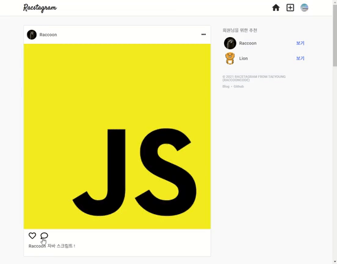

> # 리팩토링 Instagram 클론 프로젝트 by Redux-toolkit31

<br/>

<p align="center">

</p>

<br/>

> # 📄 프로젝트 설명

<br/>

이 프로젝트는 기존에 React & firebase를 통해서 만든 인스타그램 클론 프로젝트 리팩토링 프로젝트 입니다. (해당 프로젝트는 프로젝트 카테고리에서 확인 가능합니다.)

<br/>

## 상태 관리

해당 프로젝트에서는 `redux-toolkit(Slice 모델)`을 사용하여 상태관리를 구현하고 있습니다.

<br/>

## 스타일

현재 SCSS를 채택하여 css 작업을 진행중에 있으며, 부분적으로 Material UI를 사용하고 있습니다.
대부분의 경우에는, Material UI와 React 호환성 문제로 대부분은 SCSS로 직접 구현하고 있습니다.

<br/>
<br/>
<br/>

# 💻 화면 개요

<br/>

체크는 현재 기능적으로 구현된 상황을 의미합니다.

<br/>

- [x] `로딩 화면 또는 Component` : 앱 실행 초기화 작업시 로딩 또는 다른 작업시 사용할 로딩 화면 및 Component
  - [x] 스타일링 완료

<br/>

- [x] `로그인 화면` : 기본 Email 로그인, Social 로그인, 로그인 에러
  - [x] `Email 로그인` : Email, Password input, 로그인 버튼
  - [x] `Social 로그인` : google로그인 버튼, github로그인 버튼
  - [x] `로그인 에러` : Email로그인, google로그인, github 로그인 에러 발생시 사용자에게 출력

<br/>

- [x] `회원가입 화면` : Email 로그인을 위한 계정을 만드는 화면, 회원가입 에러
  - [x] `Email 형식 가입` : Email, Password input, 회원가입 버튼
    - [x] 가입시 사용자 Nickname 지정 input (추가 사항)

<br/>

- [x] `피드 화면` : 사용 유저의 모든 게시글을 표시하는 화면
  - [x] `게시글 박스` :
    - [x] `타이틀 영역` : 최상단의 작성자 사진 + 이름, 게시글 수정 탭
      - [x] `편집버튼` : 글 수정하기, 삭제하기 모달 -> 해당 버튼 누르면 삭제 또는 수정 페이지로 이동(아니면 모달이 수정하는 모달로 변경)
        - [x] `삭제하기`
        - [x] `수정하기`
    - [x] `사진 영역` : 기존에는 1개만 가능했음 (욕심내면, 여러개 슬라이드 형식으로 가능하게 하고 싶음)
    - [x] `내용 영역` : 게시글 내용

<br/>

- [x] `글 작성 화면` : 글을 작성하는 화면
  - [x] `이미지 리사이징`

<br/>

- [x] `현재 유저 프로필 화면` : 로그인한 현재 유저의 게시물과 대략적인 프로필를 표시하는 화면
  - [x] `유저 프로필 수정하기` : 유저 프로필을 수정하는 화면 (userImage, userDisplayname, userIntro)
  - [x] `작성 글` : 유저가 작성한 작성 글의 image 표 -> 클릭시 post detail
    - [x] `작성 글 detail view` : image 표에서 해당 이미지 클릭시 해당 글 detail view 화면
  - [x] `로그아웃`

<br/>

- [x] `다른 유저 프로필 화면` : 다른 유저가 작성한 글의 유저 이름을 클릭하여 해당 유저의 프로필 화면 구현
  - [x] `프로필 보기` : userImage, userDisplayname, userIntro
  - [x] `작성 글` : 유저가 작성한 작성 글의 image 표 -> 클릭시 post detail
    - [x] `작성 글 detail view` : image 표에서 해당 이미지 클릭시 해당 글 detail view 화면

<br/>

- [x] `네비게이션 바` : 앱로고 - 피드(Home)탭 - 글 작성탭 - 현재 유저 프로필(프로필 수정, 프로필 이동, 로그아웃) 탭
  - [x] Navigation-profile 눌렀을 때 로그아웃, 프로필 수정, 프로필 이동 드롭 다운 필요

<br/>

- [x] `무한 스크롤`
  - [x] 유저 스크롤 위치 기억 (뒤로가기가 아닌 페이지 변해도 기억 함)

<br/>

- [x] `랜덤 유저 추천`

<br/>

- [ ] `댓글 기능`

<br/>
<br/>
<br/>

> # 📅 TIL (Today I Learned, 오늘 깨달은 것들)

<br/>

# 2021.08.16 사항

<br/>

## 1. Post 컴포넌트에 최신 댓글 최대 2개 보이기 구현

<br/>

<p align="center">

</p>

### PostComment 컴포넌트 구현 및 스타일링

- PostComment 컴포넌트는 특정 post에 대한 최신 댓글 최대 2개를 Post 컴포넌트에 1개씩 반복하여 표현하기 위한 Presentational Component이다.
  - 즉, Post 컴포넌트에서 최대 2개의 최신 comment를 요청하여 가져와서 2개를 감싼 배열을 map으로 풀어서 PostComment에 연결하여 댓글 1개에 대한 정보를 표현해 준다.
- 스타일링은 scss로 적절하게 함

```js
import { Link } from "react-router-dom";
import "./PostComment.scss";

const PostComment = ({ commentItem }) => {
  const { commentDisplayName, comment } = commentItem;
  return (
    <div className="post_comment_container">
      <Link className="user_name" to={`/user/${commentDisplayName}`}>
        {commentDisplayName}
      </Link>
      <span className="comment_text">{comment}</span>
    </div>
  );
};

export default PostComment;
```

<br/>
<br/>
<br/>

### DB post의 commentArray와 comment 일치 시키기

<br/>

- DB의 collection에서 posts와 comments를 따로 관리하고 있기 때문에 최근 작성된 comment가 post에도 반영되고 기록, 일치시키는 작업이 중요하다.
- 즉, 댓글 작성시(CREATE) posts collection의 post, comments collection의 comment를 모두 기록해주어야 한다.
  - CREATE 뿐만아니라, 최근 데이터에 대한 UPDATE, DELETE도 같이 수정 될 수 있게 해야한다.

<br/>

- 사용자가 글을 작성하는 경우 DB 기록될 post 데이터 구조에 commentArray라는 필드가 포함되어 올라가게 하였다.
  - commentArray는 글이 처음으로 작성되는 때에는 `[ ]` 빈 배열의 형태를 값으로 갖는다.
  - 나중에, 사용자가 해당 글에 댓글을 작성할 때는 comments collection에도 기록되고, 해당 글인 post에 commentArray에도 추가되어 동일성을 유지하도록 설계 하였다.
  - commentArray는 comments라는 식별자 명이 많이 쓰이기 때문에 구분하기 위해서 사용하였다.
  - commenArray에는 항상 최신의 댓글인 commentEl가 들어가고 최대 2개가 들어가게 함.

```js
// 댓글 작성시 comments collection에서 관리하는 댓글(comment) 데이터 구조 (단위)
const commentObj = {
  postId,
  userDisplayName: currentUserInfo.displayName,
  userPhotoUrl: currentUserInfo.userPhotoUrl,
  commentDate: Date.now(),
  comment,
  count: comments[0] ? comments[0].count + 1 : 1,
};
```

```js
// 글 작성시 posts collection에서 관리하는 post 데이터 구조 (단위)
const post = {
  postText: text,
  postDate: Date.now(),
  userId: currentUser.uid,
  userPhotoUrl: currentUserInfo.userPhotoUrl,
  userDisplayName: currentUserInfo.displayName,
  postImageUrl: imageUrl,
  commentArray: [],
};
```

```js
// 댓글 작성시 post 데이터 구조의 commentArray 필드에 들어오는 commentEl 데이터 구조
const commentEl = {
  commentId,
  commentDisplayName: commentObj.userDisplayName,
  commentDate: commentObj.commentDate,
  comment,
  count: commentObj.count,
};
```

<br/>
<br/>
<br/>

### CREATE Comment 요청 함수 수정 (setCommentThunk)

- comment db 기록 요청, post db에 최신 최대 2개 comment 기록 요청
- 개선 필요 사항) 두 작업에 대한 비동기 처리를 통해 더 빠른 작업이 가능할 듯함

```js
// async
export const setCommentThunk = createAsyncThunk(
  "redux-racstagram/comment/setCommentThunk",
  async ({ comment, postId }, thunkAPI) => {
    try {
      // comment DB 반영 요청
      const {
        users: { currentUserInfo },
        comment: { comments },
      } = thunkAPI.getState();

      const commentObj = {
        postId,
        userDisplayName: currentUserInfo.displayName,
        userPhotoUrl: currentUserInfo.userPhotoUrl,
        commentDate: Date.now(),
        comment,
        count: comments[0] ? comments[0].count + 1 : 1,
      };
      const doc = dbService.collection("comments").doc();
      const commentId = doc.id;
      await doc.set(commentObj);

      // comment를 post DB의 commentArray 필드에 반영 요청
      const postDoc = dbService.collection("posts").doc(postId);
      const postDocSnap = await postDoc.get();
      const { commentArray } = { ...postDocSnap.data() };
      const commentEl = {
        commentId,
        commentDisplayName: commentObj.userDisplayName,
        commentDate: commentObj.commentDate,
        comment,
        count: commentObj.count,
      };
      // 최대 2개 이면서 최신 데이터 유지를 위해 큐를 이용한 작업
      if (commentArray.length === 2) {
        commentArray.unshift(commentEl);
        commentArray.pop();
      } else {
        commentArray.unshift(commentEl);
      }
      await postDoc.set(
        {
          commentArray,
        },
        { merge: true }
      );
      // update된 comment를 화면에 반영하기 위한 dispatch
      thunkAPI.dispatch(getCommentsThunk(postId));
      thunkAPI.dispatch(getAllPostsThunk());
      return true;
    } catch ({ code, message }) {
      return thunkAPI.rejectWithValue({ code, message });
    }
  }
);
```

<br/>
<br/>
<br/>

### 최종 Post 컴포넌트에 표현하기

- 댓글 개수 보이기
  - comment에도 count 필드 값을 넣었기 때문에, 최신 comment의 count 값을 보면 해당 post에 있는 댓글의 개수를 가져 올 수 있음
  - 댓글이 존재하지 않으면 보이지 않음
- 최신 댓글 최대 2개 보이기
  - PostComment 컴포넌트를 연결함

```js
const Post = ({ post, deletePost, updatePost, currentUserId }) => {
  // ... 생략 ...

  return (
    // ... 생략

    <div className="post_comments">
      {post.commentArray[0] && (
        <button className="comments_count" onClick={goComments}>
          댓글 {post.commentArray[0].count}개 모두 보기
        </button>
      )}
      {post.commentArray.map((commentEl) => (
        <PostComment commentEl={commentEl} key={commentEl.commentId} />
      ))}
    </div>

    // 생략 ...
  );
};
```

<br/>
<br/>
<br/>

## 2. useRandom hook 유지 보수

- 기존에 있던 useRandom hook의 경우 이미 사용자가 적어도 3명 정도인 것으로 만든 hook이라서 useRandom에서 사용되는 count, range 에 대한 잘못된 사용 제한이 필요하다.
- 뽑는 숫자가 range 보다 클 수 있는 경우를 제한 해주어야 한다.
- 그리고, db에 있는 기존의 zero based의 count 필드 값을 모두 one based 값으로 변경 했기 때문에 useRandom에도 변경을 주었음

```js
const useRandom = (count, range, except) => {
  // except을 고려하여 count가 range보다 큰 경우
  if (count > range - 1) {
    return [];
  }
  const randomSet = new Set();
  while (randomSet.size < count) {
    const temp = Math.floor(Math.random() * range) + 1;
    if (temp === except) {
      continue;
    }
    randomSet.add(temp);
  }
  return [...randomSet];
};

export default useRandom;

/* 
count : 뽑을 개수
range : 정수 숫자 범위 (range가 1이면 1 / 2이면 1~2 / 3이면 1~3)
except : 뽑는 숫자중에 제외할 정수
return : 일정 범위(0이상 ~ range 이하) 숫자에서 일정한 개수의 랜덤 숫자가 들어간 배열을 반환 (except 고려)
*/
```

<br/>
<br/>
<br/>

## 3. 신규 유저 가입시 count 넘버링 버그 해결

- 기존의 신규 유저 가입의 경우 count 넘버링이 zero based Index라서 중간에 로직을 다루는 중에 0이 falsy해서 생기는 문제가 발생함
- count 넘버링을 one based로 시작하게 변경하여 해결 함

<br/>
<br/>
<br/>

## 4. 로직 수정에 따른 React devServer 반영 문제

- 디버깅 과정에서 redux의 요청 함수 같은 것을 수정하는 경우, jsx 및 component를 고치는 것과 다르게 바로 dev서버에 반영이 되지 않는 듯 했다. 그래서 이를 모르고 안되는 건가 하고 맞게 잘한 로직도 반영이 안되어 시간을 엄청 날려 먹었다.
- 항상 redux 관련 부분을 다루는 경우 또는 문제가 계속 잘 해결이 안되는 것 같다면 server를 한번 내리고 재시작 해야겠다. 물론, 이런 부분까지 바로 서버로 반영해주는 라이브러리가 존재하긴 할 것이다.
- 예전에 nodeJS, express를 잠시 조금 공부 했을 때 서버에서 수정한 것은 서버를 내려야 반영된다는 것을 이미 알고 있었고, 이를 편하게 하기 위해서 서버 재실행 없이 watch해서 반영시키는 특정 라이브러리가 있었던 것이 얼핏 기억난다. 그런 느낌으로 react도 존재하지 않을까 생각한다.

<br/>
<br/>
<br/>

## 다음에 필요한 사항

- [ ] 댓글 좋아요 기능 -> 진행중
  - [x] 기본적인 comments page, comment, commentForm 스타일링
  - [x] comment read, create 요청 함수 컴포넌트에 연결 하기
  - [ ] post의 comments view 구현과 이에 맞게 comment create, read, delete 수정하기
  - [ ] comment update 구현하기

<br/>

- [ ] comments delete가 아닌, 개별적인 comment delete, Update 구현 필요
  - comment 수정, 제거에 따라 PostComment도 반영하도록 해주어야 함(Post에 있는 commentArray의 commentEl과 일치하는지 여부를 조건으로 반영 로직 짜기)

<br/>

- [ ] Post text 더보기 버튼
  - Post Text가 일정 길이가 넘어가는 경우 버튼이 보이게 하고, 버튼 클릭시 css overflow hidden을 풀어주는 식으로 구현 하자

<br/>

- [ ] 자동 input 체크 (이름 중복 확인시)

<br/>

- [ ] 새 게시글 보기 버튼 또는 로고 클릭시 데이터 진입점 갱신 기능 구현하기

<br/>

- [ ] validation 구현 필요함
  - input 같은 경우, display none 적용시 browser에서 제공하는 validation 말풍선이 뜨지 않기 때문에 따로 구현 필요함
  - required를 사용하지 말고, submit 함수 단에서 input값이 들어 왔는지 체크하여 validation error 구현 필요
  - [x] post 관련한 input의 check 대략적인 (PostUpdateContainer, postFormContainer)
  - [x] auth 관련한 input의 check 대략적인 조건 구현
  - [ ] 각 input 별로 데이터 형태에 따른 구체적인 조건 설정이 필요함
    - [ ] 이메일, 패스워드, 유저 네임, 글 내용의 형식(조건, 제한) 지정 필요

<br/>

- [ ] profile의 웹사이트 정규표현식 match 정교화
  - 사용자는 http를 안넣을 수도 있음, 그리고 그외에도 예외 사항을 더 생각해 보자
  - 아니면, 사용자가 올바른 형식을 넣을 수 있도록 알림 만들기, 결국엔 validation 임

<br/>

- [ ] 스켈레톤 UI 필요

<br/>

- [ ] propType으로 type 지정 또는 typeScript 도입

<br/>

- [ ] sementic tag 적절한 태그로 수정하기 (검토)

<br/>

- [ ] 효과적인 렌더링 제한을 위해서 container에 있는 함수들을 hook으로 만들어 구현하기

<br/>

- [ ] route '/profile' pathName을 '/user/:userName' pathName 사용하게 통합하여 pathname에 대한 조건을 줄여 보자

<br/>

- [ ] profileUpdateContainer과 postFormContainer 통합 시도

<br/>

- [ ] 글 작성 시간 (클라이언트 단에서 뿌리는 경우 로컬 시간 변경으로 조작 가능한지 테스트 필요함)

<br/>
<br/>
<br/>

# 나중에 구현하고 싶은 기술

<br/>

- [ ] 댓글 기능 -> 구현중
- [ ] 좋아요 기능
- [ ] 유저 이름 검색을 통한 프로필 보기 (이름 검색)
- [ ] 게시글 장소 태그로 장소 지도 보기 (지도 API)
