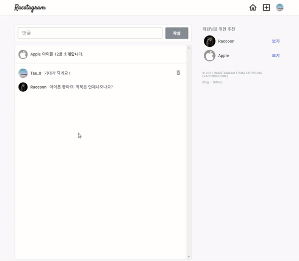
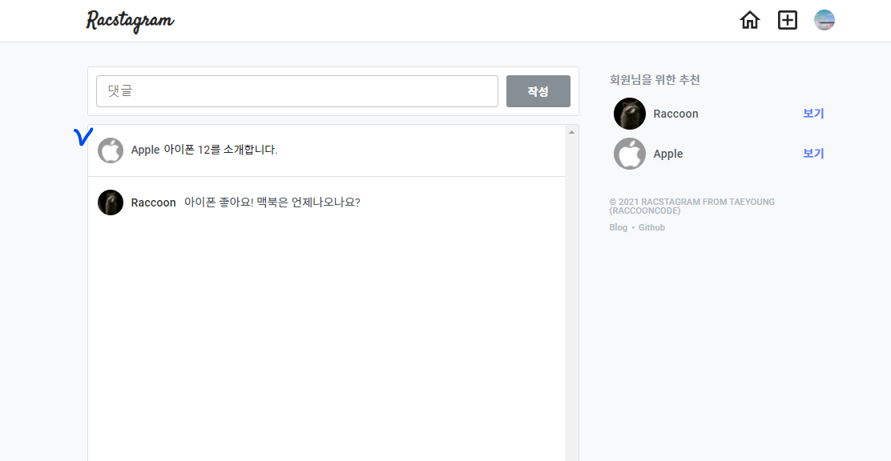
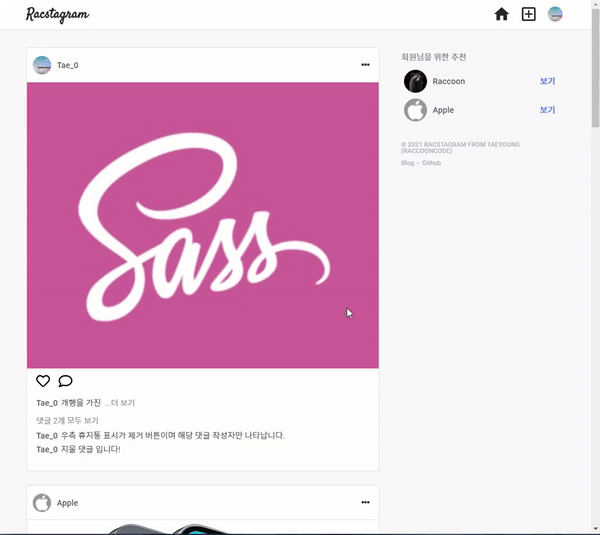

> # 리팩토링 Instagram 클론 프로젝트 by Redux-toolkit32

<br/>

<p align="center">

</p>

<br/>

> # 📄 프로젝트 설명

<br/>

이 프로젝트는 기존에 React & firebase를 통해서 만든 인스타그램 클론 프로젝트 리팩토링 프로젝트 입니다. (해당 프로젝트는 프로젝트 카테고리에서 확인 가능합니다.)

<br/>

## 상태 관리

해당 프로젝트에서는 `redux-toolkit(Slice 모델)`을 사용하여 상태관리를 구현하고 있습니다.

<br/>

## 스타일

현재 SCSS를 채택하여 css 작업을 진행중에 있으며, 부분적으로 Material UI를 사용하고 있습니다.
대부분의 경우에는, Material UI와 React 호환성 문제로 대부분은 SCSS로 직접 구현하고 있습니다.

<br/>
<br/>
<br/>

# 💻 화면 개요

<br/>

체크는 현재 기능적으로 구현된 상황을 의미합니다.

<br/>

- [x] `로딩 화면 또는 Component` : 앱 실행 초기화 작업시 로딩 또는 다른 작업시 사용할 로딩 화면 및 Component
  - [x] 스타일링 완료

<br/>

- [x] `로그인 화면` : 기본 Email 로그인, Social 로그인, 로그인 에러
  - [x] `Email 로그인` : Email, Password input, 로그인 버튼
  - [x] `Social 로그인` : google로그인 버튼, github로그인 버튼
  - [x] `로그인 에러` : Email로그인, google로그인, github 로그인 에러 발생시 사용자에게 출력

<br/>

- [x] `회원가입 화면` : Email 로그인을 위한 계정을 만드는 화면, 회원가입 에러
  - [x] `Email 형식 가입` : Email, Password input, 회원가입 버튼
    - [x] 가입시 사용자 Nickname 지정 input (추가 사항)

<br/>

- [x] `피드 화면` : 사용 유저의 모든 게시글을 표시하는 화면
  - [x] `게시글 박스` :
    - [x] `타이틀 영역` : 최상단의 작성자 사진 + 이름, 게시글 수정 탭
      - [x] `편집버튼` : 글 수정하기, 삭제하기 모달 -> 해당 버튼 누르면 삭제 또는 수정 페이지로 이동(아니면 모달이 수정하는 모달로 변경)
        - [x] `삭제하기`
        - [x] `수정하기`
    - [x] `사진 영역` : 기존에는 1개만 가능했음 (욕심내면, 여러개 슬라이드 형식으로 가능하게 하고 싶음)
    - [x] `내용 영역` : 게시글 내용

<br/>

- [x] `글 작성 화면` : 글을 작성하는 화면
  - [x] `이미지 리사이징`

<br/>

- [x] `현재 유저 프로필 화면` : 로그인한 현재 유저의 게시물과 대략적인 프로필를 표시하는 화면
  - [x] `유저 프로필 수정하기` : 유저 프로필을 수정하는 화면 (userImage, userDisplayname, userIntro)
  - [x] `작성 글` : 유저가 작성한 작성 글의 image 표 -> 클릭시 post detail
    - [x] `작성 글 detail view` : image 표에서 해당 이미지 클릭시 해당 글 detail view 화면
  - [x] `로그아웃`

<br/>

- [x] `다른 유저 프로필 화면` : 다른 유저가 작성한 글의 유저 이름을 클릭하여 해당 유저의 프로필 화면 구현
  - [x] `프로필 보기` : userImage, userDisplayname, userIntro
  - [x] `작성 글` : 유저가 작성한 작성 글의 image 표 -> 클릭시 post detail
    - [x] `작성 글 detail view` : image 표에서 해당 이미지 클릭시 해당 글 detail view 화면

<br/>

- [x] `네비게이션 바` : 앱로고 - 피드(Home)탭 - 글 작성탭 - 현재 유저 프로필(프로필 수정, 프로필 이동, 로그아웃) 탭
  - [x] Navigation-profile 눌렀을 때 로그아웃, 프로필 수정, 프로필 이동 드롭 다운 필요

<br/>

- [x] `무한 스크롤`
  - [x] 유저 스크롤 위치 기억 (뒤로가기가 아닌 페이지 변해도 기억 함)

<br/>

- [x] `랜덤 유저 추천`

<br/>

- [x] `댓글 기능`

<br/>

- [x] `작성 글의 text 더보기 버튼`

<br/>
<br/>
<br/>

> # 📅 TIL (Today I Learned, 오늘 깨달은 것들)

<br/>

# 2021.08.17 사항

<br/>

## 1. 댓글 작성 요청 개선 (post의 commetArray 반영 개선)

- 기존의 댓글 작성의 경우에는 내부적으로 이전 데이터를 가져와서 큐 구조로 넣고 빼는 구조로 설계 했지만, 생각해보니 시간 순서대로 이미 db 색인 정렬이 되어 있기 때문에 comments db에서 해당 post에 대한 최근 comment 2개를 가져와서 다시 붙여 update 하는 식으로 변경하였다.
- 즉, post에 있는 commetArray에 반영하는 작업을 comments에 있는 최근 2개 글을 가져와 계속 update 하게 함

```js
// 변경 전 Post의 commentArray에 반영하는 작업 코드
// 큐 방식의 구조

const commentId = doc.id;
const postDoc = dbService.collection("posts").doc(postId);
const postDocSnap = await postDoc.get();
const { commentArray } = { ...postDocSnap.data() };
const commentEl = {
  commentId,
  commentDisplayName: commentObj.userDisplayName,
  commentDate: commentObj.commentDate,
  comment,
  count: commentObj.count,
};
if (commentArray.length === 2) {
  commentArray.unshift(commentEl);
  commentArray.pop();
} else {
  commentArray.unshift(commentEl);
}
await postDoc.set(
  {
    commentArray,
  },
  { merge: true }
);
```

```js
export const setCommentThunk = createAsyncThunk(
  "redux-racstagram/comment/setCommentThunk",
  async ({ comment, postId }, thunkAPI) => {
    try {
      const {
        users: { currentUserInfo },
        comment: { comments },
        profile: {
          currentUser: { uid },
        },
      } = thunkAPI.getState();

      const commentObj = {
        userId: uid,
        postId,
        userDisplayName: currentUserInfo.displayName,
        userPhotoUrl: currentUserInfo.userPhotoUrl,
        commentDate: Date.now(),
        comment,
        count: comments[0] ? comments[0].count + 1 : 1,
      };
      // 먼저, comments에 작성한 댓글 db에 기록
      await dbService.collection("comments").doc().set(commentObj);

      // 최근 코멘트 2개를 db에서 가져와서 해당 post의 commentArray에 update
      const { docs } = await dbService
        .collection("comments")
        .where("postId", "==", postId)
        .orderBy("commentDate", "desc")
        .limit(2)
        .get();
      const commentArray = docs.map((doc) => ({
        comment: doc.data().comment,
        commentDate: doc.data().commentDate,
        commentDisplayName: doc.data().userDisplayName,
        commentId: doc.id,
        count: doc.data().count,
      }));
      await dbService
        .collection("posts")
        .doc(postId)
        .set({ commentArray }, { merge: true });

      thunkAPI.dispatch(getCommentsThunk(postId));
      thunkAPI.dispatch(getAllPostsThunk());
      return true;
    } catch ({ code, message }) {
      return thunkAPI.rejectWithValue({ code, message });
    }
  }
);
```

<br/>
<br/>
<br/>

## 2. 댓글 지우기 요청 기능 구현

<br/>

<p align="center">

</p>

<br/>

- 사용자의 댓글은 수정이 불가능하게 하고, 단지 지울수만 있게 하였음
- comment를 다루는 것은 이전 글에서 이야기 한것과 같이 post에 들어있는 정보도 update 해주는 것을 주의해야한다.
- comment 제거 이후 위에서 commentArray에 반영하는 코드를 재사용하여 반영시킴

```js
export const deleteCommentThunk = createAsyncThunk(
  "redux-racstagram/comment/deleteCommentThunk",
  async ({ commentId, postId }, thunkAPI) => {
    try {
      // comments의 comment delete
      await dbService.collection("comments").doc(commentId).delete();

      // delete 이후 최신 comment 가져와서 다시 post의 commentArray 반영
      const { docs } = await dbService
        .collection("comments")
        .where("postId", "==", postId)
        .orderBy("commentDate", "desc")
        .limit(2)
        .get();
      const commentArray = docs.map((doc) => ({
        comment: doc.data().comment,
        commentDate: doc.data().commentDate,
        commentDisplayName: doc.data().userDisplayName,
        commentId: doc.id,
        count: doc.data().count,
      }));
      await dbService
        .collection("posts")
        .doc(postId)
        .set({ commentArray }, { merge: true });

      thunkAPI.dispatch(getCommentsThunk(postId));
      thunkAPI.dispatch(getAllPostsThunk());
      return true;
    } catch ({ code, message }) {
      return thunkAPI.rejectWithValue({ code, message });
    }
  }
);
```

<br/>

- 생략 버튼 연결과 Comfirm 연결

```js
const Comment = ({ commentObj, postId }) => {
  // ... 생략
  const deleteComment = useCallback(() => {
    dispatch(deleteCommentThunk({ commentId, postId }));
  }, [dispatch, commentId, postId]);

  return (
    <li className="comment_container" key={commentId}>
      {currentUserId === userId && (
        <button onClick={confirmToggle} className="delete_comment_btn">
          <DeleteForeverIcon className="icon" />
        </button>
      )}
      <Confirm
        isOn={confirmIsOn}
        toggle={confirmToggle}
        message={"정말 삭제하시겠습니까?"}
      >
        <button className="confirm_item" onClick={deleteComment}>
          예
        </button>
        <button className="confirm_item" onClick={confirmToggle}>
          아니오
        </button>
      </Confirm>
    </li>
  );
};

export default Comment;
```

<br/>
<br/>
<br/>

## 3. 댓글 페이지에 해당 Post의 contents 표시

<br/>

<p align="center">

</p>

<br/>

- 인스타그램의 경우 사용자가 작성한 글의 text를 댓글 페이지의 댓글들 최상단에 표시하고 있다.
- Comment 컴포넌트들 위에 .post_text_container 요소를 통해서 해당 Post의 내용(글 작성자 이름, 작성자 이미지, 작성한 글 내용)을 표시함

<br/>
<br/>
<br/>

## 4. Post Text 더 보기 구현 (글 축약 후 버튼 클릭으로 모두 보기, 개행 다루기)

<br/>

<p align="center">

</p>

<br/>

- shortText : post에서 postText를 가져와서 일단 35글자로 제한하고 35글자 안에서 개행이 있는 부분을 나누어 앞부분만 text로 사용함
- moreBtnCheck 함수 : 개행이 없고 35글자 보다 짧은 text의 경우 더보기 버튼이 화면에 표시될 필요가 없기에 이를 check해서 boolean 값을 반환 함
  - return : true는 버튼 표시가 필요한 경우, false는 표시가 필요 없는 경우
  - 개행은 OS 별로 달라서 모두 체크해 주어야 함
    - 윈도우 : \r\n (CRLF)
    - 유닉스 : \n (LF)
    - 맥 : \r (CR)

```js
const shortText = post.postText.slice(0, 35).split(/(\r\n|\n|\r)/gm)[0];
const moreBtnCheck = () => {
  // 35자 넘거나, 개행이 있는 경우 더보기 버튼 표시
  return post.postText > 35 || /(\r\n|\n|\r)/gm.test(post.postText);
};
```

```js
const component = () => {
  // 생략
  return (
    <span className="post_text">
            {isMore ? post.postText : shortText}
          </span>
          {moreBtnCheck() && !isMore && (
            <button
              className="more_text_btn"
              onClick={(e) => {
                setMore(true);
              }}
            >
              ...더 보기
            </button>
          )}
  )

}
```

<br/>
<br/>
<br/>

# 문제 발생

<br/>

- user 또는 currentUser의 프로필 화면 이동시 가끔 최초 사용자의 글 불러올 때 그 글이 두 개씩 되는 현상이 발생하였다.
- 짐작으로는 profile path와 user path가 혼란을 일으켜서 그런것 같기도 하다. 통일이 필요한것 같다.
- 아니면, 무한스크롤의 더 불러오기 요청에서 문제를 일으키는 것 같기도 하다.
  - 최대한 작업 이후에 고쳐야 할 것 같다.

<br/>
<br/>
<br/>

# 다음에 필요한 것들

- [x] 댓글 좋아요 기능 -> 진행중
  - [x] 기본적인 comments page, comment, commentForm 스타일링
  - [x] comment read, create 요청 함수 컴포넌트에 연결 하기
  - [x] post의 comments view 구현과 이에 맞게 comment create, read, delete 수정 구현

<br/>

- [x] comments delete가 아닌, 개별적인 comment delete, Update 구현 필요
  - comment 수정, 제거에 따라 PostComment도 반영하도록 해주어야 함(Post에 있는 commentArray의 commentEl과 일치하는지 여부를 조건으로 반영 로직 짜기)

<br/>

- [x] Post text 더보기 버튼
  - Post Text가 일정 길이가 넘어가는 경우 버튼이 보이게 하고, 버튼 클릭시 css overflow hidden을 풀어주는 식으로 구현 하자

<br/>

- [ ] 자동 input 체크 (이름 중복 확인시)

<br/>

- [ ] 새 게시글 보기 버튼 또는 로고 클릭시 데이터 진입점 갱신 기능 구현하기

<br/>

- [ ] validation 구현 필요함
  - input 같은 경우, display none 적용시 browser에서 제공하는 validation 말풍선이 뜨지 않기 때문에 따로 구현 필요함
  - required를 사용하지 말고, submit 함수 단에서 input값이 들어 왔는지 체크하여 validation error 구현 필요
  - [x] post 관련한 input의 check 대략적인 (PostUpdateContainer, postFormContainer)
  - [x] auth 관련한 input의 check 대략적인 조건 구현
  - [ ] 각 input 별로 데이터 형태에 따른 구체적인 조건 설정이 필요함
    - [ ] 이메일, 패스워드, 유저 네임, 글 내용의 형식(조건, 제한) 지정 필요

<br/>

- [ ] profile의 웹사이트 정규표현식 match 정교화
  - 사용자는 http를 안넣을 수도 있음, 그리고 그외에도 예외 사항을 더 생각해 보자
  - 아니면, 사용자가 올바른 형식을 넣을 수 있도록 알림 만들기, 결국엔 validation 임

<br/>

- [ ] 스켈레톤 UI 필요

<br/>

- [ ] propType으로 type 지정 또는 typeScript 도입

<br/>

- [ ] sementic tag 적절한 태그로 수정하기 (검토)

<br/>

- [ ] 효과적인 렌더링 제한을 위해서 container에 있는 함수들을 hook으로 만들어 구현하기

<br/>

- [ ] route '/profile' pathName을 '/user/:userName' pathName 사용하게 통합하여 pathname에 대한 조건을 줄여 보자

<br/>

- [ ] profileUpdateContainer과 postFormContainer 통합 시도

<br/>

- [ ] 글 작성 시간 (클라이언트 단에서 뿌리는 경우 로컬 시간 변경으로 조작 가능한지 테스트 필요함)

<br/>
<br/>
<br/>

# 나중에 구현하고 싶은 기술

<br/>

- [x] 댓글 기능
- [ ] 좋아요 기능
- [ ] 유저 이름 검색을 통한 프로필 보기 (이름 검색)
- [ ] 게시글 장소 태그로 장소 지도 보기 (지도 API)
